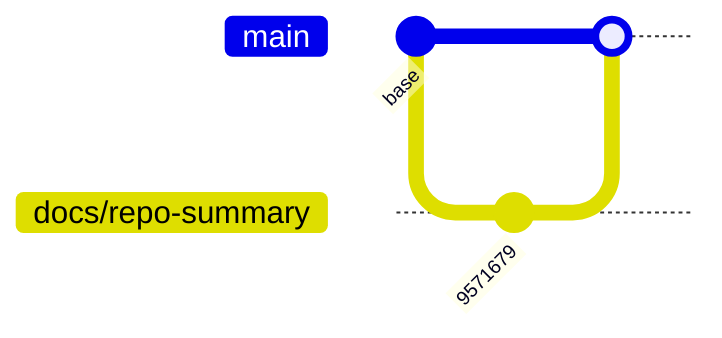

# Changelog

Registro diário automático das mudanças identificadas no repositório, baseado em evidências concretas.

## 2026-03-20

### Documentação
- `9571679` — adiciona artefatos e script para gerar uma página/resumo HTML em PDF do repositório UzzApp (`scripts/generate-app-summary-pdf.js`, `tmp/pdfs/uzzapp-app-summary.html`, `output/pdf/uzzapp-app-summary.pdf`)

### Visual das mudanças

> Gerado em: 2026-03-20
