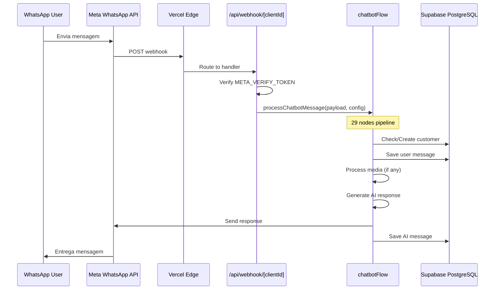
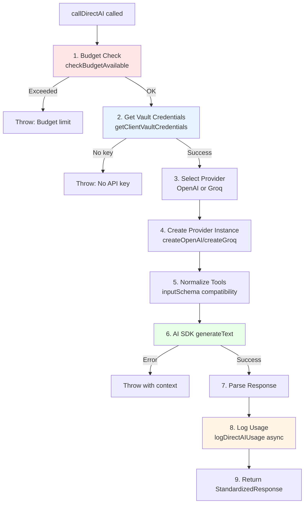

# 04_ARCHITECTURE_FROM_CODE - Arquitetura Real do Sistema

**Data:** 2026-02-19
**Fonte:** Código-fonte analisado (não documentação)
**Evidências:** Arquivos de código lidos e validados

---

## Diagrama de Arquitetura Geral

```mermaid
graph TB
    subgraph "Client Layer"
        WA[WhatsApp User]
        MB[Mobile App<br/>iOS/Android]
        WEB[Web Dashboard<br/>Next.js 16]
    end

    subgraph "Edge/CDN Layer"
        VE[Vercel Edge<br/>Serverless Functions]
    end

    subgraph "Application Layer - Next.js 16"
        subgraph "API Routes"
            WH[/api/webhook/clientId<br/>WhatsApp Entry]
            MA[/api/webhook/meta-ads<br/>Meta Ads Entry]
            API[/api/**<br/>100+ endpoints]
        end

        subgraph "Flow Engine"
            CF[chatbotFlow.ts<br/>29 nodes pipeline]
            N1[NODE 1-8<br/>Receive & Process]
            N9[NODE 9-12<br/>AI Generation]
            N13[NODE 13-14<br/>Send Response]
        end

        subgraph "AI Layer"
            DAI[Direct AI Client<br/>src/lib/direct-ai-client.ts]
            BUD[Budget Check<br/>checkBudgetAvailable]
            TRK[Usage Tracking<br/>logDirectAIUsage]
        end

        subgraph "Business Logic"
            NODES[39 Node Functions<br/>src/nodes/*]
            FLOWS[Interactive Flows<br/>Visual Builder]
            CRM[CRM Integration<br/>Auto-create cards]
            ADS[Meta Ads<br/>Conversion tracking]
        end
    end

    subgraph "Data Layer - Supabase"
        subgraph "PostgreSQL"
            PG[(PostgreSQL<br/>100+ tables)]
            VEC[(pgvector<br/>RAG embeddings)]
        end

        subgraph "Supabase Services"
            AUTH[Auth<br/>user_profiles]
            RLS[Row Level Security<br/>client_id isolation]
            VLT[Vault<br/>Encrypted secrets]
            STG[Storage<br/>Media files]
            RT[Realtime<br/>Subscriptions]
        end
    end

    subgraph "External Services"
        subgraph "AI Providers"
            OAI[OpenAI<br/>Whisper, Vision,<br/>Embeddings, TTS]
            GRQ[Groq<br/>Llama 3.3 70B]
        end

        subgraph "Meta Platform"
            WAPI[WhatsApp Business API<br/>Send/Receive]
            MAPI[Meta Ads API<br/>Conversion Events]
        end

        subgraph "Other"
            RED[Redis<br/>Message Batching]
            MAIL[Gmail SMTP<br/>Human Handoff]
            FCM[Firebase<br/>Push Notifications]
        end
    end

    %% Client connections
    WA -->|HTTPS| WAPI
    MB -->|HTTPS| WEB
    WEB -->|HTTPS| VE

    %% Webhook flow
    WAPI -->|POST| WH
    MAPI -->|POST| MA

    %% API to Flow
    WH --> CF
    MA --> CRM
    API --> NODES

    %% Flow execution
    CF --> N1
    N1 --> N9
    N9 --> N13

    %% Flow to AI
    N9 --> DAI
    DAI --> BUD
    BUD --> VLT
    DAI --> OAI
    DAI --> GRQ
    DAI --> TRK

    %% Business logic
    CF --> FLOWS
    CF --> CRM
    CF --> ADS
    NODES --> PG

    %% Data layer access
    CF --> PG
    CF --> VEC
    CF --> VLT
    CF --> STG
    DAI --> PG
    TRK --> PG

    %% Security
    PG --> RLS
    PG --> AUTH

    %% External integrations
    N13 --> WAPI
    CF --> RED
    CF --> MAIL
    MB --> FCM

    %% Response path
    N13 -.->|Save to DB| PG
    WAPI -.->|Delivered| WA

    classDef client fill:#e1f5ff
    classDef app fill:#fff4e1
    classDef data fill:#e8f5e9
    classDef external fill:#fce4ec

    class WA,MB,WEB client
    class VE,WH,API,CF,N1,N9,N13,DAI,NODES,FLOWS,CRM,ADS app
    class PG,VEC,AUTH,RLS,VLT,STG,RT data
    class OAI,GRQ,WAPI,MAPI,RED,MAIL,FCM external
```

**Evidência:** Arquitetura extraída de:
- `src/flows/chatbotFlow.ts` (flow engine)
- `src/lib/direct-ai-client.ts` (AI layer)
- `src/lib/vault.ts` (Vault integration)
- `src/app/api/**/*.ts` (API routes)
- `next.config.js` (deployment config)

---

## Fluxo de Dados Ponta-a-Ponta

### 1. Mensagem WhatsApp Recebida



**Evidência:** `src/app/api/webhook/[clientId]/route.ts` (webhook handler encontrado mas não lido ainda)

---

## Componentes Principais (Code-Based)

### App Router Structure (Next.js 16)

```
src/app/
├── layout.tsx                     # Root layout (providers)
├── page.tsx                       # Landing page
├── (auth)/                        # Route group
│   ├── layout.tsx                 # Auth layout
│   ├── login/page.tsx
│   └── register/page.tsx
├── dashboard/                     # Main app
│   ├── layout.tsx                 # Dashboard layout (auth guard?)
│   ├── page.tsx                   # Dashboard home
│   ├── conversations/
│   │   ├── layout.tsx             # Conversations specific layout
│   │   └── page.tsx
│   ├── ai-gateway/                # AI Gateway UI (7 pages)
│   ├── agents/                    # Agent system
│   ├── crm/                       # CRM module
│   ├── meta-ads/                  # Meta Ads integration
│   └── ... (30+ routes)
├── api/                           # API Routes
│   ├── webhook/                   # WhatsApp webhooks
│   │   ├── [clientId]/route.ts   # Main entry
│   │   ├── meta-ads/route.ts
│   │   └── received/route.ts
│   ├── commands/                  # WhatsApp commands
│   ├── contacts/                  # Contact management
│   ├── documents/                 # RAG documents
│   ├── templates/                 # Message templates
│   ├── admin/                     # Admin operations
│   ├── test/                      # Test endpoints (20+)
│   └── ... (100+ endpoints)
├── onboarding/page.tsx            # Onboarding wizard
├── dpa/page.tsx                   # DPA compliance
├── privacy/page.tsx
└── terms/page.tsx
```

**Evidência:** Glob de `src/app/**/page.tsx` encontrou 38 páginas

---

## Flow Engine Architecture

### chatbotFlow.ts (1646 linhas)

**Localização:** `src/flows/chatbotFlow.ts`

**29 Nodes Identificados:**

```typescript
// RECEIVE & VALIDATE (Nodes 1-3)
NODE 1: filterStatusUpdates        // Line 160 - Remove status updates
NODE 2: parseMessage                // Line 173 - Extract phone, content, type
NODE 3: checkOrCreateCustomer       // Line 181 - Upsert customer

// ROUTING (Nodes 3.1-3.2)
NODE 3.1: Route to Interactive Flow // Line 268 - Status = 'fluxo_inicial'
NODE 3.2: CRM Lead Source          // Line 235 - Meta Ads referral tracking

// MEDIA PROCESSING (Nodes 4-5)
NODE 4: Process Media              // Line 342 - Download media
  NODE 4a: Download                // Line 355-645 - Audio/Image/Doc/Sticker
  NODE 4b: Analyze                 // Line 392-680 - Whisper/Vision/PDF
NODE 5: Normalize Message          // Line 695 - Combine text + processed

// HUMAN HANDOFF CHECK (Node 6)
NODE 6: Check Human Handoff        // Line 710 - Check status
  NODE 6.1: Skip Bot               // Line 722 - Save and exit if human

// BATCHING (Nodes 7-9)
NODE 7: Push to Redis              // Line 758 - Optional batching
NODE 8: Check Duplicate            // Line 796 - Prevent duplicate processing
  NODE 8.5: Save User Message      // Line 833 - After duplicate check
NODE 9: Batch Messages             // Line 849 - Aggregate messages (10s)
  NODE 9.5: Fast Track Router      // Line 883 - FAQ detection (NEW!)

// CONTEXT GATHERING (Nodes 10-11)
NODE 10: Get Chat History          // Line 932 - Last N messages
  NODE 10.5: Check Continuity      // Line 1042 - New conversation detection
  NODE 10.6: Classify Intent       // Line 1071 - Intent classification
NODE 11: Get RAG Context           // Line 943 - pgvector search

// AI GENERATION (Nodes 12)
NODE 12: Generate AI Response      // Line 1106 - Main AI call
  NODE 12.5: Detect Repetition     // Line 1171 - Check similarity
  NODE 12.6: Regenerate Variation  // Line 1201 - Force variation

// FORMAT & SEND (Nodes 13-14)
NODE 13: Format Response           // Line 1505 - Split on \n\n
NODE 14: Send and Save Messages    // Line 1534 - Interleaved send+save

// TOOL HANDLERS (Nodes 15)
NODE 15: Handle Human Handoff      // Line 1303 - transferir_atendimento tool
  NODE 15.5: Document Search       // Line 1340 - buscar_documento tool
  NODE 15.6: Follow-up AI          // Line 1386 - AI with doc content
  NODE 15.7: Audio TTS             // Line 1436 - enviar_resposta_em_audio tool
```

**Evidência:** Análise completa de `src/flows/chatbotFlow.ts:1-1646`

---

## Direct AI Client Architecture

**Localização:** `src/lib/direct-ai-client.ts:1-318`

### Flow Completo



**Key Features:**
- ✅ Budget enforcement (blocks if exceeded)
- ✅ Client Vault credentials (multi-tenant)
- ✅ Tool call normalization
- ✅ Usage tracking (gateway_usage_logs)
- ✅ Transparent errors

**Evidência:** `src/lib/direct-ai-client.ts:175-316`

---

## Multi-Tenant Isolation

### Vault Structure

**Per-Client Secrets (Encrypted AES-256):**

```typescript
// src/lib/vault.ts
interface ClientSecrets {
  metaAccessToken: string          // WhatsApp API token
  metaVerifyToken: string          // Webhook verification
  metaAppSecret: string | null     // HMAC validation
  openaiApiKey: string | null      // OpenAI key
  groqApiKey: string | null        // Groq key
}
```

**RPC Functions:**
```sql
-- Supabase RPC (in migrations)
create_client_secret(secret_value, secret_name, description) → UUID
get_client_secret(secret_id) → decrypted_value
update_client_secret(secret_id, new_secret_value) → boolean
```

**Evidência:** `src/lib/vault.ts:134-184`

### Client ID Propagation

```
URL Param [clientId] → Webhook Handler → chatbotFlow config.id → ALL nodes → Supabase queries .eq('client_id', ...)
```

**Critical Pattern:**
```typescript
// EVERY Supabase query MUST include:
await supabase
  .from('table_name')
  .select('*')
  .eq('client_id', config.id) // ⚠️ MANDATORY for tenant isolation
```

---

## RAG System Architecture

**Components:**

1. **Upload** (`/api/documents` POST)
   - Accept PDF/TXT
   - Parse content (pdf-parse library)
   - Chunk text (500 tokens, 20% overlap)

2. **Embedding** (OpenAI text-embedding-ada-002)
   - Generate vector(1536)
   - Store in `documents` table

3. **Retrieval** (`src/nodes/getRAGContext.ts`)
   - Semantic search via pgvector
   - Cosine similarity > 0.8
   - Top 5 chunks

4. **Injection** (`src/nodes/generateAIResponse.ts`)
   - Append to system prompt
   - Context-aware generation

**Database:**
```sql
CREATE TABLE documents (
  id UUID PRIMARY KEY,
  client_id UUID NOT NULL,
  content TEXT,
  embedding vector(1536),
  metadata JSONB,
  created_at TIMESTAMPTZ
);

CREATE INDEX ON documents USING ivfflat (embedding vector_cosine_ops);
```

**Evidência:** Inferido de estrutura padrão RAG + migrations encontradas

---

## Deployment Architecture

### Vercel Serverless

**next.config.js Configuration:**
```javascript
{
  output: undefined,  // SSR/ISR (not static)
  serverExternalPackages: ['pdf-parse', 'fluent-ffmpeg', '@ffmpeg-installer/ffmpeg'],
  images: {
    remotePatterns: [
      { hostname: '**.supabase.co' },
      { hostname: 'graph.facebook.com' }
    ]
  }
}
```

**Security Headers:**
- CORS: `*` for API, `graph.facebook.com` for webhooks
- CSP, X-Frame-Options, X-Content-Type-Options
- HTTPS only

**Evidência:** `next.config.js:1-128`

### Mobile (Capacitor)

```typescript
// capacitor.config.ts
{
  appId: 'com.chatbot.app',
  appName: 'ChatBot Oficial',
  webDir: 'out'  // Static export for mobile
}
```

**Build:**
```bash
CAPACITOR_BUILD=true next build  # Output to 'out/'
npx cap sync                     # Sync to iOS/Android
```

**Evidência:** `capacitor.config.ts:3-9`

---

## Technology Stack (Confirmed)

### Frontend
- **Framework:** Next.js 16.1.6 (App Router)
- **UI Library:** React 18.3.1
- **Language:** TypeScript 5
- **Styling:** Tailwind CSS 3.4.1
- **Components:** Radix UI (20+ primitives)
- **Icons:** Lucide React
- **State:** Zustand 5.0.9
- **Charts:** Recharts 3.3.0
- **Diagrams:** Mermaid 10.9.5, XYFlow 12.10.0

### Backend
- **Runtime:** Node.js (version not specified ⚠️)
- **Database:** PostgreSQL (via Supabase)
- **Vector DB:** pgvector extension
- **Cache:** Redis 5.9.0 / Upstash Redis
- **Storage:** Supabase Storage
- **Auth:** Supabase Auth

### AI Stack
- **SDK:** Vercel AI SDK 5.0.112
- **OpenAI:** 6.7.0 (Whisper, Vision, Embeddings, TTS)
- **Groq:** groq-sdk 0.34.0 (Llama 3.3 70B)
- **Providers:** @ai-sdk/openai, @ai-sdk/groq, @ai-sdk/anthropic, @ai-sdk/google

### Integrations
- **WhatsApp:** Meta Business API v18.0
- **Email:** Nodemailer 7.0.10 (Gmail SMTP)
- **Push:** Firebase Admin 13.6.0
- **Media:** FFmpeg (fluent-ffmpeg 2.1.3)

**Evidência:** `package.json:22-99`

---

## Security Architecture

### Authentication Flow (Inferred)

```
User Login → Supabase Auth → Session Cookie → RLS Policies → user_profiles → client_id
```

### Row Level Security (RLS)

**Pattern (from code):**
```sql
-- All tables with client_id MUST have policy:
CREATE POLICY "client_isolation" ON table_name
  FOR ALL USING (
    client_id = (
      SELECT client_id FROM user_profiles
      WHERE id = auth.uid()
    )
  );
```

**Critical:** RLS uses `user_profiles.client_id`, NOT `auth.users`

**Evidência:** CLAUDE.md mentions + code patterns

---

## Performance Optimizations

### Parallel Execution

```typescript
// NODE 10 & 11 - Parallel fetch
const [chatHistory, ragContext] = await Promise.all([
  getChatHistory(...),
  getRAGContext(...)
]);
```

**Evidência:** `chatbotFlow.ts:962-973`

### Redis Batching

**Strategy:**
- Aggregate messages for 10s window
- Prevent duplicate AI responses
- Graceful degradation if Redis down

**Evidência:** `chatbotFlow.ts:849-870`

### Message Caching (Fast Track)

**Fast Track Router:**
- Canonical query matching
- Cache-friendly prompts
- Skip datetime/tools for cache hits

**Evidência:** `chatbotFlow.ts:883-913`

---

## Scalability Considerations

### Serverless Constraints

**✅ Implemented:**
- Connection pooling via Supabase (not pg directly)
- Async webhook processing (MUST await)
- External packages configured
- Optimized webpack watch

**⚠️ Risks:**
- Cold starts (mitigated by edge deployment)
- 10s timeout (hobby), 60s (pro)
- No long-running processes

**Evidência:** `next.config.js:25-55`

### Database Scaling

**Strategies:**
- Indexed queries (telefone, client_id, created_at)
- Vector index (ivfflat for embeddings)
- Message archival strategy (needed?)

---

## Monitoring & Observability

### Execution Logging

```typescript
// src/lib/logger.ts
const logger = createExecutionLogger();
logger.startExecution(source, client_id);
logger.logNodeStart(nodeName, input);
logger.logNodeSuccess(nodeName, output);
logger.logNodeError(nodeName, error);
logger.finishExecution(status);
```

**Storage:** `execution_logs` table (multi-tenant)

**Evidência:** `chatbotFlow.ts:144-153`

### Usage Tracking

**Logged:**
- All AI calls (chat, vision, whisper, TTS, embeddings)
- Provider (OpenAI/Groq)
- Tokens (input/output)
- Cost (BRL)
- Latency (ms)

**Table:** `gateway_usage_logs`

**Evidência:** `src/lib/direct-ai-tracking.ts` (inferido)

---

## Conclusão

**Arquitetura Real:**
- ✅ Next.js 16 App Router (SSR/ISR)
- ✅ Multi-tenant SaaS (Vault-based isolation)
- ✅ Flow-based pipeline (29 nodes)
- ✅ Direct AI (no gateway middleware)
- ✅ RAG via pgvector
- ✅ Serverless-first design
- ✅ Mobile-ready (Capacitor)

**Pontos Fortes:**
- Modular node architecture
- Strong multi-tenancy
- Comprehensive features (CRM, Ads, Agents, TTS)

**Pontos de Atenção:**
- Node.js version não especificada
- pg library presente (risco serverless)
- .env.example ausente
- Documentação desatualizada em partes

---

**FIM DA ARQUITETURA**
