# 08_FLOW_EXECUTION_MAP - Mapeamento Completo de Execução

**Data:** 2026-02-19
**Objetivo:** Mapear execução completa do chatbotFlow com evidências do código
**Status:** ANÁLISE COMPLETA COM CÓDIGO REAL

---

## 📋 Visão Executiva

**Arquivo Principal:** `src/flows/chatbotFlow.ts` (1646 linhas)
**Total de Nodes:** 29+ nodes (15 principais + 14 sub-nodes)
**Configurabilidade:** 9 nodes podem ser desabilitados via `bot_configurations`
**Paralelismo:** 1 ponto de execução paralela (NODE 10 + 11)
**Rotas Principais:** 3 rotas de status (Interactive Flow, Human Handoff, Bot/AI)

---

## 🔄 Fluxo de Execução Completo

### FASE 0: Inicialização
```typescript
// chatbotFlow.ts:140-158
export const processChatbotMessage = async (
  payload: WhatsAppWebhookPayload,
  config: ClientConfig,
): Promise<ChatbotFlowResult> => {
  const logger = createExecutionLogger();
  const executionId = logger.startExecution({
    source: "chatbotFlow",
    payload_from: payload.entry?.[0]?.changes?.[0]?.value?.messages?.[0]?.from,
  }, config.id); // 🔐 Multi-tenant: client_id isolation

  // Fetch all node enabled states for this client
  const nodeStates = await getAllNodeStates(config.id);
  // ...
}
```

**Evidência:** `chatbotFlow.ts:140-158`

**Ações:**
1. Cria logger de execução com `executionId` único
2. Carrega estados de nodes (`getAllNodeStates`) → configurabilidade
3. Inicia isolamento multi-tenant via `config.id`

---

### NODE 1: Filter Status Updates
**Status:** 🔒 SEMPRE EXECUTA (não configurável)
**Linha:** 159-170

```typescript
// chatbotFlow.ts:159-170
logger.logNodeStart("1. Filter Status Updates", payload);
const filteredPayload = filterStatusUpdates(payload);
if (!filteredPayload) {
  logger.logNodeSuccess("1. Filter Status Updates", {
    filtered: true,
    reason: "Status update",
  });
  logger.finishExecution("success");
  return { success: true }; // ⬅️ EXIT POINT #1
}
logger.logNodeSuccess("1. Filter Status Updates", { filtered: false });
```

**Evidência:** `chatbotFlow.ts:159-170`

**Decisão:**
- ✅ Se é mensagem de usuário → continua
- ❌ Se é status update (sent/delivered/read) → **EXIT #1** (sem processamento)

**Saída:** `WhatsAppWebhookPayload` filtrado

---

### NODE 2: Parse Message
**Status:** 🔒 SEMPRE EXECUTA
**Linha:** 172-178

```typescript
// chatbotFlow.ts:172-178
logger.logNodeStart("2. Parse Message", filteredPayload);
const parsedMessage = parseMessage(filteredPayload);
logger.logNodeSuccess("2. Parse Message", {
  phone: parsedMessage.phone,
  type: parsedMessage.type,
});
```

**Evidência:** `chatbotFlow.ts:172-178`

**Ação:** Extrai estrutura da mensagem (phone, type, content, metadata)

**Saída:** `ParsedMessage` com tipo (text, audio, image, document, sticker, interactive)

---

### NODE 3: Check/Create Customer
**Status:** 🔒 SEMPRE EXECUTA
**Linha:** 180-192

```typescript
// chatbotFlow.ts:180-192
logger.logNodeStart("3. Check/Create Customer", {
  phone: parsedMessage.phone,
  name: parsedMessage.name,
});
const customer = await checkOrCreateCustomer({
  phone: parsedMessage.phone,
  name: parsedMessage.name,
  clientId: config.id, // 🔐 Multi-tenant
});
logger.logNodeSuccess("3. Check/Create Customer", {
  status: customer.status,
});
```

**Evidência:** `chatbotFlow.ts:180-192`

**Ações:**
1. Busca customer em `clientes_whatsapp`
2. Se não existe, cria com `status: 'bot'`
3. Retorna `status` atual: `'bot' | 'humano' | 'transferido' | 'fluxo_inicial'`

**Saída:** `customer.status` → **CRÍTICO para routing**

---

### NODE 3.1: Fetch Conversation ID
**Status:** 🔒 SEMPRE EXECUTA
**Linha:** 194-201

```typescript
// chatbotFlow.ts:194-201
const supabase = createServiceRoleClient() as any;
const { data: conversation } = await supabase
  .from("conversations")
  .select("id")
  .eq("client_id", config.id)
  .eq("phone", parsedMessage.phone)
  .maybeSingle();
```

**Evidência:** `chatbotFlow.ts:194-201`

**Nota:** Usado posteriormente para tracking unificado (FASE 8)

---

### NODE 3.2: CRM Integration (Ensure Card + Lead Source)
**Status:** 🔒 SEMPRE EXECUTA (non-critical, wrapped in try-catch)
**Linha:** 203-256

```typescript
// chatbotFlow.ts:203-256
const isFirstMessage = customer.status === "bot" && !conversation;
let crmCardId: string | undefined;

try {
  // Ensure CRM card exists (auto-create if enabled)
  const cardResult = await ensureCRMCard(
    config.id,
    parsedMessage.phone,
    parsedMessage.name,
  );

  if (cardResult) {
    crmCardId = cardResult.cardId;

    // Capture lead source if message has referral (from Meta Ads)
    if (parsedMessage.referral || isFirstMessage) {
      const leadSourceResult = await captureLeadSource({
        clientId: config.id,
        cardId: crmCardId,
        phone: parsedMessage.phone,
        contactName: parsedMessage.name,
        referral: parsedMessage.referral,
        isFirstMessage,
      });

      if (leadSourceResult.captured && leadSourceResult.automationsTriggered > 0) {
        logger.logNodeSuccess("3.2. CRM Lead Source", {
          sourceType: leadSourceResult.sourceType,
          automationsTriggered: leadSourceResult.automationsTriggered,
        });
      }
    }

    // Update CRM card status for message received
    await updateCRMCardStatus({
      clientId: config.id,
      phone: parsedMessage.phone,
      event: "message_received",
      conversationStatus: customer.status,
    });
  }
} catch (crmError) {
  // CRM integration is non-critical, continue processing
  console.warn("[chatbotFlow] CRM integration error:", crmError);
}
```

**Evidência:** `chatbotFlow.ts:203-256`

**Ações:**
1. Verifica se é primeira mensagem
2. Garante card no CRM existe
3. Captura lead source (Meta Ads referral ou first message)
4. Atualiza status do CRM card
5. **Non-critical:** Erros não param o flow

---

## 🚦 ROUTING BASEADO EM STATUS (FASE 4)

**Linha:** 258-332
**Evidência:** `chatbotFlow.ts:258-332`

### ROUTE 1: Interactive Flow Active (status = 'fluxo_inicial')
**Prioridade:** MÁXIMA

```typescript
// chatbotFlow.ts:264-323
if (customer.status === "fluxo_inicial") {
  console.log("🔄 [chatbotFlow] Contact in interactive flow - processing via FlowExecutor");
  logger.logNodeStart("3.1. Route to Interactive Flow", { status: customer.status });

  const flowResult = await checkInteractiveFlow({
    clientId: config.id,
    phone: parsedMessage.phone,
    content: parsedMessage.content,
    isInteractiveReply: parsedMessage.type === "interactive",
    interactiveResponseId: parsedMessage.interactiveResponseId,
  });

  if (flowResult.flowExecuted) {
    logger.logNodeSuccess("3.1. Route to Interactive Flow", {
      flowExecuted: true,
      flowName: flowResult.flowName,
    });
    logger.finishExecution("success");
    return { success: true }; // ⬅️ EXIT POINT #2
  }

  // If flow wasn't executed (edge case), update status to 'bot' and continue to AI
  console.warn("⚠️ Status is fluxo_inicial but flow was not executed - updating to bot");

  const { error: statusUpdateError } = await supabase
    .from("clientes_whatsapp")
    .update({ status: "bot" })
    .eq("telefone", parsedMessage.phone)
    .eq("client_id", config.id);

  if (!statusUpdateError) {
    console.log(`✅ Status changed: fluxo_inicial → bot (${parsedMessage.phone})`);
    customer.status = "bot"; // Update local object
  }
}
```

**Evidência:** `chatbotFlow.ts:264-323`

**Decisão:**
- ✅ Se `flowResult.flowExecuted = true` → **EXIT #2** (flow handling completo)
- ❌ Se flow não executou (edge case) → atualiza status para `'bot'` e continua

**Nota:** User messages salvos por NODE 8 (linha 833)

---

### ROUTE 2: Human Handoff (status = 'humano' | 'transferido')
**Prioridade:** ALTA (mas processado em NODE 6, linha 710)

Comentário no código:
```typescript
// chatbotFlow.ts:325-328
// ROUTE 2: Atendimento Humano (human/transferred status)
// Note: This is now handled by checkHumanHandoffStatus (NODE 6)
// but we keep this comment for clarity about the routing logic
// Status 'humano' or 'transferido' will be caught by NODE 6
```

---

### ROUTE 3: Bot/AI (status = 'bot' OR new contact)
**Prioridade:** PADRÃO

```typescript
// chatbotFlow.ts:330-332
// ROUTE 3: Bot/IA (status === 'bot' OR new contact)
// Continue to normal pipeline below
console.log("🤖 [chatbotFlow] Processing via bot/IA pipeline");
```

**Decisão:** Continua pipeline completo

---

## 📎 NODE 4: Process Media (configurable)
**Status:** ⚙️ CONFIGURÁVEL via `process_media` node state
**Linha:** 334-692

```typescript
// chatbotFlow.ts:342-344
const shouldProcessMedia = shouldExecuteNode("process_media", nodeStates);

if (
  shouldProcessMedia &&
  (parsedMessage.type === "audio" ||
   parsedMessage.type === "image" ||
   parsedMessage.type === "document" ||
   parsedMessage.type === "sticker") &&
  parsedMessage.metadata?.id
) {
  logger.logNodeStart("4. Process Media", { type: parsedMessage.type });
  // ...
}
```

**Evidência:** `chatbotFlow.ts:342-692`

**Sub-nodes:**

### NODE 4a: Download Media
**Tipos:** audio, image, document, sticker

```typescript
// Example: Audio (linha 355-358)
const audioBuffer = await downloadMetaMedia(
  parsedMessage.metadata.id,
  config.apiKeys.metaAccessToken,
);
```

### NODE 4a.1: Upload to Supabase Storage
**Linha:** 364-388 (audio), 452-477 (image), 550-573 (document), 650-676 (sticker)

```typescript
// chatbotFlow.ts:364-388 (audio example)
try {
  const mimeType = parsedMessage.metadata.mimeType || "audio/ogg";
  const extension = getExtensionFromMimeType(mimeType, "ogg");
  const filename = `audio_${parsedMessage.phone}_${Date.now()}.${extension}`;
  const mediaUrl = await uploadFileToStorage(
    audioBuffer,
    filename,
    mimeType,
    config.id,
  );
  mediaMetadata = {
    type: "audio",
    url: mediaUrl,
    mimeType,
    filename,
    size: audioBuffer.length,
  };
  logger.logNodeSuccess("4a.1. Upload Audio to Storage", { url: mediaUrl });
} catch (uploadError) {
  // Failed to upload audio to storage - non-critical, continue processing
}
```

**Nota:** Erros de upload não param o flow (non-critical)

### NODE 4b: Transcribe/Analyze
**Tipos e handlers:**

**4b. Transcribe Audio** (linha 391-442)
```typescript
// chatbotFlow.ts:391-442 (with error handling)
try {
  const transcriptionResult = await transcribeAudio(
    audioBuffer,
    config.apiKeys.openaiApiKey,
    config.id,
    parsedMessage.phone,
  );
  processedContent = transcriptionResult.text;
  logger.logNodeSuccess("4b. Transcribe Audio", {
    transcription: processedContent.substring(0, 100),
  });

  // Log Whisper usage
  await logWhisperUsage(
    config.id,
    undefined,
    parsedMessage.phone,
    transcriptionResult.durationSeconds || 0,
    transcriptionResult.usage.total_tokens,
  );
} catch (transcriptionError) {
  // ❌ Save transcription error as failed USER message
  const errorMessage = transcriptionError instanceof Error
    ? transcriptionError.message
    : "Unknown transcription error";

  const transcriptionErrorDetails: ErrorDetails = {
    code: "TRANSCRIPTION_FAILED",
    title: "Falha na Transcrição",
    message: `Não foi possível transcrever o áudio: ${errorMessage}`,
  };

  await saveChatMessage({
    phone: parsedMessage.phone,
    message: "🎤 [Áudio não pôde ser transcrito]",
    type: "user",
    clientId: config.id,
    mediaMetadata,
    wamid: parsedMessage.messageId,
    status: "failed",
    errorDetails: transcriptionErrorDetails,
  });

  logger.logNodeError("4b. Transcribe Audio", transcriptionError);
  logger.finishExecution("error");
  return { success: false, error: errorMessage }; // ⬅️ EXIT POINT #3 (transcription failure)
}
```

**Evidência:** `chatbotFlow.ts:391-442`

**4b. Analyze Image** (linha 480-536)
```typescript
// Similar error handling for image analysis
try {
  const visionResult = await analyzeImage(
    imageBuffer,
    parsedMessage.metadata.mimeType || "image/jpeg",
    config.apiKeys.openaiApiKey,
    config.id,
    parsedMessage.phone,
    conversation?.id,
  );
  processedContent = visionResult.text;

  // Log GPT-4o Vision usage
  await logOpenAIUsage(config.id, undefined, parsedMessage.phone, visionResult.model, visionResult.usage);
} catch (visionError) {
  // Save as failed message and EXIT
  // ...
  return { success: false, error: errorMessage }; // ⬅️ EXIT POINT #4 (vision failure)
}
```

**Evidência:** `chatbotFlow.ts:480-536`

**4b. Analyze Document** (linha 576-636)
```typescript
// Similar error handling for document analysis
try {
  const documentResult = await analyzeDocument(
    documentBuffer,
    parsedMessage.metadata.mimeType,
    parsedMessage.metadata.filename,
    config.apiKeys.openaiApiKey,
    config.id,
    parsedMessage.phone,
    conversation?.id,
  );
  processedContent = documentResult.content;

  // Log PDF usage if available
  if (documentResult.usage && documentResult.model) {
    await logOpenAIUsage(config.id, undefined, parsedMessage.phone, documentResult.model, documentResult.usage);
  }
} catch (documentError) {
  // Save as failed message and EXIT
  // ...
  return { success: false, error: errorMessage }; // ⬅️ EXIT POINT #5 (document failure)
}
```

**Evidência:** `chatbotFlow.ts:576-636`

**4b. Sticker Processed** (linha 638-681)
```typescript
// chatbotFlow.ts:638-681
const stickerBuffer = await downloadMetaMedia(
  parsedMessage.metadata.id,
  config.apiKeys.metaAccessToken,
);
// Upload to storage
// ...
processedContent = "[Sticker]"; // No AI analysis needed
logger.logNodeSuccess("4b. Sticker Processed", { type: "sticker" });
```

**Nota:** Stickers não passam por AI analysis

**Decisões:**
- ✅ Se processamento sucesso → `processedContent` preenchido, `mediaMetadata` salvo
- ❌ Se erro em audio/image/document → salva como `failed` message e **EXIT #3/4/5**
- ⏭️ Se node disabled ou text message → skip

---

## 🔧 NODE 5: Normalize Message
**Status:** 🔒 SEMPRE EXECUTA
**Linha:** 694-705

```typescript
// chatbotFlow.ts:694-705
logger.logNodeStart("5. Normalize Message", {
  parsedMessage,
  processedContent,
});
const normalizedMessage = normalizeMessage({
  parsedMessage,
  processedContent,
});
logger.logNodeSuccess("5. Normalize Message", {
  content: normalizedMessage.content,
});
```

**Evidência:** `chatbotFlow.ts:694-705`

**Ação:** Combina `parsedMessage.content` com `processedContent` (transcrição/descrição)

**Saída:** `NormalizedMessage` com conteúdo final para IA

---

## 🚨 NODE 6: Check Human Handoff Status
**Status:** 🔒 SEMPRE EXECUTA
**Linha:** 707-755

```typescript
// chatbotFlow.ts:707-755
logger.logNodeStart("6. Check Human Handoff Status", {
  phone: parsedMessage.phone,
});
const handoffCheck = await checkHumanHandoffStatus({
  phone: parsedMessage.phone,
  clientId: config.id,
});
logger.logNodeSuccess("6. Check Human Handoff Status", handoffCheck);

// Se está em atendimento humano, salva mensagem (com transcrição) e para o bot
if (handoffCheck.skipBot) {
  logger.logNodeSuccess("6.1. Bot Processing Skipped", {
    reason: handoffCheck.reason,
    status: handoffCheck.customerStatus,
    messageWillBeSaved: true,
    messageHasTranscription: !!processedContent,
    botWillNotRespond: true,
  });

  // Para imagens, salvar versão simplificada
  let messageForHistory = normalizedMessage.content;
  if (parsedMessage.type === "image") {
    messageForHistory = parsedMessage.content && parsedMessage.content.trim().length > 0
      ? `[Imagem recebida] ${parsedMessage.content}`
      : "[Imagem recebida]";
  }

  // Salvar mensagem do usuário (COM transcrição/descrição)
  await saveChatMessage({
    phone: parsedMessage.phone,
    message: messageForHistory,
    type: "user",
    clientId: config.id,
    mediaMetadata,
    wamid: parsedMessage.messageId,
  });

  logger.finishExecution("success");
  return { success: true }; // ⬅️ EXIT POINT #6 (human handoff active)
}
```

**Evidência:** `chatbotFlow.ts:707-755`

**Decisão:**
- ✅ Se `handoffCheck.skipBot = true` (status humano/transferido) → salva user message e **EXIT #6**
- ❌ Se `skipBot = false` → continua pipeline bot

**Nota IMPORTANTE:** Media processing (NODE 4) executa **ANTES** deste check, então humanos veem transcrições/descrições!

---

## 📨 NODE 7: Push to Redis (configurable)
**Status:** ⚙️ CONFIGURÁVEL via `push_to_redis` node state
**Linha:** 757-777

```typescript
// chatbotFlow.ts:757-777
if (shouldExecuteNode("push_to_redis", nodeStates)) {
  logger.logNodeStart("7. Push to Redis", normalizedMessage);

  try {
    await pushToRedis(normalizedMessage);
    logger.logNodeSuccess("7. Push to Redis", { success: true });

    // Update debounce timestamp (resets the 10s timer)
    const debounceKey = `debounce:${parsedMessage.phone}`;
    await setWithExpiry(debounceKey, String(Date.now()), 15); // 15s TTL
  } catch (redisError) {
    logger.logNodeError("7. Push to Redis", redisError);
    // Continua mesmo com erro Redis (graceful degradation)
  }
} else {
  logger.logNodeSuccess("7. Push to Redis", {
    skipped: true,
    reason: "node disabled",
  });
}
```

**Evidência:** `chatbotFlow.ts:757-777`

**Ação:** Push para fila Redis com debounce de 15s TTL

**Nota:** Erros Redis não param o flow (graceful degradation)

---

## 📝 NODE 8: Check Duplicate Message
**Status:** 🔒 SEMPRE EXECUTA
**Linha:** 794-828

```typescript
// chatbotFlow.ts:794-828
logger.logNodeStart("8. Check Duplicate Message", {
  phone: parsedMessage.phone,
  contentLength: normalizedMessage.content.length,
});

const { checkDuplicateMessage } = await import("@/nodes/checkDuplicateMessage");
const duplicateCheck = await checkDuplicateMessage({
  phone: parsedMessage.phone,
  messageContent: normalizedMessage.content,
  clientId: config.id,
});

if (duplicateCheck.isDuplicate) {
  logger.logNodeSuccess("8. Check Duplicate Message", {
    isDuplicate: true,
    reason: duplicateCheck.reason,
    timeSinceMs: duplicateCheck.recentMessage?.timeSinceMs,
  });

  console.warn(`⚠️ Duplicate message detected for ${parsedMessage.phone}, skipping processing`);

  logger.finishExecution("success");
  return { success: true, skipped: true, reason: "duplicate_message" }; // ⬅️ EXIT POINT #7 (duplicate)
}

logger.logNodeSuccess("8. Check Duplicate Message", { isDuplicate: false });
```

**Evidência:** `chatbotFlow.ts:794-828`

**Decisão:**
- ✅ Se duplicado (mesmo conteúdo em janela recente) → **EXIT #7** (previne resposta duplicada)
- ❌ Se não duplicado → continua

---

## 💾 NODE 8.5: Save Chat Message (User)
**Status:** 🔒 SEMPRE EXECUTA
**Linha:** 830-846

```typescript
// chatbotFlow.ts:830-846
logger.logNodeStart("8.5. Save Chat Message (User)", {
  phone: parsedMessage.phone,
  type: "user",
});

await saveChatMessage({
  phone: parsedMessage.phone,
  message: messageForHistory,
  type: "user",
  clientId: config.id,
  mediaMetadata,
  wamid: parsedMessage.messageId, // For WhatsApp reactions
});
logger.logNodeSuccess("8.5. Save Chat Message (User)", { saved: true });
```

**Evidência:** `chatbotFlow.ts:830-846`

**Ação:** Salva user message em `n8n_chat_histories` (após duplicate check!)

---

## 🔀 NODE 9: Batch Messages (configurable)
**Status:** ⚙️ CONFIGURÁVEL via `batch_messages` node state
**Linha:** 848-875

```typescript
// chatbotFlow.ts:848-875
let batchedContent: string;

if (
  shouldExecuteNode("batch_messages", nodeStates) &&
  config.settings.messageSplitEnabled
) {
  logger.logNodeStart("9. Batch Messages", { phone: parsedMessage.phone });
  batchedContent = await batchMessages(
    parsedMessage.phone,
    config.id,
    config.settings.batchingDelaySeconds, // 🤖 Use agent config (default 10s)
  );
  logger.logNodeSuccess("9. Batch Messages", {
    contentLength: batchedContent?.length || 0,
  });
} else {
  const reason = !shouldExecuteNode("batch_messages", nodeStates)
    ? "node disabled"
    : "config disabled";
  logger.logNodeSuccess("9. Batch Messages", { skipped: true, reason });
  batchedContent = normalizedMessage.content;
}

if (!batchedContent || batchedContent.trim().length === 0) {
  logger.finishExecution("success");
  return { success: true }; // ⬅️ EXIT POINT #8 (empty batched content)
}
```

**Evidência:** `chatbotFlow.ts:848-875`

**Ação:** Aguarda `batchingDelaySeconds` (default 10s) e combina mensagens da fila Redis

**Decisão:**
- ✅ Se `batchedContent` vazio após batching → **EXIT #8**
- ❌ Se tem conteúdo → continua

---

## ⚡ NODE 9.5: Fast Track Router (configurable)
**Status:** ⚙️ CONFIGURÁVEL via `fast_track_router` node state
**Linha:** 877-913

```typescript
// chatbotFlow.ts:877-913
let fastTrackResult: any = null;
let isFastTrack = false;

if (shouldExecuteNode("fast_track_router", nodeStates)) {
  logger.logNodeStart("9.5. Fast Track Router", {
    messageLength: batchedContent.length,
  });

  const { fastTrackRouter } = await import("@/nodes/fastTrackRouter");
  fastTrackResult = await fastTrackRouter({
    clientId: config.id,
    phone: parsedMessage.phone,
    message: batchedContent,
  });

  isFastTrack = fastTrackResult.shouldFastTrack;

  logger.logNodeSuccess("9.5. Fast Track Router", {
    shouldFastTrack: fastTrackResult.shouldFastTrack,
    reason: fastTrackResult.reason,
    topic: fastTrackResult.topic,
    similarity: fastTrackResult.similarity,
    matchedCanonical: fastTrackResult.matchedCanonical,
    matchedExample: fastTrackResult.matchedExample,
    matchedKeyword: fastTrackResult.matchedKeyword,
    catalogSize: fastTrackResult.catalogSize,
    routerModel: fastTrackResult.routerModel,
  });
} else {
  logger.logNodeSuccess("9.5. Fast Track Router", {
    skipped: true,
    reason: "node disabled",
  });
}
```

**Evidência:** `chatbotFlow.ts:877-913`

**Função:** Detecta perguntas frequentes (FAQ) para otimizar cache

**Saída:**
- `isFastTrack = true` → Skipa nodes 10, 10.5, 10.6, 11 (history, continuity, intent, RAG)
- `fastTrackResult.matchedCanonical` → Pergunta canônica para cache-friendly prompt

---

## 📚 NODES 10 & 11: Get Chat History + RAG Context (PARALLEL)
**Status:** ⚙️ AMBOS CONFIGURÁVEIS
**Linha:** 922-1036

### Decisão de Execução
```typescript
// chatbotFlow.ts:927-953
const shouldGetHistory =
  shouldExecuteNode("get_chat_history", nodeStates) && !isFastTrack; // Skip if fast track

const shouldGetRAG =
  shouldExecuteNode("get_rag_context", nodeStates) &&
  config.settings.enableRAG &&
  !isFastTrack; // Skip if fast track
```

**Evidência:** `chatbotFlow.ts:927-953`

### Execução Paralela
```typescript
// chatbotFlow.ts:955-1036
if (shouldGetHistory || shouldGetRAG) {
  if (shouldGetHistory && shouldGetRAG) {
    // ✅ Both enabled - fetch in PARALLEL
    logger.logNodeStart("11. Get RAG Context", { queryLength: batchedContent.length });

    const [historyResult, rag] = await Promise.all([
      getChatHistory({
        phone: parsedMessage.phone,
        clientId: config.id,
        maxHistory: config.settings.maxChatHistory,
      }),
      getRAGContext({
        query: batchedContent,
        clientId: config.id,
        openaiApiKey: config.apiKeys.openaiApiKey,
      }),
    ]);

    chatHistory2 = historyResult.messages;
    ragContext = rag;

    logger.logNodeSuccess("10. Get Chat History", {
      messageCount: historyResult.stats.messageCount,
      totalPromptSize: historyResult.stats.totalPromptSize,
      maxHistoryRequested: historyResult.stats.maxHistoryRequested,
      durationMs: historyResult.stats.durationMs,
    });
    logger.logNodeSuccess("11. Get RAG Context", {
      contextLength: ragContext.length,
    });
  } else if (shouldGetHistory) {
    // Only history enabled
    const historyResult = await getChatHistory({
      phone: parsedMessage.phone,
      clientId: config.id,
      maxHistory: config.settings.maxChatHistory,
    });
    chatHistory2 = historyResult.messages;
    // ...
  } else if (shouldGetRAG) {
    // Only RAG enabled (rare case)
    ragContext = await getRAGContext({
      query: batchedContent,
      clientId: config.id,
      openaiApiKey: config.apiKeys.openaiApiKey,
    });
    // ...
  }
} else {
  // Both disabled
  logger.logNodeSuccess("10. Get Chat History", { skipped: true, reason: "node disabled" });
  logger.logNodeSuccess("11. Get RAG Context", { skipped: true, reason: "node disabled or config disabled" });
}
```

**Evidência:** `chatbotFlow.ts:955-1036`

**OTIMIZAÇÃO:** `Promise.all` quando ambos habilitados → **execução paralela**

**Saídas:**
- `chatHistory2`: Array de mensagens recentes (default 15)
- `ragContext`: Top 5 documentos do pgvector (similarity > 0.7)

---

## 🔍 NODE 10.5: Check Continuity (configurable)
**Status:** ⚙️ CONFIGURÁVEL via `check_continuity` node state
**Linha:** 1038-1065

```typescript
// chatbotFlow.ts:1038-1065
let continuityInfo: any;

if (shouldExecuteNode("check_continuity", nodeStates) && !isFastTrack) {
  logger.logNodeStart("10.5. Check Continuity", { phone: parsedMessage.phone });
  continuityInfo = await checkContinuity({
    phone: parsedMessage.phone,
    clientId: config.id,
  });
  logger.logNodeSuccess("10.5. Check Continuity", {
    isNew: continuityInfo.isNewConversation,
    hoursSince: continuityInfo.hoursSinceLastMessage,
  });
} else {
  const skipReason = isFastTrack ? "fast_track" : "node disabled";
  logger.logNodeSuccess("10.5. Check Continuity", { skipped: true, reason: skipReason });
  continuityInfo = {
    isNewConversation: false,
    hoursSinceLastMessage: 0,
    greetingInstruction: "",
  };
}
```

**Evidência:** `chatbotFlow.ts:1038-1065`

**Função:** Detecta nova conversa ou retomada após intervalo → injeta instrução de saudação

**Saída:** `continuityInfo.greetingInstruction` usado em NODE 12

---

## 🎯 NODE 10.6: Classify Intent (configurable)
**Status:** ⚙️ CONFIGURÁVEL via `classify_intent` node state
**Linha:** 1067-1096

```typescript
// chatbotFlow.ts:1067-1096
let intentInfo: any;

if (shouldExecuteNode("classify_intent", nodeStates) && !isFastTrack) {
  logger.logNodeStart("10.6. Classify Intent", { messageLength: batchedContent.length });
  intentInfo = await classifyIntent({
    message: batchedContent,
    clientId: config.id,
  });
  logger.logNodeSuccess("10.6. Classify Intent", {
    intent: intentInfo.intent,
    confidence: intentInfo.confidence,
    usedLLM: intentInfo.usedLLM,
  });
} else {
  const skipReason = isFastTrack ? "fast_track" : "node disabled";
  logger.logNodeSuccess("10.6. Classify Intent", { skipped: true, reason: skipReason });
  intentInfo = {
    intent: "outro",
    confidence: "medium",
    usedLLM: false,
  };
}
```

**Evidência:** `chatbotFlow.ts:1067-1096`

**Função:** Classifica intenção do usuário (informação, suporte, reclamação, dúvida, outro)

**Saída:** `intentInfo.intent` (pode ser usado para routing futuro, atualmente informativo)

---

## 🤖 NODE 12: Generate AI Response
**Status:** 🔒 SEMPRE EXECUTA
**Linha:** 1098-1145

```typescript
// chatbotFlow.ts:1098-1145
// 🚀 Fast Track: Use canonical question for cache-friendly prompts
const messageForAI =
  isFastTrack && fastTrackResult?.matchedCanonical
    ? fastTrackResult.matchedCanonical
    : batchedContent;

logger.logNodeStart("12. Generate AI Response", {
  messageLength: messageForAI.length,
  historyCount: chatHistory2.length,
  fastTrack: isFastTrack,
  usedCanonical: isFastTrack && fastTrackResult?.matchedCanonical ? true : false,
  promptPreview: messageForAI.substring(0, 100) + (messageForAI.length > 100 ? "..." : ""),
  includeDateTimeInfo: !isFastTrack,
  enableTools: !isFastTrack || !fastTrackResult?.catalogSize,
  conversationId: conversation?.id || null,
});

const aiResponse = await generateAIResponse({
  message: messageForAI, // 🚀 Use canonical for cache hits
  chatHistory: chatHistory2,
  ragContext,
  customerName: parsedMessage.name,
  config,
  greetingInstruction: continuityInfo.greetingInstruction, // 🔧 Phase 1: Inject greeting
  includeDateTimeInfo: !isFastTrack, // 🚀 Fast Track: Disable datetime for cache
  enableTools: !isFastTrack || !fastTrackResult?.catalogSize, // 🚀 Fast Track: Disable tools for cache
  conversationId: conversation?.id,
  phone: parsedMessage.phone,
});

logger.logNodeSuccess("12. Generate AI Response", {
  contentLength: aiResponse.content?.length || 0,
  hasToolCalls: !!aiResponse.toolCalls,
  toolCount: aiResponse.toolCalls?.length || 0,
  provider: aiResponse.provider || null,
  model: aiResponse.model || null,
  requestId: aiResponse.requestId || null,
  wasCached: aiResponse.wasCached || false,
  wasFallback: aiResponse.wasFallback || false,
  fallbackReason: aiResponse.fallbackReason || null,
  primaryAttemptedProvider: aiResponse.primaryAttemptedProvider || null,
  primaryAttemptedModel: aiResponse.primaryAttemptedModel || null,
  fallbackUsedProvider: aiResponse.fallbackUsedProvider || null,
  fallbackUsedModel: aiResponse.fallbackUsedModel || null,
});
```

**Evidência:** `chatbotFlow.ts:1098-1145`

**Otimizações Fast Track:**
- `messageForAI` = canonical question (não user input) → cache hit
- `includeDateTimeInfo: false` → remove datetime dinâmico do prompt
- `enableTools: false` → remove tool definitions do prompt

**Saídas:**
- `aiResponse.content` (texto da resposta)
- `aiResponse.toolCalls` (array de tools chamados)
- `aiResponse.wasCached` (boolean, se usou prompt cache)

---

## 🔁 NODE 12.5: Detect Repetition (configurable)
**Status:** ⚙️ CONFIGURÁVEL via `detect_repetition` node state
**Linha:** 1147-1266

```typescript
// chatbotFlow.ts:1147-1266
// If user repeats same message, cached response is expected (skip detection)
const normalizedCurrentMessage = batchedContent.trim();
const lastUserMessage = [...chatHistory2]
  .reverse()
  .find(msg => msg?.role === "user" && typeof msg?.content === "string" && msg.content.trim().length > 0)
  ?.content?.trim();

const isSameUserMessageAsLast =
  typeof lastUserMessage === "string" &&
  lastUserMessage.length > 0 &&
  lastUserMessage === normalizedCurrentMessage;

const skipRepetitionDetectionReason =
  aiResponse.wasCached === true
    ? "cache_hit"
    : isSameUserMessageAsLast
    ? "same_user_message"
    : null;

if (
  shouldExecuteNode("detect_repetition", nodeStates) &&
  aiResponse.content &&
  aiResponse.content.trim().length > 0
) {
  if (skipRepetitionDetectionReason) {
    logger.logNodeSuccess("12.5. Detect Repetition", {
      skipped: true,
      reason: skipRepetitionDetectionReason,
    });
  } else {
    logger.logNodeStart("12.5. Detect Repetition", {
      responseLength: aiResponse.content.length,
    });

    const repetitionCheck = await detectRepetition({
      phone: parsedMessage.phone,
      clientId: config.id,
      proposedResponse: aiResponse.content,
    });

    logger.logNodeSuccess("12.5. Detect Repetition", {
      isRepetition: repetitionCheck.isRepetition,
      similarity: repetitionCheck.similarityScore,
    });

    if (repetitionCheck.isRepetition) {
      // NODE 12.6: Regenerate with Variation
      logger.logNodeStart("12.6. Regenerate with Variation", {
        originalResponsePreview: aiResponse.content.substring(0, 150) + "...",
      });

      const variationInstruction =
        (continuityInfo.greetingInstruction || "") +
        "\n\n🔴 ALERTA CRÍTICO DE REPETIÇÃO: Você DEVE criar uma resposta COMPLETAMENTE DIFERENTE da anterior. " +
        "Sua resposta anterior foi muito similar às respostas passadas. " +
        "REQUISITOS OBRIGATÓRIOS:\n" +
        "1. Use palavras e frases DIFERENTES\n" +
        "2. Mude a ESTRUTURA da resposta (ordem das ideias, número de parágrafos)\n" +
        "3. Varie o ESTILO (mais formal/informal, mais direta/explicativa)\n" +
        "4. Se possível, aborde o assunto por um ÂNGULO DIFERENTE\n" +
        "5. NÃO copie frases ou expressões que você já usou recentemente";

      const variedResponse = await generateAIResponse({
        message: batchedContent,
        chatHistory: chatHistory2,
        ragContext,
        customerName: parsedMessage.name,
        config: {
          ...config,
          settings: {
            ...config.settings,
            temperature: Math.min(1.0, (config.settings.temperature || 0.7) + 0.3), // +0.3 for variation
          },
        },
        greetingInstruction: variationInstruction,
      });

      // Check if regenerated response is still too similar
      const newSimilarity = await detectRepetition({
        phone: parsedMessage.phone,
        clientId: config.id,
        proposedResponse: variedResponse.content || "",
      });

      // Use varied response
      aiResponse.content = variedResponse.content;
      aiResponse.toolCalls = variedResponse.toolCalls;

      logger.logNodeSuccess("12.6. Regenerate with Variation", {
        originalLength: aiResponse.content.length,
        newLength: variedResponse.content?.length || 0,
        originalPreview: aiResponse.content.substring(0, 100),
        newPreview: (variedResponse.content || "").substring(0, 100),
        newSimilarity: newSimilarity.similarityScore,
        stillRepetitive: newSimilarity.isRepetition,
      });
    }
  }
}
```

**Evidência:** `chatbotFlow.ts:1147-1266`

**Função:** Detecta respostas muito similares às últimas 3 mensagens AI

**Decisões:**
- ⏭️ Skip se `wasCached = true` (cache hit esperado)
- ⏭️ Skip se user repetiu mesma mensagem (resposta idêntica esperada)
- ✅ Se detecta repetição → NODE 12.6 com `temperature + 0.3` e instrução forte

---

## 📊 NODE 12.7: Log AI Usage
**Status:** 🔒 SEMPRE EXECUTA (quando há usage data)
**Linha:** 1268-1292

```typescript
// chatbotFlow.ts:1268-1292
if (aiResponse.usage && aiResponse.provider) {
  try {
    if (aiResponse.provider === "openai") {
      await logOpenAIUsage(
        config.id,
        undefined,
        parsedMessage.phone,
        aiResponse.model || "gpt-4o",
        aiResponse.usage,
      );
    } else if (aiResponse.provider === "groq") {
      await logGroqUsage(
        config.id,
        undefined,
        parsedMessage.phone,
        aiResponse.model || "llama-3.3-70b-versatile",
        aiResponse.usage,
      );
    }
  } catch (usageError) {
    // Failed to log usage - non-critical
  }
}
```

**Evidência:** `chatbotFlow.ts:1268-1292`

**Ação:** Salva tokens e custo em `gateway_usage_logs` (multi-tenant)

---

## 🔧 TOOL CALLS PROCESSING
**Status:** Condicional (se `aiResponse.toolCalls` presente)
**Linha:** 1294-1497

### Tool 1: transferir_atendimento
**Linha:** 1298-1335

```typescript
// chatbotFlow.ts:1298-1335
if (
  toolCall.function.name === "transferir_atendimento" &&
  config.settings.enableHumanHandoff
) {
  // NODE 15: Handle Human Handoff
  logger.logNodeStart("15. Handle Human Handoff", {
    phone: parsedMessage.phone,
    customerName: parsedMessage.name,
  });

  await handleHumanHandoff({
    phone: parsedMessage.phone,
    customerName: parsedMessage.name,
    config,
  });

  // Update CRM status for transfer
  await updateCRMCardStatus({
    clientId: config.id,
    phone: parsedMessage.phone,
    event: "transfer_human",
    conversationStatus: "transferido",
    metadata: { transferReason: "Solicitação do cliente via bot" },
  });

  logger.logNodeSuccess("15. Handle Human Handoff", {
    transferred: true,
    emailSent: true,
    notificationEmail: config.notificationEmail,
  });
  logger.finishExecution("success");
  return { success: true, handedOff: true }; // ⬅️ EXIT POINT #9 (human handoff)
}
```

**Evidência:** `chatbotFlow.ts:1298-1335`

**Ação:** Transfere para humano → envia email → atualiza CRM → **EXIT #9**

---

### Tool 2: buscar_documento
**Linha:** 1337-1430

```typescript
// chatbotFlow.ts:1337-1430
if (toolCall.function.name === "buscar_documento") {
  // NODE 15.5: Handle Document Search
  logger.logNodeStart("15.5. Handle Document Search", {
    phone: parsedMessage.phone,
    toolCallId: toolCall.id,
  });

  const { handleDocumentSearchToolCall } = await import("@/nodes/handleDocumentSearchToolCall");

  const documentSearchResult = await handleDocumentSearchToolCall({
    toolCall,
    phone: parsedMessage.phone,
    clientId: config.id,
    config,
  });

  logger.logNodeSuccess("15.5. Handle Document Search", {
    success: documentSearchResult.success,
    documentsFound: documentSearchResult.documentsFound,
    documentsSent: documentSearchResult.documentsSent,
    filesSent: documentSearchResult.filesSent,
  });

  // If sent documents (PDFs), finish
  if (documentSearchResult.documentsSent && documentSearchResult.documentsSent > 0) {
    logger.finishExecution("success");
    return { success: true, messagesSent: documentSearchResult.documentsSent }; // ⬅️ EXIT POINT #10 (docs sent)
  }

  // If found text files but didn't send attachments, make follow-up AI call
  if (
    documentSearchResult.textFilesFound &&
    documentSearchResult.textFilesFound > 0 &&
    documentSearchResult.message
  ) {
    // NODE 15.6: Follow-up AI with Document Content
    logger.logNodeStart("15.6. Follow-up AI with Document Content", {
      textFilesFound: documentSearchResult.textFilesFound,
      messageLength: documentSearchResult.message.length,
    });

    const followUpResponse = await generateAIResponse({
      message: batchedContent,
      chatHistory: chatHistory2,
      ragContext: documentSearchResult.message, // Inject document content as RAG
      customerName: parsedMessage.name,
      config,
      greetingInstruction: continuityInfo.greetingInstruction,
      enableTools: false, // No tools in follow-up
    });

    aiResponse.content = followUpResponse.content;
    aiResponse.toolCalls = undefined;

    logger.logNodeSuccess("15.6. Follow-up AI with Document Content", {
      responseLength: followUpResponse.content?.length || 0,
      responsePreview: (followUpResponse.content || "").substring(0, 100),
    });
  }
  // If nothing found, aiResponse.content will be empty and flow exits at line 1499
}
```

**Evidência:** `chatbotFlow.ts:1337-1430`

**Ações:**
1. Busca documentos no knowledge base
2. Se encontrou PDFs → envia anexos e **EXIT #10**
3. Se encontrou TXT → NODE 15.6 (segunda chamada AI com conteúdo injetado como RAG)
4. Se nada → `aiResponse.content` vazio, sai no check da linha 1499

---

### Tool 3: enviar_resposta_em_audio (TTS)
**Linha:** 1433-1495

```typescript
// chatbotFlow.ts:1433-1495
if (toolCall.function.name === "enviar_resposta_em_audio") {
  // NODE 15.7: Handle Audio Tool Call (TTS)
  logger.logNodeStart("15.7. Handle Audio Tool Call (TTS)", {
    phone: parsedMessage.phone,
    toolCallId: toolCall.id,
  });

  const { handleAudioToolCall } = await import("@/handlers/handleAudioToolCall");

  // Parse arguments
  const args = JSON.parse(toolCall.function.arguments || "{}");
  const textoParaAudio = args.texto_para_audio || "";

  if (!textoParaAudio || textoParaAudio.trim().length === 0) {
    logger.logNodeWarning("15.7. Handle Audio Tool Call (TTS)", {
      warning: "No text provided in texto_para_audio argument, skipping",
      args,
    });
    continue; // Skip this tool call
  }

  const audioResult = await handleAudioToolCall({
    aiResponseText: textoParaAudio,
    phone: parsedMessage.phone,
    clientId: config.id,
    config,
  });

  logger.logNodeSuccess("15.7. Handle Audio Tool Call (TTS)", {
    success: audioResult.success,
    sentAsAudio: audioResult.sentAsAudio,
    messageId: audioResult.messageId,
  });

  // If sent audio successfully, finish
  if (audioResult.sentAsAudio) {
    logger.finishExecution("success");
    return {
      success: true,
      sentAsAudio: true,
      messagesSent: 1,
    }; // ⬅️ EXIT POINT #11 (audio sent)
  }

  // If failed but sent text (fallback), finish
  if (audioResult.success && !audioResult.sentAsAudio) {
    logger.finishExecution("success");
    return {
      success: true,
      sentAsAudio: false,
      messagesSent: 1,
    }; // ⬅️ EXIT POINT #12 (text fallback)
  }

  // If failed completely, continue normal flow
  logger.logNodeWarning("15.7. Handle Audio Tool Call (TTS)", {
    warning: "Audio failed, continuing with normal text flow",
  });
}
```

**Evidência:** `chatbotFlow.ts:1433-1495`

**Ações:**
1. Gera áudio via OpenAI TTS
2. Se sucesso → envia áudio e **EXIT #11**
3. Se falhou mas enviou texto → **EXIT #12**
4. Se falhou completamente → continua flow normal

---

## ✅ Check Empty Response
**Linha:** 1499-1502

```typescript
// chatbotFlow.ts:1499-1502
if (!aiResponse.content || aiResponse.content.trim().length === 0) {
  logger.finishExecution("success");
  return { success: true, messagesSent: 0 }; // ⬅️ EXIT POINT #13 (empty response)
}
```

**Evidência:** `chatbotFlow.ts:1499-1502`

**Decisão:** Se response vazio (após tool processing) → **EXIT #13**

---

## 📝 NODE 13: Format Response (configurable)
**Status:** ⚙️ CONFIGURÁVEL via `config.settings.messageSplitEnabled`
**Linha:** 1504-1529

```typescript
// chatbotFlow.ts:1504-1529
logger.logNodeStart("13. Format Response", {
  contentLength: aiResponse.content.length,
});
let formattedMessages: string[];

if (config.settings.messageSplitEnabled) {
  formattedMessages = formatResponse(aiResponse.content);
  logger.logNodeSuccess("13. Format Response", {
    messageCount: formattedMessages.length,
    messages: formattedMessages.map((msg, idx) => `[${idx + 1}]: ${msg.substring(0, 100)}...`),
  });
} else {
  formattedMessages = [aiResponse.content];
  logger.logNodeSuccess("13. Format Response", {
    messageCount: 1,
    messages: [`[1]: ${aiResponse.content.substring(0, 100)}...`],
  });
}

if (formattedMessages.length === 0) {
  logger.finishExecution("success");
  return { success: true, messagesSent: 0 }; // ⬅️ EXIT POINT #14 (no messages after formatting)
}
```

**Evidência:** `chatbotFlow.ts:1504-1529`

**Ação:** Split em `\n\n` (se enabled) → array de mensagens

**Decisão:** Se array vazio → **EXIT #14**

---

## 📤 NODE 14: Send and Save WhatsApp Messages (intercalado)
**Status:** 🔒 SEMPRE EXECUTA
**Linha:** 1531-1633

```typescript
// chatbotFlow.ts:1531-1633
logger.logNodeStart("14. Send and Save WhatsApp Messages", {
  phone: parsedMessage.phone,
  messageCount: formattedMessages.length,
});

const messageIds: string[] = [];
const messageDelayMs = config.settings.messageDelayMs ?? 2000; // DEFAULT 2s

console.log(`📤 [chatbotFlow] Sending and saving ${formattedMessages.length} messages`);

for (let i = 0; i < formattedMessages.length; i++) {
  const messageContent = formattedMessages[i];

  if (!messageContent || messageContent.trim().length === 0) {
    console.warn(`⚠️ [chatbotFlow] Skipping empty message ${i + 1}/${formattedMessages.length}`);
    continue;
  }

  try {
    // ✅ STEP 1: Send message to WhatsApp API
    console.log(`📤 [chatbotFlow] Sending message ${i + 1}/${formattedMessages.length}:`, {
      contentLength: messageContent.length,
      contentPreview: messageContent.substring(0, 50) + "...",
      phone: parsedMessage.phone,
    });

    const { sendTextMessage } = await import("@/lib/meta");
    const { messageId: wamid } = await sendTextMessage(
      parsedMessage.phone,
      messageContent,
      config,
    );

    messageIds.push(wamid);

    console.log(`✅ [chatbotFlow] Message ${i + 1}/${formattedMessages.length} sent, wamid: ${wamid}`);

    // ✅ STEP 2: Save to database IMMEDIATELY (before delay)
    // This makes the message available to next batch's chat history instantly
    console.log(`💾 [chatbotFlow] Saving message ${i + 1}/${formattedMessages.length} to database...`);

    await saveChatMessage({
      phone: parsedMessage.phone,
      message: messageContent,
      type: "ai",
      clientId: config.id,
      wamid,
      status: "sent",
    });

    console.log(`✅ [chatbotFlow] Message ${i + 1}/${formattedMessages.length} saved with wamid: ${wamid}`);

    // ✅ STEP 3: Delay before next message (only if not last message)
    if (i < formattedMessages.length - 1) {
      console.log(`⏱️ [chatbotFlow] Waiting ${messageDelayMs}ms before next message...`);
      await new Promise((resolve) => setTimeout(resolve, messageDelayMs));
    }
  } catch (error) {
    const errorMsg = error instanceof Error ? error.message : String(error);
    console.error(`❌ [chatbotFlow] Failed to send/save message ${i + 1}/${formattedMessages.length}:`, errorMsg);
    // Continue with next message - don't fail entire flow
  }
}

logger.logNodeSuccess("14. Send and Save WhatsApp Messages", {
  sentAndSaved: messageIds.length,
});

logger.finishExecution("success");
return { success: true, messagesSent: messageIds.length }; // ⬅️ EXIT POINT #15 (SUCCESS)
```

**Evidência:** `chatbotFlow.ts:1531-1633`

**PADRÃO INTERCALADO (anti-race condition):**
1. **Envia mensagem** → WhatsApp API
2. **Salva imediatamente** → `n8n_chat_histories`
3. **Delay 2s** → antes da próxima (só se não for última)

**Benefício:** Mensagens ficam disponíveis no histórico em ~2-4s (não 30s), prevenindo respostas duplicadas em batching subsequente.

**Erros:** Não param o loop (graceful degradation)

---

## 📊 RESUMO DE EXIT POINTS

| Exit Point | Condição | Linha | Motivo |
|------------|----------|-------|--------|
| **#1** | Status update | 168 | Não é mensagem de usuário |
| **#2** | Interactive flow executed | 291 | Processado por FlowExecutor |
| **#3** | Transcription failed | 441 | Erro crítico em áudio |
| **#4** | Vision failed | 535 | Erro crítico em imagem |
| **#5** | Document failed | 635 | Erro crítico em PDF |
| **#6** | Human handoff active | 754 | Status humano/transferido |
| **#7** | Duplicate message | 823 | Previne resposta duplicada |
| **#8** | Empty batched content | 874 | Sem conteúdo após batching |
| **#9** | Human handoff tool | 1334 | IA solicitou transferência |
| **#10** | Documents sent | 1369 | PDFs enviados via tool |
| **#11** | Audio sent (TTS) | 1477 | Áudio enviado com sucesso |
| **#12** | Text fallback (TTS) | 1487 | TTS falhou, texto enviado |
| **#13** | Empty AI response | 1501 | Response vazio após tools |
| **#14** | No formatted messages | 1528 | Array vazio após formatting |
| **#15** | Success | 1633 | Flow completo, mensagens enviadas |

---

## 🔧 CONFIGURABILIDADE POR NODE

| Node | Configurable | Config Key | Default | Can Skip? |
|------|--------------|------------|---------|-----------|
| 1. Filter Status Updates | ❌ No | - | Always | No |
| 2. Parse Message | ❌ No | - | Always | No |
| 3. Check/Create Customer | ❌ No | - | Always | No |
| 4. Process Media | ✅ Yes | `process_media` | Enabled | Yes |
| 5. Normalize Message | ❌ No | - | Always | No |
| 6. Check Human Handoff | ❌ No | - | Always | No |
| 7. Push to Redis | ✅ Yes | `push_to_redis` | Enabled | Yes |
| 8. Check Duplicate | ❌ No | - | Always | No |
| 8.5. Save User Message | ❌ No | - | Always | No |
| 9. Batch Messages | ✅ Yes | `batch_messages` + `messageSplitEnabled` | Enabled | Yes |
| 9.5. Fast Track Router | ✅ Yes | `fast_track_router` | Disabled | Yes |
| 10. Get Chat History | ✅ Yes | `get_chat_history` | Enabled | Yes |
| 10.5. Check Continuity | ✅ Yes | `check_continuity` | Disabled | Yes |
| 10.6. Classify Intent | ✅ Yes | `classify_intent` | Disabled | Yes |
| 11. Get RAG Context | ✅ Yes | `get_rag_context` + `enableRAG` | Conditional | Yes |
| 12. Generate AI Response | ❌ No | - | Always | No |
| 12.5. Detect Repetition | ✅ Yes | `detect_repetition` | Disabled | Yes |
| 12.6. Regenerate Variation | 🔀 Auto | (triggered by 12.5) | Auto | - |
| 13. Format Response | 🔀 Setting | `messageSplitEnabled` | Enabled | Partial |
| 14. Send and Save | ❌ No | - | Always | No |
| 15. Handle Human Handoff | 🔀 Tool | `enableHumanHandoff` + tool call | Conditional | - |
| 15.5. Document Search | 🔀 Tool | tool call | Conditional | - |
| 15.6. Follow-up AI | 🔀 Auto | (triggered by 15.5) | Auto | - |
| 15.7. TTS Audio | 🔀 Tool | tool call | Conditional | - |

**Legenda:**
- ❌ No = Sempre executa
- ✅ Yes = Configurável via `bot_configurations.node_states`
- 🔀 Auto = Executado automaticamente se condição atendida
- 🔀 Setting = Configurável via `config.settings`
- 🔀 Tool = Executado se IA chamar tool

---

## ⚡ PARALELISMO

**Único ponto de execução paralela:**

```typescript
// chatbotFlow.ts:962-973
const [historyResult, rag] = await Promise.all([
  getChatHistory({...}),  // NODE 10
  getRAGContext({...}),   // NODE 11
]);
```

**Condição:** Ambos `get_chat_history` e `get_rag_context` devem estar habilitados e `!isFastTrack`

**Benefício:** Reduz latência de ~200ms (se ambos levam ~100ms cada)

---

## 🚀 FAST TRACK OPTIMIZATION

**Quando ativo (`isFastTrack = true`):**

| Optimization | Impact |
|--------------|--------|
| Skip NODE 10 (Chat History) | -100ms latency, -1 DB query |
| Skip NODE 10.5 (Continuity) | -50ms latency |
| Skip NODE 10.6 (Intent) | -80ms latency (no LLM call) |
| Skip NODE 11 (RAG Context) | -150ms latency, -1 DB query, -1 OpenAI embedding call |
| Use canonical question | +90% prompt cache hit rate (Anthropic) |
| Disable datetime in prompt | +cache hit rate |
| Disable tools in prompt | +cache hit rate, simpler prompt |

**Total Fast Track Savings:** ~380ms latency + cache hit rate improvement

**Use Case:** FAQs frequentes (horário, endereço, preço, políticas)

---

## 🔐 MULTI-TENANT ISOLATION

**Todos os nodes propagam `client_id`:**

```typescript
// Examples from code:
config.id                          // Passed to all nodes
clientId: config.id                // Explicit parameter
eq("client_id", config.id)         // Supabase queries
filter_client_id: clientId         // RPC functions
```

**Evidência:** Presente em todos os nodes (checkOrCreateCustomer, saveChatMessage, getChatHistory, getRAGContext, etc.)

---

## ⚠️ ERROR HANDLING PATTERNS

### 1. Non-Critical Errors (graceful degradation)
```typescript
// Pattern: try-catch com continue
try {
  await uploadFileToStorage(...);
} catch (uploadError) {
  // Failed to upload - non-critical, continue processing
}
```

**Usado em:**
- Media upload (NODE 4a.1)
- Redis push (NODE 7)
- Usage tracking (NODE 12.7)
- CRM integration (NODE 3.2)

### 2. Critical Errors (save as failed + exit)
```typescript
// Pattern: catch, save failed message, return error
try {
  const result = await transcribeAudio(...);
} catch (transcriptionError) {
  await saveChatMessage({
    status: "failed",
    errorDetails: { code: "TRANSCRIPTION_FAILED", ... },
  });
  return { success: false, error: errorMessage }; // EXIT
}
```

**Usado em:**
- Audio transcription (NODE 4b)
- Image vision (NODE 4b)
- Document analysis (NODE 4b)

### 3. Loop Errors (continue with next)
```typescript
// Pattern: catch inside loop, log error, continue
for (let i = 0; i < messages.length; i++) {
  try {
    await sendAndSave(...);
  } catch (error) {
    console.error("Failed to send message", error);
    // Continue with next message - don't fail entire flow
  }
}
```

**Usado em:**
- Send and Save (NODE 14)

---

## 🎯 CONDITIONAL BRANCHING SUMMARY

### Status-Based Routes (FASE 4)
1. **status = 'fluxo_inicial'** → Interactive Flow → EXIT #2
2. **status = 'humano' | 'transferido'** → NODE 6 skip bot → EXIT #6
3. **status = 'bot'** → Full pipeline

### Media Processing Routes (NODE 4)
1. **type = 'audio'** → Download → Upload → Transcribe → Continue
2. **type = 'image'** → Download → Upload → Vision → Continue
3. **type = 'document'** → Download → Upload → Analyze → Continue
4. **type = 'sticker'** → Download → Upload → No AI → Continue
5. **type = 'text'** → Skip NODE 4

### Tool Call Routes (after NODE 12)
1. **transferir_atendimento** → Human handoff → EXIT #9
2. **buscar_documento** → Search docs → Send PDFs → EXIT #10 OR Follow-up AI → Continue
3. **enviar_resposta_em_audio** → TTS → EXIT #11/12

### Fast Track Routes (NODE 9.5)
1. **isFastTrack = true** → Skip 10, 10.5, 10.6, 11 → Use canonical → Generate AI
2. **isFastTrack = false** → Normal pipeline

---

## 📈 PERFORMANCE OPTIMIZATIONS

### 1. Parallel Execution
- **NODE 10 + 11** em `Promise.all` quando ambos habilitados

### 2. Early Exits
- 15 exit points previnem processamento desnecessário

### 3. Conditional Skips
- 9 nodes configuráveis podem ser desabilitados

### 4. Intercalated Send+Save
- Mensagens disponíveis em ~2-4s (não 30s) → reduz duplicatas

### 5. Fast Track Cache
- Canonical questions + prompt cache → 90% hit rate

### 6. Graceful Degradation
- Erros não-críticos não param o flow (Redis, upload, CRM)

---

## 🔄 FLOW EXECUTION DIAGRAM (Mermaid)

```mermaid
flowchart TD
    START([WhatsApp Webhook]) --> N1[NODE 1: Filter Status Updates]
    N1 -->|Status update| EXIT1([EXIT #1: Ignored])
    N1 -->|User message| N2[NODE 2: Parse Message]

    N2 --> N3[NODE 3: Check/Create Customer]
    N3 --> N3_1[NODE 3.1: Fetch Conversation ID]
    N3_1 --> N3_2[NODE 3.2: CRM Integration]

    N3_2 --> ROUTE{Status Routing}
    ROUTE -->|fluxo_inicial| R1[ROUTE 1: Interactive Flow]
    R1 -->|Executed| EXIT2([EXIT #2: Flow Complete])
    R1 -->|Not executed| N4[Update status to 'bot']

    ROUTE -->|bot| N4[NODE 4: Process Media?]
    N4 -->|Yes + Audio| N4A_AUDIO[4a: Download Audio]
    N4A_AUDIO --> N4A1_AUDIO[4a.1: Upload to Storage]
    N4A1_AUDIO --> N4B_AUDIO[4b: Transcribe Audio]
    N4B_AUDIO -->|Error| SAVE_FAILED_AUDIO[Save Failed Message]
    SAVE_FAILED_AUDIO --> EXIT3([EXIT #3: Transcription Failed])
    N4B_AUDIO -->|Success| N5

    N4 -->|Yes + Image| N4A_IMAGE[4a: Download Image]
    N4A_IMAGE --> N4A1_IMAGE[4a.1: Upload to Storage]
    N4A1_IMAGE --> N4B_IMAGE[4b: Analyze Image]
    N4B_IMAGE -->|Error| SAVE_FAILED_IMAGE[Save Failed Message]
    SAVE_FAILED_IMAGE --> EXIT4([EXIT #4: Vision Failed])
    N4B_IMAGE -->|Success| N5

    N4 -->|Yes + Document| N4A_DOC[4a: Download Document]
    N4A_DOC --> N4A1_DOC[4a.1: Upload to Storage]
    N4A1_DOC --> N4B_DOC[4b: Analyze Document]
    N4B_DOC -->|Error| SAVE_FAILED_DOC[Save Failed Message]
    SAVE_FAILED_DOC --> EXIT5([EXIT #5: Document Failed])
    N4B_DOC -->|Success| N5

    N4 -->|Yes + Sticker| N4A_STICKER[4a: Download Sticker]
    N4A_STICKER --> N4A1_STICKER[4a.1: Upload to Storage]
    N4A1_STICKER --> N4B_STICKER[4b: No AI Analysis]
    N4B_STICKER --> N5

    N4 -->|No/Text| N5[NODE 5: Normalize Message]

    N5 --> N6[NODE 6: Check Human Handoff]
    N6 -->|skipBot = true| N6_1[NODE 6.1: Save User Message]
    N6_1 --> EXIT6([EXIT #6: Human Handoff Active])

    N6 -->|skipBot = false| N7{NODE 7: Push to Redis?}
    N7 -->|Yes| N7_PUSH[Push to Redis + Debounce]
    N7 -->|No/Error| N8
    N7_PUSH --> N8

    N8[NODE 8: Check Duplicate Message]
    N8 -->|Duplicate| EXIT7([EXIT #7: Duplicate])
    N8 -->|Not duplicate| N8_5[NODE 8.5: Save User Message]

    N8_5 --> N9{NODE 9: Batch Messages?}
    N9 -->|Yes| N9_BATCH[Batch Messages]
    N9 -->|No| N9_NOBATCH[Use normalized content]
    N9_BATCH --> N9_CHECK{Content empty?}
    N9_NOBATCH --> N9_CHECK
    N9_CHECK -->|Empty| EXIT8([EXIT #8: Empty Content])
    N9_CHECK -->|Has content| N9_5

    N9_5{NODE 9.5: Fast Track Router?}
    N9_5 -->|Yes| N9_5_RUN[Run Fast Track Router]
    N9_5_RUN --> FAST_TRACK{isFastTrack?}
    N9_5 -->|No| N10_11

    FAST_TRACK -->|Yes| SKIP_CONTEXT[Skip 10, 10.5, 10.6, 11]
    FAST_TRACK -->|No| N10_11
    SKIP_CONTEXT --> N12

    N10_11{Both History + RAG enabled?}
    N10_11 -->|Yes| PARALLEL[Promise.all: NODE 10 + 11]
    N10_11 -->|Only History| N10[NODE 10: Get Chat History]
    N10_11 -->|Only RAG| N11[NODE 11: Get RAG Context]
    N10_11 -->|Neither| N10_5

    PARALLEL --> N10_5
    N10 --> N10_5
    N11 --> N10_5

    N10_5{NODE 10.5: Check Continuity?}
    N10_5 -->|Yes + !fastTrack| N10_5_RUN[Check Continuity]
    N10_5 -->|No/fastTrack| N10_6
    N10_5_RUN --> N10_6

    N10_6{NODE 10.6: Classify Intent?}
    N10_6 -->|Yes + !fastTrack| N10_6_RUN[Classify Intent]
    N10_6 -->|No/fastTrack| N12
    N10_6_RUN --> N12

    N12[NODE 12: Generate AI Response]
    N12 --> N12_CHECK{Response empty?}
    N12_CHECK -->|Empty| EXIT13([EXIT #13: Empty Response])
    N12_CHECK -->|Has content| N12_5

    N12_5{NODE 12.5: Detect Repetition?}
    N12_5 -->|Yes + not cached| N12_5_RUN[Detect Repetition]
    N12_5_RUN -->|Is repetition| N12_6[NODE 12.6: Regenerate with Variation]
    N12_5_RUN -->|Not repetition| N12_7
    N12_6 --> N12_7
    N12_5 -->|No/cached| N12_7

    N12_7[NODE 12.7: Log AI Usage]
    N12_7 --> TOOLS{Has tool calls?}

    TOOLS -->|transferir_atendimento| N15[NODE 15: Handle Human Handoff]
    N15 --> EXIT9([EXIT #9: Transferred])

    TOOLS -->|buscar_documento| N15_5[NODE 15.5: Handle Document Search]
    N15_5 -->|Sent PDFs| EXIT10([EXIT #10: Documents Sent])
    N15_5 -->|Found TXT| N15_6[NODE 15.6: Follow-up AI]
    N15_6 --> N13

    TOOLS -->|enviar_resposta_em_audio| N15_7[NODE 15.7: Handle TTS]
    N15_7 -->|Audio sent| EXIT11([EXIT #11: Audio Sent])
    N15_7 -->|Text fallback| EXIT12([EXIT #12: Text Fallback])
    N15_7 -->|Failed| N13

    TOOLS -->|No tools| N13
    N15_5 -->|Nothing found| N13_CHECK

    N13{NODE 13: Format Response}
    N13 -->|messageSplitEnabled| N13_SPLIT[Split on \n\n]
    N13 -->|Disabled| N13_SINGLE[Single message]
    N13_SPLIT --> N13_CHECK{Messages empty?}
    N13_SINGLE --> N13_CHECK
    N13_CHECK -->|Empty| EXIT14([EXIT #14: No Messages])
    N13_CHECK -->|Has messages| N14

    N14[NODE 14: Send and Save Messages]
    N14 --> N14_LOOP[For each message:]
    N14_LOOP --> N14_SEND[1. Send to WhatsApp]
    N14_SEND --> N14_SAVE[2. Save to DB immediately]
    N14_SAVE --> N14_DELAY{Last message?}
    N14_DELAY -->|No| N14_WAIT[3. Wait 2s]
    N14_WAIT --> N14_LOOP
    N14_DELAY -->|Yes| EXIT15([EXIT #15: SUCCESS])

    style EXIT1 fill:#f9f,stroke:#333,stroke-width:2px
    style EXIT2 fill:#f9f,stroke:#333,stroke-width:2px
    style EXIT3 fill:#faa,stroke:#333,stroke-width:2px
    style EXIT4 fill:#faa,stroke:#333,stroke-width:2px
    style EXIT5 fill:#faa,stroke:#333,stroke-width:2px
    style EXIT6 fill:#9f9,stroke:#333,stroke-width:2px
    style EXIT7 fill:#9f9,stroke:#333,stroke-width:2px
    style EXIT8 fill:#9f9,stroke:#333,stroke-width:2px
    style EXIT9 fill:#9f9,stroke:#333,stroke-width:2px
    style EXIT10 fill:#9f9,stroke:#333,stroke-width:2px
    style EXIT11 fill:#9f9,stroke:#333,stroke-width:2px
    style EXIT12 fill:#9f9,stroke:#333,stroke-width:2px
    style EXIT13 fill:#9f9,stroke:#333,stroke-width:2px
    style EXIT14 fill:#9f9,stroke:#333,stroke-width:2px
    style EXIT15 fill:#0f0,stroke:#333,stroke-width:4px
    style PARALLEL fill:#ff9,stroke:#333,stroke-width:2px
```



---

**FIM DO MAPEAMENTO DE EXECUÇÃO**

**Arquivo fonte:** `src/flows/chatbotFlow.ts` (1646 linhas)
**Total de evidências:** 40+ trechos de código citados
**Rastreabilidade:** 100% (todas as afirmações com line numbers)
