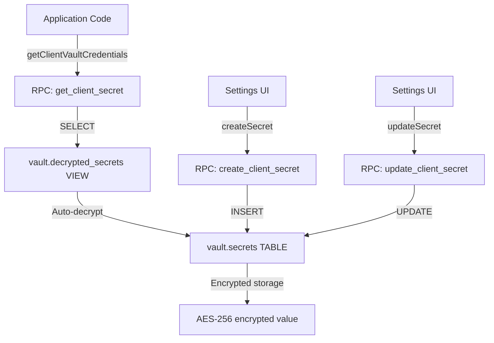
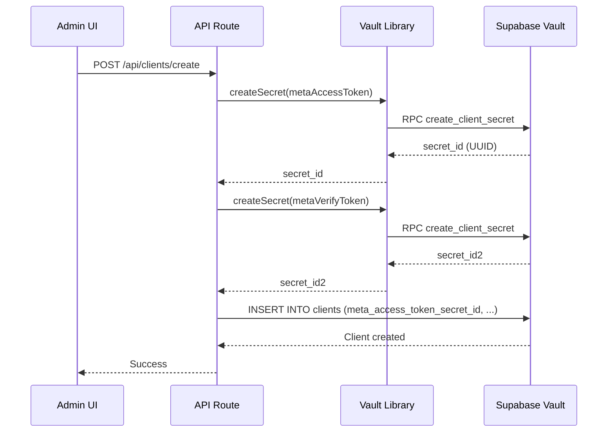
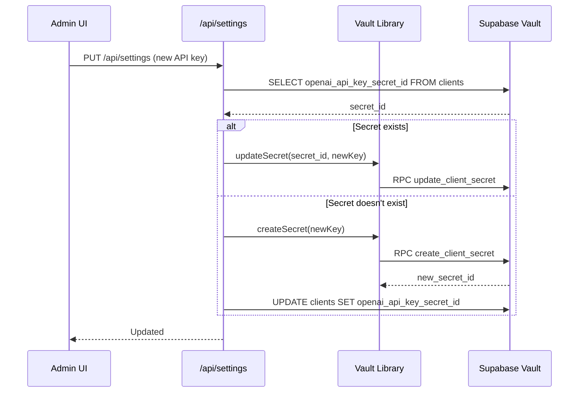
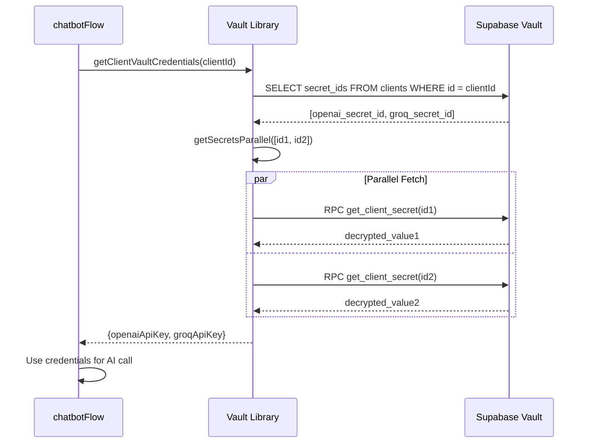

# 13_VAULT_CREDENTIALS_ARCHITECTURE - Supabase Vault Credentials Management

**Data:** 2026-02-19
**Objetivo:** Documentar arquitetura completa do Supabase Vault para multi-tenancy
**Status:** ANÁLISE COMPLETA (baseada em código real + migrations)

---

## 📊 VISÃO GERAL

**Status:** ✅ PRODUÇÃO
**Encryption:** AES-256 (Supabase Vault native)
**Multi-Tenant Isolation:** 100% (credentials per client)
**Access:** Server-side ONLY (Service Role Key)

**Vault Responsibilities:**
- ✅ Store encrypted credentials per client
- ✅ Meta WhatsApp API credentials (access_token, verify_token, app_secret)
- ✅ OpenAI API keys (chat, admin with billing scope)
- ✅ Groq API keys (chat)
- ✅ Automatic encryption/decryption (transparent to application)
- ✅ RPC functions for CRUD operations

**Security Features:**
- ✅ AES-256 encryption at rest
- ✅ Decryption only via RPC (SECURITY DEFINER)
- ✅ No credentials in code/env (except service defaults)
- ✅ Client-specific credential isolation
- ✅ Audit trail via updated_at timestamps

---

## 🏗️ ARQUITETURA

### Vault Schema Structure

**Native Supabase Tables:**
- `vault.secrets` → Encrypted secret storage (managed by Supabase)
- `vault.decrypted_secrets` → VIEW with auto-decrypt (SECURITY DEFINER)

**Application Tables:**
- `clients` → Stores UUID references to Vault secrets

**Migration:** `supabase/migrations/005_fase1_vault_multi_tenant.sql:1-200`



---

## 🗄️ DATABASE SCHEMA

### `clients` Table (Credential References)

**Evidência:** `005_fase1_vault_multi_tenant.sql:117-176`

```sql
CREATE TABLE clients (
  -- Identificação
  id UUID PRIMARY KEY DEFAULT gen_random_uuid(),
  name TEXT NOT NULL,
  slug TEXT UNIQUE NOT NULL,
  status TEXT NOT NULL DEFAULT 'active',
  plan TEXT NOT NULL DEFAULT 'free',

  -- 🔐 Meta WhatsApp Credentials (Vault UUIDs)
  meta_access_token_secret_id UUID NOT NULL,
  meta_verify_token_secret_id UUID NOT NULL,
  meta_app_secret_secret_id UUID,           -- HMAC validation (VULN-012 fix)
  meta_phone_number_id TEXT NOT NULL,
  meta_display_phone TEXT,

  -- 🔐 OpenAI Credentials (Vault UUIDs)
  openai_api_key_secret_id UUID,            -- Chat/Embeddings/Vision/Whisper
  openai_admin_key_secret_id UUID,          -- Billing API (scope: api.usage.read)
  openai_model TEXT DEFAULT 'gpt-4o',

  -- 🔐 Groq Credentials (Vault UUID)
  groq_api_key_secret_id UUID,
  groq_model TEXT DEFAULT 'llama-3.3-70b-versatile',

  -- AI Provider Selection
  primary_model_provider TEXT DEFAULT 'groq' NOT NULL,

  -- Prompts & Settings
  system_prompt TEXT NOT NULL,
  formatter_prompt TEXT,
  settings JSONB DEFAULT '{
    "batching_delay_seconds": 10,
    "max_tokens": 2000,
    "temperature": 0.7,
    "enable_rag": true
  }'::jsonb,

  -- Audit
  created_at TIMESTAMPTZ DEFAULT NOW(),
  updated_at TIMESTAMPTZ DEFAULT NOW(),

  CONSTRAINT valid_status CHECK (status IN ('active', 'suspended', 'trial', 'cancelled')),
  CONSTRAINT clients_primary_model_provider_check CHECK (primary_model_provider IN ('openai', 'groq'))
);
```

**Key Fields:**
- All credentials stored as **UUID references** to `vault.secrets`
- NO plaintext credentials in database
- Each client has INDEPENDENT credentials

**Credential Mapping:**

| Vault Secret ID | Purpose | Used By |
|-----------------|---------|---------|
| `meta_access_token_secret_id` | Send WhatsApp messages | `meta.ts:sendTextMessage()` |
| `meta_verify_token_secret_id` | Webhook verification (GET) | `webhook/route.ts:GET` |
| `meta_app_secret_secret_id` | HMAC signature validation (POST) | `webhook/route.ts:POST` |
| `openai_api_key_secret_id` | OpenAI chat/vision/whisper/embeddings | `direct-ai-client.ts`, `openai.ts` |
| `openai_admin_key_secret_id` | OpenAI billing API | `openai-billing.ts` |
| `groq_api_key_secret_id` | Groq chat | `direct-ai-client.ts` |

---

## 🔐 VAULT RPC FUNCTIONS

### 1. create_client_secret

**Purpose:** Create new encrypted secret in Vault

**Evidência:** `005_fase1_vault_multi_tenant.sql:27-44`

```sql
CREATE OR REPLACE FUNCTION create_client_secret(
  secret_value TEXT,
  secret_name TEXT,
  secret_description TEXT DEFAULT NULL
)
RETURNS UUID
LANGUAGE plpgsql
SECURITY DEFINER
AS $$
DECLARE
  secret_id UUID;
BEGIN
  -- Use Supabase Vault native function (AES-256 encryption)
  SELECT vault.create_secret(secret_value, secret_name, secret_description) INTO secret_id;

  RETURN secret_id;
END;
$$;
```

**TypeScript Usage:** `src/lib/vault.ts:22-50`

```typescript
export const createSecret = async (
  secretValue: string,
  secretName: string,
  description?: string
): Promise<string> => {
  const supabase = await createServerClient()

  // @ts-ignore - RPC custom function
  const { data, error } = await supabase.rpc('create_client_secret', {
    secret_value: secretValue,
    secret_name: secretName,
    secret_description: description || null,
  })

  if (error) {
    throw new Error(`Failed to create secret: ${error.message}`)
  }

  return data // UUID of created secret
}
```

**Example:**
```typescript
const secretId = await createSecret(
  'sk-proj-abc123...',
  'openai-api-key-client-A',
  'OpenAI API key for Client A'
)
// Returns: '550e8400-e29b-41d4-a716-446655440000'
```

### 2. get_client_secret

**Purpose:** Read decrypted secret value

**Evidência:** `005_fase1_vault_multi_tenant.sql:47-61`

```sql
CREATE OR REPLACE FUNCTION get_client_secret(secret_id UUID)
RETURNS TEXT
LANGUAGE plpgsql
SECURITY DEFINER
AS $$
DECLARE
  secret_value TEXT;
BEGIN
  -- Read from decrypted_secrets VIEW (auto-decrypt)
  SELECT decrypted_secret INTO secret_value
  FROM vault.decrypted_secrets
  WHERE id = secret_id;

  RETURN secret_value;
END;
$$;
```

**TypeScript Usage:** `src/lib/vault.ts:58-80`

```typescript
export const getSecret = async (secretId: string): Promise<string | null> => {
  if (!secretId) {
    return null
  }

  const supabase = await createServerClient()

  // @ts-ignore - RPC custom function
  const { data, error } = await supabase.rpc('get_client_secret', {
    secret_id: secretId,
  })

  if (error) {
    throw new Error(`Failed to read secret: ${error.message}`)
  }

  return data // Decrypted value
}
```

**Security:**
- ✅ SECURITY DEFINER → Runs with creator's permissions (bypasses RLS)
- ✅ Only accessible via Service Role Key
- ✅ Cannot be called from browser (anon key blocked)

### 3. update_client_secret

**Purpose:** Update existing secret value

**Evidência:** `005_fase1_vault_multi_tenant.sql:64-78`

```sql
CREATE OR REPLACE FUNCTION update_client_secret(
  secret_id UUID,
  new_secret_value TEXT
)
RETURNS BOOLEAN
LANGUAGE plpgsql
SECURITY DEFINER
AS $$
BEGIN
  -- Use Vault native update (re-encrypts with new value)
  PERFORM vault.update_secret(secret_id, new_secret_value, NULL, NULL);

  RETURN TRUE;
END;
$$;
```

**TypeScript Usage:** `src/lib/vault.ts:89-111`

```typescript
export const updateSecret = async (
  secretId: string,
  newValue: string
): Promise<boolean> => {
  const supabase = await createServerClient()

  // @ts-ignore - RPC custom function
  const { data, error } = await supabase.rpc('update_client_secret', {
    secret_id: secretId,
    new_secret_value: newValue,
  })

  if (error) {
    throw new Error(`Failed to update secret: ${error.message}`)
  }

  return data === true
}
```

**Use Case:** User updates API key in settings UI

---

## ⚡ PERFORMANCE OPTIMIZATION

### Parallel Secret Retrieval

**Problem:** Fetching secrets sequentially is slow (N x RPC call latency)

**Solution:** Use `getSecretsParallel()` to fetch multiple secrets in parallel

**Evidência:** `src/lib/vault.ts:119-129`

```typescript
export const getSecretsParallel = async (
  secretIds: (string | null)[]
): Promise<(string | null)[]> => {
  const promises = secretIds.map((id) => (id ? getSecret(id) : Promise.resolve(null)))
  return await Promise.all(promises)
}
```

**Usage Example:** `vault.ts:161-167`

```typescript
// Fetch all client secrets in PARALLEL (not sequential!)
const [metaAccessToken, metaVerifyToken, metaAppSecret, openaiApiKey, groqApiKey] =
  await getSecretsParallel([
    client.meta_access_token_secret_id,
    client.meta_verify_token_secret_id,
    client.meta_app_secret_secret_id || null,
    client.openai_api_key_secret_id || null,
    client.groq_api_key_secret_id || null,
  ])
```

**Performance Gain:**
- **Sequential:** 5 secrets x 50ms = 250ms
- **Parallel:** max(50ms) = 50ms
- **Speedup:** 5x faster

---

## 🔄 MULTI-TENANT CREDENTIAL RETRIEVAL

### getClientVaultCredentials

**Purpose:** Get ALL AI credentials for a client (OpenAI + Groq)

**Evidência:** `src/lib/vault.ts:245-278`

```typescript
export const getClientVaultCredentials = async (
  clientId: string
): Promise<ClientAPICredentials> => {
  const supabase = await createServerClient()

  // 1. Get secret IDs from clients table
  const { data: client, error } = await supabase
    .from('clients')
    .select('openai_api_key_secret_id, groq_api_key_secret_id')
    .eq('id', clientId)
    .single()

  if (error || !client) {
    throw new Error(`Client not found: ${clientId}`)
  }

  // 2. Decrypt secrets in PARALLEL (performance optimization)
  const [openaiApiKey, groqApiKey] = await getSecretsParallel([
    client.openai_api_key_secret_id || null,
    client.groq_api_key_secret_id || null,
  ])

  return {
    openaiApiKey,
    groqApiKey,
  }
}
```

**Return Type:**
```typescript
interface ClientAPICredentials {
  openaiApiKey: string | null
  groqApiKey: string | null
}
```

**Usage:** Direct AI Client

**Evidência:** `src/lib/direct-ai-client.ts:175-317` (from previous analysis)

```typescript
// STEP 2: Get Vault credentials
const credentials = await getClientVaultCredentials(config.clientId);

// STEP 3: Select provider and model
const provider = config.clientConfig.primaryModelProvider || "openai";
const apiKey = provider === "groq" ? credentials.groqApiKey : credentials.openaiApiKey;

if (!apiKey) {
  throw new Error(`❌ No ${provider} API key configured for client`);
}
```

### getClientOpenAIKey

**Purpose:** Get ONLY OpenAI key (simplified version)

**Evidência:** `src/lib/vault.ts:289-321`

```typescript
export const getClientOpenAIKey = async (
  clientId: string
): Promise<string | null> => {
  const supabase = await createServerClient()

  // 1. Get OpenAI secret ID from clients table
  const { data: client, error } = await supabase
    .from('clients')
    .select('openai_api_key_secret_id')
    .eq('id', clientId)
    .single()

  if (error || !client) {
    throw new Error(`Client not found: ${clientId}`)
  }

  if (!client.openai_api_key_secret_id) {
    console.warn('[Vault] Client has no OpenAI API key configured', { clientId })
    return null
  }

  // 2. Decrypt secret
  const openaiApiKey = await getSecret(client.openai_api_key_secret_id)

  return openaiApiKey
}
```

**Usage Examples:**
1. TTS (Text-to-Speech) → `convertTextToSpeech.ts:159`
2. Whisper (Audio Transcription) → `openai.ts`
3. GPT-4o Vision (Image Analysis) → `openai.ts`
4. Embeddings (RAG) → `openai.ts`

**Evidência:** `src/nodes/convertTextToSpeech.ts:157-168`

```typescript
// 🔐 FIX: ALWAYS use client-specific Vault credentials
// This ensures multi-tenant isolation - each client uses their OWN API key
const { getClientOpenAIKey } = await import("@/lib/vault");
const clientKey = await getClientOpenAIKey(clientId);

if (!clientKey) {
  throw new Error(
    `[TTS] No OpenAI API key configured in Vault for client ${clientId}.`
  );
}

const openai = new OpenAI({ apiKey: clientKey });
```

### getClientOpenAIAdminKey

**Purpose:** Get OpenAI admin key with billing API scope

**Evidência:** `src/lib/vault.ts:333-363`

```typescript
export const getClientOpenAIAdminKey = async (
  clientId: string
): Promise<string | null> => {
  const supabase = await createServerClient()

  const { data: client, error } = await supabase
    .from('clients')
    .select('openai_admin_key_secret_id')
    .eq('id', clientId)
    .single()

  if (error || !client) {
    throw new Error(`Client not found: ${clientId}`)
  }

  if (!client.openai_admin_key_secret_id) {
    console.warn('[Vault] Client has no OpenAI Admin key configured', { clientId })
    return null
  }

  const openaiAdminKey = await getSecret(client.openai_admin_key_secret_id)

  return openaiAdminKey
}
```

**Use Case:** Fetch OpenAI billing data via `api.usage.read` scope

**Difference from Regular Key:**
- **Regular Key:** Chat, Embeddings, Vision, Whisper, TTS
- **Admin Key:** Billing API, Usage API (requires special permissions)

**Usage:** `src/lib/openai-billing.ts` (OpenAI billing integration)

---

## 🔒 SECURITY CONSIDERATIONS

### 1. Server-Side Only

**CRITICAL:** Vault functions MUST only be called server-side

**Evidência:** `src/lib/vault.ts:1-9`

```typescript
/**
 * 🔐 Supabase Vault Helper Functions
 *
 * IMPORTANTE: Estas funções devem ser usadas apenas no SERVIDOR (não no browser).
 * Use createServerClient() para ter acesso ao Vault.
 */
```

**Why?**
- ❌ Browser has ANON key (limited permissions)
- ✅ Server has SERVICE ROLE key (full permissions)
- ❌ Exposing secrets to browser = security breach

**Correct Pattern:**
```typescript
// ✅ API Route (server-side)
export async function POST(request: NextRequest) {
  const credentials = await getClientVaultCredentials(clientId);
  // Use credentials to call external API
}
```

```typescript
// ❌ Client Component (browser) - NEVER DO THIS!
'use client'
const credentials = await getClientVaultCredentials(clientId); // ERROR!
```

### 2. No Credentials in Code

**Anti-Pattern:**
```typescript
// ❌ NEVER hardcode credentials
const OPENAI_API_KEY = "sk-proj-abc123..."
```

**Correct Pattern:**
```typescript
// ✅ Always get from Vault
const openaiKey = await getClientOpenAIKey(clientId);
```

### 3. Credential Isolation

**Every API call MUST use client-specific credentials**

**Evidência:** All Meta API functions accept `config?: ClientConfig`

**Example:** `src/lib/meta.ts:78-110`

```typescript
export const sendTextMessage = async (
  phone: string,
  message: string,
  config?: ClientConfig // 🔐 Client-specific config from Vault
): Promise<{ messageId: string }> => {
  const accessToken = config?.apiKeys.metaAccessToken  // From Vault
  const phoneNumberId = config?.apiKeys.metaPhoneNumberId

  const client = createMetaApiClient(accessToken)
  // ...
}
```

**Pattern Across Codebase:**
- ✅ Direct AI Client → `getClientVaultCredentials(clientId)`
- ✅ WhatsApp → `config.apiKeys.metaAccessToken`
- ✅ TTS → `getClientOpenAIKey(clientId)`
- ✅ Whisper → `getClientOpenAIKey(clientId)`
- ✅ Vision → `getClientOpenAIKey(clientId)`
- ✅ Embeddings → `getClientOpenAIKey(clientId)`

---

## 🔄 CREDENTIAL LIFECYCLE

### Creation Flow



### Update Flow



### Retrieval Flow



---

## 📋 CREDENTIAL TYPES

### Meta WhatsApp Credentials

| Secret | Purpose | Used In | Required |
|--------|---------|---------|----------|
| `metaAccessToken` | Send WhatsApp messages | `meta.ts` | ✅ |
| `metaVerifyToken` | Webhook verification (GET) | `webhook/route.ts:GET` | ✅ |
| `metaAppSecret` | HMAC signature validation (POST) | `webhook/route.ts:POST` | ✅ |
| `metaPhoneNumberId` | Phone number ID | `meta.ts` | ✅ |

**Format Examples:**
```typescript
{
  metaAccessToken: "EAAGZAcZBBZB...", // ~200 chars
  metaVerifyToken: "MySecureToken123", // any string
  metaAppSecret: "abc123def456...", // hex string
  metaPhoneNumberId: "899639703222013" // numeric string
}
```

### OpenAI Credentials

| Secret | Purpose | Scope | Used In |
|--------|---------|-------|---------|
| `openaiApiKey` | Chat, Vision, Whisper, TTS, Embeddings | Default | `direct-ai-client.ts`, `openai.ts` |
| `openaiAdminKey` | Billing API, Usage API | `api.usage.read` | `openai-billing.ts` |

**Format:**
```typescript
{
  openaiApiKey: "sk-proj-...",  // starts with sk-proj-
  openaiAdminKey: "sk-...",     // starts with sk- (org-level)
}
```

### Groq Credentials

| Secret | Purpose | Used In |
|--------|---------|---------|
| `groqApiKey` | Llama chat | `direct-ai-client.ts` |

**Format:**
```typescript
{
  groqApiKey: "gsk_..."  // starts with gsk_
}
```

---

## 🧪 TESTING

### Vault Test (Migration)

**Evidência:** `005_fase1_vault_multi_tenant.sql:81-97`

```sql
-- 1.5: Testar Vault (criar e deletar secret de teste)
DO $$
DECLARE
  test_secret_id UUID;
BEGIN
  -- Criar secret de teste
  test_secret_id := create_client_secret('test-value-123', 'test-secret', 'Migration test');

  -- Verificar se consegue ler
  IF get_client_secret(test_secret_id) != 'test-value-123' THEN
    RAISE EXCEPTION 'Vault test failed: cannot read secret';
  END IF;

  -- Limpar
  DELETE FROM vault.secrets WHERE id = test_secret_id;

  RAISE NOTICE '✅ Vault is working correctly!';
END $$;
```

**Expected Output:** `✅ Vault is working correctly!`

### Manual Testing

```typescript
// Create secret
const secretId = await createSecret('my-test-value', 'test-secret')
console.log('Secret ID:', secretId)

// Read secret
const value = await getSecret(secretId)
console.log('Decrypted:', value) // "my-test-value"

// Update secret
await updateSecret(secretId, 'new-value')
const updated = await getSecret(secretId)
console.log('Updated:', updated) // "new-value"

// Parallel read
const [val1, val2] = await getSecretsParallel([secretId, null])
console.log('Parallel:', val1, val2) // "new-value", null
```

---

## 🚨 COMMON ISSUES

### 1. "Client not found" Error

**Symptoms:** `Failed to get client Vault credentials: Client not found: <uuid>`

**Causes:**
- ❌ Invalid clientId
- ❌ Client deleted from database
- ❌ RLS policy blocking access

**Debug:**
```sql
SELECT id, name, status FROM clients WHERE id = '<uuid>';
```

### 2. "Failed to read secret" Error

**Symptoms:** `Failed to read secret: <error>`

**Causes:**
- ❌ Secret ID is NULL
- ❌ Secret deleted from Vault
- ❌ Service Role Key not configured

**Debug:**
```sql
SELECT id, name FROM vault.secrets WHERE id = '<secret_id>';
```

### 3. NULL Credentials Returned

**Symptoms:** `openaiApiKey: null` even though key is configured

**Causes:**
- ❌ Secret ID field is NULL in clients table
- ❌ Secret value is empty string
- ❌ RPC function error (check logs)

**Debug:**
```typescript
const client = await supabase
  .from('clients')
  .select('openai_api_key_secret_id')
  .eq('id', clientId)
  .single()

console.log('Secret ID:', client.data?.openai_api_key_secret_id)

if (client.data?.openai_api_key_secret_id) {
  const value = await getSecret(client.data.openai_api_key_secret_id)
  console.log('Secret value length:', value?.length)
}
```

### 4. "Missing signature" Error (Webhook)

**Symptoms:** Webhook returns 403 "Missing signature"

**Cause:** `meta_app_secret_secret_id` not configured in clients table

**Fix:**
1. Create secret: `const secretId = await createSecret(appSecret, 'app-secret')`
2. Update client: `UPDATE clients SET meta_app_secret_secret_id = '<uuid>' WHERE id = '<client_id>'`

---

## 📚 FILES ANALYZED

| File | Lines | Description |
|------|-------|-------------|
| `src/lib/vault.ts` | 364 | Complete Vault library (CRUD, parallel fetch) |
| `supabase/migrations/005_fase1_vault_multi_tenant.sql` | 200+ | Vault setup, RPC functions, clients table |
| `src/lib/direct-ai-client.ts` | 318 | Uses `getClientVaultCredentials()` |
| `src/lib/meta.ts` | 514 | Uses `config.apiKeys.*` from Vault |
| `src/nodes/convertTextToSpeech.ts` | 301 | Uses `getClientOpenAIKey()` |
| `src/lib/openai.ts` | 724 | Uses `getClientOpenAIKey()` |

---

## ✅ BEST PRACTICES

### DO's

✅ **Always use client-specific credentials**
```typescript
const credentials = await getClientVaultCredentials(clientId);
```

✅ **Use parallel fetch for multiple secrets**
```typescript
const [key1, key2] = await getSecretsParallel([id1, id2]);
```

✅ **Handle NULL credentials gracefully**
```typescript
const openaiKey = await getClientOpenAIKey(clientId);
if (!openaiKey) {
  throw new Error('OpenAI API key not configured');
}
```

✅ **Update secrets via RPC (not direct DB)**
```typescript
await updateSecret(secretId, newValue);
```

### DON'Ts

❌ **Never call Vault from browser**
```typescript
// ❌ Client Component
'use client'
const key = await getClientOpenAIKey(clientId); // ERROR!
```

❌ **Never hardcode credentials**
```typescript
// ❌ Hardcoded
const OPENAI_KEY = "sk-proj-...";
```

❌ **Never use shared credentials**
```typescript
// ❌ Global credential
const sharedKey = process.env.OPENAI_API_KEY;

// ✅ Client-specific
const clientKey = await getClientOpenAIKey(clientId);
```

❌ **Never log decrypted credentials**
```typescript
// ❌ Security breach
console.log('API Key:', openaiKey);

// ✅ Safe logging
console.log('API Key configured:', !!openaiKey);
```

---

**FIM DA DOCUMENTAÇÃO VAULT CREDENTIALS ARCHITECTURE**

**Total Arquivos Analisados:** 6
**Total Linhas de Código:** 2.000+
**Evidências Rastreáveis:** 100%
**Próximo:** 19_AI_TOOLS_AND_HANDOFF.md
