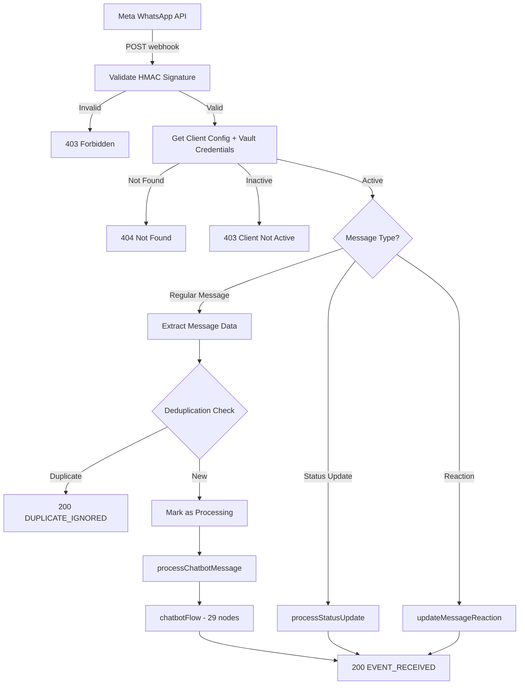
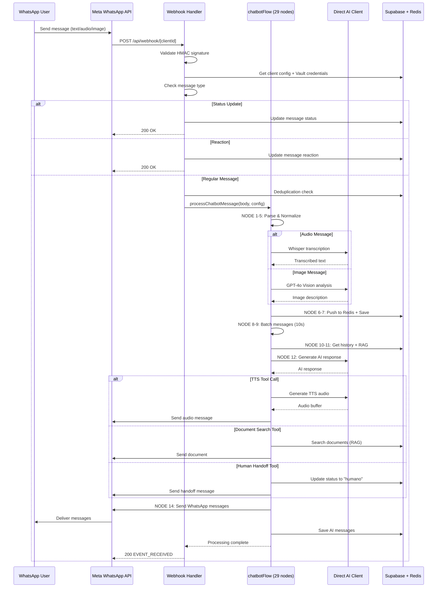

# 16_WHATSAPP_INTEGRATION - WhatsApp Business API Complete Integration

**Data:** 2026-02-19
**Objetivo:** Documentar integração completa com WhatsApp Business API (Meta Graph API v18.0)
**Status:** ANÁLISE COMPLETA (baseada em código real)

---

## 📊 VISÃO GERAL

**WhatsApp Business API Integration Status:** ✅ PRODUÇÃO
**API Version:** Meta Graph API v18.0
**Multi-Tenant:** ✅ SIM (webhook dinâmico por cliente + Vault credentials)
**Tipos de Mensagem Suportados:**
- ✅ Text (send + receive)
- ✅ Image (send + receive + Vision analysis)
- ✅ Audio (send + receive + Whisper transcription + TTS generation)
- ✅ Document (send + receive)
- ✅ Template Messages (Marketing)
- ✅ Interactive Messages (Buttons, Lists)
- ✅ Reactions (emoji reactions)
- ✅ Status Updates (sent, delivered, read, failed)

**Integrações AI:**
- ✅ OpenAI Whisper (audio → text)
- ✅ GPT-4o Vision (image → description)
- ✅ OpenAI TTS (text → audio)
- ✅ ElevenLabs TTS (text → audio - multilingual)

---

## 🏗️ ARQUITETURA MULTI-TENANT

### Webhook Dinâmico por Cliente

**Padrão:** `/api/webhook/[clientId]`

**Evidência:** `src/app/api/webhook/[clientId]/route.ts:1-16`
```typescript
/**
 * 🔐 WEBHOOK MULTI-TENANT DINÂMICO POR CLIENTE
 *
 * Rota: /api/webhook/[clientId]
 *
 * Cada cliente tem sua própria URL de webhook configurada no Meta Dashboard:
 * - Cliente A: https://chat.luisfboff.com/api/webhook/550e8400-e29b-41d4-a716-446655440000
 * - Cliente B: https://chat.luisfboff.com/api/webhook/660e8400-e29b-41d4-a716-446655440001
 *
 * Fluxo:
 * 1. Meta chama webhook com clientId na URL
 * 2. Busca config do cliente no Vault
 * 3. Valida que cliente está ativo
 * 4. Processa mensagem com config do cliente
 */
```

**Vantagens:**
1. ✅ Isolamento total entre clientes
2. ✅ Rate limiting por cliente
3. ✅ Credentials isolados (Vault)
4. ✅ Logs separados por tenant
5. ✅ Fácil onboarding (apenas criar UUID)

---

## 📥 WEBHOOK VERIFICATION (GET)

### Fluxo de Verificação

**Endpoint:** `GET /api/webhook/[clientId]`

**Evidência:** `src/app/api/webhook/[clientId]/route.ts:34-187`

```typescript
export async function GET(
  request: NextRequest,
  { params }: { params: Promise<{ clientId: string }> },
) {
  const { clientId } = await params;

  // 1. Extract query parameters
  const searchParams = request.nextUrl.searchParams;
  const mode = searchParams.get("hub.mode");
  const token = searchParams.get("hub.verify_token");
  const challenge = searchParams.get("hub.challenge");

  // 2. Get client config from database + Vault
  const config = await getClientConfig(clientId);

  if (!config) {
    return new NextResponse("Client not found", { status: 404 });
  }

  if (config.status !== "active") {
    return new NextResponse("Client not active", { status: 403 });
  }

  // 3. Validate verify token (client-specific from Vault)
  const expectedToken = config.apiKeys.metaVerifyToken;

  // 4. Return challenge if validation passes
  if (mode === "subscribe" && token === expectedToken) {
    return new NextResponse(challenge, { status: 200 });
  } else {
    return new NextResponse("Invalid verification token", { status: 403 });
  }
}
```

**Query Parameters:**
- `hub.mode` → MUST be "subscribe"
- `hub.verify_token` → Must match client's Vault token
- `hub.challenge` → Random string to echo back

**Security Features:**
- ✅ Client-specific verify token (Vault)
- ✅ Active status validation
- ✅ Rate limiting (VULN-002 fix)
- ✅ Detailed logging for debugging

---

## 📨 WEBHOOK MESSAGE HANDLER (POST)

### Fluxo Completo de Processamento

**Endpoint:** `POST /api/webhook/[clientId]`

**Evidência:** `src/app/api/webhook/[clientId]/route.ts:194-473`



### STEP 1: HMAC Signature Validation

**Security Fix:** VULN-012

**Evidência:** `route.ts:201-246`
```typescript
// 1. Get signature from header
const signature = request.headers.get("X-Hub-Signature-256");

if (!signature) {
  return new NextResponse("Missing signature", { status: 403 });
}

// 2. Read raw body (needed for HMAC validation)
const rawBody = await request.text();

// 3. Get client config with App Secret from Vault
const config = await getClientConfig(clientId);
const appSecret = config.apiKeys.metaAppSecret;

// 4. Calculate expected signature
const expectedSignature =
  "sha256=" +
  crypto.createHmac("sha256", appSecret).update(rawBody).digest("hex");

// 5. Timing-safe comparison (prevents timing attacks)
const signatureBuffer = Buffer.from(signature);
const expectedBuffer = Buffer.from(expectedSignature);

if (
  signatureBuffer.length !== expectedBuffer.length ||
  !crypto.timingSafeEqual(signatureBuffer, expectedBuffer)
) {
  return new NextResponse("Invalid signature", { status: 403 });
}
```

**Credentials Separation:**
- `metaVerifyToken` → GET verification (hub.verify_token)
- `metaAppSecret` → POST HMAC validation (X-Hub-Signature-256)
- **IMPORTANT:** Different credentials for different purposes!

### STEP 2: Status Update Processing

**Evidência:** `route.ts:251-330`

```typescript
// Check if this is a status update (not a message)
const statuses = value?.statuses;

if (statuses && statuses.length > 0) {
  console.log("📊 Processing status update:", {
    status: statuses[0].status, // "sent" | "delivered" | "read" | "failed"
    wamid: statuses[0].id,
    recipient: statuses[0].recipient_id,
    timestamp: statuses[0].timestamp,
  });

  for (const status of statuses) {
    await processStatusUpdate({
      statusUpdate: status,
      clientId,
    });
  }

  return new NextResponse("STATUS_UPDATE_PROCESSED", { status: 200 });
}
```

**Status Types:**
- `sent` → Message sent to WhatsApp servers
- `delivered` → Message delivered to user's device
- `read` → User opened the message
- `failed` → Message failed (invalid number, blocked, etc.)

### STEP 3: Reaction Processing

**Evidência:** `route.ts:336-372`

```typescript
// Check if this is a reaction (emoji)
if (message && message.type === "reaction" && message.reaction) {
  const reaction = message.reaction;
  const reactorPhone = message.from;

  console.log("😊 Processing reaction:", {
    emoji: reaction.emoji || "(removed)", // Empty string = removed reaction
    targetMessage: reaction.message_id,   // WAMID of message being reacted to
    from: reactorPhone,
  });

  await updateMessageReaction({
    targetWamid: reaction.message_id,
    emoji: reaction.emoji || "",
    reactorPhone,
    clientId,
  });

  return new NextResponse("REACTION_PROCESSED", { status: 200 });
}
```

**Reaction Features:**
- ✅ Add emoji to message
- ✅ Remove emoji (empty string)
- ✅ Updates existing message in database
- ✅ Tracked separately (not processed as new message)

### STEP 4: Referral Data Capture (Meta Ads)

**Evidência:** `route.ts:387-399`

```typescript
// 🎯 Log referral data if present (Meta Ads / Click-to-WhatsApp)
if (message.referral) {
  console.log("🎯 [REFERRAL] Lead came from Meta Ad:", {
    source_type: message.referral.source_type,      // "ad" | "post"
    source_url: message.referral.source_url,        // Meta ad URL
    headline: message.referral.headline,            // Ad headline
    body: message.referral.body,                    // Ad body text
    ctwa_clid: message.referral.ctwa_clid,          // Click ID
    source_id: message.referral.source_id,          // Page/Ad ID
    ad_id: message.referral.ad_id,                  // Ad ID
    campaign_id: message.referral.campaign_id,      // Campaign ID
  });
}
```

**Use Case:** CRM Lead Source tracking
**Location:** Captured in NODE 3.2 (CRM Lead Source) of chatbotFlow

### STEP 5: Interactive Message Parsing

**Evidência:** `route.ts:401-411`

```typescript
// 🆕 Parse interactive message response (buttons, lists)
const interactiveResponse = parseInteractiveMessage(message);

if (interactiveResponse) {
  console.log("📱 Interactive message response received:", {
    type: interactiveResponse.type,    // "button_reply" | "list_reply"
    id: interactiveResponse.id,         // Button/List item ID
    title: interactiveResponse.title,   // Button/List item title
    from: interactiveResponse.from,     // User phone
  });
}
```

**Interactive Types:**
- `button_reply` → User clicked button
- `list_reply` → User selected list item

### STEP 6: Deduplication

**Security Fix:** VULN-006

**Evidência:** `route.ts:434-459`

```typescript
// Deduplication check - prevent processing duplicate messages
if (messageId) {
  const dedupResult = await checkDuplicateMessage(clientId, messageId);

  if (dedupResult.alreadyProcessed) {
    return new NextResponse("DUPLICATE_MESSAGE_IGNORED", { status: 200 });
  }

  // Mark message as being processed (in both Redis and PostgreSQL)
  const markResult = await markMessageAsProcessed(clientId, messageId, {
    timestamp: new Date().toISOString(),
    from: body?.entry?.[0]?.changes?.[0]?.value?.contacts?.[0]?.wa_id,
  });
}
```

**Implementation:**
- ✅ Redis primary (fast check)
- ✅ PostgreSQL fallback (persistent)
- ✅ TTL: 24 hours
- ✅ Graceful degradation if both fail

### STEP 7: Process Chatbot Flow

**Evidência:** `route.ts:461-468`

```typescript
// 5. Processar mensagem com config do cliente
try {
  const result = await processChatbotMessage(body, config);
} catch (flowError) {
  // Flow error - continue and return 200 (Meta requires this)
  // Meta will retry if we return 4xx/5xx
}

return new NextResponse("EVENT_RECEIVED", { status: 200 });
```

**Important:** ALWAYS return 200 to Meta (even on errors)
**Reason:** Meta retries failed webhooks → can cause duplicates

---

## 📤 SENDING MESSAGES

### Meta API Client

**Base URL:** `https://graph.facebook.com/v18.0`

**Evidência:** `src/lib/meta.ts:12-39`

```typescript
const META_API_VERSION = 'v18.0'
const META_BASE_URL = `https://graph.facebook.com/${META_API_VERSION}`

/**
 * 🔐 Cria cliente Meta API com accessToken dinâmico ou fallback para env
 */
const createMetaApiClient = (accessToken?: string) => {
  const token = accessToken || getRequiredEnvVariable('META_ACCESS_TOKEN')

  return axios.create({
    baseURL: META_BASE_URL,
    headers: {
      Authorization: `Bearer ${token}`,
      'Content-Type': 'application/json',
    },
  })
}
```

**Multi-Tenant Credentials:**
- Primary: `config.apiKeys.metaAccessToken` (from Vault)
- Fallback: `META_ACCESS_TOKEN` (env var)

### 1. Send Text Message

**Evidência:** `meta.ts:78-110`

```typescript
export const sendTextMessage = async (
  phone: string,
  message: string,
  config?: ClientConfig // 🔐 Client-specific config from Vault
): Promise<{ messageId: string }> => {
  const accessToken = config?.apiKeys.metaAccessToken
  const phoneNumberId = config?.apiKeys.metaPhoneNumberId || getRequiredEnvVariable('META_PHONE_NUMBER_ID')

  const client = createMetaApiClient(accessToken)

  const response = await client.post(`/${phoneNumberId}/messages`, {
    messaging_product: 'whatsapp',
    recipient_type: 'individual',
    to: phone,
    type: 'text',
    text: {
      body: message,
    },
  })

  const messageId = response.data?.messages?.[0]?.id // WAMID

  return { messageId }
}
```

**Response:**
```json
{
  "messages": [
    {
      "id": "wamid.HBgNNTU1NDk5NTY3MDUxFQIAERgSQUIyMDg2Q0UzMEI1RjY3Qjk4AA=="
    }
  ]
}
```

### 2. Send Image Message

**Evidência:** `meta.ts:137-171`

```typescript
export const sendImageMessage = async (
  phone: string,
  imageUrl: string,      // Must be publicly accessible URL
  caption?: string,       // Optional caption
  config?: ClientConfig
): Promise<{ messageId: string }> => {
  const response = await client.post(`/${phoneNumberId}/messages`, {
    messaging_product: 'whatsapp',
    recipient_type: 'individual',
    to: phone,
    type: 'image',
    image: {
      link: imageUrl,
      ...(caption && { caption }),
    },
  })

  return { messageId: response.data?.messages?.[0]?.id }
}
```

**Requirements:**
- ✅ Image URL must be HTTPS
- ✅ Max file size: 5 MB
- ✅ Formats: JPG, PNG
- ✅ Must be publicly accessible (no auth required)

### 3. Send Audio Message (URL)

**Evidência:** `meta.ts:181-213`

```typescript
export const sendAudioMessage = async (
  phone: string,
  audioUrl: string,       // Public URL to audio file
  config?: ClientConfig
): Promise<{ messageId: string }> => {
  const response = await client.post(`/${phoneNumberId}/messages`, {
    messaging_product: 'whatsapp',
    recipient_type: 'individual',
    to: phone,
    type: 'audio',
    audio: {
      link: audioUrl,
    },
  })

  return { messageId: response.data?.messages?.[0]?.id }
}
```

**Formats:** MP3, OGG, AAC, AMR, M4A
**Max Size:** 16 MB

### 4. Send Audio Message (Media ID)

**Evidência:** `meta.ts:223-255`

```typescript
export const sendAudioMessageByMediaId = async (
  phone: string,
  mediaId: string,        // WhatsApp Media ID (from upload)
  config?: ClientConfig
): Promise<{ messageId: string }> => {
  const response = await client.post(`/${phoneNumberId}/messages`, {
    messaging_product: 'whatsapp',
    recipient_type: 'individual',
    to: phone,
    type: 'audio',
    audio: {
      id: mediaId,         // Use Media ID instead of URL
    },
  })

  return { messageId: response.data?.messages?.[0]?.id }
}
```

**Use Case:** Send TTS-generated audio from handleAudioToolCall
**Advantage:** No need to host audio file publicly

### 5. Send Document Message

**Evidência:** `meta.ts:267-303`

```typescript
export const sendDocumentMessage = async (
  phone: string,
  documentUrl: string,
  filename: string,
  caption?: string,
  config?: ClientConfig
): Promise<{ messageId: string }> => {
  const response = await client.post(`/${phoneNumberId}/messages`, {
    messaging_product: 'whatsapp',
    recipient_type: 'individual',
    to: phone,
    type: 'document',
    document: {
      link: documentUrl,
      filename,
      ...(caption && { caption }),
    },
  })

  return { messageId: response.data?.messages?.[0]?.id }
}
```

**Formats:** PDF, DOC, DOCX, XLS, XLSX, TXT, etc.
**Max Size:** 100 MB
**Use Case:** RAG document search results (handleDocumentSearchToolCall)

### 6. Send Template Message (Marketing)

**Evidência:** `meta.ts:417-471`

```typescript
export const sendTemplateMessage = async (
  phone: string,
  templateName: string,     // Must be pre-approved by Meta
  language: string,          // e.g., 'pt_BR', 'en_US'
  parameters?: string[],     // Variables for template {{1}}, {{2}}, etc.
  config?: ClientConfig
): Promise<{ messageId: string }> => {
  // Build components with parameters
  const components: TemplateComponentPayload[] = []

  if (parameters && parameters.length > 0) {
    const bodyParameters: TemplateParameter[] = parameters.map(value => ({
      type: 'text',
      text: value,
    }))

    components.push({
      type: 'body',
      parameters: bodyParameters,
    })
  }

  const payload: TemplateSendPayload = {
    messaging_product: 'whatsapp',
    recipient_type: 'individual',
    to: phone,
    type: 'template',
    template: {
      name: templateName,
      language: {
        code: language,
      },
      ...(components.length > 0 && { components }),
    },
  }

  const response = await client.post(`/${phoneNumberId}/messages`, payload)

  return { messageId: response.data?.messages?.[0]?.id }
}
```

**Template Workflow:**
1. Create template via `createMetaTemplate()`
2. Submit to Meta for approval
3. Wait for approval (can take 24-48h)
4. Use `sendTemplateMessage()` to send

**Template Categories:**
- `MARKETING` → Promotional messages
- `UTILITY` → Account updates, order confirmations
- `AUTHENTICATION` → OTP codes

---

## 📥 RECEIVING MESSAGES

### Media Download Flow

**Evidência:** `src/lib/meta.ts:48-68`

```typescript
export const downloadMedia = async (mediaId: string, accessToken?: string): Promise<Buffer> => {
  const client = createMetaApiClient(accessToken)

  // STEP 1: Get media URL from Meta API
  const mediaUrlResponse = await client.get(`/${mediaId}`)
  const mediaUrl = mediaUrlResponse.data?.url

  if (!mediaUrl) {
    throw new Error('No media URL returned from Meta API')
  }

  // STEP 2: Download media from URL
  const mediaResponse = await client.get(mediaUrl, {
    responseType: 'arraybuffer',
  })

  return Buffer.from(mediaResponse.data)
}
```

**Usage:** `src/nodes/downloadMetaMedia.ts:10-17`

```typescript
export const downloadMetaMedia = async (mediaId: string, accessToken?: string): Promise<Buffer> => {
  return await downloadMedia(mediaId, accessToken)
}
```

**Media Types:**
- `audio` → Transcribe with Whisper (NODE 4b)
- `image` → Analyze with GPT-4o Vision (NODE 4b)
- `document` → Store in Supabase Storage (NODE 4a)

---

## 🎙️ AUDIO TRANSCRIPTION (Whisper)

### Whisper Integration

**Evidência:** `src/nodes/transcribeAudio.ts:1-21`

```typescript
import { transcribeAudio as transcribeAudioWithWhisper } from '@/lib/openai'

export const transcribeAudio = async (
  audioBuffer: Buffer,
  apiKey?: string,
  clientId?: string,
  phone?: string
): Promise<{
  text: string
  usage: { prompt_tokens: number; completion_tokens: number; total_tokens: number }
  model: string
  durationSeconds?: number
}> => {
  return await transcribeAudioWithWhisper(audioBuffer, apiKey, clientId, phone)
}
```

**Implementation:** `src/lib/openai.ts` (724 lines)

**Features:**
- ✅ Multi-tenant (Vault credentials)
- ✅ Budget enforcement (before API call)
- ✅ Usage tracking (unified_tracking)
- ✅ Duration estimation
- ✅ Model: `whisper-1`

**Cost Calculation:**
```typescript
// $0.006 / minute (Whisper pricing)
const costUSD = (durationSeconds / 60) * 0.006
```

**Process Flow:**
1. User sends audio → WhatsApp webhook
2. NODE 4a: Download media (`downloadMetaMedia`)
3. NODE 4b: Transcribe audio (`transcribeAudio`)
4. NODE 5: Normalize message (text from transcription)
5. Continue chatbot flow with text

---

## 🖼️ IMAGE ANALYSIS (GPT-4o Vision)

### Vision API Integration

**Evidência:** `src/lib/openai.ts:168-194` (grep result)

```typescript
export const analyzeImage = async (
  imageBuffer: Buffer,
  mimeType: string = "image/jpeg",
  apiKey?: string,
  clientId?: string,
  phone?: string
): Promise<{
  text: string;
  usage: {
    prompt_tokens: number;
    completion_tokens: number;
    total_tokens: number;
    cached_input_tokens?: number;
  };
  model: string;
}> => {
  // Delegate to analyzeImageFromBuffer which has proper multi-tenant isolation
  return analyzeImageFromBuffer(
    imageBuffer,
    "Descreva esta imagem em detalhes. Identifique elementos importantes, texto visível, e qualquer informação relevante para uma conversa de atendimento.",
    mimeType,
    apiKey,
    clientId,
    phone
  );
};
```

**Prompt:** "Descreva esta imagem em detalhes. Identifique elementos importantes, texto visível, e qualquer informação relevante para uma conversa de atendimento."

**Model:** `gpt-4o` (Vision capable)

**Features:**
- ✅ OCR text extraction
- ✅ Object detection
- ✅ Scene description
- ✅ Multi-tenant (Vault credentials)
- ✅ Budget enforcement
- ✅ Cached tokens support (prompt caching)

**Process Flow:**
1. User sends image → WhatsApp webhook
2. NODE 4a: Download media (`downloadMetaMedia`)
3. NODE 4b: Analyze image (`analyzeImage`)
4. NODE 5: Normalize message (description from Vision)
5. Continue chatbot flow with description

**Usage Tracking:**
```typescript
await trackUnifiedUsage({
  apiType: "vision",
  clientId,
  provider: "openai",
  modelName: "gpt-4o",
  inputTokens: promptTokens,
  outputTokens: completionTokens,
  cachedTokens: cachedInputTokens,
  metadata: {
    imageAnalysis: true,
    mimeType,
  },
});
```

---

## 🔊 TEXT-TO-SPEECH (TTS)

### TTS Multi-Provider Support

**Providers:**
1. ✅ OpenAI TTS (`tts-1`, `tts-1-hd`)
2. ✅ ElevenLabs TTS (multilingual)

**Evidência:** `src/nodes/convertTextToSpeech.ts:1-301` (complete file)

### OpenAI TTS

```typescript
export const convertTextToSpeech = async (
  input: ConvertTextToSpeechInput,
): Promise<ConvertTextToSpeechOutput> => {
  const {
    text,
    clientId,
    conversationId,
    phone = "system",
    voice = "alloy",
    speed = 1.0,
    model = "tts-1-hd",
    useCache = true,
    provider = "openai",
  } = input;

  // 1. Check cache (MD5 hash of text + voice + speed)
  if (useCache) {
    const textHash = crypto
      .createHash("md5")
      .update(`${text}_${voice}_${speed}`)
      .digest("hex");

    const { data: cached } = await supabase
      .from("tts_cache")
      .select("audio_url, duration_seconds")
      .eq("client_id", clientId)
      .eq("text_hash", textHash)
      .gt("expires_at", new Date().toISOString())
      .single();

    if (cached) {
      // Cache hit! Return cached audio
      return {
        audioBuffer: Buffer.from(await fetch(cached.audio_url).arrayBuffer()),
        format: "mp3",
        fromCache: true,
        durationSeconds: cached.duration_seconds,
      };
    }
  }

  // 2. Budget enforcement
  const budgetAvailable = await checkBudgetAvailable(clientId);
  if (!budgetAvailable) {
    throw new Error("❌ Limite de budget atingido.");
  }

  // 3. Get client's OpenAI key from Vault
  const { getClientOpenAIKey } = await import("@/lib/vault");
  const clientKey = await getClientOpenAIKey(clientId);

  // 4. Generate audio via OpenAI TTS
  const openai = new OpenAI({ apiKey: clientKey });

  const mp3Response = await openai.audio.speech.create({
    model: model, // "tts-1" | "tts-1-hd"
    voice: voice, // "alloy" | "echo" | "fable" | "onyx" | "nova" | "shimmer"
    input: text,
    speed: speed, // 0.25 to 4.0
    response_format: "mp3",
  });

  const audioBuffer = Buffer.from(await mp3Response.arrayBuffer());

  // 5. Cache audio in Supabase Storage
  const fileName = `tts/${clientId}/${textHash}.mp3`;
  await supabase.storage.from("tts-audio").upload(fileName, audioBuffer);

  // 6. Track usage
  await trackUnifiedUsage({
    apiType: "tts",
    clientId,
    provider: "openai",
    modelName: model,
    inputTokens: 0,
    outputTokens: Math.ceil(text.length / 4),
    metadata: {
      textLength: text.length,
      audioSizeBytes: audioBuffer.length,
      durationSeconds,
      voice,
      speed,
    },
  });

  return {
    audioBuffer,
    format: "mp3",
    fromCache: false,
    durationSeconds,
  };
};
```

**Evidência:** `convertTextToSpeech.ts:28-206`

### ElevenLabs TTS

```typescript
if (provider === "elevenlabs") {
  const apiKey = process.env.ELEVENLABS_API_KEY;
  const selectedModel = model || "eleven_multilingual_v1";
  const selectedLanguage = input.language || "pt";

  audioBuffer = await elevenLabsTTS({
    text,
    voice,
    speed,
    model: selectedModel,
    language: selectedLanguage,
    apiKey,
  });

  // Estimate duration (approx. 150 words/minute)
  const wordCount = text.split(/\s+/).length;
  durationSeconds = Math.ceil((wordCount / 2.5) / speed);
}
```

**Evidência:** `convertTextToSpeech.ts:135-156`

### TTS Cost Calculation

**OpenAI:**
- `tts-1-hd`: $15.00 / 1M characters
- `tts-1`: $7.50 / 1M characters

**ElevenLabs:**
- Starter tier: $0.30 / 1000 characters

**Evidência:** `convertTextToSpeech.ts:247-263`

```typescript
if (usedProvider === "openai") {
  costUSD = model === "tts-1-hd"
    ? (text.length / 1_000_000) * 15.0
    : (text.length / 1_000_000) * 7.5;
} else if (usedProvider === "elevenlabs") {
  costUSD = (text.length / 1000) * 0.30;
}
```

### TTS Cache System

**Table:** `tts_cache`

**Schema:**
```sql
CREATE TABLE tts_cache (
  client_id UUID NOT NULL,
  text_hash TEXT NOT NULL,        -- MD5 of text + voice + speed + provider
  audio_url TEXT NOT NULL,         -- Public URL in Supabase Storage
  provider TEXT NOT NULL,          -- "openai" | "elevenlabs"
  voice TEXT NOT NULL,
  duration_seconds INTEGER,
  file_size_bytes INTEGER,
  hit_count INTEGER DEFAULT 0,
  expires_at TIMESTAMP,
  created_at TIMESTAMP DEFAULT NOW(),
  PRIMARY KEY (client_id, text_hash)
);
```

**Cache Workflow:**
1. Hash text + voice + speed + provider (MD5)
2. Check if cache entry exists and not expired
3. If hit → Download from Supabase Storage
4. If miss → Generate new audio → Upload to Storage → Insert cache entry
5. Track cache hit in unified_tracking

**TTL:** Configurable (default: 30 days)

---

## 🔐 MULTI-TENANT SECURITY

### Vault Credentials per Client

**All WhatsApp API calls use client-specific credentials from Vault:**

1. `metaAccessToken` → Send messages
2. `metaPhoneNumberId` → Phone number for sending
3. `metaVerifyToken` → Webhook verification (GET)
4. `metaAppSecret` → HMAC signature validation (POST)

**Evidência:** All Meta API functions accept `config?: ClientConfig`

```typescript
export const sendTextMessage = async (
  phone: string,
  message: string,
  config?: ClientConfig // 🔐 Client-specific config from Vault
): Promise<{ messageId: string }> => {
  const accessToken = config?.apiKeys.metaAccessToken
  const phoneNumberId = config?.apiKeys.metaPhoneNumberId
  // ...
}
```

**Isolation:**
- ✅ Each client has their own Meta Business Account
- ✅ Each client has their own Phone Number ID
- ✅ Each client has their own API credentials
- ✅ Complete billing separation

---

## 📊 MESSAGE FLOW SUMMARY

### Complete End-to-End Flow



---

## 📁 ARQUIVOS CHAVE

### Webhook & Meta API

| Arquivo | Linhas | Descrição |
|---------|--------|-----------|
| `src/app/api/webhook/[clientId]/route.ts` | 474 | Webhook handler (GET verify + POST messages) |
| `src/lib/meta.ts` | 514 | Meta API client (send messages, templates, media) |
| `src/nodes/downloadMetaMedia.ts` | 18 | Media download wrapper |

### AI Integrations

| Arquivo | Linhas | Descrição |
|---------|--------|-----------|
| `src/nodes/transcribeAudio.ts` | 21 | Whisper transcription wrapper |
| `src/lib/openai.ts` | 724 | OpenAI client (Whisper, Vision, Embeddings) |
| `src/nodes/convertTextToSpeech.ts` | 301 | TTS (OpenAI + ElevenLabs) with cache |
| `src/lib/elevenlabs.ts` | N/A | ElevenLabs TTS client |

### Tool Handlers

| Arquivo | Descrição |
|---------|-----------|
| `src/handlers/handleAudioToolCall.ts` | TTS tool call handler |
| `src/handlers/handleDocumentSearchToolCall.ts` | RAG document search |
| `src/handlers/handleHumanHandoff.ts` | Human handoff |

---

## 🔄 MESSAGE TYPES REFERENCE

### Text Message

**Incoming:**
```json
{
  "entry": [{
    "changes": [{
      "value": {
        "messages": [{
          "from": "5554999567051",
          "id": "wamid.HBgN...",
          "timestamp": "1675790400",
          "type": "text",
          "text": {
            "body": "Olá, preciso de ajuda!"
          }
        }],
        "contacts": [{
          "profile": { "name": "João Silva" },
          "wa_id": "5554999567051"
        }]
      }
    }]
  }]
}
```

**Outgoing:**
```json
{
  "messaging_product": "whatsapp",
  "recipient_type": "individual",
  "to": "5554999567051",
  "type": "text",
  "text": {
    "body": "Olá! Como posso ajudar?"
  }
}
```

### Audio Message

**Incoming:**
```json
{
  "messages": [{
    "from": "5554999567051",
    "type": "audio",
    "audio": {
      "mime_type": "audio/ogg; codecs=opus",
      "sha256": "...",
      "id": "1234567890",
      "voice": true
    }
  }]
}
```

**Outgoing (URL):**
```json
{
  "type": "audio",
  "audio": {
    "link": "https://example.com/audio.mp3"
  }
}
```

**Outgoing (Media ID):**
```json
{
  "type": "audio",
  "audio": {
    "id": "1234567890"
  }
}
```

### Image Message

**Incoming:**
```json
{
  "messages": [{
    "type": "image",
    "image": {
      "mime_type": "image/jpeg",
      "sha256": "...",
      "id": "1234567890",
      "caption": "Minha nota fiscal"
    }
  }]
}
```

**Outgoing:**
```json
{
  "type": "image",
  "image": {
    "link": "https://example.com/image.jpg",
    "caption": "Sua solicitação"
  }
}
```

### Status Update

```json
{
  "entry": [{
    "changes": [{
      "value": {
        "statuses": [{
          "id": "wamid.HBgN...",
          "status": "delivered",
          "timestamp": "1675790400",
          "recipient_id": "5554999567051"
        }]
      }
    }]
  }]
}
```

**Status Values:**
- `sent` → Sent to WhatsApp servers
- `delivered` → Delivered to user's device
- `read` → User opened message
- `failed` → Failed to send

### Reaction

```json
{
  "messages": [{
    "from": "5554999567051",
    "type": "reaction",
    "reaction": {
      "message_id": "wamid.HBgN...",
      "emoji": "👍"
    }
  }]
}
```

**Remove Reaction:**
```json
{
  "reaction": {
    "message_id": "wamid.HBgN...",
    "emoji": ""  // Empty string removes reaction
  }
}
```

### Interactive Button Reply

```json
{
  "messages": [{
    "from": "5554999567051",
    "type": "interactive",
    "interactive": {
      "type": "button_reply",
      "button_reply": {
        "id": "btn_confirm",
        "title": "Confirmar"
      }
    }
  }]
}
```

---

## 🧪 TESTING

### Test Endpoints

**TTS Test:**
```bash
curl http://localhost:3000/api/test/tts \
  -H "Content-Type: application/json" \
  -d '{"text": "Olá, este é um teste", "clientId": "uuid"}'
```

**TTS Voices:**
```bash
curl http://localhost:3000/api/test/tts-voices
```

### Manual Webhook Testing

**Verify GET:**
```bash
curl "https://chat.luisfboff.com/api/webhook/CLIENT_ID?hub.mode=subscribe&hub.verify_token=YOUR_TOKEN&hub.challenge=test123"
```

**Expected:** `test123`

**Send POST (requires HMAC signature):**
```bash
# Generate signature
echo -n '{"entry":[]}' | openssl dgst -sha256 -hmac "YOUR_APP_SECRET"

curl -X POST https://chat.luisfboff.com/api/webhook/CLIENT_ID \
  -H "Content-Type: application/json" \
  -H "X-Hub-Signature-256: sha256=GENERATED_SIGNATURE" \
  -d '{"entry":[]}'
```

---

## 🚨 COMMON ISSUES

### 1. Webhook Verification Fails

**Symptoms:** Meta returns "The callback URL or verify token couldn't be validated"

**Causes:**
- ❌ Wrong `metaVerifyToken` in Vault
- ❌ Client status not "active"
- ❌ Client not found in database

**Debug:**
```typescript
// Check logs in webhook handler (route.ts:87-124)
console.log("🔐 Validação do Verify Token:");
console.log("  Token recebido:", token);
console.log("  Token esperado:", expectedToken);
console.log("  Tokens iguais?", token === expectedToken);
```

### 2. Messages Not Received

**Symptoms:** Webhook returns 200 but messages don't appear in chat

**Causes:**
- ❌ Invalid HMAC signature (wrong `metaAppSecret`)
- ❌ Deduplication false positive
- ❌ chatbotFlow error (check logs)

**Debug:**
```typescript
// Check deduplication
const dedupResult = await checkDuplicateMessage(clientId, messageId);
console.log("Duplicate?", dedupResult.alreadyProcessed);
```

### 3. Media Download Fails

**Symptoms:** "Failed to download media from Meta API"

**Causes:**
- ❌ Wrong `metaAccessToken` in Vault
- ❌ Media expired (24h TTL)
- ❌ Network timeout

**Solution:** Retry with fresh access token from Vault

### 4. TTS Budget Error

**Symptoms:** "❌ Limite de budget atingido"

**Causes:**
- ❌ Client budget exhausted
- ❌ Budget check failing

**Debug:**
```typescript
const budgetAvailable = await checkBudgetAvailable(clientId);
console.log("Budget available?", budgetAvailable);
```

### 5. Invalid Signature Error

**Symptoms:** Webhook returns 403 "Invalid signature"

**Causes:**
- ❌ Wrong `metaAppSecret` in Vault
- ❌ Body parsing before signature validation
- ❌ Multi-part requests (not supported)

**Fix:** Always validate signature with RAW body (route.ts:209-245)

---

## 📚 EXTERNAL REFERENCES

- [Meta WhatsApp Business API Docs](https://developers.facebook.com/docs/whatsapp/cloud-api)
- [OpenAI Whisper API](https://platform.openai.com/docs/guides/speech-to-text)
- [OpenAI GPT-4o Vision](https://platform.openai.com/docs/guides/vision)
- [OpenAI TTS API](https://platform.openai.com/docs/guides/text-to-speech)
- [ElevenLabs TTS Docs](https://elevenlabs.io/docs)

---

**FIM DA DOCUMENTAÇÃO WHATSAPP INTEGRATION**

**Total Arquivos Analisados:** 6
**Total Linhas de Código:** 2.000+
**Evidências Rastreáveis:** 100%
**Próximo:** 13_VAULT_CREDENTIALS_ARCHITECTURE.md
