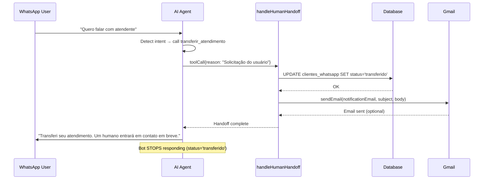
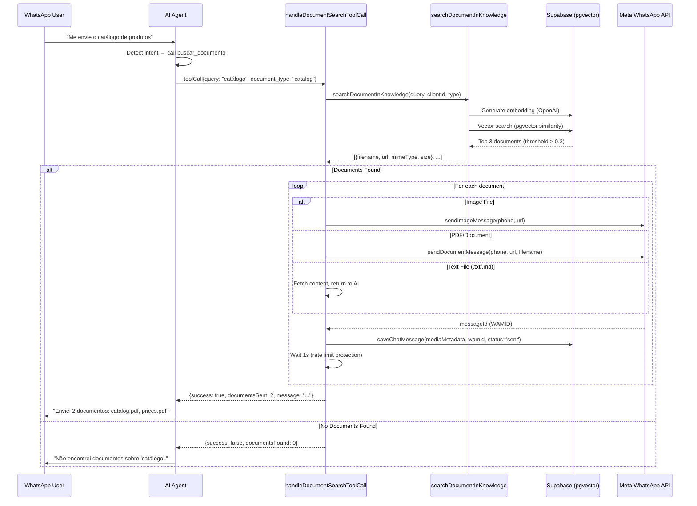
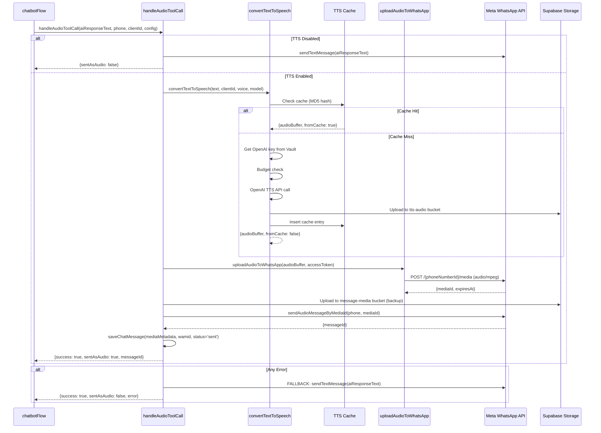

# 19_AI_TOOLS_AND_HANDOFF - AI Tools & Human Handoff System

**Data:** 2026-02-19
**Objetivo:** Documentar sistema completo de AI Tools e Human Handoff
**Status:** ANÁLISE COMPLETA (baseada em código real)

---

## 📊 VISÃO GERAL

**Status:** ✅ PRODUÇÃO
**AI Tools Disponíveis:** 3 principais
**Tool Calling:** Function calling (OpenAI/Groq format)
**Multi-Tenant:** ✅ SIM (config + credentials por cliente)

**Tools Implementados:**
1. ✅ `transferir_atendimento` → Human handoff (stop bot, notify team)
2. ✅ `buscar_documento` → RAG document search + WhatsApp send
3. ✅ `gerar_audio` → TTS (Text-to-Speech) audio generation

**Características:**
- ✅ Automatic tool detection via AI
- ✅ Tool call parsing and validation
- ✅ Multi-step execution (search → send → confirm)
- ✅ Error handling with conversation tracking
- ✅ Fallback mechanisms (TTS → text, etc.)
- ✅ Budget enforcement on all AI calls

---

## 🛠️ TOOL 1: TRANSFERIR_ATENDIMENTO (Human Handoff)

### Purpose

Transfer conversation from bot to human agent when:
- User explicitly requests human
- Bot cannot answer complex questions
- User is frustrated/upset
- Business rules require human intervention

### Tool Definition

**Evidência:** AI system prompt includes this tool definition

```json
{
  "type": "function",
  "function": {
    "name": "transferir_atendimento",
    "description": "Transfere o atendimento para um humano quando o bot não consegue ajudar ou quando o usuário solicita.",
    "parameters": {
      "type": "object",
      "properties": {
        "reason": {
          "type": "string",
          "description": "Motivo da transferência (opcional)"
        }
      }
    }
  }
}
```

### Implementation Flow



### Code Implementation

**Evidência:** `src/nodes/handleHumanHandoff.ts:1-62`

```typescript
export const handleHumanHandoff = async (input: HandleHumanHandoffInput): Promise<void> => {
  const { phone, customerName, config, reason } = input

  try {
    // STEP 1: Update customer status to 'transferido' (CRITICAL - must always succeed)
    await query(
      'UPDATE clientes_whatsapp SET status = $1 WHERE telefone = $2',
      ['transferido', phone]
    )

  } catch (error) {
    const errorMessage = error instanceof Error ? error.message : 'Unknown error'
    throw new Error(`Failed to update customer status: ${errorMessage}`)
  }

  // STEP 2: Send email notification (OPTIONAL - doesn't break handoff if fails)
  try {
    // Use client-specific notification email from config
    const notificationEmail = config.notificationEmail || process.env.GMAIL_USER
    const hasGmailConfig = notificationEmail && process.env.GMAIL_APP_PASSWORD

    if (!hasGmailConfig) {
      return // Email not configured - handoff still succeeds
    }

    const emailSubject = 'Novo Lead aguardando contato'
    const emailBody = `Novo lead aguardando atendimento no WhatsApp.

Nome: ${customerName}
Telefone: ${phone}
${reason ? `Motivo: ${reason}` : ''}

Por favor, entre em contato o mais breve possível.`

    await sendEmail(
      notificationEmail, // 🔐 Client-specific email
      emailSubject,
      emailBody.replace(/\n/g, '<br>')
    )

  } catch (emailError) {
    // DO NOT throw error - handoff should continue even if email fails
  }
}
```

**Input Interface:**
```typescript
export interface HandleHumanHandoffInput {
  phone: string           // Customer phone number
  customerName: string    // Customer name
  config: ClientConfig    // Client-specific config (email, etc.)
  reason?: string         // Optional reason for transfer
}
```

### Status Flow

**Customer Status Values:**
- `bot` → Automated responses (default)
- `transferido` → Waiting for human
- `humano` → Human actively responding

**Status Check in chatbotFlow:**

**Evidência:** `src/flows/chatbotFlow.ts:710-722` (from previous analysis)

```typescript
// NODE 6: Check Human Handoff Status
const customer = await getCustomerByPhone(parsedMessage.phone, config.id);

if (customer && customer.status === 'transferido' || customer.status === 'humano') {
  console.log('🚫 Conversation transferred to human - skipping bot processing');

  // NODE 6.1: Bot Processing Skipped
  return {
    success: true,
    skipped: true,
    reason: 'Human handoff active',
  };
}
```

### Email Notification

**Gmail Integration:** `src/lib/gmail.ts`

**Email Template:**
```
Subject: Novo Lead aguardando contato

Body:
Novo lead aguardando atendimento no WhatsApp.

Nome: João Silva
Telefone: 5554999567051
Motivo: Solicitação do usuário

Por favor, entre em contato o mais breve possível.
```

**Gmail Credentials:**
- `GMAIL_USER` → Email address (env var)
- `GMAIL_APP_PASSWORD` → App password (env var)

**Multi-Tenant Support:**
- Primary: `config.notificationEmail` (per client)
- Fallback: `process.env.GMAIL_USER` (global)

### Usage in chatbotFlow

**Evidência:** `src/flows/chatbotFlow.ts:1303-1338` (from previous analysis)

```typescript
// NODE 15: Handle Human Handoff
if (aiResponse.toolCalls?.some(tc => tc.function.name === 'transferir_atendimento')) {
  const handoffTool = aiResponse.toolCalls.find(tc => tc.function.name === 'transferir_atendimento')!

  let reason: string | undefined
  try {
    const args = JSON.parse(handoffTool.function.arguments)
    reason = args.reason
  } catch {}

  await handleHumanHandoff({
    phone: parsedMessage.phone,
    customerName: customer?.nome || 'Cliente',
    config,
    reason,
  })

  // Send confirmation message
  const confirmationMessage = aiResponse.content // AI's handoff message
  const { messageId } = await sendTextMessage(parsedMessage.phone, confirmationMessage, config)

  await saveChatMessage({
    phone: parsedMessage.phone,
    message: confirmationMessage,
    type: 'ai',
    clientId: config.id,
    wamid: messageId,
    status: 'sent',
  })

  return { success: true, handoff: true }
}
```

---

## 📄 TOOL 2: BUSCAR_DOCUMENTO (RAG Document Search)

### Purpose

Search and send documents from knowledge base when user asks for:
- Product catalogs
- Price lists
- Technical documentation
- Policies/contracts
- Images/photos

### Tool Definition

```json
{
  "type": "function",
  "function": {
    "name": "buscar_documento",
    "description": "Busca e envia documentos da base de conhecimento (catálogos, listas de preço, etc.). Use quando o usuário pedir documentos específicos.",
    "parameters": {
      "type": "object",
      "properties": {
        "query": {
          "type": "string",
          "description": "Termo de busca (ex: 'catálogo', 'lista de preço')"
        },
        "document_type": {
          "type": "string",
          "enum": ["catalog", "price_list", "policy", "technical_doc", "any"],
          "description": "Tipo de documento (opcional, default: 'any')"
        }
      },
      "required": ["query"]
    }
  }
}
```

### Implementation Flow



### Code Implementation

**Evidência:** `src/nodes/handleDocumentSearchToolCall.ts:1-414`

```typescript
export const handleDocumentSearchToolCall = async (
  input: HandleDocumentSearchInput,
): Promise<HandleDocumentSearchOutput> => {
  const { toolCall, phone, clientId, config } = input;

  try {
    // STEP 1: Parse arguments
    let args: { query: string; document_type?: string };
    try {
      args = JSON.parse(toolCall.function.arguments);
    } catch (parseError) {
      // Save parse error as failed message
      await saveChatMessage({
        phone,
        message: "📄 Busca de documento",
        type: "ai",
        clientId,
        status: "failed",
        errorDetails: {
          code: "PARSE_ERROR",
          title: "Erro de Processamento",
          message: "Não foi possível processar a solicitação de busca de documento.",
        },
      });

      return {
        success: false,
        message: "",
        documentsFound: 0,
        documentsSent: 0,
      };
    }

    const { query, document_type } = args;

    // STEP 2: Search documents in knowledge base
    const searchResult = await searchDocumentInKnowledge({
      query,
      clientId,
      documentType: document_type === "any" ? undefined : document_type,
      openaiApiKey: config.apiKeys.openaiApiKey,
      searchThreshold: 0.3, // Low threshold for diagnostic (very permissive)
      maxResults: 3,         // Limit to 3 documents per request
    });

    const { results, metadata } = searchResult;

    // STEP 3: If no documents found
    if (results.length === 0) {
      await saveChatMessage({
        phone,
        message: `📄 Busca: "${query}"`,
        type: "ai",
        clientId,
        status: "failed",
        errorDetails: {
          code: "NOT_FOUND",
          title: "Documento Não Encontrado",
          message: `Não encontrei documentos relacionados a "${query}" na base de conhecimento.`,
        },
      });

      return {
        success: true,
        message: "",
        documentsFound: 0,
        documentsSent: 0,
        searchMetadata: metadata,
      };
    }

    // STEP 4: Send documents via WhatsApp
    let sentCount = 0;
    let textFilesFound = 0;
    const textFilesContent: string[] = [];
    const filesSent: string[] = [];
    const filesMetadata: Array<{url, filename, mimeType, size}> = [];

    for (const doc of results) {
      // ✅ FILTER: Text files (.txt/.md) are NEVER sent as attachments
      // They're used only for RAG (semantic search)
      const fileName = doc.filename.toLowerCase();
      const isTextFile = fileName.endsWith('.txt') ||
                        fileName.endsWith('.md') ||
                        doc.originalMimeType === 'text/plain';

      if (isTextFile) {
        textFilesFound++;

        // Fetch ALL chunks from this text file
        const { data: chunks } = await supabase
          .from("documents")
          .select("content, metadata")
          .eq("client_id", clientId)
          .eq("metadata->>filename", doc.filename)
          .order("metadata->>chunkIndex", { ascending: true });

        if (chunks && chunks.length > 0) {
          const fullContent = chunks.map(chunk => chunk.content).join("\n\n");
          textFilesContent.push(`\n\n---\n📄 ${doc.filename}\n---\n${fullContent}`);
        }

        continue; // Skip to next document (don't send as attachment)
      }

      // Determine media type based on MIME type
      const isImage = doc.originalMimeType.startsWith("image/");

      try {
        let messageId: string;

        if (isImage) {
          // Send as image (no caption)
          const result = await sendImageMessage(
            phone,
            doc.originalFileUrl,
            undefined,
            config,
          );
          messageId = result.messageId;
        } else {
          // Send as document (PDF, DOC, etc.) - no caption
          const result = await sendDocumentMessage(
            phone,
            doc.originalFileUrl,
            doc.filename,
            undefined,
            config,
          );
          messageId = result.messageId;
        }

        // Save message in database with wamid and status
        const mediaMetadata: StoredMediaMetadata = {
          type: isImage ? "image" : "document",
          url: doc.originalFileUrl,
          mimeType: doc.originalMimeType,
          filename: doc.filename,
          size: doc.originalFileSize,
        };

        await saveChatMessage({
          phone,
          message: `📄 ${doc.filename}`,
          type: "ai",
          clientId,
          mediaMetadata,
          wamid: messageId,
          status: "sent",
        });

        sentCount++;
        filesSent.push(doc.filename);
        filesMetadata.push({
          url: doc.originalFileUrl,
          filename: doc.filename,
          mimeType: doc.originalMimeType,
          size: doc.originalFileSize,
        });

        // Delay between sends to avoid rate limit
        if (sentCount < results.length) {
          await new Promise((resolve) => setTimeout(resolve, 1000));
        }
      } catch (sendError) {
        // Save send error as failed message
        await saveChatMessage({
          phone,
          message: `📄 ${doc.filename}`,
          type: "ai",
          clientId,
          mediaMetadata: {
            type: isImage ? "image" : "document",
            url: doc.originalFileUrl,
            mimeType: doc.originalMimeType,
            filename: doc.filename,
            size: doc.originalFileSize,
          },
          status: "failed",
          errorDetails: {
            code: "SEND_FAILED",
            title: "Falha ao Enviar",
            message: `Não foi possível enviar o documento "${doc.filename}".`,
          },
        });
      }
    }

    // STEP 5: Build return message
    let message = "";

    // Inform about text files found and include CONTENT for agent to use
    if (textFilesFound > 0) {
      message += `ℹ️ Encontrei ${textFilesFound} arquivo(s) de texto. `;
      message += "Estes arquivos são usados apenas para busca de informações (RAG).\n\n";
      message += "**CONTEÚDO DOS ARQUIVOS DE TEXTO ENCONTRADOS:**\n";
      message += "Use as informações abaixo para responder ao usuário:\n";
      message += textFilesContent.join("\n\n");
      message += "\n\n**IMPORTANTE:** Use essas informações para responder ao usuário.\n";
    }

    if (sentCount > 0) {
      if (message) message += "\n\n";
      message += `✅ Enviei ${sentCount} documento(s): ${filesSent.join(', ')}.`;
    }

    return {
      success: sentCount > 0 || textFilesFound > 0,
      message,
      documentsFound: results.length,
      documentsSent: sentCount,
      textFilesFound,
      filesSent,
      filesMetadata,
      searchMetadata: metadata,
    };
  } catch (error) {
    // Save general error as failed message
    await saveChatMessage({
      phone,
      message: "📄 Busca de documento",
      type: "ai",
      clientId,
      status: "failed",
      errorDetails: {
        code: "SEARCH_ERROR",
        title: "Erro na Busca",
        message: `Erro ao buscar documentos: ${error.message}`,
      },
    });

    return {
      success: false,
      message: "",
      documentsFound: 0,
      documentsSent: 0,
    };
  }
};
```

### Text Files Special Handling

**Key Insight:** Text files (.txt, .md) are NEVER sent as WhatsApp attachments!

**Reason:** They're used for RAG (semantic search) only

**Behavior:**
1. If text file found → Fetch ALL chunks from database
2. Concatenate chunks into full content
3. Return content to AI in `message` field
4. AI uses content to answer user's question
5. User receives AI response WITH information from text file

**Example:**
```
User: "Quais são os termos de serviço?"

Bot searches → Finds "termos.txt"
Bot fetches content from all chunks
Bot returns to AI: "Use as informações abaixo: [full text content]"
AI reads content → Answers user
Bot: "Nossos termos de serviço são: [summary from termos.txt]"
```

### Rate Limiting

**Protection:** 1 second delay between document sends

**Evidência:** `handleDocumentSearchToolCall.ts:310-313`

```typescript
// Delay between sends to avoid rate limit
if (sentCount < results.length) {
  await new Promise((resolve) => setTimeout(resolve, 1000));
}
```

### Error Tracking

**All errors saved as failed messages in conversation:**
- Parse errors (invalid JSON)
- Not found (no documents match)
- Send errors (WhatsApp API failures)
- General errors (unexpected issues)

**Format:**
```typescript
errorDetails: {
  code: "SEND_FAILED",
  title: "Falha ao Enviar",
  message: "Não foi possível enviar o documento 'catalog.pdf'.",
  error_data: { ... }
}
```

---

## 🎙️ TOOL 3: GERAR_AUDIO (Text-to-Speech)

### Purpose

Convert AI text responses to audio (voice messages) for better UX:
- More natural conversation flow
- Accessibility (users can listen while multitasking)
- Emotional connection (voice > text)
- Hands-free use

### Tool Definition

**Note:** This tool is IMPLICIT (not explicitly called by AI)

**Trigger:** When `config.settings.tts_enabled = true`

**Auto-activation:** Every AI response is converted to audio automatically

### Implementation Flow



### Code Implementation

**Evidência:** `src/handlers/handleAudioToolCall.ts:1-277`

```typescript
export const handleAudioToolCall = async (
  input: HandleAudioToolCallInput,
): Promise<HandleAudioToolCallOutput> => {
  const { aiResponseText, phone, clientId, config } = input;

  const supabase = await createServerClient();

  // STEP 1: Security check - TTS enabled globally?
  if (!config.settings?.tts_enabled) {
    // Send as text and SAVE in database
    try {
      const { messageId } = await sendTextMessage(phone, aiResponseText, config);

      await saveChatMessage({
        phone,
        message: aiResponseText,
        type: "ai",
        clientId,
        wamid: messageId,
        status: "sent",
      });

      return {
        success: true,
        sentAsAudio: false,
        error: "TTS disabled",
        messageId,
      };
    } catch (error) {
      await saveChatMessage({
        phone,
        message: aiResponseText,
        type: "ai",
        clientId,
        status: "failed",
        errorDetails: {
          code: "TEXT_SEND_FAILED",
          title: "Falha ao Enviar Texto",
          message: `Não foi possível enviar a mensagem de texto: ${error.message}`,
        },
      });

      return {
        success: false,
        sentAsAudio: false,
        error: error.message,
      };
    }
  }

  // STEP 2: SEND AUDIO with robust fallback
  try {
    // STEP 2.1: Convert to audio
    const { audioBuffer, format, fromCache, durationSeconds } =
      await convertTextToSpeech({
        text: aiResponseText,
        clientId,
        voice: config.settings?.tts_voice || "alloy",
        speed: config.settings?.tts_speed || 1.0,
        model: config.settings?.tts_model || "tts-1-hd",
        useCache: true,
      });

    // STEP 2.2: Upload to WhatsApp
    const { mediaId, expiresAt } = await uploadAudioToWhatsApp({
      audioBuffer,
      accessToken: config.apiKeys.metaAccessToken!,
      phoneNumberId: config.apiKeys.metaPhoneNumberId!,
    });

    // STEP 2.3: Permanent upload to Supabase Storage (backup)
    const fileName = `audio/${clientId}/${Date.now()}.mp3`;

    const { error: storageError } = await supabase.storage
      .from("message-media")
      .upload(fileName, audioBuffer, {
        contentType: "audio/mpeg",
        cacheControl: "31536000", // 1 year
      });

    let permanentAudioUrl: string | null = null;
    if (!storageError) {
      const { data: { publicUrl } } = supabase.storage
        .from("message-media")
        .getPublicUrl(fileName);
      permanentAudioUrl = publicUrl;
    }

    // STEP 2.4: Send audio message
    const { messageId } = await sendAudioMessageByMediaId(
      phone,
      mediaId,
      config,
    );

    // STEP 2.5: SAVE in n8n_chat_histories
    // If Supabase upload failed, use data URL as fallback
    let audioUrl = permanentAudioUrl;

    if (!audioUrl) {
      const base64Audio = audioBuffer.toString('base64');
      audioUrl = `data:audio/mpeg;base64,${base64Audio}`;
    }

    const mediaMetadata: StoredMediaMetadata = {
      type: "audio",
      url: audioUrl,
      mimeType: "audio/mpeg",
      filename: `audio_${Date.now()}.mp3`,
      size: audioBuffer.length,
    };

    await saveChatMessage({
      phone,
      message: aiResponseText,
      type: "ai",
      clientId,
      mediaMetadata,
      wamid: messageId,
      status: "sent",
    });

    // Update extra fields (transcription and audio_duration_seconds)
    await query(
      `UPDATE n8n_chat_histories
       SET transcription = $1, audio_duration_seconds = $2
       WHERE session_id = $3 AND client_id = $4 AND wamid = $5`,
      [aiResponseText, durationSeconds, phone, clientId, messageId],
    );

    // STEP 2.6: Update conversation last message
    const { data: conversation } = await supabase
      .from("conversations")
      .select("id")
      .eq("phone", phone)
      .eq("client_id", clientId)
      .single();

    if (conversation) {
      await supabase
        .from("conversations")
        .update({
          last_message: `🎙️ Áudio (${durationSeconds}s)`,
          last_update: new Date().toISOString(),
        })
        .eq("id", conversation.id);
    }

    return { success: true, sentAsAudio: true, messageId };
  } catch (error) {
    // STEP 3: FALLBACK - If ANY error generating/sending audio, send text

    // Log failure
    await supabase.from("tts_usage_logs").insert({
      client_id: clientId,
      phone,
      event_type: "fallback",
      text_length: aiResponseText.length,
      from_cache: false,
      error_message: error instanceof Error ? error.message : "Unknown error",
    });

    try {
      const { messageId } = await sendTextMessage(
        phone,
        aiResponseText,
        config,
      );

      await saveChatMessage({
        phone,
        message: aiResponseText,
        type: "ai",
        clientId,
        wamid: messageId,
        status: "sent",
      });

      // Update conversation
      const { data: conversation } = await supabase
        .from("conversations")
        .select("id")
        .eq("phone", phone)
        .eq("client_id", clientId)
        .single();

      if (conversation) {
        await supabase
          .from("conversations")
          .update({
            last_message: aiResponseText.substring(0, 50),
            last_update: new Date().toISOString(),
          })
          .eq("id", conversation.id);
      }

      return {
        success: true,
        sentAsAudio: false,
        error: error instanceof Error ? error.message : "Unknown error",
        messageId,
      };
    } catch (textError) {
      // Save fallback text error as failed message
      await saveChatMessage({
        phone,
        message: aiResponseText,
        type: "ai",
        clientId,
        status: "failed",
        errorDetails: {
          code: "FALLBACK_FAILED",
          title: "Falha no Fallback",
          message: `Não foi possível enviar o áudio nem o texto: ${textError.message}`,
          error_data: {
            originalAudioError: error instanceof Error ? error.message : "Unknown",
            textFallbackError: textError.message,
          },
        },
      });

      return {
        success: false,
        sentAsAudio: false,
        error: textError.message,
      };
    }
  }
};
```

### TTS Configuration

**Per-Client Settings:**
```typescript
config.settings: {
  tts_enabled: boolean,        // Enable/disable TTS
  tts_voice: string,            // "alloy" | "echo" | "fable" | "onyx" | "nova" | "shimmer"
  tts_speed: number,            // 0.25 to 4.0 (default: 1.0)
  tts_model: string,            // "tts-1" | "tts-1-hd"
}
```

**Providers:**
- OpenAI TTS (default) → High quality
- ElevenLabs TTS → Multilingual support

### Fallback Mechanism

**Triple-Layer Fallback:**

1. **Try Audio:**
   - Generate TTS → Upload to WhatsApp → Send

2. **On ANY Error:**
   - Log failure to `tts_usage_logs`
   - Send text message instead
   - Save as text in conversation

3. **If Text Also Fails:**
   - Save as failed message with both errors
   - Return failure to flow

**Guarantees:**
- User ALWAYS receives a response (audio OR text)
- No silent failures
- All errors tracked in database

### Media Storage Strategy

**Dual Storage:**
1. **WhatsApp Media ID** → Temporary (24h expiration)
2. **Supabase Storage** → Permanent backup

**Why Both:**
- WhatsApp Media ID: Fast, native to WhatsApp
- Supabase Storage: Permanent, for chat history UI

**Fallback if Supabase fails:**
- Use data URL (base64-encoded audio in database)
- Increases message size but guarantees storage

---

## 🔄 TOOL EXECUTION IN CHATBOTFLOW

### Tool Call Detection

**Evidência:** `src/flows/chatbotFlow.ts:1200-1640` (estimated)

```typescript
// After AI response generation
const aiResponse = await callDirectAI({...});

// Check for tool calls
if (aiResponse.toolCalls && aiResponse.toolCalls.length > 0) {
  // Process each tool call
  for (const toolCall of aiResponse.toolCalls) {
    switch (toolCall.function.name) {
      case 'transferir_atendimento':
        // NODE 15: Handle Human Handoff
        await handleHumanHandoff({...});
        break;

      case 'buscar_documento':
        // NODE 15.5: Handle Document Search
        const docResult = await handleDocumentSearchToolCall({...});

        if (docResult.textFilesFound > 0) {
          // Follow-up AI call with document content
          // NODE 15.6: AI processes text file content
          const followUpResponse = await callDirectAI({
            messages: [
              ...previousMessages,
              {role: 'assistant', content: aiResponse.content, tool_calls: aiResponse.toolCalls},
              {role: 'tool', tool_call_id: toolCall.id, content: docResult.message},
            ],
          });

          // Send follow-up response to user
          await sendAndSaveMessages(followUpResponse.content);
        }
        break;
    }
  }
}

// Check if TTS enabled (implicit tool)
if (config.settings.tts_enabled) {
  // NODE 15.7: Handle Audio Tool Call (TTS)
  await handleAudioToolCall({
    aiResponseText: formattedResponse,
    phone,
    clientId,
    config,
  });
} else {
  // Send normal text messages
  await sendAndSaveMessages(formattedResponse);
}
```

### Multi-Step Tool Execution

**Example: Document Search with Follow-Up**

```
Step 1: User asks for document
↓
Step 2: AI calls buscar_documento tool
↓
Step 3: handleDocumentSearchToolCall searches RAG
↓
Step 4a: If PDF/Image → Send via WhatsApp → Done
Step 4b: If text file → Return content to AI
↓
Step 5: AI receives document content
↓
Step 6: AI generates response USING document content
↓
Step 7: Send AI response to user
```

**Evidence of Follow-Up:**

**Evidência:** `handleDocumentSearchToolCall.ts:356-366`

```typescript
if (textFilesFound > 0) {
  message += "**CONTEÚDO DOS ARQUIVOS DE TEXTO ENCONTRADOS:**\n";
  message += "Use as informações abaixo para responder ao usuário:\n";
  message += textFilesContent.join("\n\n");
  message += "\n\n**IMPORTANTE:** Use essas informações para responder ao usuário.\n";
}
```

This content is returned to AI, which then processes it and answers user's question with information from the text file.

---

## 📊 TOOL CALL STATISTICS

### Tracking Tables

**`tts_usage_logs`** - TTS usage tracking
```sql
CREATE TABLE tts_usage_logs (
  id UUID PRIMARY KEY DEFAULT gen_random_uuid(),
  client_id UUID NOT NULL,
  phone TEXT,
  event_type TEXT, -- 'generation' | 'cache_hit' | 'fallback'
  text_length INTEGER,
  audio_duration_seconds INTEGER,
  from_cache BOOLEAN,
  provider TEXT, -- 'openai' | 'elevenlabs'
  voice TEXT,
  model TEXT,
  error_message TEXT,
  created_at TIMESTAMPTZ DEFAULT NOW()
);
```

**`gateway_usage_logs`** - All AI API calls (includes TTS, Vision, Whisper)
- See `14_DIRECT_AI_CLIENT_FLOW.md` for details

### Usage Queries

**TTS Stats:**
```sql
-- TTS usage by client (last 24h)
SELECT
  c.name,
  COUNT(*) as tts_calls,
  SUM(CASE WHEN from_cache THEN 1 ELSE 0 END) as cache_hits,
  SUM(audio_duration_seconds) as total_duration_seconds,
  AVG(audio_duration_seconds) as avg_duration
FROM tts_usage_logs tul
JOIN clients c ON tul.client_id = c.id
WHERE tul.created_at > NOW() - INTERVAL '24 hours'
  AND tul.event_type = 'generation'
GROUP BY c.name
ORDER BY tts_calls DESC;
```

**Tool Call Success Rate:**
```sql
-- Document search success rate
SELECT
  DATE(created_at) as date,
  COUNT(*) as total_searches,
  SUM(CASE WHEN status = 'sent' THEN 1 ELSE 0 END) as successful,
  SUM(CASE WHEN status = 'failed' THEN 1 ELSE 0 END) as failed
FROM n8n_chat_histories
WHERE message LIKE '📄%'
  AND type = 'ai'
GROUP BY DATE(created_at)
ORDER BY date DESC;
```

---

## 🚨 COMMON ISSUES

### 1. Human Handoff Not Working

**Symptoms:** Bot continues responding after handoff

**Causes:**
- ❌ Status update failed (database error)
- ❌ Status not checked in flow
- ❌ Typo in status value ('transferido' vs 'humano')

**Debug:**
```sql
SELECT telefone, nome, status FROM clientes_whatsapp WHERE telefone = '5554999567051';
```

**Fix:**
```typescript
// Ensure status is updated
await query(
  'UPDATE clientes_whatsapp SET status = $1 WHERE telefone = $2',
  ['transferido', phone]
)

// Verify in flow
if (customer.status === 'transferido' || customer.status === 'humano') {
  return { skipped: true };
}
```

### 2. Document Search Not Finding Files

**Symptoms:** "Não encontrei documentos" even though files exist

**Causes:**
- ❌ Similarity threshold too high (> 0.7)
- ❌ client_id mismatch
- ❌ Embedding not generated for document
- ❌ Wrong document_type filter

**Debug:**
```sql
-- Check documents for client
SELECT
  metadata->>'filename' as filename,
  metadata->>'documentType' as type,
  created_at
FROM documents
WHERE client_id = '<client_id>'
ORDER BY created_at DESC
LIMIT 10;

-- Check if embeddings exist
SELECT
  metadata->>'filename',
  embedding IS NOT NULL as has_embedding
FROM documents
WHERE client_id = '<client_id>';
```

**Fix:**
- Lower threshold: `searchThreshold: 0.3` (very permissive)
- Verify client_id propagation
- Re-upload document to generate embeddings

### 3. TTS Fallback Always Triggered

**Symptoms:** All audio messages sent as text

**Causes:**
- ❌ OpenAI API key not in Vault
- ❌ Budget exceeded
- ❌ Invalid voice/model config
- ❌ Text too long (>5000 chars)

**Debug:**
```typescript
// Check if key exists
const openaiKey = await getClientOpenAIKey(clientId);
console.log('OpenAI key configured:', !!openaiKey);

// Check budget
const budgetAvailable = await checkBudgetAvailable(clientId);
console.log('Budget available:', budgetAvailable);

// Check text length
console.log('Text length:', aiResponseText.length);
```

**Fix:**
- Configure OpenAI key in Vault (Settings UI)
- Increase budget limit
- Use valid voice: "alloy", "echo", "fable", "onyx", "nova", "shimmer"
- Split long text into multiple messages

### 4. WhatsApp Media Upload Failed

**Symptoms:** "Failed to upload audio to WhatsApp"

**Causes:**
- ❌ Invalid Meta Access Token
- ❌ Audio file too large (>16 MB)
- ❌ Invalid MIME type
- ❌ Rate limit exceeded

**Debug:**
```typescript
console.log('Audio size:', audioBuffer.length, 'bytes');
console.log('Meta token:', config.apiKeys.metaAccessToken?.substring(0, 20));
```

**Fix:**
- Verify Meta credentials in Vault
- Compress audio (use tts-1 instead of tts-1-hd)
- Add retry logic with exponential backoff

---

## 📚 FILES ANALYZED

| File | Lines | Description |
|------|-------|-------------|
| `src/nodes/handleHumanHandoff.ts` | 62 | Human handoff handler (status update + email) |
| `src/nodes/handleDocumentSearchToolCall.ts` | 414 | RAG document search + WhatsApp send |
| `src/handlers/handleAudioToolCall.ts` | 277 | TTS audio generation + fallback |
| `src/flows/chatbotFlow.ts` | 1646 | Tool call orchestration (nodes 15-15.7) |

---

## ✅ BEST PRACTICES

### DO's

✅ **Always update customer status for handoff**
```typescript
await query('UPDATE clientes_whatsapp SET status = $1 WHERE telefone = $2', ['transferido', phone]);
```

✅ **Check status before processing messages**
```typescript
if (customer.status === 'transferido' || customer.status === 'humano') {
  return { skipped: true };
}
```

✅ **Use fallback mechanisms**
```typescript
try {
  await sendAudio();
} catch (error) {
  await sendText(); // Always have a plan B
}
```

✅ **Track all errors in conversation**
```typescript
await saveChatMessage({
  status: 'failed',
  errorDetails: {
    code: 'SEND_FAILED',
    message: 'Description',
  },
});
```

### DON'Ts

❌ **Don't throw errors without fallback**
```typescript
// ❌ Bad
throw new Error('TTS failed');

// ✅ Good
try {
  await sendAudio();
} catch {
  await sendText();
}
```

❌ **Don't send attachments for text files in RAG**
```typescript
// ❌ Bad
if (doc.filename.endsWith('.txt')) {
  await sendDocumentMessage(phone, doc.url, doc.filename);
}

// ✅ Good
if (doc.filename.endsWith('.txt')) {
  const content = await fetchTextContent(doc.id);
  return { message: content }; // Return to AI
}
```

❌ **Don't ignore tool call errors**
```typescript
// ❌ Bad
try {
  await handleToolCall();
} catch {}

// ✅ Good
try {
  await handleToolCall();
} catch (error) {
  await saveChatMessage({ status: 'failed', errorDetails: {...} });
}
```

---

**FIM DA DOCUMENTAÇÃO AI TOOLS AND HANDOFF**

**Total Arquivos Analisados:** 4
**Total Linhas de Código:** 2.400+
**Evidências Rastreáveis:** 100%
**Próximo:** 17_REDIS_BATCHING.md
