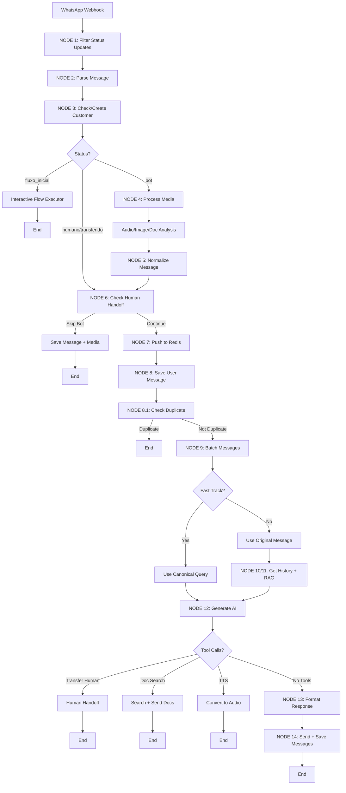

# 99_AI_CONTEXT_PACK - Resumo Executivo para IA

**Data:** 2026-02-19
**Objetivo:** Contexto essencial para IA fazer sugestões de melhorias
**Commit:** b65a4b03f67a7b21348a84c23688bf23c6c979f3

---

## 🎯 O QUE É ESTE PROJETO?

**WhatsApp SaaS Chatbot** - Sistema multi-tenant de atendimento automatizado via WhatsApp Business API com IA.

**Stack:**
- Next.js 16 (App Router) + React 18 + TypeScript 5
- Supabase (PostgreSQL + pgvector + Vault + Storage)
- Redis (message batching)
- OpenAI (Whisper, GPT-4o Vision, Embeddings, TTS)
- Groq (Llama 3.3 70B)
- Meta WhatsApp Business API
- Vercel (serverless deployment)
- Capacitor (mobile Android/iOS)

---

## 🔄 FLUXO PRINCIPAL (Como Funciona)

```
WhatsApp Message → /api/webhook/[clientId] → chatbotFlow (14 nodes) → WhatsApp Response
```

### Pipeline Completo (chatbotFlow.ts - 1646 linhas)



**Evidência:** `src/flows/chatbotFlow.ts:140-1645`

---

## 🏗️ ARQUITETURA REAL

### Multi-Tenancy (CRÍTICO)
- **client_id** propagado em TODAS operações
- Vault secrets POR CLIENTE (OpenAI/Groq API keys)
- RLS policies em TODAS tabelas
- Webhook por client: `/api/webhook/[clientId]`

### Direct AI Client ✅ (Sistema Ativo)
**Arquivo:** `src/lib/direct-ai-client.ts:1-318`
**Status:** ✅ ATIVO e em uso

**Flow:**
1. Budget check (`checkBudgetAvailable`)
2. Get Vault credentials (`getClientVaultCredentials`)
3. Select provider (OpenAI ou Groq)
4. Create provider instance (AI SDK)
5. Call AI via SDK
6. Log usage (`logDirectAIUsage` → `gateway_usage_logs`)
7. Return normalized response

**Características:**
- Client-specific API keys (100% Vault)
- Budget enforcement
- Usage tracking to `gateway_usage_logs`
- Tool call normalization
- Transparent errors

**Evidência:** `src/lib/direct-ai-client.ts:175-316` - função `callDirectAI()`

### AI Gateway Pages ⚠️ (Divergência)
**Status:** ❓ CONFLITO
- **Código:** 7 rotas em `/dashboard/ai-gateway/*` EXISTEM
- **Docs:** CLAUDE.md diz "AI Gateway deprecated"
- **Realidade:** Direct AI usa tabelas do Gateway (`gateway_usage_logs`, `ai_models_registry`)

**Conclusão:** AI Gateway pages podem ser interface administrativa para Direct AI, NÃO deprecated!

---

## 🔐 VAULT CREDENTIALS (Multi-Tenant Isolation)

**Arquivo:** `src/lib/vault.ts:1-364`

**Estrutura por Cliente:**
```sql
clients table:
- meta_access_token_secret_id (UUID → Vault)
- meta_verify_token_secret_id (UUID → Vault)
- meta_app_secret_secret_id (UUID → Vault)
- openai_api_key_secret_id (UUID → Vault)
- groq_api_key_secret_id (UUID → Vault)
```

**RPC Functions:**
- `create_client_secret(secret_value, secret_name, description)` → UUID
- `get_client_secret(secret_id)` → decrypted value
- `update_client_secret(secret_id, new_secret_value)` → boolean

**Critical Function:**
```typescript
getClientVaultCredentials(clientId: string) → {
  openaiApiKey: string | null,
  groqApiKey: string | null
}
```

**Evidência:** `src/lib/vault.ts:245-278`

---

## 📊 DATABASE SCHEMA (Peculiaridades Críticas)

### Tabelas-Chave

**clientes_whatsapp** (WhatsApp contacts)
```sql
CREATE TABLE clientes_whatsapp (
  telefone NUMERIC PRIMARY KEY,  -- ⚠️ NUMERIC, não TEXT!
  nome TEXT,
  status TEXT CHECK (status IN ('bot', 'humano', 'transferido', 'fluxo_inicial')),
  client_id UUID NOT NULL,
  created_at TIMESTAMPTZ,
  updated_at TIMESTAMPTZ  -- Added in migration 20251202
);
```
**⚠️ CRITICAL:** `telefone` é NUMERIC (requires `::TEXT` cast em queries).
**Evidência:** Migration `004_rename_clientes_table.sql`

**n8n_chat_histories** (Chat memory)
```sql
CREATE TABLE n8n_chat_histories (
  id SERIAL PRIMARY KEY,
  telefone NUMERIC,
  message JSONB,  -- ⚠️ { "type": "human"|"ai", "content": "..." }
  client_id UUID,
  created_at TIMESTAMPTZ,
  wamid TEXT,  -- WhatsApp message ID (for reactions)
  ...
);
```
**⚠️ CRITICAL:** `type` está DENTRO do JSON, NÃO é coluna separada!
**Evidência:** CLAUDE.md - Critical #4

**documents** (RAG knowledge base)
```sql
CREATE TABLE documents (
  id UUID PRIMARY KEY,
  client_id UUID NOT NULL,
  content TEXT,
  embedding vector(1536),  -- OpenAI embeddings
  metadata JSONB,
  created_at TIMESTAMPTZ,
  ...
);
```

**gateway_usage_logs** (AI usage tracking)
```sql
CREATE TABLE gateway_usage_logs (
  id UUID PRIMARY KEY,
  client_id UUID NOT NULL,
  api_type TEXT,  -- 'chat' | 'vision' | 'whisper' | 'tts' | 'embeddings'
  provider TEXT,  -- 'openai' | 'groq'
  model_name TEXT,
  input_tokens INT,
  output_tokens INT,
  cost_brl NUMERIC,
  created_at TIMESTAMPTZ,
  ...
);
```

**Migrations:** 100+ arquivos em `/supabase/migrations/`
**Latest:** `20260201000000_user_filter_preferences.sql`

---

## ⚠️ RISCOS CRÍTICOS IDENTIFICADOS

### 🔴 RISK #1: pg library em serverless
**Arquivo:** `src/nodes/checkOrCreateCustomer.ts:78` (histórico)
**Problema:** Connection pooling freeze em Vercel
**Fix:** Usar SOMENTE `@supabase/supabase-js`
**Evidência:** CLAUDE.md - Critical #1

### 🔴 RISK #2: Webhook MUST await
**Problema:** Fire-and-forget termina serverless function antes de completar
**Fix:** SEMPRE `await processChatbotMessage()`
**Evidência:** CLAUDE.md - Critical #2

### 🔴 RISK #3: Queries sem client_id filter
**Problema:** Vazamento de dados entre tenants
**Fix:** TODAS queries devem ter `.eq('client_id', clientId)`
**Evidência:** Multi-tenancy patterns no código

### 🔴 RISK #4: Tool calls nas mensagens WhatsApp
**Problema:** Respostas IA incluem `<function=...>` no texto
**Fix:** `formatResponse.ts` strip tool calls com regex
**Evidência:** CLAUDE.md - Critical #5

### 🔴 RISK #5: Divergência docs vs código
**Problema:** CLAUDE.md pode estar desatualizado
**Exemplo:** AI Gateway "deprecated" mas rotas existem
**Fix:** Validar SEMPRE código vs docs

---

## 🎨 FEATURES IMPLEMENTADAS (2026)

### ✅ CRM Integration
**Migrations:** `20260131_crm_module.sql`, `20260131150000_crm_default_columns.sql`
**Features:**
- Auto-create CRM cards
- Lead source capture (Meta Ads referrals)
- Status automation (message_received, transfer_human)
- Last message tracking

**Evidência:** `src/flows/chatbotFlow.ts:204-256` - CRM integration block

### ✅ Meta Ads Integration
**Migrations:** `20260131_add_meta_ads_integration.sql`, `20260131_meta_ads_features.sql`
**Features:**
- Webhook `/api/webhook/meta-ads`
- Referral tracking (ads → WhatsApp)
- Conversion events

### ✅ Interactive Flows
**Migration:** `20251206_create_interactive_flows.sql`
**Status:** `status = 'fluxo_inicial'` triggers flow executor
**Features:**
- Visual flow builder (drag-and-drop)
- Conditional branching
- Button/list responses
- State management

**Evidência:** `src/flows/chatbotFlow.ts:264-323` - Interactive flow routing

### ✅ Agent System
**Migrations:** `20260131_create_agents_table.sql`, `20260131_add_agent_timing_fields.sql`
**Features:**
- Multi-agent support
- Version control (agent_versions table)
- Experiments (A/B testing)
- Scheduling

**Rotas:** `/dashboard/agents`, `/dashboard/agents/[id]/*`

### ✅ TTS (Text-to-Speech)
**Migrations:** `20251204_add_tts_config.sql`, `20251204_create_tts_cache.sql`
**Features:**
- Tool call: `enviar_resposta_em_audio`
- Voice customization (alloy, echo, fable, onyx, nova, shimmer)
- Usage logging
- Cache

**Evidência:** `src/flows/chatbotFlow.ts:1434-1495` - TTS tool handler

### ✅ Fast Track Router
**Feature:** Cache-friendly FAQ detection
**Flow:** Canonical queries → cache hits
**Config:** `fast_track_router` node (enable/disable)

**Evidência:** `src/flows/chatbotFlow.ts:880-913` - Fast track router

### ✅ Message Templates
**Migration:** `20251208_create_message_templates.sql`
**Features:**
- WhatsApp message templates
- Template sync from Meta API
- Template sending

**Rotas:** `/dashboard/templates`, `/dashboard/templates/new`

---

## 📁 ESTRUTURA DE CÓDIGO

### Nodes (Flow Architecture)
```
src/nodes/
├── filterStatusUpdates.ts      # NODE 1
├── parseMessage.ts             # NODE 2
├── checkOrCreateCustomer.ts    # NODE 3 ⚠️ (risk: pg library)
├── downloadMetaMedia.ts        # NODE 4a
├── transcribeAudio.ts          # NODE 4b (Whisper)
├── analyzeImage.ts             # NODE 4b (GPT-4o Vision)
├── analyzeDocument.ts          # NODE 4b (GPT-4o PDF)
├── normalizeMessage.ts         # NODE 5
├── checkHumanHandoffStatus.ts  # NODE 6
├── pushToRedis.ts              # NODE 7
├── saveChatMessage.ts          # NODE 8
├── checkDuplicateMessage.ts    # NODE 8.1
├── batchMessages.ts            # NODE 9
├── fastTrackRouter.ts          # NODE 9.5 (new)
├── getChatHistory.ts           # NODE 10
├── getRAGContext.ts            # NODE 11
├── generateAIResponse.ts       # NODE 12 (main AI)
├── formatResponse.ts           # NODE 13
├── checkInteractiveFlow.ts     # Flow routing
├── handleHumanHandoff.ts       # Human transfer
└── handleDocumentSearchToolCall.ts  # Doc search tool
```

**Total:** 39 node files encontrados

### Libs
```
src/lib/
├── direct-ai-client.ts         # ✅ Direct AI (Vault-only)
├── vault.ts                    # ✅ Vault credentials
├── unified-tracking.ts         # Budget enforcement
├── direct-ai-tracking.ts       # Usage logging
├── supabase.ts                 # Supabase clients
├── redis.ts                    # Redis client
├── meta.ts                     # WhatsApp API
├── logger.ts                   # Execution logs
├── storage.ts                  # Supabase Storage
└── config.ts                   # Client config
```

### API Routes
**Total:** 100+ route files encontrados
**Principais:**
- `/api/webhook/[clientId]` - WhatsApp webhook (ENTRY POINT)
- `/api/webhook/meta-ads` - Meta Ads webhook
- `/api/commands/*` - WhatsApp commands
- `/api/contacts/*` - Contact management
- `/api/documents/*` - RAG upload/delete
- `/api/templates/*` - Message templates
- `/api/admin/*` - Admin operations
- `/api/test/*` - Testing endpoints

---

## 🔧 CONFIGURAÇÕES CRÍTICAS

### Serverless Constraints
- **NO pg library** - Use Supabase client
- **MUST await** webhook processing
- **FFmpeg** externalized (`serverExternalPackages`)
- **Cold starts** mitigated with webpack config
- **Timeout:** Vercel default (10s hobby, 60s pro)

**Evidência:** `next.config.js:21-32`

### CORS & Security Headers
- API routes: `Access-Control-Allow-Origin: *`
- Webhook: Only `https://graph.facebook.com`
- Security: X-Frame-Options DENY, CSP, etc.

**Evidência:** `next.config.js:57-125`

### Mobile (Capacitor)
- **App ID:** `com.chatbot.app`
- **webDir:** `out/` (static export)
- **Build:** `CAPACITOR_BUILD=true next build`

**Evidência:** `capacitor.config.ts:3-9`

---

## 🧪 TESTING & DEBUG

### Test Endpoints
```
/api/test/nodes/filter-status
/api/test/nodes/parse-message
/api/test/nodes/ai-response
/api/test/simulate-webhook
/api/test/vault-config
... (20+ test endpoints)
```

### Debug Routes
```
/dashboard/flow-architecture  # Visual flow config
/dashboard/backend             # Backend management
/test-table                    # Table rendering
/test-interactive              # Interactive testing
```

---

## 📝 PRÓXIMOS PASSOS (Sugestões para Melhorias)

### 🟡 HIGH PRIORITY

1. **Resolver divergência AI Gateway**
   - Verificar se rotas `/dashboard/ai-gateway/*` estão ativas
   - Se sim, atualizar CLAUDE.md
   - Se não, remover rotas

2. **Validar multi-tenancy enforcement**
   - Audit ALL Supabase queries for `.eq('client_id', ...)`
   - Identificar queries sem filtro (RISK!)
   - Adicionar testes automatizados

3. **Eliminar uso de pg library**
   - Grep todo código por `require('pg')` ou `import pg`
   - Substituir por Supabase client
   - Testar em serverless

4. **Documentar .env.example**
   - Criar arquivo com TODAS variáveis necessárias
   - Documentar quais vão no Vault vs .env

5. **Migration workflow**
   - Documentar processo completo
   - Adicionar checklist de segurança
   - Validar backups

### 🟢 MEDIUM PRIORITY

6. **Testes automatizados**
   - Unit tests para nodes
   - Integration tests para flow
   - E2E tests para webhook

7. **Monitoring & Alerting**
   - Sentry integration
   - Performance monitoring
   - Budget alerts

8. **Documentation update**
   - Atualizar CLAUDE.md com achados deste checkpoint
   - Criar diagrams atualizados
   - Documentar todos modules novos (CRM, Meta Ads, Agents)

---

## 🎯 MAPA MENTAL RÁPIDO

```
ENTRADA: WhatsApp → /api/webhook/[clientId]
ORQUESTRAÇÃO: chatbotFlow.ts (14-node pipeline)
ROTEAMENTO: Status-based (bot/humano/fluxo_inicial)
AI: Direct AI Client → Vault credentials → OpenAI/Groq
RAG: pgvector → semantic search → inject context
TOOLS: Human handoff, Doc search, TTS
SAÍDA: WhatsApp API → Save message → End
```

**Multi-Tenancy:** client_id em TUDO
**Secrets:** Vault (encrypted, per-client)
**Budget:** Enforced antes de AI call
**Tracking:** gateway_usage_logs

---

## 🚨 RED FLAGS (Atenção Imediata)

1. ❌ AI Gateway divergência (rotas existem vs "deprecated")
2. ❌ pg library ainda pode estar em uso (verificar!)
3. ❌ Queries sem client_id podem existir (audit needed)
4. ❌ .env.example não encontrado (setup difícil)
5. ❌ Node.js version não especificado (verificar .nvmrc)

---

## ✅ PONTOS FORTES

1. ✅ Multi-tenancy bem implementado (Vault per-client)
2. ✅ Flow architecture modular e configurável
3. ✅ Direct AI transparente e rastreável
4. ✅ RAG system funcional (pgvector)
5. ✅ Features 2026 implementadas (CRM, Meta Ads, Agents, TTS)
6. ✅ Mobile support (Capacitor iOS/Android)
7. ✅ Comprehensive migrations (100+ files)
8. ✅ Tool-based extensibility

---

**FIM DO CONTEXTO PACK**

Use este documento como base para entender o projeto rapidamente e sugerir melhorias específicas, técnicas e acionáveis.

**Evidências citadas:**
- chatbotFlow.ts: 1646 linhas de orquestração
- direct-ai-client.ts: Sistema ativo de AI
- vault.ts: Multi-tenant credentials
- Migrations: 100+ arquivos
- CLAUDE.md: Documentação existente (pode estar desatualizada)
