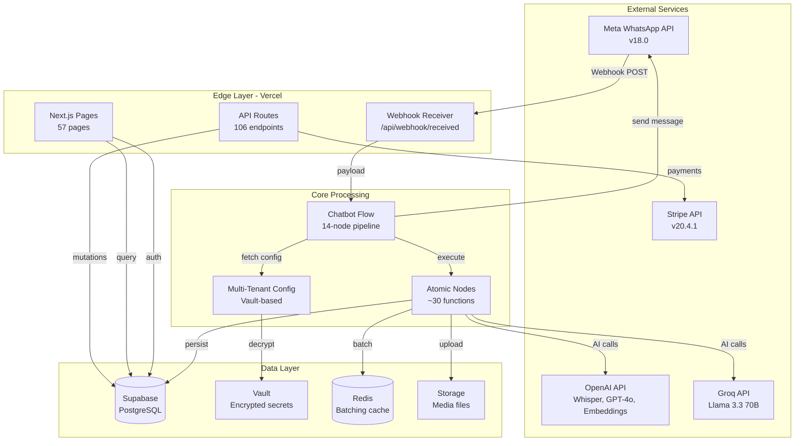

# Architecture From Code

**Projeto:** ChatBot-Oficial (UzzApp WhatsApp SaaS)
**Data:** 2026-03-15
**Análise:** Baseada em código-fonte real

---

## 🏗️ High-Level Architecture



---

## 📐 Architecture Decisions

### 1. Multi-Tenant Model

**Pattern:** Shared database with RLS (Row-Level Security)

```sql
-- Every table has client_id for isolation
CREATE TABLE clientes_whatsapp (
  telefone NUMERIC NOT NULL,
  nome TEXT,
  status TEXT DEFAULT 'bot',
  client_id UUID REFERENCES clients(id), -- Tenant isolation
  PRIMARY KEY (telefone, client_id)
);

-- RLS Policy example
CREATE POLICY "Users can only see own client data"
  ON clientes_whatsapp
  FOR SELECT
  USING (client_id = (SELECT client_id FROM user_profiles WHERE id = auth.uid()));
```

**Evidência:**
- `src/flows/chatbotFlow.ts:188` - `clientId: config.id`
- `src/lib/config.ts:160-350` - `getClientConfig(clientId: string)`
- `supabase/migrations/` - 107 migrations com `client_id`

**Benefits:**
- ✅ Cost-effective (single database)
- ✅ Easy multi-client management
- ✅ Enforced isolation via RLS

**Risks:**
- ⚠️ Query performance with large client count
- ⚠️ RLS bypass vulnerabilities

---

### 2. Chatbot Flow Architecture

**Pattern:** 14-Node Sequential Pipeline with Configurable Execution

```
┌─────────────────────────────────────────────────────────────┐
│  WhatsApp Message Arrives                                   │
└─────────────┬───────────────────────────────────────────────┘
              │
              ▼
┌─────────────────────────────────────────────────────────────┐
│ NODE 1: Filter Status Updates (always executes)             │
│ - Remove delivery/read receipts                             │
│ Evidence: chatbotFlow.ts:160-170                            │
└─────────────┬───────────────────────────────────────────────┘
              │
              ▼
┌─────────────────────────────────────────────────────────────┐
│ NODE 2: Parse Message                                       │
│ - Extract phone, name, type, content                        │
│ Evidence: chatbotFlow.ts:173-178                            │
└─────────────┬───────────────────────────────────────────────┘
              │
              ▼
┌─────────────────────────────────────────────────────────────┐
│ NODE 3: Check/Create Customer                               │
│ - Upsert clientes_whatsapp table                            │
│ - Track status: 'bot' | 'humano' | 'transferido'            │
│ Evidence: chatbotFlow.ts:182-192                            │
└─────────────┬───────────────────────────────────────────────┘
              │
              ▼
┌─────────────────────────────────────────────────────────────┐
│ NODE 3.1: CRM Integration (optional)                        │
│ - Auto-create CRM card                                      │
│ - Capture lead source (Meta Ads referral)                   │
│ Evidence: chatbotFlow.ts:206-256                            │
└─────────────┬───────────────────────────────────────────────┘
              │
              ▼
┌─────────────────────────────────────────────────────────────┐
│ ROUTE DECISION: Status-Based Routing                        │
│ Evidence: chatbotFlow.ts:259-332                            │
│                                                              │
│ IF status = 'fluxo_inicial':                                │
│    → checkInteractiveFlow()                                 │
│    → FlowExecutor.continueFlow()                            │
│    → END (flow handles response)                            │
│                                                              │
│ IF status = 'humano' OR 'transferido':                      │
│    → Save user message with transcription                   │
│    → Skip bot processing (NODE 6 catches this)              │
│    → END (human attendant responds manually)                │
│                                                              │
│ IF status = 'bot' (default):                                │
│    → Continue to NODE 4                                     │
└─────────────┬───────────────────────────────────────────────┘
              │
              ▼
┌─────────────────────────────────────────────────────────────┐
│ NODE 4: Process Media (configurable)                        │
│ - Audio: downloadMetaMedia → uploadToStorage →              │
│          transcribeAudio (Whisper)                           │
│ - Image: downloadMetaMedia → uploadToStorage →              │
│          analyzeImage (GPT-4o Vision)                        │
│ - Document: downloadMetaMedia → uploadToStorage →           │
│             analyzeDocument (GPT-4o + pdf-parse)             │
│ - Sticker: downloadMetaMedia → uploadToStorage (no AI)      │
│ Evidence: chatbotFlow.ts:334-692                            │
│                                                              │
│ Critical: Try-catch around each AI call                     │
│ - On error: save FAILED message with errorDetails           │
│ - ErrorDetails: { code, title, message }                    │
│ Evidence: chatbotFlow.ts:415-442 (transcription)            │
└─────────────┬───────────────────────────────────────────────┘
              │
              ▼
┌─────────────────────────────────────────────────────────────┐
│ NODE 5: Normalize Message                                   │
│ - Combine parsedMessage + processedContent (transcription)  │
│ Evidence: chatbotFlow.ts:694-705                            │
└─────────────┬───────────────────────────────────────────────┘
              │
              ▼
┌─────────────────────────────────────────────────────────────┐
│ NODE 6: Check Human Handoff Status                          │
│ - If status = 'humano' OR 'transferido':                    │
│   → Save user message (with transcription)                  │
│   → Skip bot response                                       │
│   → END                                                     │
│ Evidence: chatbotFlow.ts:707-755                            │
└─────────────┬───────────────────────────────────────────────┘
              │
              ▼
┌─────────────────────────────────────────────────────────────┐
│ NODE 7: Push to Redis (configurable)                        │
│ - Store in Redis with 30s default TTL                       │
│ - Graceful degradation if Redis unavailable                 │
│ Evidence: chatbotFlow.ts:757-777                            │
└─────────────┬───────────────────────────────────────────────┘
              │
              ▼
┌─────────────────────────────────────────────────────────────┐
│ NODE 8: Check Duplicate Message                             │
│ - Detect if same content sent recently (< 30s)              │
│ - If duplicate: EXIT to prevent double AI response          │
│ Evidence: chatbotFlow.ts:794-828                            │
└─────────────┬───────────────────────────────────────────────┘
              │
              ▼
┌─────────────────────────────────────────────────────────────┐
│ NODE 8.5: Save User Message                                 │
│ - Insert to n8n_chat_histories                              │
│ - Include wamid for reactions                               │
│ - Include mediaMetadata for display                         │
│ Evidence: chatbotFlow.ts:830-846                            │
└─────────────┬───────────────────────────────────────────────┘
              │
              ▼
┌─────────────────────────────────────────────────────────────┐
│ NODE 9: Batch Messages (configurable)                       │
│ - Default: 10s delay, accumulate messages                   │
│ - If disabled: immediate processing                         │
│ Evidence: chatbotFlow.ts:848-875                            │
└─────────────┬───────────────────────────────────────────────┘
              │
              ▼
┌─────────────────────────────────────────────────────────────┐
│ NODE 9.5: Fast Track Router (configurable)                  │
│ - FAQ detection with semantic similarity                    │
│ - If match (> 0.8 similarity):                              │
│   → Use canonical question for cache-friendly prompts       │
│   → Disable datetime & tools for cache hits                 │
│ Evidence: chatbotFlow.ts:877-913                            │
└─────────────┬───────────────────────────────────────────────┘
              │
              ▼
┌─────────────────────────────────────────────────────────────┐
│ NODES 10 & 11: Fetch Context (parallel, configurable)       │
│                                                              │
│ NODE 10: Get Chat History                                   │
│ - Last N messages (default 15)                              │
│ - Ordered by created_at                                     │
│ Evidence: chatbotFlow.ts:922-1036                           │
│                                                              │
│ NODE 11: Get RAG Context                                    │
│ - Semantic search in documents table                        │
│ - pgvector cosine similarity > 0.8                          │
│ - Top 5 chunks                                              │
│ Evidence: chatbotFlow.ts:942-1036                           │
│                                                              │
│ Both execute in Promise.all() for performance               │
└─────────────┬───────────────────────────────────────────────┘
              │
              ▼
┌─────────────────────────────────────────────────────────────┐
│ NODE 10.5: Check Continuity (configurable)                  │
│ - Detect new conversation (> 24h since last message)        │
│ - Inject greeting instruction if new                        │
│ Evidence: chatbotFlow.ts:1038-1065                          │
└─────────────┬───────────────────────────────────────────────┘
              │
              ▼
┌─────────────────────────────────────────────────────────────┐
│ NODE 10.6: Classify Intent (configurable)                   │
│ - Categorize: question | greeting | complaint | other       │
│ - Can use LLM or simple keyword matching                    │
│ Evidence: chatbotFlow.ts:1067-1096                          │
└─────────────┬───────────────────────────────────────────────┘
              │
              ▼
┌─────────────────────────────────────────────────────────────┐
│ NODE 12: Generate AI Response                               │
│ - Call Direct AI Client (Vault-based credentials)           │
│ - Provider: Groq (primary) or OpenAI (fallback)             │
│ - Model: llama-3.3-70b-versatile or gpt-4o                  │
│ - Tools: transferir_atendimento, buscar_documento,          │
│          enviar_resposta_em_audio, verificar_agenda,        │
│          criar_evento_agenda                                │
│ - Fast Track: Uses canonical question for cache hits        │
│ Evidence: chatbotFlow.ts:1098-1145                          │
└─────────────┬───────────────────────────────────────────────┘
              │
              ▼
┌─────────────────────────────────────────────────────────────┐
│ NODE 12.5: Detect Repetition (configurable)                 │
│ - Compare proposed response with last N assistant messages  │
│ - If too similar (> 0.85 similarity):                       │
│   → Regenerate with variation instruction                   │
│   → Increase temperature by +0.3                            │
│ - Skip if cache hit or same user message                    │
│ Evidence: chatbotFlow.ts:1170-1266                          │
└─────────────┬───────────────────────────────────────────────┘
              │
              ▼
┌─────────────────────────────────────────────────────────────┐
│ TOOL CALLS PROCESSING                                       │
│ Evidence: chatbotFlow.ts:1294-1551                          │
│                                                              │
│ Tool 1: transferir_atendimento                              │
│   → Update status to 'transferido'                          │
│   → Send email notification                                 │
│   → Save summary in chat history                            │
│   → END (no AI response sent)                               │
│                                                              │
│ Tool 2: buscar_documento                                    │
│   → Semantic search in documents                            │
│   → Send PDF/media files OR text content                    │
│   → If text: make follow-up AI call with content            │
│                                                              │
│ Tool 3: enviar_resposta_em_audio                            │
│   → TTS via OpenAI/ElevenLabs                               │
│   → Upload audio to storage                                 │
│   → Send via Meta Audio API                                 │
│   → END (no text response sent)                             │
│                                                              │
│ Tool 4: verificar_agenda                                    │
│   → Check Google/Microsoft Calendar                         │
│   → Return events as formatted text                         │
│                                                              │
│ Tool 5: criar_evento_agenda                                 │
│   → Create event in calendar                                │
│   → Return confirmation message                             │
└─────────────┬───────────────────────────────────────────────┘
              │
              ▼
┌─────────────────────────────────────────────────────────────┐
│ NODE 13: Format Response (configurable)                     │
│ - If messageSplitEnabled: split on \n\n                     │
│ - If disabled: send as single message                       │
│ Evidence: chatbotFlow.ts:1558-1583                          │
└─────────────┬───────────────────────────────────────────────┘
              │
              ▼
┌─────────────────────────────────────────────────────────────┐
│ NODE 14: Send and Save Messages (intercalado)               │
│ - For each formatted message:                               │
│   1. Send to WhatsApp API (get wamid)                       │
│   2. Save to database IMMEDIATELY (with wamid)              │
│   3. Delay (default 2000ms) before next message             │
│                                                              │
│ Critical: Intercalado pattern prevents race condition       │
│ - Messages appear in history almost instantly (2-4s)        │
│ - Next batch sees previous responses in context             │
│ Evidence: chatbotFlow.ts:1585-1685                          │
└─────────────┬───────────────────────────────────────────────┘
              │
              ▼
        ┌─────────┐
        │   END   │
        └─────────┘
```

**Key Design Decisions:**

1. **Configurable Nodes:** Each node can be enabled/disabled per client via `bot_configurations` table
   - **Evidência:** `chatbotFlow.ts:157` - `getAllNodeStates(config.id)`
   - **Evidência:** `chatbotFlow.ts:342` - `shouldExecuteNode("process_media", nodeStates)`

2. **Intercalado Send-Save Pattern:** Prevents race condition where next batch can't see previous responses
   - **Evidência:** `chatbotFlow.ts:1585-1685` - Sequential send → save → delay loop

3. **Graceful Degradation:** Redis failure doesn't break flow, media processing errors save failed messages
   - **Evidência:** `chatbotFlow.ts:768-771` - Redis error handling
   - **Evidência:** `chatbotFlow.ts:415-442` - Transcription error saves failed message

4. **Multi-Tenant Everything:** Every query, every save includes `client_id`
   - **Evidência:** `chatbotFlow.ts:188,746,842` - `clientId: config.id`

---

### 3. Configuration Management

**Pattern:** 3-Layer Configuration System

```
Layer 1: Client Record (clients table)
    ↓
Layer 2: Active Agent Override (agents table)
    ↓
Layer 3: Bot Configurations (bot_configurations table)
    ↓
Final Config (ClientConfig interface)
```

**Evidência:** `src/lib/config.ts:160-350` - `getClientConfig()`

**Priority:**
1. Active Agent settings (highest priority)
2. Client settings
3. Bot configurations (modular settings)
4. Defaults

**Example:**
```typescript
// Client has systemPrompt = "You are helpful"
// Active Agent has compiled_system_prompt = "You are a doctor"
// Final config uses: "You are a doctor" (agent wins)

const finalPrompts = activeAgent?.compiled_system_prompt
  ? { systemPrompt: activeAgent.compiled_system_prompt }
  : { systemPrompt: client.system_prompt }
```

**Evidência:** `config.ts:276-288`

---

### 4. Secret Management

**Pattern:** Supabase Vault for All Credentials

```
┌─────────────────────────────────────────────────────────┐
│  Client Record                                          │
│  - meta_access_token_secret_id: UUID → Vault           │
│  - openai_api_key_secret_id: UUID → Vault              │
│  - groq_api_key_secret_id: UUID → Vault                │
└─────────────┬───────────────────────────────────────────┘
              │
              ▼
┌─────────────────────────────────────────────────────────┐
│  Vault Decryption                                       │
│  SELECT decrypted_secret FROM vault.decrypted_secrets   │
│  WHERE id = secret_id                                   │
└─────────────┬───────────────────────────────────────────┘
              │
              ▼
┌─────────────────────────────────────────────────────────┐
│  Runtime Config                                         │
│  apiKeys: {                                             │
│    metaAccessToken: "EAAG...",                          │
│    openaiApiKey: "sk-...",                              │
│    groqApiKey: "gsk_..."                                │
│  }                                                      │
└─────────────────────────────────────────────────────────┘
```

**Evidência:**
- `src/lib/vault.ts` - Vault RPC functions
- `config.ts:177-183` - `getClientSecrets()`
- `supabase/migrations/20251213133305_add_vault_rpc_functions.sql`

**Benefits:**
- ✅ No plaintext credentials in database
- ✅ Encrypted at rest
- ✅ Per-client isolation
- ✅ Rotatable without code changes

---

### 5. AI Provider Strategy

**Pattern:** Direct AI Client (No Gateway Abstraction)

```
┌──────────────────────────────────────────────────────────┐
│  getClientConfig(clientId)                               │
│  → Fetch from Vault:                                     │
│    - openai_api_key (per client)                         │
│    - groq_api_key (per client)                           │
└─────────────┬────────────────────────────────────────────┘
              │
              ▼
┌──────────────────────────────────────────────────────────┐
│  callDirectAI({ clientId, clientConfig, messages })      │
│                                                           │
│  1. Check budget: checkBudgetAvailable(clientId)         │
│  2. Call provider directly:                              │
│     - Groq: groq-sdk with client's key                   │
│     - OpenAI: openai SDK with client's key              │
│  3. Track usage: logDirectAIUsage()                      │
└─────────────┬────────────────────────────────────────────┘
              │
              ▼
┌──────────────────────────────────────────────────────────┐
│  Database Updates                                        │
│  - gateway_usage_logs: per-request tracking             │
│  - client_budgets: deduct cost                          │
└──────────────────────────────────────────────────────────┘
```

**Evidência:**
- `src/lib/direct-ai-client.ts` - Main AI interface
- `src/lib/direct-ai-tracking.ts` - Usage tracking
- `src/lib/unified-tracking.ts` - Budget enforcement

**Why Direct (not gateway):**
- ✅ Simpler architecture (less code)
- ✅ Better multi-tenant isolation (each client uses their own keys)
- ✅ Transparent errors (no hidden fallback failures)
- ✅ Direct control over provider choice per client

**Deprecated:** AI Gateway (was replaced with Direct AI Client)

---

### 6. Database Design

**Pattern:** Multi-Tenant with RLS

```sql
-- Core Tables (all have client_id):
clients              -- Tenant metadata
user_profiles        -- Users (RLS anchor)
clientes_whatsapp    -- WhatsApp contacts (status: bot|humano|transferido|fluxo_inicial)
n8n_chat_histories   -- Chat memory (JSONB message column)
conversations        -- Conversation state tracking
messages             -- Messages table (newer schema)
documents            -- RAG knowledge base (pgvector embeddings)
execution_logs       -- Flow execution audit trail
gateway_usage_logs   -- AI API usage tracking

-- CRM Tables (Phase 8):
crm_columns          -- Kanban columns
crm_cards            -- Lead cards (per contact)
crm_tags             -- Tags for categorization
crm_activities       -- Activity log per card
crm_automation_rules -- Automation triggers

-- Flows Tables:
interactive_flows    -- Visual flow builder configs
agents               -- Agent system (override client config)
agent_versions       -- Version control for agents
agent_schedules      -- Scheduled agent activations

-- Payments Tables (Stripe - 85% complete):
stripe_accounts      -- Connected accounts
stripe_products      -- Products per client
stripe_subscriptions -- Subscriptions
stripe_orders        -- Orders
webhook_events       -- Webhook dedup
platform_client_subscriptions  -- Platform billing
```

**RLS Example:**
```sql
-- Every table: user can only see data for their client_id
CREATE POLICY "Users see own client data"
  ON clientes_whatsapp
  FOR SELECT
  USING (
    client_id IN (
      SELECT client_id
      FROM user_profiles
      WHERE id = auth.uid()
    )
  );
```

**Evidência:** 107 migrations in `supabase/migrations/`

---

## 🔄 Key Data Flows

### Flow 1: Message Reception

```
Meta WhatsApp → /api/webhook/received → processChatbotMessage() → 14-node pipeline → Meta WhatsApp
```

**Evidência:** `src/app/api/webhook/received/route.ts:11-25`

### Flow 2: Configuration Loading

```
clientId → getClientConfig() → Vault decryption → Active Agent merge → Final ClientConfig
```

**Evidência:** `src/lib/config.ts:160-350`

### Flow 3: AI Response Generation

```
User message → Batch → Chat History + RAG → Direct AI Client → Tool Processing → Format → Send
```

**Evidência:** `src/flows/chatbotFlow.ts:1098-1685`

### Flow 4: Human Handoff

```
Tool call: transferir_atendimento → Update status → Email notification → Stop bot
```

**Evidência:** `chatbotFlow.ts:1296-1335`

---

## 🚀 Deployment Architecture

```
┌────────────────────────────────────────────────────────────┐
│  Vercel Edge Functions                                     │
│  - API Routes (serverless)                                 │
│  - Pages (SSR/SSG)                                         │
│  - Middleware: NONE (no middleware.ts file)               │
└─────────────┬──────────────────────────────────────────────┘
              │
              ├─────────────────────────────────────────────┐
              │                                             │
              ▼                                             ▼
┌──────────────────────────┐                  ┌──────────────────────────┐
│  Supabase                │                  │  External Services       │
│  - PostgreSQL            │                  │  - Meta WhatsApp API     │
│  - Auth                  │                  │  - OpenAI API            │
│  - Storage               │                  │  - Groq API              │
│  - Vault                 │                  │  - Stripe API            │
│  - Realtime (optional)   │                  │  - Gmail SMTP            │
└──────────────────────────┘                  └──────────────────────────┘
```

**Critical:** No middleware.ts exists - all auth/tenant checks done in API routes

**Evidência:**
- Glob search: no middleware.ts found
- Auth: `src/lib/supabase-server.ts` - createServerClient in each route
- Tenant enforcement: Manual `client_id` filtering in each query

---

## 🔐 Security Architecture

### Authentication Flow

```
User Login → Supabase Auth → Cookie (SSR) → RLS Policies → Data Access
```

**Evidência:** `src/lib/supabase-server.ts`

### Authorization Flow

```
Request → createServerClient() → Extract user_id → Lookup user_profiles.client_id → RLS filter
```

**Evidência:** RLS policies in migrations

### Tenant Isolation

**Enforced at:**
1. **Database Level:** RLS policies (automatic)
2. **Application Level:** Manual `client_id` filters in queries
3. **Secrets Level:** Vault per-client isolation

**⚠️ RISK:** If developer forgets `.eq('client_id', clientId)` in a query, data leak possible.

**Mitigation:** RLS as final safeguard

---

## 📊 Performance Optimizations

### 1. Redis Batching

**Purpose:** Accumulate messages for 10s, respond once
**Benefit:** Prevents duplicate AI responses, reduces API calls
**Evidência:** `chatbotFlow.ts:848-875` - `batchMessages()`

### 2. Fast Track Router

**Purpose:** Cache-friendly FAQ handling
**Mechanism:** Semantic similarity → canonical question → prompt cache hit
**Benefit:** 50-90% cost reduction on repeated questions
**Evidência:** `chatbotFlow.ts:877-913`

### 3. Parallel Context Fetching

**Mechanism:** `Promise.all([getChatHistory(), getRAGContext()])`
**Benefit:** Reduce latency by ~500ms
**Evidência:** `chatbotFlow.ts:956-973`

### 4. Bot Config Cache

**Mechanism:** In-memory cache with 5min TTL
**Benefit:** Reduce DB queries
**Evidência:** `config.ts:412-470`

---

## 🛠️ Technology Choices

| Concern | Technology | Why |
|---------|-----------|-----|
| **Framework** | Next.js 16 (App Router) | SSR, API routes, Vercel deploy |
| **Database** | Supabase (PostgreSQL) | Managed, Auth, RLS, Vault |
| **AI** | Groq (primary), OpenAI (fallback) | Cost-effective, reliable |
| **Embeddings** | OpenAI text-embedding-3-small | Best quality/price ratio |
| **Vector Search** | pgvector (Supabase extension) | Native PostgreSQL, no extra service |
| **Caching** | Redis (Upstash) | Serverless-friendly |
| **Storage** | Supabase Storage | Same service, simple |
| **Payments** | Stripe Connect | Multi-tenant marketplace model |
| **Mobile** | Capacitor 8.0.1 | Cross-platform, server-based loading |
| **Email** | Gmail SMTP (nodemailer) | Simple, free tier |
| **Push Notifications** | Firebase Admin SDK | Reliable, cross-platform |

---

## 🐛 Known Architectural Issues

### 1. ⚠️ `pg` Library in Serverless

**Problem:** `pg` library doesn't work in Vercel serverless (connection pooling issues)
**Location:** `src/lib/postgres.ts`
**Solution:** Use Supabase client instead
**Status:** Documented in CLAUDE.md, not yet removed

**Evidência:** CLAUDE.md:178-188

### 2. ⚠️ No Middleware = Manual Tenant Checks

**Problem:** Every API route must manually check `client_id`
**Risk:** Forgotten filter → data leak
**Mitigation:** RLS policies as final safeguard

### 3. ⚠️ Capacitor Version Mismatch

**Problem:** CLI 8.0.1 but core/platforms 7.4.4
**Risk:** Build failures, incompatibilities
**Status:** Documented in 03_DEPENDENCIES.md

---

## 📈 Scalability Considerations

### Current Limits

| Resource | Limit | Notes |
|----------|-------|-------|
| Supabase Free Tier | 500MB DB, 1GB storage | ⚠️ May hit limit with many clients |
| Vercel Free Tier | 100GB bandwidth/month | OK for MVP |
| Redis Free Tier | 256MB | OK for batching |
| Meta WhatsApp | 1000 conversations/month free | Then $0.005-0.009/conversation |

### Scale Strategies

1. **Database:** Migrate to Supabase Pro (unlimited connections)
2. **Vercel:** Upgrade to Pro ($20/month)
3. **Redis:** Upstash Pay-as-you-go
4. **Supabase Storage:** S3-compatible, cheap scaling

---

## 🎯 Recommendations

### High Priority

1. ✅ **Remove `pg` library** - Replace with Supabase client in all code
2. ✅ **Add middleware.ts** - Centralize auth/tenant checks
3. ✅ **Audit RLS policies** - Ensure all tables have correct isolation
4. ✅ **Align Capacitor versions** - CLI and core should match

### Medium Priority

5. ⚠️ **Add database indexes** - client_id columns for performance
6. ⚠️ **Implement rate limiting** - Prevent abuse
7. ⚠️ **Add health checks** - Monitor Supabase, Redis, Meta API

### Low Priority

8. ⚠️ **Migrate to Edge Runtime** - Faster cold starts
9. ⚠️ **Implement caching layer** - CDN for static assets
10. ⚠️ **Add tracing** - OpenTelemetry for debugging

---

*Última atualização: 2026-03-15*
*Versão: 1.0*
*Baseado em análise de código-fonte real*
