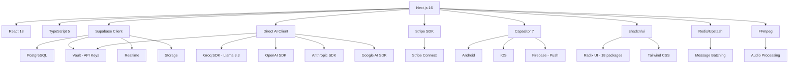

# DEPENDENCIES - ChatBot-Oficial

**Gerado em:** 2026-02-16
**Fonte:** package.json (commit: 65e6482)

## Sumário Executivo

- **Total de dependências:** 76 produção + 18 desenvolvimento = 94 total
- **Frameworks principais:** Next.js 16, React 18, TypeScript 5
- **Categorias:** UI (shadcn/ui), AI (4 providers), Database (Supabase), Payments (Stripe), Mobile (Capacitor)

---

## 1. Core Framework

| Package | Versão | Propósito | Evidência |
|---------|--------|-----------|-----------|
| next | ^16 | Framework React full-stack | package.json:84 |
| react | ^18.3.1 | Biblioteca UI | package.json:90 |
| react-dom | ^18.3.1 | React DOM renderer | package.json:92 |
| typescript | ^5 | Type safety | package.json:127 (devDep) |

**Notas:**
- Next.js 16 usa App Router por padrão
- TypeScript em modo não-strict (`tsconfig.json:10` - `"strict": false`)

---

## 2. Database & Backend

### 2.1 Supabase

| Package | Versão | Propósito | Evidência |
|---------|--------|-----------|-----------|
| @supabase/supabase-js | ^2.78.0 | Cliente Supabase (PostgreSQL + Auth + Storage + Realtime) | package.json:62 |
| @supabase/ssr | ^0.5.2 | SSR helpers para Next.js | package.json:61 |
| pg | ^8.16.3 | Driver PostgreSQL direto (legacy) | package.json:89 |
| @types/pg | ^8.15.5 | Types para pg | package.json:63 |

**Nota CRÍTICA (do CLAUDE.md):**
- Usar Supabase client em serverless (Vercel), NUNCA `pg` direto
- `pg` causa connection hangs em serverless
- Evidência no código: `src/nodes/checkOrCreateCustomer.ts:78` (problema documentado)

### 2.2 Caching

| Package | Versão | Propósito | Evidência |
|---------|--------|-----------|-----------|
| redis | ^5.9.0 | Cliente Redis (message batching) | package.json:96 |
| @upstash/redis | ^1.35.6 | Redis serverless (Upstash) | package.json:65 |
| @upstash/ratelimit | ^2.0.7 | Rate limiting via Upstash | package.json:64 |

**Uso principal:** Batch messages por 30s para evitar respostas duplicadas do AI

---

## 3. AI Providers (Multi-Provider Architecture)

### 3.1 AI SDKs

| Package | Versão | Provider | Modelo Principal | Evidência |
|---------|--------|----------|------------------|-----------|
| groq-sdk | ^0.34.0 | Groq | Llama 3.3 70B | package.json:78 |
| openai | ^6.7.0 | OpenAI | Whisper, GPT-4o Vision, Embeddings | package.json:87 |
| @ai-sdk/anthropic | ^2.0.56 | Anthropic | Claude Opus/Sonnet | package.json:23 |
| @ai-sdk/google | ^2.0.46 | Google | Gemini | package.json:24 |
| @ai-sdk/groq | ^2.0.33 | Groq (AI SDK) | Llama via AI SDK | package.json:25 |
| @ai-sdk/openai | ^2.0.85 | OpenAI (AI SDK) | GPT via AI SDK | package.json:26 |
| ai | ^5.0.112 | Vercel AI SDK | Abstração multi-provider | package.json:67 |

**Arquitetura (do CLAUDE.md):**
- **Direct AI Client** (`src/lib/direct-ai-client.ts`) - Interface unificada
- **Vault Credentials** (`src/lib/vault.ts`) - API keys por cliente (multi-tenant isolation)
- **Budget Enforcement** (`checkBudgetAvailable()`) - Controle de gastos
- **Usage Tracking** - Logs em `gateway_usage_logs` table

**Main Agent:** Groq Llama 3.3 70B com tools (human handoff, RAG search)

### 3.2 AI Features

| Recurso | Provider | Uso |
|---------|----------|-----|
| Chat (chatbot principal) | Groq Llama 3.3 70B | Conversação WhatsApp |
| Transcription (voice messages) | OpenAI Whisper | Audio to text |
| Vision (imagens) | OpenAI GPT-4o Vision | Análise de imagens |
| Embeddings (RAG) | OpenAI text-embedding-3-small | Vector search |
| Alternatives | Claude, Gemini | Backup/comparação |

---

## 4. WhatsApp Integration

| Package | Versão | Propósito | Evidência |
|---------|--------|-----------|-----------|
| axios | ^1.12.2 | HTTP client (Meta API calls) | package.json:68 |
| form-data | ^4.0.5 | Multipart form uploads (media) | package.json:75 |
| @types/form-data | ^2.5.2 | Types | package.json:108 (devDep) |

**API:** Meta WhatsApp Business API v18.0
**Phone ID:** 899639703222013 (do CLAUDE.md)
**Número:** 555499567051

---

## 5. Payments (Stripe Connect)

| Package | Versão | Propósito | Evidência |
|---------|--------|-----------|-----------|
| stripe | ^20.4.1 | Stripe backend SDK | package.json:97 |
| @stripe/stripe-js | ^8.9.0 | Stripe.js client-side | package.json:60 |

**Arquitetura (do .env.mobile.example e código):**
- **Stripe Connect:** Platform + Connected Accounts
- **Dual Context:**
  - Contexto A: UzzAI cobrando clientes (STRIPE_PLATFORM_*)
  - Contexto B: Clientes cobrando consumidores (Connected Accounts)
- **Webhooks:** V1 (payments) + V2 Thin Events (connected accounts)

**Evidência:** `.env.mobile.example:59-90` (configurações Stripe)

---

## 6. Mobile (Capacitor)

### 6.1 Core Capacitor

| Package | Versão | Propósito | Evidência |
|---------|--------|-----------|-----------|
| @capacitor/cli | ^8.0.1 | Capacitor CLI | package.json:30 (devDep) |
| @capacitor/core | ^7.4.4 | Core runtime | package.json:31 |
| @capacitor/android | ^7.4.4 | Android platform | package.json:28 |
| @capacitor/ios | ^7.4.4 | iOS platform | package.json:32 |
| @capacitor/assets | ^3.0.5 | Asset generation | package.json:106 (devDep) |

**Nota:** CLI é v8, runtime é v7 (compatibilidade)

### 6.2 Capacitor Plugins

| Package | Versão | Funcionalidade | Evidência |
|---------|--------|----------------|-----------|
| @capacitor/app | ^7.1.0 | App lifecycle, deep links | package.json:29 |
| @capacitor/network | ^7.0.2 | Network status | package.json:33 |
| @capacitor/push-notifications | ^7.0.3 | Push notifications (Firebase) | package.json:34 |
| @capacitor/status-bar | ^7.0.5 | Status bar styling | package.json:35 |
| @aparajita/capacitor-biometric-auth | ^9.1.2 | Biometric authentication | package.json:27 |

### 6.3 Mobile-related

| Package | Versão | Propósito | Evidência |
|---------|--------|-----------|-----------|
| firebase-admin | ^13.6.0 | Firebase Admin SDK (push) | package.json:73 |

---

## 7. UI Components & Styling

### 7.1 Radix UI (shadcn/ui base)

**Total:** 18 pacotes Radix

| Package | Versão | Component | Evidência |
|---------|--------|-----------|-----------|
| @radix-ui/react-dialog | ^1.1.15 | Modal, Dialog | package.json:46 |
| @radix-ui/react-dropdown-menu | ^2.1.16 | Dropdown menu | package.json:47 |
| @radix-ui/react-select | ^2.2.6 | Select input | package.json:52 |
| @radix-ui/react-tabs | ^1.1.13 | Tabs | package.json:57 |
| @radix-ui/react-toast | ^1.1.5 | Notifications | package.json:58 |
| @radix-ui/react-tooltip | ^1.2.8 | Tooltips | package.json:59 |
| @radix-ui/react-accordion | ^1.2.12 | Accordion | package.json:42 |
| @radix-ui/react-alert-dialog | ^1.1.15 | Alert dialogs | package.json:43 |
| @radix-ui/react-avatar | ^1.1.10 | Avatar | package.json:44 |
| @radix-ui/react-checkbox | ^1.3.3 | Checkbox | package.json:45 |
| @radix-ui/react-label | ^2.1.7 | Label | package.json:48 |
| @radix-ui/react-popover | ^1.1.15 | Popover | package.json:49 |
| @radix-ui/react-progress | ^1.1.8 | Progress bar | package.json:50 |
| @radix-ui/react-scroll-area | ^1.0.5 | Scroll area | package.json:51 |
| @radix-ui/react-separator | ^1.0.3 | Separator | package.json:53 |
| @radix-ui/react-slider | ^1.3.6 | Slider | package.json:54 |
| @radix-ui/react-slot | ^1.0.2 | Slot composition | package.json:55 |
| @radix-ui/react-switch | ^1.2.6 | Toggle switch | package.json:56 |

### 7.2 Styling & Utilities

| Package | Versão | Propósito | Evidência |
|---------|--------|-----------|-----------|
| tailwindcss | ^3.4.1 | CSS framework | package.json:125 (devDep) |
| tailwindcss-animate | ^1.0.7 | Animation utilities | package.json:99 |
| tailwind-merge | ^2.5.5 | Class merging utility | package.json:98 |
| class-variance-authority | ^0.7.0 | Variant-based styling | package.json:69 |
| clsx | ^2.1.1 | Conditional classNames | package.json:70 |
| postcss | ^8 | CSS processing | package.json:123 (devDep) |
| autoprefixer | ^10.4.21 | CSS vendor prefixes | package.json:116 (devDep) |

### 7.3 UI Libraries

| Package | Versão | Propósito | Evidência |
|---------|--------|-----------|-----------|
| lucide-react | ^0.460.0 | Icon library | package.json:82 |
| next-themes | ^0.4.6 | Dark mode support | package.json:85 |
| react-hot-toast | ^2.6.0 | Toast notifications | package.json:93 |
| framer-motion | ^12.23.25 | Animations | package.json:76 |

---

## 8. Data Visualization & Charts

| Package | Versão | Propósito | Evidência |
|---------|--------|-----------|-----------|
| recharts | ^3.3.0 | React charts library | package.json:95 |
| mermaid | ^10.9.5 | Diagram generation (flow visualizer) | package.json:83 |
| @xyflow/react | ^12.10.0 | Flow/node editor (drag-drop flows) | package.json:66 |

**Uso:**
- **recharts:** Analytics dashboards (`/dashboard/analytics`, `/dashboard/openai-analytics`)
- **mermaid:** Flow architecture viewer (`/dashboard/flow-architecture`)
- **@xyflow/react:** Visual flow editor (`/dashboard/flows`)

---

## 9. Drag & Drop

| Package | Versão | Propósito | Evidência |
|---------|--------|-----------|-----------|
| @dnd-kit/core | ^6.3.1 | DnD core | package.json:36 |
| @dnd-kit/sortable | ^10.0.0 | Sortable lists | package.json:37 |
| @dnd-kit/utilities | ^3.2.2 | DnD utilities | package.json:38 |

**Uso:** Flow editor, reordenar elementos

---

## 10. File Processing

### 10.1 PDF

| Package | Versão | Propósito | Evidência |
|---------|--------|-----------|-----------|
| pdf-parse | ^1.1.0 | Parse PDF (RAG knowledge) | package.json:88 |
| @types/pdf-parse | ^1.1.5 | Types | package.json:112 (devDep) |
| jspdf | ^4.0.0 | Generate PDF | package.json:81 |

### 10.2 Audio/Video

| Package | Versão | Propósito | Evidência |
|---------|--------|-----------|-----------|
| @ffmpeg/ffmpeg | ^0.12.15 | FFmpeg WASM (browser) | package.json:40 |
| @ffmpeg/util | ^0.12.2 | FFmpeg utilities | package.json:41 |
| @ffmpeg-installer/ffmpeg | ^1.1.0 | FFmpeg binary (server) | package.json:39 |
| fluent-ffmpeg | ^2.1.3 | FFmpeg wrapper (server) | package.json:74 |

**Nota:** Externalizado no webpack (`next.config.js:25-33`)

### 10.3 Excel

| Package | Versão | Propósito | Evidência |
|---------|--------|-----------|-----------|
| xlsx | ^0.18.5 | Excel read/write | package.json:101 |

### 10.4 Images

| Package | Versão | Propósito | Evidência |
|---------|--------|-----------|-----------|
| html2canvas | ^1.4.1 | Screenshot/export | package.json:79 |

---

## 11. State Management & Data Fetching

| Package | Versão | Propósito | Evidência |
|---------|--------|-----------|-----------|
| zustand | ^5.0.9 | State management | package.json:103 |
| immer | ^11.0.1 | Immutable state updates | package.json:80 |

**Nota:** Zustand usado para global state, Server Components usam direct Supabase queries

---

## 12. Forms & Validation

| Package | Versão | Propósito | Evidência |
|---------|--------|-----------|-----------|
| zod | ^4.1.13 | Schema validation | package.json:102 |

**Uso:** API route validation, form validation

---

## 13. Calendar & Date

| Package | Versão | Propósito | Evidência |
|---------|--------|-----------|-----------|
| date-fns | ^4.1.0 | Date utilities | package.json:71 |
| react-day-picker | ^9.13.0 | Date picker component | package.json:91 |
| googleapis | ^171.4.0 | Google Calendar API | package.json:77 |

**Evidência de integração:** `/dashboard/calendar` page existe

---

## 14. Email

| Package | Versão | Propósito | Evidência |
|---------|--------|-----------|-----------|
| nodemailer | ^7.0.10 | Send emails (human handoff notifications) | package.json:86 |
| @types/nodemailer | ^7.0.3 | Types | package.json:111 (devDep) |

**Uso:** Email alerts quando bot transfere para humano
**Config:** Gmail com App Password (do CLAUDE.md)

---

## 15. Utilities

| Package | Versão | Propósito | Evidência |
|---------|--------|-----------|-----------|
| uuid | ^13.0.0 | Generate UUIDs | package.json:100 |
| @types/uuid | ^11.0.0 | Types | package.json:115 (devDep) |
| dotenv | ^17.2.3 | Load .env files | package.json:72 |
| react-is | ^19.2.4 | React utilities | package.json:94 |

---

## 16. Development Dependencies

### 16.1 Testing

| Package | Versão | Propósito | Evidência |
|---------|--------|-----------|-----------|
| jest | ^30.2.0 | Test framework | package.json:122 |
| ts-jest | ^29.4.6 | TypeScript for Jest | package.json:126 |
| @jest/globals | ^30.2.0 | Jest globals types | package.json:107 |
| @types/jest | ^30.0.0 | Jest types | package.json:109 |

### 16.2 Build Tools

| Package | Versão | Propósito | Evidência |
|---------|--------|-----------|-----------|
| @types/node | ^22.18.12 | Node.js types | package.json:110 |
| @types/react | ^18 | React types | package.json:113 |
| @types/react-dom | ^18 | React DOM types | package.json:114 |

### 16.3 Environment Management

| Package | Versão | Propósito | Evidência |
|---------|--------|-----------|-----------|
| cross-env | ^10.1.0 | Cross-platform env vars | package.json:118 |
| dotenv-cli | ^11.0.0 | Doppler alternative | package.json:119 |

### 16.4 Linting

| Package | Versão | Propósito | Evidência |
|---------|--------|-----------|-----------|
| eslint | ^9.23.0 | Linter | package.json:120 |
| eslint-config-next | ^16 | Next.js ESLint config | package.json:121 |

### 16.5 Testing Tools

| Package | Versão | Propósito | Evidência |
|---------|--------|-----------|-----------|
| puppeteer | ^24.38.0 | Headless browser testing | package.json:124 |

### 16.6 Outros

| Package | Versão | Propósito | Evidência |
|---------|--------|-----------|-----------|
| baseline-browser-mapping | ^2.9.17 | Browser support mapping | package.json:117 |

---

## 17. Dependency Graph (Principais Relações)



---

## 18. Análise de Riscos & Observações

### 18.1 Versões Principais OK

✅ Next.js 16 (latest stable)
✅ React 18 (latest stable)
✅ TypeScript 5 (latest)
✅ Supabase 2.78 (recent)

### 18.2 Atenção

⚠️ `"strict": false` no tsconfig - type safety reduzida
⚠️ `pg` presente (não usar em serverless - usar Supabase client)
⚠️ Capacitor CLI v8 + runtime v7 (versões diferentes)

### 18.3 Dependencies Security

**Total packages:** 94
**Recomendação:** Executar `npm audit` regularmente

---

## 19. Comandos Úteis

```bash
# Verificar updates disponíveis
npm outdated

# Audit de segurança
npm audit

# Fix vulnerabilities automáticas
npm audit fix

# Ver dependency tree
npm list --depth=0

# Ver tamanho dos pacotes
npm run build  # Ver Bundle Size no output
```

---

## 20. Padrões de Importação (do código)

**Path alias configurado:**
```typescript
// tsconfig.json:24-28
"paths": {
  "@/*": ["./src/*"]
}
```

**Exemplos:**
```typescript
import { Button } from '@/components/ui/button'
import { createServerClient } from '@/lib/supabase/server'
import { callDirectAI } from '@/lib/direct-ai-client'
```

---

**FIM DO DEPENDENCIES**
