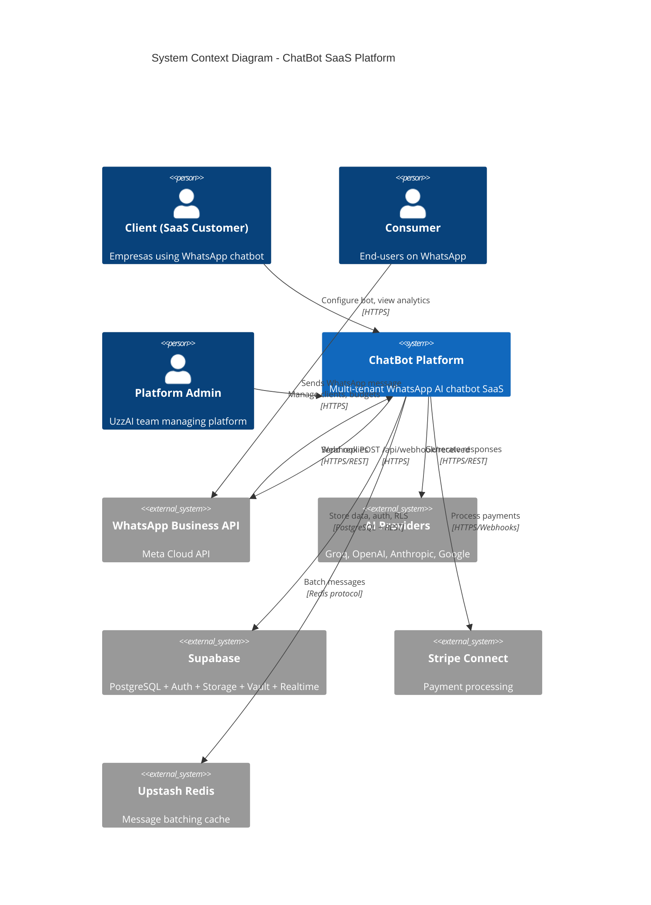
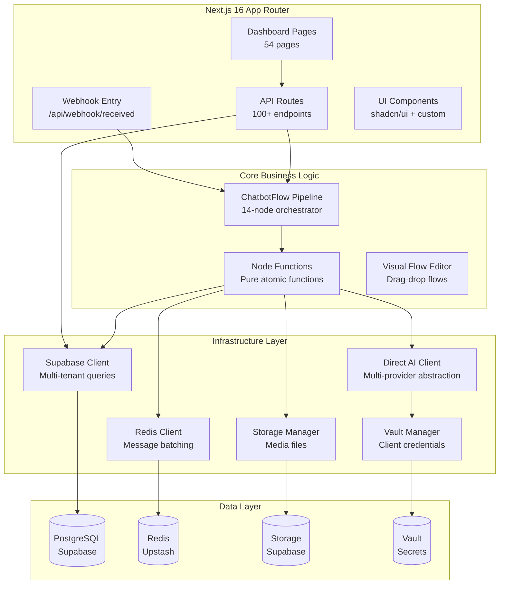
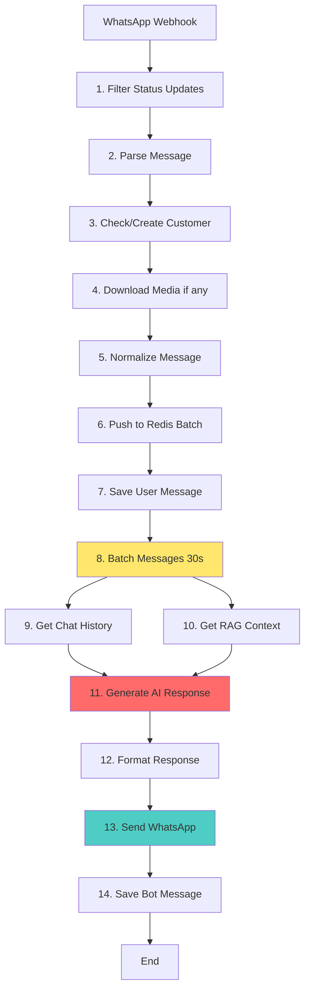
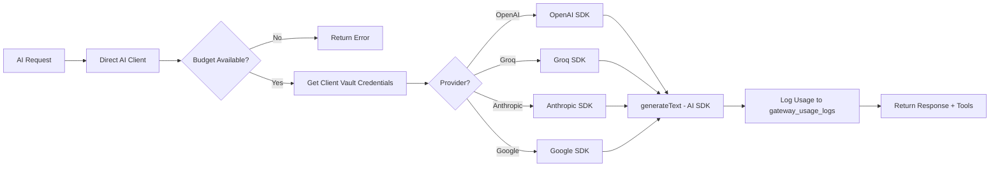
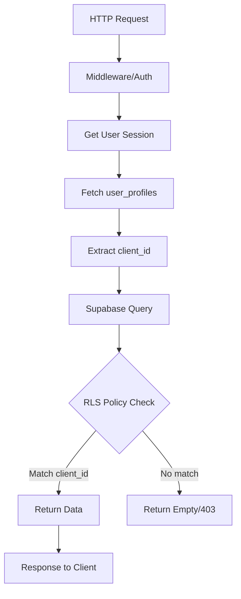
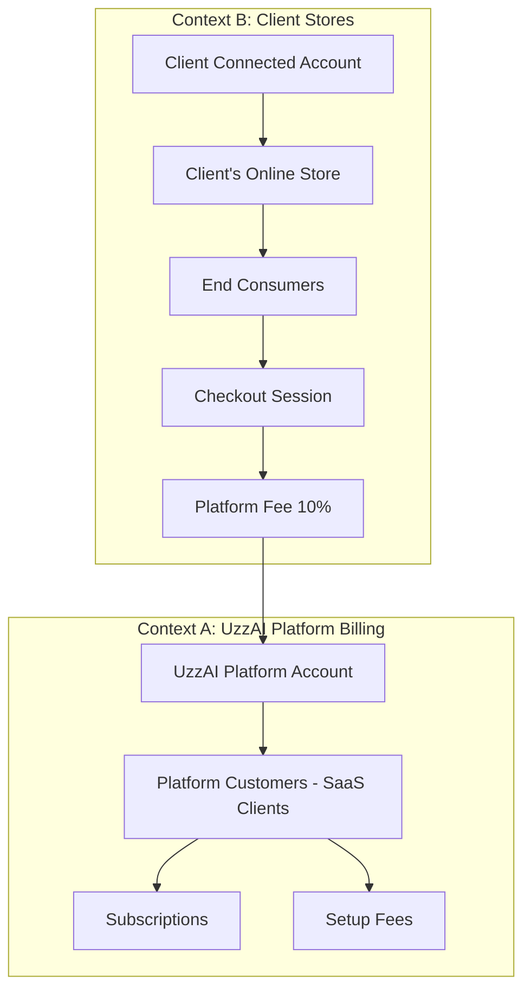
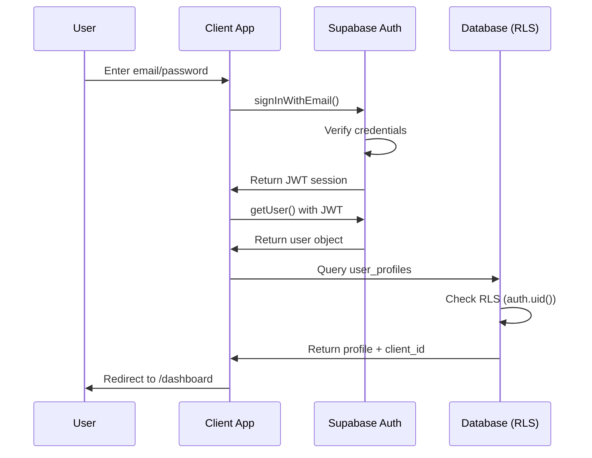
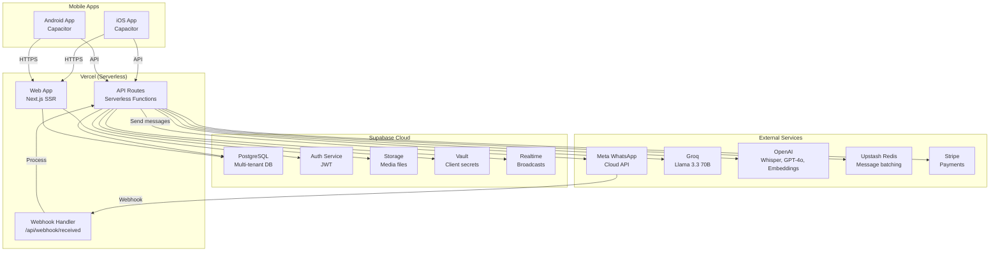

# ARCHITECTURE FROM CODE - ChatBot-Oficial

**Gerado em:** 2026-02-16
**Fonte:** Análise completa do código-fonte

## Sumário Executivo

**Sistema:** WhatsApp SaaS Multi-tenant Chatbot Platform
**Arquitetura:** Serverless (Vercel) + Supabase + Multi-Provider AI
**Pattern:** Event-driven message processing pipeline
**Tenant Isolation:** RLS + Vault credentials + client_id filtering

---

## 1. High-Level Architecture



---

## 2. Component Architecture (Next.js App)



---

## 3. Chatbot Flow Architecture (Core Pipeline)

**Evidência:** `src/flows/chatbotFlow.ts:1-100`

### 3.1 Pipeline Nodes (14 Nodes)



**Evidência:** Imports em chatbotFlow.ts:
- Line 6-22: Import de todos os nodes

**Key Features:**
- **Parallel Execution:** N9 + N10 run in parallel (independent)
- **Redis Batching:** N8 prevents duplicate responses (30s default)
- **Interleaved Save:** N13 sends, N14 saves (race condition prevention)
- **Tool Calls:** Special flow for human handoff (evidência: handleHumanHandoff import line 17)

### 3.2 Node Functions (Pure Functions)

**Pattern:**
```typescript
// Evidência: chatbotFlow.ts structure
export interface NodeInput {
  phone: string
  content: string
  // ...
}

export const myNode = async (input: NodeInput): Promise<Output> => {
  // Pure logic, single responsibility
  return result
}
```

**Locations:**
- `src/nodes/*.ts` - One file per node
- Example nodes:
  - `filterStatusUpdates.ts`
  - `parseMessage.ts`
  - `checkOrCreateCustomer.ts`
  - `downloadMetaMedia.ts`
  - `normalizeMessage.ts`
  - `pushToRedis.ts`
  - `saveChatMessage.ts`
  - `batchMessages.ts`
  - `getChatHistory.ts`
  - `getRAGContext.ts`
  - `generateAIResponse.ts`
  - `formatResponse.ts`
  - `transcribeAudio.ts`
  - `analyzeImage.ts`
  - `analyzeDocument.ts`
  - `handleHumanHandoff.ts`
  - `checkHumanHandoffStatus.ts`
  - `captureLeadSource.ts`
  - `updateCRMCardStatus.ts`
  - `checkContinuity.ts`
  - `classifyIntent.ts`
  - `detectRepetition.ts`
  - `checkInteractiveFlow.ts`

**Total:** 25+ node functions

---

## 4. AI Architecture (Direct AI Client)

**Evidência:** `src/lib/direct-ai-client.ts:1-100`

### 4.1 Multi-Provider Strategy



**Evidência:**
- Line 1-13: Header comments explaining architecture
- Line 15-17: AI SDK imports (generateText, createOpenAI, createGroq)
- Line 18: Vault integration (`getClientVaultCredentials`)
- Line 19: Budget check (`checkBudgetAvailable`)
- Line 20: Usage tracking (`logDirectAIUsage`)

**Key Principles:**
1. **No shared keys** - Each client uses OWN Vault credentials
2. **Budget enforcement** - Pre-flight check before API call
3. **Usage tracking** - Every call logged to `gateway_usage_logs`
4. **Tool normalization** - Compatible with existing flow code
5. **Transparent errors** - No hidden fallbacks

### 4.2 Supported Providers

**Evidência:** direct-ai-client.ts:32-34

| Provider | Config Key | Default Model | Use Case |
|----------|-----------|---------------|----------|
| OpenAI | `primaryModelProvider: 'openai'` | GPT-4o-mini | Chat, Vision, Embeddings |
| Groq | `primaryModelProvider: 'groq'` | Llama 3.3 70B | Fast chat (main chatbot) |
| Anthropic | (via AI SDK) | Claude Opus/Sonnet | Alternative chat |
| Google | (via AI SDK) | Gemini | Alternative chat |

### 4.3 Tool Calls (Function Calling)

**Tools Available:**
- `transferir_atendimento` - Human handoff
- `subagente_diagnostico` - Diagnostic subagent
- `search_documents` - RAG search

**Evidência:** chatbotFlow.ts:17 (handleHumanHandoff import)

---

## 5. Database Architecture (Supabase + Multi-tenant)

### 5.1 Multi-tenant Isolation Strategy



**Evidência:** dashboard/page.tsx:37-42
```typescript
const { data: profile } = await supabase
  .from('user_profiles')
  .select('client_id')
  .eq('id', user.id)
  .single()
```

### 5.2 Client Configuration & Vault

**Architecture:**
1. **Client record** in `clients` table (id, name, config)
2. **Vault secrets** for each client:
   - `client_{uuid}_openai_api_key`
   - `client_{uuid}_groq_api_key`
   - `client_{uuid}_meta_access_token`
3. **RLS policies** filter all tables by `client_id`

**Evidência:** direct-ai-client.ts:18 (getClientVaultCredentials)

**Libs:**
- `src/lib/vault.ts` - Vault credential manager
- `src/lib/config.ts` - Client configuration loader
- `src/lib/supabase.ts` - Supabase client factory
- `src/lib/supabase-server.ts` - Server-side client
- `src/lib/supabase-browser.ts` - Browser client

### 5.3 Core Tables (Inferido do código)

| Table | Purpose | Tenant Field | Evidência |
|-------|---------|--------------|-----------|
| `clients` | SaaS customers | N/A (root) | Config loader |
| `user_profiles` | User accounts | `client_id` | dashboard/page.tsx:37 |
| `clientes_whatsapp` | WhatsApp contacts | `client_id` | CLAUDE.md reference |
| `n8n_chat_histories` | Chat memory | `client_id` | chatHistory node |
| `documents` | RAG knowledge base | `client_id` | RAG node |
| `conversations` | Conversation state | `client_id` | Conversations page |
| `messages` | Message history | `client_id` | Messages |
| `gateway_usage_logs` | AI usage tracking | `client_id` | direct-ai-tracking.ts:20 |
| `ai_models_registry` | Model catalog | N/A (shared) | Pricing |
| `client_budgets` | Budget limits | `client_id` | Budget check |

**Migrations:** `supabase/migrations/` (20 files encontrados)

---

## 6. Infrastructure Layer

### 6.1 Library Organization

**Evidência:** Glob src/lib/*.ts (53 files)

| Library | Purpose | Evidência |
|---------|---------|-----------|
| `direct-ai-client.ts` | AI calls (main interface) | Lido |
| `vault.ts` | Credential management | Import ref |
| `unified-tracking.ts` | Budget + usage | Import ref |
| `direct-ai-tracking.ts` | AI usage logs | Import ref |
| `supabase.ts` | Supabase client factory | Import ref |
| `redis.ts` | Redis client | Import ref |
| `storage.ts` | File storage | chatbotFlow:46 |
| `meta.ts` | WhatsApp API client | Inferred |
| `stripe.ts` | Stripe platform | Glob |
| `stripe-connect.ts` | Stripe Connect | Glob |
| `gmail.ts` | Email notifications | Glob |
| `logger.ts` | Execution logging | chatbotFlow:30 |
| `config.ts` | Client config loader | Glob |
| `types.ts` | TypeScript definitions | chatbotFlow:1-5 |
| `utils.ts` | Generic utilities | Glob |
| `schemas.ts` | Zod schemas | Glob |
| `rate-limit.ts` | Rate limiting | Glob |
| `dedup.ts` | Deduplication | Glob |
| `webhookCache.ts` | Webhook caching | Glob |
| `flowHelpers.ts` | Flow orchestration | chatbotFlow:44 |
| `chunking.ts` | Text chunking (RAG) | Glob |
| `openai.ts` | OpenAI helpers | Glob |
| `groq.ts` | Groq helpers | Glob |
| `elevenlabs.ts` | TTS (Text-to-Speech) | Glob |
| `audio-converter.ts` | Audio format conversion | Glob |
| `biometricAuth.ts` | Mobile biometric auth | Glob |
| `deepLinking.ts` | Mobile deep links | Glob |
| `pushNotifications.ts` | Push notifications | Glob |
| `firebase-admin.ts` | Firebase Admin SDK | Glob |
| `calendar-client.ts` | Calendar integration | Glob |
| `google-calendar-*.ts` | Google Calendar OAuth | Glob (3 files) |
| `microsoft-calendar-*.ts` | Microsoft Calendar OAuth | Glob (2 files) |
| `meta-oauth.ts` | Meta OAuth | Glob |
| `meta-leads.ts` | Meta Leads integration | Glob |
| `crm-automation-constants.ts` | CRM constants | Glob |
| `agent-templates.ts` | Agent prompt templates | Glob |
| `prompt-builder.ts` | Dynamic prompt building | Glob |
| `waba-lookup.ts` | WABA ID lookup | Glob |
| `auth-helpers.ts` | Auth utilities | Glob |
| `admin-helpers.ts` | Admin utilities | Glob |
| `auto-provision.ts` | Auto client provisioning | Glob |
| `audit.ts` | Audit logging | Glob |
| `sanitizedLogger.ts` | Sanitized logs (no PII) | Glob |

**Total:** 53 library files

### 6.2 Supabase Client Patterns

**3 client types:**

1. **Server Client (API Routes/Server Components)**
```typescript
// src/lib/supabase-server.ts
import { createServerClient } from '@supabase/ssr'
// Uses service role key - full access
```

2. **Browser Client (Client Components)**
```typescript
// src/lib/supabase-browser.ts
import { createBrowserClient } from '@supabase/ssr'
// Uses anon key - RLS enforced
```

3. **Service Role Client (Admin operations)**
```typescript
// src/lib/supabase.ts
// For operations that bypass RLS (internal only)
```

**Evidência:**
- dashboard/page.tsx:26 uses `createClientBrowser()`
- chatbotFlow.ts:32 uses `createServiceRoleClient()`

---

## 7. Message Processing Flow (Detailed)

### 7.1 Webhook Reception

**Entry Point:** `src/app/api/webhook/received/route.ts`

**Webhook signature (inferido):**
```typescript
POST /api/webhook/received
Headers:
  - x-hub-signature-256 (Meta verification)
Body:
  - entry[].changes[].value.messages[]
  - entry[].changes[].value.statuses[]
```

**Evidência:** CLAUDE.md references webhook at `/api/webhook/[clientId]/route.ts`

**Processing:**
1. Verify Meta signature
2. Extract message/status updates
3. Call `chatbotFlow.processChatbotMessage()`

### 7.2 Message Batching (Redis)

**Purpose:** Prevent duplicate AI responses if user sends multiple messages rapidly

**Implementation:**
```typescript
// Evidência: chatbotFlow.ts:8 (batchMessages import)
// Evidência: chatbotFlow.ts:20 (pushToRedis import)

// 1. Push message to Redis key: batch:{client_id}:{phone}
// 2. Set TTL: 30 seconds
// 3. Wait 30s
// 4. Pop all messages from batch
// 5. Process as single AI request with concatenated content
```

**Redis Lib:** `src/lib/redis.ts`
**Cache Lib:** `src/lib/webhookCache.ts` (adicional)

### 7.3 RAG Context Injection

**Evidência:** chatbotFlow.ts:16 (getRAGContext import)

**Flow:**
1. User message → Generate embedding (OpenAI)
2. Vector search in `documents` table (pgvector)
3. Cosine similarity > 0.8
4. Top 5 chunks
5. Inject into AI prompt as context

**Chunking:** `src/lib/chunking.ts`
- 500 tokens per chunk
- 20% overlap
- Semantic boundaries

---

## 8. Stripe Connect Architecture

**Dual Context:**



**Evidência:** `.env.mobile.example:59-90`

**Webhooks:**
- V1 Webhook (`STRIPE_WEBHOOK_SECRET`) - Platform subscriptions/payments
- V2 Thin Events (`STRIPE_CONNECT_WEBHOOK_SECRET`) - Connected account events

**Libs:**
- `src/lib/stripe.ts` - Platform Stripe client
- `src/lib/stripe-connect.ts` - Connect operations

**Store Routes:**
- `/store/[clientSlug]` - Public store
- `/store/[clientSlug]/[productId]` - Product page
- `/store/[clientSlug]/success` - Payment success
- `/store/[clientSlug]/cancel` - Payment canceled

---

## 9. Mobile Architecture (Capacitor)

### 9.1 Build Strategy

**Web Build:** Standard Next.js SSR/SSG
**Mobile Build:** Static export (no server-side features)

**Evidência:** next.config.js:2-5
```javascript
const isMobileBuild = process.env.CAPACITOR_BUILD === 'true'
const nextConfig = {
  output: isMobileBuild ? 'export' : undefined,
```

### 9.2 Mobile-Specific Features

**Plugins (Capacitor):**
- `@capacitor/app` - App lifecycle, deep links
- `@capacitor/network` - Network status
- `@capacitor/push-notifications` - Firebase push
- `@capacitor/status-bar` - Status bar styling
- `@aparajita/capacitor-biometric-auth` - Biometric auth

**Evidência:** package.json:27-35

**Libs:**
- `src/lib/biometricAuth.ts` - Biometric helpers
- `src/lib/deepLinking.ts` - Deep link handling
- `src/lib/pushNotifications.ts` - Push notification handlers
- `src/lib/firebase-admin.ts` - Firebase Admin SDK
- `src/lib/push-dispatch.ts` - Push dispatch logic

**Components:**
- `src/components/BiometricAuthButton.tsx` - Biometric login button
- `src/components/DeepLinkingProvider.tsx` - Deep link provider
- `src/components/PushNotificationsProvider.tsx` - Push provider

**Deep Link Pattern:** `uzzapp://...`

### 9.3 API Calls em Mobile

**Mobile apps NÃO usam:**
- API routes locais (não existem em static export)

**Mobile apps USAM:**
```typescript
// Evidência: .env.mobile.example:38-39
NEXT_PUBLIC_API_URL=https://uzzapp.uzzai.com.br

// Todas as chamadas fetch vão para produção
fetch(`${process.env.NEXT_PUBLIC_API_URL}/api/...`)
```

---

## 10. Security Architecture

### 10.1 Authentication Flow



**Evidência:**
- login/page.tsx:93 (signInWithEmail)
- login/page.tsx:115-126 (fetch user_profiles)
- dashboard/page.tsx:29-42 (client-side auth check)

**OAuth Providers:**
- Google
- GitHub
- Microsoft (Azure AD)

**Evidência:** login/page.tsx:146-155

### 10.2 RLS (Row Level Security)

**Pattern (expected):**
```sql
-- Example policy
CREATE POLICY "Users can only see own client data"
ON table_name
FOR SELECT
USING (client_id = (
  SELECT client_id FROM user_profiles WHERE id = auth.uid()
))
```

**Enforcement:**
- All queries automatically filtered by Supabase
- No manual client_id filtering needed in code
- Vault queries use service role (bypass RLS for fetching credentials)

### 10.3 CORS & Security Headers

**Evidência:** next.config.js:57-125

**Configured:**
- CORS for /api/* (allow all origins)
- CORS for /api/webhook/* (restrict to Meta)
- X-Frame-Options: DENY
- X-Content-Type-Options: nosniff
- X-XSS-Protection
- Referrer-Policy: strict-origin-when-cross-origin
- Permissions-Policy: camera=(), microphone=(self)

---

## 11. Observability & Monitoring

### 11.1 Execution Logging

**Evidência:** chatbotFlow.ts:30
```typescript
import { createExecutionLogger } from "@/lib/logger"
```

**Usage (expected):**
```typescript
const logger = createExecutionLogger(clientId, conversationId)
logger.info('Node executed', { node: 'parseMessage', data })
```

**Storage:** Likely `execution_logs` table (migration 002_execution_logs.sql)

### 11.2 Usage Tracking

**Tables:**
- `gateway_usage_logs` - AI API calls
- `client_budgets` - Budget limits & usage

**Tracking Functions:**
- `logDirectAIUsage()` - AI calls
- `checkBudgetAvailable()` - Pre-flight budget check

**Evidência:**
- direct-ai-client.ts:19-20
- unified-tracking.ts (budget enforcement)

### 11.3 Audit Logging

**Lib:** `src/lib/audit.ts`

**Expected:** Audit trail for admin actions (user creation, budget changes, config updates)

---

## 12. Performance Optimizations

### 12.1 Webpack Externals

**Evidência:** next.config.js:25-33

**Externalized:**
- `fluent-ffmpeg` - Prevent bundling large binaries
- `@ffmpeg-installer/ffmpeg` - FFmpeg installer

**Reason:** Reduce bundle size, prevent serverless timeouts

### 12.2 Watch Optimization

**Evidência:** next.config.js:36-52

**Ignored in dev watch:**
- node_modules
- .git
- .next
- db/
- docs/
- supabase/
- capacitor/
- *.md
- *.log

**Aggregate timeout:** 300ms (reduce rebuild frequency)

### 12.3 Image Optimization

**Evidência:** next.config.js:6-20

**Remote Patterns:**
- `**.supabase.co/storage/v1/object/public/**` (Supabase Storage)
- `graph.facebook.com/**` (WhatsApp profile pictures)

**Mobile:** `unoptimized: true` (static export)

---

## 13. Error Handling & Edge Cases

### 13.1 Serverless Connection Pooling

**CRÍTICO (do CLAUDE.md):**

❌ **NUNCA usar `pg` direto em serverless:**
```typescript
// ❌ BAD (causes hangs)
const { Pool } = require('pg')
const pool = new Pool()
```

✅ **SEMPRE usar Supabase client:**
```typescript
// ✅ GOOD (Supavisor pooler)
const supabase = createServerClient()
await supabase.from('table').upsert(...)
```

**Evidência:** CLAUDE.md Critical Decision #1

### 13.2 Webhook MUST Await

**Evidência:** CLAUDE.md Critical Decision #2

```typescript
// ❌ BAD (fire-and-forget kills async work)
processChatbotMessage(body)
return NextResponse.json({ status: 200 })

// ✅ GOOD (wait for completion)
await processChatbotMessage(body)
return NextResponse.json({ status: 200 })
```

**Reason:** Serverless functions terminate after HTTP response

### 13.3 Tool Call Stripping

**Problem:** AI responses include `<function=...>` tags in text

**Solution:** Strip before sending to WhatsApp

**Evidência:** CLAUDE.md Critical Decision #5
```typescript
const removeToolCalls = (text: string): string => {
  return text.replace(/<function=[^>]+>[\s\S]*?<\/function>/g, '').trim()
}
```

**Location:** `src/nodes/formatResponse.ts`

---

## 14. Deployment Architecture



**Hosting:**
- **Web + API:** Vercel (serverless)
- **Database:** Supabase (managed PostgreSQL)
- **Cache:** Upstash Redis (serverless Redis)
- **Storage:** Supabase Storage
- **Mobile:** App Store + Google Play

---

## 15. Technology Stack Summary

| Layer | Technologies | Purpose |
|-------|-------------|---------|
| **Frontend** | Next.js 16, React 18, TypeScript, Tailwind, shadcn/ui | Web & mobile UI |
| **Backend** | Next.js API Routes, Serverless functions | API & webhooks |
| **Database** | Supabase (PostgreSQL + pgvector) | Multi-tenant data |
| **Auth** | Supabase Auth, OAuth (Google/GitHub/Azure) | Authentication |
| **Secrets** | Supabase Vault | Client credentials |
| **Cache** | Redis (Upstash) | Message batching |
| **Storage** | Supabase Storage | Media files (PDFs, images, audio) |
| **AI** | Groq, OpenAI, Anthropic, Google | Chatbot intelligence |
| **Messaging** | Meta WhatsApp Business API | WhatsApp integration |
| **Payments** | Stripe Connect | Platform + client billing |
| **Mobile** | Capacitor 7, iOS, Android | Native mobile apps |
| **Monitoring** | Custom execution logs, usage tracking | Observability |
| **Email** | Nodemailer + Gmail | Notifications |

---

## 16. Code Organization Principles

### 16.1 Functional Programming

**Evidência:** CLAUDE.md Code Patterns

**Principles:**
- Only `const` (never `let`/`var`)
- Arrow functions
- No classes
- Immutable data
- Pure functions (nodes)
- Descriptive naming

### 16.2 Modularization

**Separation:**
- `/src/app` - Routes (pages + API)
- `/src/components` - UI components
- `/src/flows` - Flow orchestrators
- `/src/nodes` - Business logic (pure functions)
- `/src/lib` - Infrastructure (clients, helpers)
- `/src/hooks` - React hooks (expected, not verified)

### 16.3 TypeScript Patterns

**Path alias:** `@/*` → `./src/*`

**Evidência:** tsconfig.json:24-28

**Strict mode:** DISABLED (`tsconfig.json:10` - `"strict": false`)

⚠️ **Note:** Reduced type safety

---

## 17. Architectural Decisions (ADRs - Extracted)

| Decision | Rationale | Trade-offs | Evidência |
|----------|-----------|------------|-----------|
| **Direct AI Client (no gateway)** | Simpler, better isolation, transparent errors | No centralized cache, no shared keys | direct-ai-client.ts:1-13 |
| **Vault per client** | Complete multi-tenant isolation | Increased complexity | vault.ts |
| **Redis batching** | Prevent duplicate AI responses | 30s delay in high-traffic | chatbotFlow.ts:8 |
| **Serverless (Vercel)** | Auto-scaling, low ops | Cold starts, Supabase client required | next.config.js |
| **Static export mobile** | Works offline | No SSR, API via HTTPS to prod | next.config.js:5 |
| **14-node pipeline** | Clear separation of concerns | More files to maintain | chatbotFlow.ts |
| **RLS everywhere** | Automatic tenant isolation | Complex policies | Inferred |
| **PostgreSQL (not MongoDB)** | ACID, strong typing, pgvector | Less flexible schema | Supabase choice |

---

## 18. Risks & Technical Debt

### 18.1 Type Safety

⚠️ **TypeScript strict: false**

**Impact:** Reduced compile-time error detection

**Mitigation:** Manual type checks, runtime validation (Zod)

### 18.2 Test Coverage

⚠️ **Test files:** Not extensively verified in this checkpoint

**Expected:** `*.test.ts` files (Jest configured)

**Action needed:** Verify test coverage per module

### 18.3 Error Boundaries

⚠️ **React error boundaries:** Not verified

**Expected:** `error.tsx` files in app directory

**Action needed:** Verify error handling UI

---

**FIM DA ARQUITETURA**

**Próximos documentos a criar:**
- 07_DATA_ACCESS_MAP.md (Supabase queries catalogadas)
- 08_SUPABASE_SCHEMA_FROM_MIGRATIONS_AND_BACKUP.md
- 10_TENANCY_ENFORCEMENT.md
- 91_MAIN_FLOWS.md (fluxogramas detalhados)
