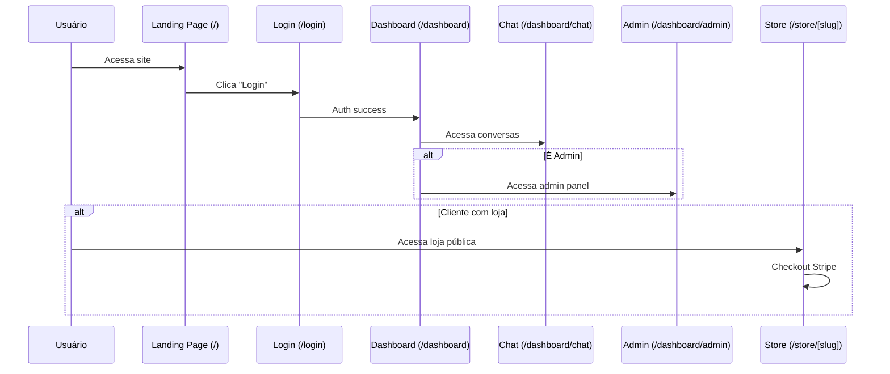

# ROUTES FROM CODE - ChatBot-Oficial

**Gerado em:** 2026-02-16
**Fonte:** Análise de `src/app/**/page.tsx` (54 páginas encontradas)

## Sumário Executivo

- **Total de páginas:** 54
- **Total de layouts:** 4
- **Total de API routes:** 100+ (ver seção separada)
- **Rendering:** Mix de Client Components ('use client') e Server Components
- **Auth pattern:** Middleware + client-side checks

---

## 1. Estrutura de Rotas (Mermaid)

```mermaid
graph TD
    ROOT[/] --> LANDING[Landing Page]
    ROOT --> AUTH_GROUP[(auth) Group]
    ROOT --> DASHBOARD_GROUP[/dashboard]
    ROOT --> LEGAL[Legal Pages]
    ROOT --> STORE[/store]
    ROOT --> ONBOARDING[/onboarding]

    AUTH_GROUP --> LOGIN[/login]
    AUTH_GROUP --> REGISTER[/register]
    AUTH_GROUP --> CHECK_EMAIL[/check-email]
    AUTH_GROUP --> ACCEPT_INVITE[/accept-invite]

    DASHBOARD_GROUP --> DASH_HOME[/dashboard - Home]
    DASHBOARD_GROUP --> ANALYTICS[Analytics]
    DASHBOARD_GROUP --> AI_GATEWAY[AI Gateway]
    DASHBOARD_GROUP --> AGENTS[Agents]
    DASHBOARD_GROUP --> CHAT[Chat]
    DASHBOARD_GROUP --> CONTACTS[Contacts/CRM]
    DASHBOARD_GROUP --> CONVERSATIONS[Conversations]
    DASHBOARD_GROUP --> FLOWS[Flows]
    DASHBOARD_GROUP --> KNOWLEDGE[Knowledge RAG]
    DASHBOARD_GROUP --> SETTINGS[Settings]
    DASHBOARD_GROUP --> TEMPLATES[Templates]
    DASHBOARD_GROUP --> PAYMENTS[Payments/Stripe]
    DASHBOARD_GROUP --> ADMIN[Admin Panel]

    LEGAL --> PRIVACY[/privacy]
    LEGAL --> TERMS[/terms]
    LEGAL --> DPA[/dpa, /docs/dpa]

    STORE --> STORE_HOME[/store/[clientSlug]]
    STORE --> PRODUCT[/store/[clientSlug]/[productId]]
    STORE --> SUCCESS[/store/[clientSlug]/success]
    STORE --> CANCEL[/store/[clientSlug]/cancel]
```

---

## 2. Layouts Hierarchy

**Evidência:** 4 layouts encontrados

| Layout | Path | Propósito | Evidência |
|--------|------|-----------|-----------|
| Root Layout | `src/app/layout.tsx` | Global layout (fonts, providers, metadata) | Glob result |
| (auth) Layout | `src/app/(auth)/layout.tsx` | Layout para páginas de autenticação (sem sidebar) | Glob result |
| Dashboard Layout | `src/app/dashboard/layout.tsx` | Layout principal do dashboard (sidebar, header) | Glob result |
| Conversations Layout | `src/app/dashboard/conversations/layout.tsx` | Layout específico para conversas (split view) | Glob result |

**Nota:** Route groups `(auth)` não aparecem na URL final

---

## 3. Public Routes (Não Autenticadas)

### 3.1 Landing & Marketing

| Route | File | Type | Propósito | Evidência |
|-------|------|------|-----------|-----------|
| `/` | `src/app/page.tsx` | Server | Landing page principal com hero, planos, CTA | Lido: page.tsx:1-46 |
| `/precos` | `src/app/precos/page.tsx` | Server/Client | Página de preços | Glob result |
| `/privacy` | `src/app/privacy/page.tsx` | Server | Política de privacidade | Lido: page.tsx:29-32 (link) |
| `/terms` | `src/app/terms/page.tsx` | Server | Termos de uso | Lido: page.tsx:35-38 (link) |
| `/dpa` | `src/app/dpa/page.tsx` | Server | Data Processing Agreement | Glob result |
| `/docs/dpa` | `src/app/docs/dpa/page.tsx` | Server | DPA alternativo | Glob result |

**Landing Page Components (evidência: page.tsx:1-6):**
- Hero
- Highlights
- Plans
- Security
- FinalCTA

### 3.2 Auth Pages (Route Group: `(auth)`)

**Layout:** `src/app/(auth)/layout.tsx` (sem sidebar, centered)

| Route | File | Type | Propósito | Evidência |
|-------|------|------|-----------|-----------|
| `/login` | `src/app/(auth)/login/page.tsx` | Client | Login com email/senha, OAuth, biometria | Lido: login/page.tsx:1-368 |
| `/register` | `src/app/(auth)/register/page.tsx` | Client | Criação de conta | Glob result |
| `/check-email` | `src/app/(auth)/check-email/page.tsx` | Client | Confirmação de email enviado | Glob result |
| `/accept-invite` | `src/app/(auth)/accept-invite/page.tsx` | Client | Aceitar convite de time | Glob result |

**Login Features (evidência: login/page.tsx):**
- Email/senha (lines 243-291)
- OAuth: Google, GitHub, Microsoft (lines 300-341)
- Biometria (Capacitor native, lines 198-203)
- Session expired handling (lines 186-190)
- Account inactive check (lines 192-196)

### 3.3 Auth Helpers

| Route | File | Type | Propósito | Evidência |
|-------|------|------|-----------|-----------|
| `/auth/pending-approval` | `src/app/auth/pending-approval/page.tsx` | Server/Client | Aguardando aprovação de admin | Glob result |
| `/delete-account` | `src/app/delete-account/page.tsx` | Server/Client | Solicitação de exclusão de conta (GDPR) | Glob result |

### 3.4 Onboarding

| Route | File | Type | Propósito | Evidência |
|-------|------|------|-----------|-----------|
| `/onboarding` | `src/app/onboarding/page.tsx` | Client | Wizard de setup inicial | Glob result |

---

## 4. Protected Routes - Dashboard (Autenticação Obrigatória)

**Layout:** `src/app/dashboard/layout.tsx` (sidebar + header)

### 4.1 Dashboard Home

| Route | File | Type | Propósito | Evidência |
|-------|------|------|-----------|-----------|
| `/dashboard` | `src/app/dashboard/page.tsx` | Client | Dashboard principal (métricas, resumo) | Lido: dashboard/page.tsx:1-77 |

**Dashboard Home Features (evidência: dashboard/page.tsx):**
- Client Component (line 1: 'use client')
- Mobile compatible (static export, lines 8-17)
- Auth check client-side (lines 24-61)
- Fetches client_id from user_profiles (lines 37-42)
- Renders `<DashboardClient clientId={clientId} />` (line 75)

### 4.2 Analytics

| Route | File | Type | Propósito | Evidência |
|-------|------|------|-----------|-----------|
| `/dashboard/analytics` | `src/app/dashboard/analytics/page.tsx` | Server/Client | Analytics geral (conversas, tokens, custos) | Glob result |
| `/dashboard/analytics-comparison` | `src/app/dashboard/analytics-comparison/page.tsx` | Server/Client | Comparação de métricas | Glob result |
| `/dashboard/openai-analytics` | `src/app/dashboard/openai-analytics/page.tsx` | Server/Client | Analytics específico OpenAI | Glob result |

### 4.3 AI Gateway (Budget & Models)

| Route | File | Type | Propósito | Evidência |
|-------|------|------|-----------|-----------|
| `/dashboard/ai-gateway` | `src/app/dashboard/ai-gateway/page.tsx` | Server/Client | Gateway overview | Glob result |
| `/dashboard/ai-gateway/budget` | `src/app/dashboard/ai-gateway/budget/page.tsx` | Server/Client | Configuração de budget | Glob result |
| `/dashboard/ai-gateway/cache` | `src/app/dashboard/ai-gateway/cache/page.tsx` | Server/Client | Cache management | Glob result |
| `/dashboard/ai-gateway/models` | `src/app/dashboard/ai-gateway/models/page.tsx` | Server/Client | Registro de modelos AI | Glob result |
| `/dashboard/ai-gateway/setup` | `src/app/dashboard/ai-gateway/setup/page.tsx` | Server/Client | Setup inicial do gateway | Glob result |
| `/dashboard/ai-gateway/test` | `src/app/dashboard/ai-gateway/test/page.tsx` | Server/Client | Testar modelos | Glob result |
| `/dashboard/ai-gateway/validation` | `src/app/dashboard/ai-gateway/validation/page.tsx` | Server/Client | Validação de configurações | Glob result |

### 4.4 Agents (Prompt Engineering)

| Route | File | Type | Propósito | Evidência |
|-------|------|------|-----------|-----------|
| `/dashboard/agents` | `src/app/dashboard/agents/page.tsx` | Server/Client | Lista de agentes/prompts | Glob result |

**Nota:** Sistema de versioning de prompts mencionado no CLAUDE.md

### 4.5 Chat (Conversas WhatsApp)

| Route | File | Type | Propósito | Evidência |
|-------|------|------|-----------|-----------|
| `/dashboard/chat` | `src/app/dashboard/chat/page.tsx` | Server/Client | Interface de chat (atender conversas) | Glob result |
| `/dashboard/conversations` | `src/app/dashboard/conversations/page.tsx` | Server/Client | Lista de conversas | Glob result |

**Conversations Layout:** `src/app/dashboard/conversations/layout.tsx` (split view)

### 4.6 Contacts/CRM

| Route | File | Type | Propósito | Evidência |
|-------|------|------|-----------|-----------|
| `/dashboard/contacts` | `src/app/dashboard/contacts/page.tsx` | Server/Client | Gerenciamento de contatos | Glob result |
| `/dashboard/crm` | `src/app/dashboard/crm/page.tsx` | Server/Client | CRM completo | Glob result |

### 4.7 Calendar

| Route | File | Type | Propósito | Evidência |
|-------|------|------|-----------|-----------|
| `/dashboard/calendar` | `src/app/dashboard/calendar/page.tsx` | Server/Client | Calendário integrado (Google/Microsoft) | Glob result |

**Evidência de integração:** `googleapis` package instalado (dependencies.md)

### 4.8 Knowledge Base (RAG)

| Route | File | Type | Propósito | Evidência |
|-------|------|------|-----------|-----------|
| `/dashboard/knowledge` | `src/app/dashboard/knowledge/page.tsx` | Server/Client | Upload PDFs/TXTs para RAG | Glob result |

**Uso:** Upload de documentos → Semantic chunking → Embeddings → Vector search (do CLAUDE.md)

### 4.9 Flows (Visual Flow Editor)

| Route | File | Type | Propósito | Evidência |
|-------|------|------|-----------|-----------|
| `/dashboard/flows` | `src/app/dashboard/flows/page.tsx` | Client | Lista de flows | Glob result |
| `/dashboard/flows/[flowId]/edit` | `src/app/dashboard/flows/[flowId]/edit/page.tsx` | Client | Editor visual de flows (drag-drop) | Glob result |
| `/dashboard/flow-architecture` | `src/app/dashboard/flow-architecture/page.tsx` | Client | Visualizador do pipeline principal (14 nodes Mermaid) | Glob result |

**Flow Editor Components (evidência: Glob components/flows/):**
- FlowCanvas
- FlowPropertiesPanel
- FlowSidebar
- FlowToolbar
- FlowPreview
- Blocks: Start, Message, Condition, Action, AIHandoff, HumanHandoff, InteractiveButtons, InteractiveList, End

**Flow Architecture Manager:**
- Mermaid diagram interativo
- Configuração de nodes
- Enable/disable nodes
- Multi-tenant isolated

### 4.10 Templates (WhatsApp Message Templates)

| Route | File | Type | Propósito | Evidência |
|-------|------|------|-----------|-----------|
| `/dashboard/templates` | `src/app/dashboard/templates/page.tsx` | Server/Client | Lista de templates Meta | Glob result |
| `/dashboard/templates/new` | `src/app/dashboard/templates/new/page.tsx` | Server/Client | Criar novo template | Glob result |
| `/dashboard/templates/test` | `src/app/dashboard/templates/test/page.tsx` | Server/Client | Testar envio de template | Glob result |

### 4.11 Settings

| Route | File | Type | Propósito | Evidência |
|-------|------|------|-----------|-----------|
| `/dashboard/settings` | `src/app/dashboard/settings/page.tsx` | Server/Client | Configurações gerais | Glob result |
| `/dashboard/settings/tts` | `src/app/dashboard/settings/tts/page.tsx` | Server/Client | Configuração Text-to-Speech | Glob result |

### 4.12 Payments (Stripe Connect)

| Route | File | Type | Propósito | Evidência |
|-------|------|------|-----------|-----------|
| `/dashboard/payments` | `src/app/dashboard/payments/page.tsx` | Server/Client | Dashboard de pagamentos | Glob result |
| `/dashboard/payments/onboarding` | `src/app/dashboard/payments/onboarding/page.tsx` | Server/Client | Stripe Connect onboarding | Glob result |
| `/dashboard/payments/products` | `src/app/dashboard/payments/products/page.tsx` | Server/Client | Gerenciar produtos para venda | Glob result |

**Stripe Architecture (do .env.mobile.example):**
- Platform Account (UzzAI)
- Connected Accounts (clientes)
- Webhooks V1 + V2 Thin Events

### 4.13 Admin Panel (RBAC)

| Route | File | Type | Propósito | Evidência |
|-------|------|------|-----------|-----------|
| `/dashboard/admin` | `src/app/dashboard/admin/page.tsx` | Server/Client | Admin dashboard | Glob result |
| `/dashboard/admin/clients` | `src/app/dashboard/admin/clients/page.tsx` | Server/Client | Gerenciar clientes (multi-tenant) | Glob result |
| `/dashboard/admin/budget-plans` | `src/app/dashboard/admin/budget-plans/page.tsx` | Server/Client | Planos de budget | Glob result |

**RBAC:** user_profiles.role (do CLAUDE.md - migrations 008_phase4_admin_roles.sql)

### 4.14 Backend/Debug

| Route | File | Type | Propósito | Evidência |
|-------|------|------|-----------|-----------|
| `/dashboard/backend` | `src/app/dashboard/backend/page.tsx` | Server/Client | Backend utilities | Glob result |

### 4.15 Meta Ads

| Route | File | Type | Propósito | Evidência |
|-------|------|------|-----------|-----------|
| `/dashboard/meta-ads` | `src/app/dashboard/meta-ads/page.tsx` | Server/Client | Integração com Meta Ads | Glob result |

---

## 5. Store Routes (Public/Dynamic)

**Pattern:** `/store/[clientSlug]/...`

| Route | File | Type | Propósito | Evidência |
|-------|------|------|-----------|-----------|
| `/store/[clientSlug]` | `src/app/store/[clientSlug]/page.tsx` | Server | Loja pública do cliente (produtos) | Glob result |
| `/store/[clientSlug]/[productId]` | `src/app/store/[clientSlug]/[productId]/page.tsx` | Server | Página de produto específico | Glob result |
| `/store/[clientSlug]/success` | `src/app/store/[clientSlug]/success/page.tsx` | Server/Client | Sucesso de pagamento | Glob result |
| `/store/[clientSlug]/cancel` | `src/app/store/[clientSlug]/cancel/page.tsx` | Server/Client | Cancelamento de pagamento | Glob result |

**Uso:** Clientes do SaaS podem vender produtos para seus consumidores via Stripe Connect

---

## 6. Test/Dev Routes (Desenvolvimento)

| Route | File | Type | Propósito | Evidência |
|-------|------|------|-----------|-----------|
| `/test-table` | `src/app/test-table/page.tsx` | Server/Client | Teste de tabelas | Glob result |
| `/components-showcase` | `src/app/components-showcase/page.tsx` | Server/Client | Showcase de componentes UI | Glob result |
| `/test-oauth` | `src/app/test-oauth/page.tsx` | Server/Client | Teste de OAuth | Glob result |
| `/dashboard/test-interactive` | `src/app/dashboard/test-interactive/page.tsx` | Server/Client | Teste de mensagens interativas WhatsApp | Glob result |

**Nota:** Essas rotas devem ser removidas/protegidas em produção

---

## 7. API Routes (Resumo - Ver Seção Separada)

**Total encontrado:** 100+ arquivos `route.ts` em `src/app/api/`

**Principais categorias:**
- `/api/webhook/*` - Webhooks do WhatsApp (Meta)
- `/api/admin/*` - Administração
- `/api/agents/*` - Gerenciamento de agentes
- `/api/analytics/*` - Métricas
- `/api/auth/*` - Autenticação/OAuth
- `/api/budget/*` - Budget control
- `/api/commands/*` - WhatsApp commands
- `/api/config/*` - Configurações
- `/api/contacts/*` - Contatos
- `/api/conversations/*` - Conversas
- `/api/crm/*` - CRM operations
- `/api/debug/*` - Debug endpoints
- `/api/documents/*` - RAG documents
- `/api/flows/*` - Flows
- `/api/templates/*` - Templates WhatsApp
- `/api/test/*` - Test endpoints (30+ rotas)
- `/api/user/*` - User management

**Ver documento separado:** `06_API_ROUTES_FROM_CODE.md` (a criar)

---

## 8. Rendering Strategy (Server vs Client Components)

### 8.1 Server Components (Default)

**Usado para:**
- Landing page
- SEO pages (privacy, terms)
- Store pages (public)

**Vantagem:** Melhor SEO, menor bundle JS

### 8.2 Client Components ('use client')

**Usado para:**
- Dashboard pages (mobile compatibility - static export)
- Auth pages (interactive forms)
- Flow editor (drag-drop)
- Real-time features

**Evidência:**
- `src/app/dashboard/page.tsx:1` - 'use client'
- `src/app/(auth)/login/page.tsx:1` - 'use client'

**Razão (do código - dashboard/page.tsx:8-17):**
```typescript
/**
 * FASE 3 (Mobile): Convertido para Client Component
 * Motivo: Static Export (Capacitor) não suporta Server Components com async/await
 */
```

---

## 9. Authentication & Authorization Flow

### 9.1 Auth Check Pattern

**Client-side (pages):**
```typescript
// Evidência: dashboard/page.tsx:24-61
useEffect(() => {
  const supabase = createClientBrowser()
  const { data: { user } } = await supabase.auth.getUser()

  if (!user) {
    router.push('/login')
    return
  }

  // Fetch client_id
  const { data: profile } = await supabase
    .from('user_profiles')
    .select('client_id')
    .eq('id', user.id)
    .single()
}, [])
```

**Server-side (API routes):**
```typescript
// Pattern esperado (não confirmado neste read, mas padrão):
const supabase = createServerClient()
const { data: { user } } = await supabase.auth.getUser()
if (!user) return NextResponse.json({ error: 'Unauthorized' }, { status: 401 })
```

### 9.2 Middleware

**Arquivo esperado:** `src/middleware.ts` (não verificado nesta passada)

**Função:** Redirect não-autenticados tentando acessar /dashboard/*

### 9.3 Role-Based Access Control (RBAC)

**Tabela:** `user_profiles.role`

**Roles esperados:**
- admin
- client
- user

**Migration evidência:** `supabase/migrations/008_phase4_admin_roles.sql`

---

## 10. Dynamic Routes & Params

| Pattern | Example | File | Evidência |
|---------|---------|------|-----------|
| [flowId] | /dashboard/flows/abc123/edit | `src/app/dashboard/flows/[flowId]/edit/page.tsx` | Glob result |
| [clientSlug] | /store/uzzai | `src/app/store/[clientSlug]/page.tsx` | Glob result |
| [productId] | /store/uzzai/prod_123 | `src/app/store/[clientSlug]/[productId]/page.tsx` | Glob result |
| [clientId] | /api/webhook/uuid/... | `src/app/api/webhook/[clientId]/route.ts` | CLAUDE.md reference |
| [phone] | /api/contacts/5554999999 | `src/app/api/contacts/[phone]/route.ts` | Glob API routes |
| [id] | /api/agents/123 | `src/app/api/agents/[id]/route.ts` | Glob API routes |

---

## 11. Metadata & SEO

### 11.1 Root Layout

**Arquivo:** `src/app/layout.tsx`

**Expected metadata:**
```typescript
export const metadata: Metadata = {
  title: 'UzzApp - WhatsApp Chatbot SaaS',
  description: '...',
  // ...
}
```

### 11.2 Per-page Metadata

**Pattern:**
```typescript
// Em cada page.tsx
export const metadata: Metadata = {
  title: 'Dashboard | UzzApp',
}
```

---

## 12. Mobile Considerations (Capacitor)

### 12.1 Deep Links

**Pattern:** `uzzapp://...`

**Evidência:** `DeepLinkingProvider.tsx` component (do Glob components)

### 12.2 Static Export Routes

**Todas as rotas /dashboard/** devem funcionar offline (após first load)

**Evidência:** `next.config.js:5` - `output: isMobileBuild ? 'export' : undefined`

### 12.3 API Calls em Mobile

**Mobile apps fazem fetch para:**
`NEXT_PUBLIC_API_URL` (ex: https://uzzapp.uzzai.com.br)

**Não usam:** API routes locais (não existem em static export)

---

## 13. Navigation Patterns

### 13.1 Links Principais (Inferidos)

```mermaid
graph LR
    LANDING[/] --> LOGIN[/login]
    LANDING --> REGISTER[/register]
    LOGIN --> DASHBOARD[/dashboard]
    REGISTER --> CHECK_EMAIL[/check-email]
    CHECK_EMAIL --> LOGIN
    ACCEPT_INVITE --> REGISTER

    DASHBOARD --> CHAT[/dashboard/chat]
    DASHBOARD --> CONTACTS[/dashboard/contacts]
    DASHBOARD --> ANALYTICS[/dashboard/analytics]
    DASHBOARD --> SETTINGS[/dashboard/settings]

    CHAT --> CONVERSATIONS[/dashboard/conversations]
    CONTACTS --> CRM[/dashboard/crm]
```

### 13.2 Sidebar Menu (Dashboard)

**Evidência:** `src/app/dashboard/layout.tsx` (implementa sidebar)

**Seções esperadas:**
- Home
- Chat / Conversas
- Contatos / CRM
- Analytics
- AI Gateway
- Flows
- Knowledge
- Templates
- Agents
- Settings
- Payments
- Admin (se role = admin)

---

## 14. Error Handling & Loading States

### 14.1 Loading Pattern

**Evidência: dashboard/page.tsx:63-69**
```typescript
if (loading) {
  return (
    <div className="flex items-center justify-center min-h-screen bg-background">
      <div className="animate-spin rounded-full h-8 w-8 border-b-2 border-primary"></div>
    </div>
  )
}
```

### 14.2 Error Pages (Expected)

**Arquivos esperados (não verificados):**
- `src/app/error.tsx` - Error boundary
- `src/app/not-found.tsx` - 404 page
- `src/app/loading.tsx` - Global loading

---

## 15. Rotas por Módulo Funcional

| Módulo | Rotas | Arquivos |
|--------|-------|----------|
| Auth | /login, /register, /check-email, /accept-invite | 4 pages |
| Dashboard Home | /dashboard | 1 page |
| Analytics | /dashboard/analytics, /dashboard/analytics-comparison, /dashboard/openai-analytics | 3 pages |
| AI Gateway | /dashboard/ai-gateway/* | 7 pages |
| Agents | /dashboard/agents | 1 page |
| Chat/Conversations | /dashboard/chat, /dashboard/conversations | 2 pages |
| Contacts/CRM | /dashboard/contacts, /dashboard/crm | 2 pages |
| Knowledge RAG | /dashboard/knowledge | 1 page |
| Flows | /dashboard/flows, /dashboard/flows/[flowId]/edit, /dashboard/flow-architecture | 3 pages |
| Templates | /dashboard/templates/* | 3 pages |
| Settings | /dashboard/settings/* | 2 pages |
| Payments | /dashboard/payments/* | 3 pages |
| Admin | /dashboard/admin/* | 3 pages |
| Store | /store/[clientSlug]/* | 4 pages |
| Legal | /privacy, /terms, /dpa, /docs/dpa | 4 pages |
| Test/Dev | /test-*, /components-showcase, /dashboard/test-* | 4 pages |

---

## 16. Security Headers & CORS

**Evidência:** `next.config.js:57-125`

### 16.1 API Routes CORS

```javascript
// next.config.js:62-83
source: '/api/:path*',
headers: [
  { key: 'Access-Control-Allow-Origin', value: '*' },
  { key: 'Access-Control-Allow-Methods', value: 'GET,POST,PUT,DELETE,OPTIONS,PATCH' },
  { key: 'Access-Control-Allow-Headers', value: 'Content-Type, Authorization, X-Requested-With' },
]
```

### 16.2 Webhook Specific CORS

```javascript
// next.config.js:85-97
source: '/api/webhook/:path*',
headers: [
  { key: 'Access-Control-Allow-Origin', value: 'https://graph.facebook.com' },
]
```

### 16.3 Security Headers (All Routes)

```javascript
// next.config.js:99-123
X-Content-Type-Options: nosniff
X-Frame-Options: DENY
X-XSS-Protection: 1; mode=block
Referrer-Policy: strict-origin-when-cross-origin
Permissions-Policy: camera=(), microphone=(self), geolocation=()
```

---

## 17. Perguntas em Aberto (Requerem Código Adicional)

- [ ] Middleware implementation (`src/middleware.ts`)
- [ ] Error boundaries (`error.tsx`, `not-found.tsx`)
- [ ] Global loading states (`loading.tsx`)
- [ ] Metadata completo por página
- [ ] Sidebar menu implementation (dashboard layout)
- [ ] Breadcrumbs implementation
- [ ] Search functionality
- [ ] Notifications system routing

---

## 18. Riscos & Observações

### 18.1 Test Routes em Produção

⚠️ **RISCO:** Rotas de teste acessíveis publicamente

**Rotas:**
- `/test-table`
- `/components-showcase`
- `/test-oauth`
- `/dashboard/test-interactive`

**Mitigação:** Adicionar auth check ou remover em build de produção

### 18.2 Admin Routes sem RBAC Aparente

⚠️ **OBSERVAÇÃO:** `/dashboard/admin/*` deve verificar role

**Verificar:** Se há check de `user_profiles.role === 'admin'` em:
- Página
- API route
- Middleware

### 18.3 Deep Links não Documentados

⚠️ **OBSERVAÇÃO:** `DeepLinkingProvider.tsx` existe mas padrões de deep link não claros

**Verificar:** Documentação de deep links para mobile

---

## 19. Mapa Completo de Navegação (Fluxo Usuário)



---

**FIM DO ROUTES FROM CODE**

**Total de páginas catalogadas:** 54
**Total de layouts:** 4
**Módulos funcionais identificados:** 15

**Próximos passos:**
- Documentar API Routes (100+ endpoints)
- Mapear componentes UI por página
- Verificar middleware e guards
- Documentar fluxos de dados completos
