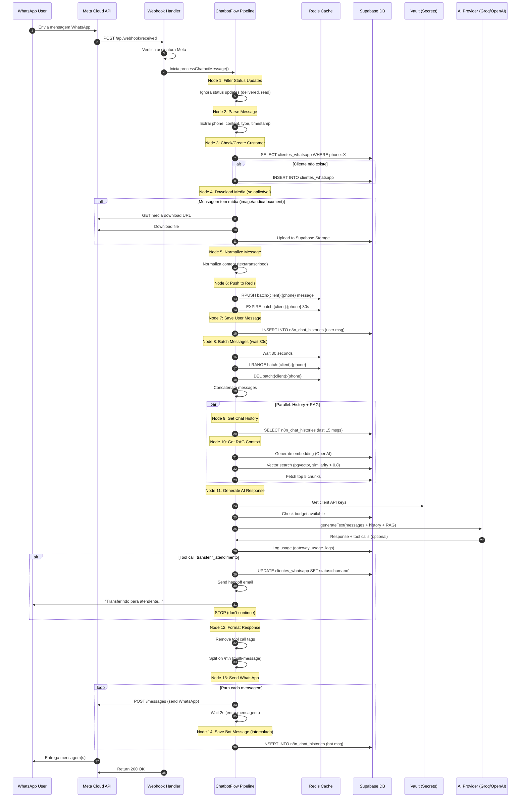
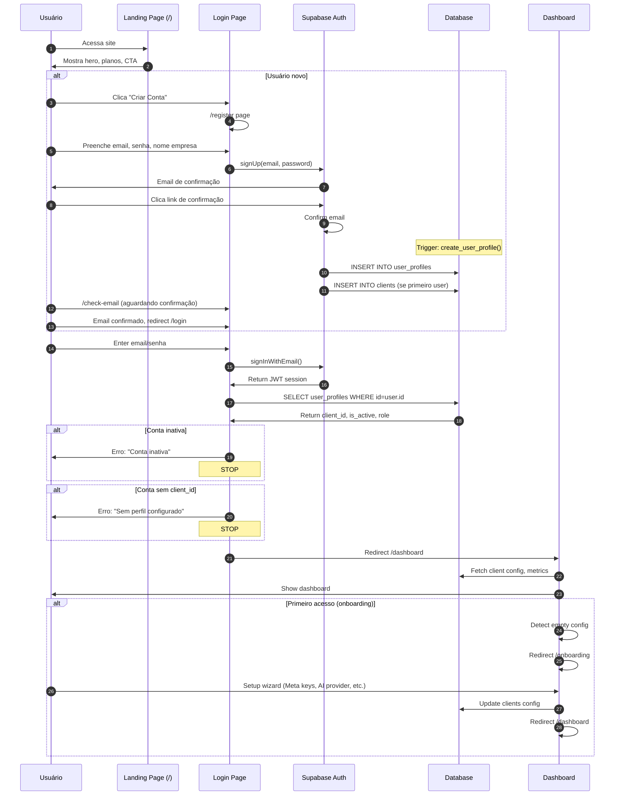
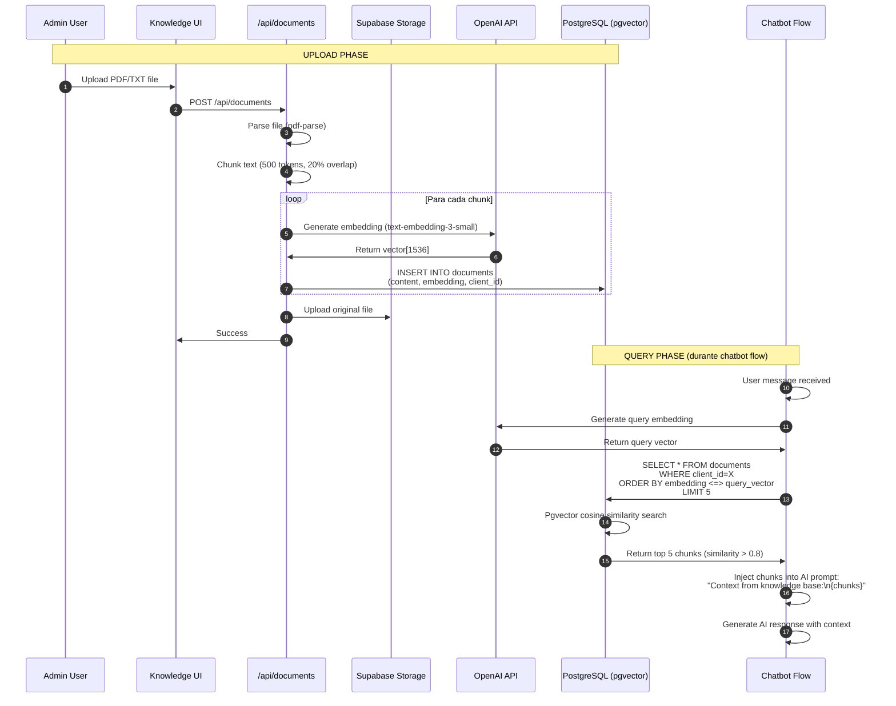
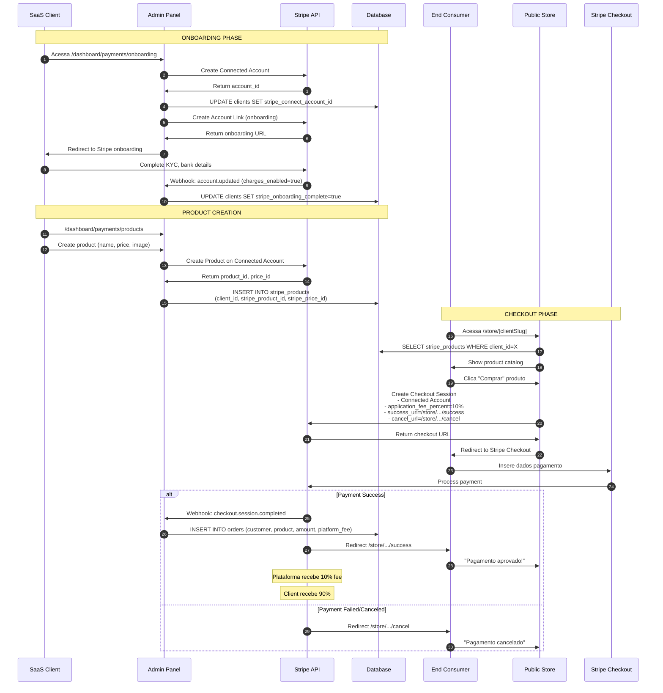
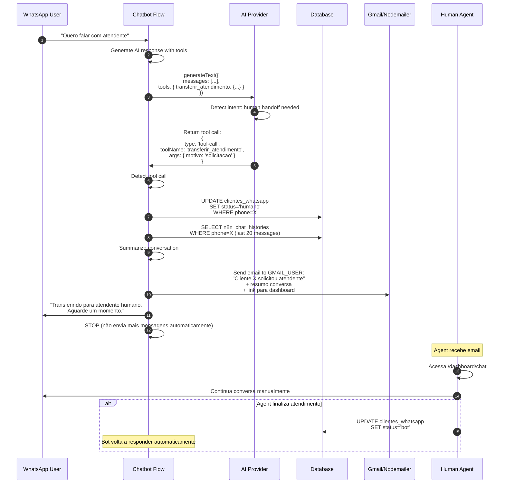
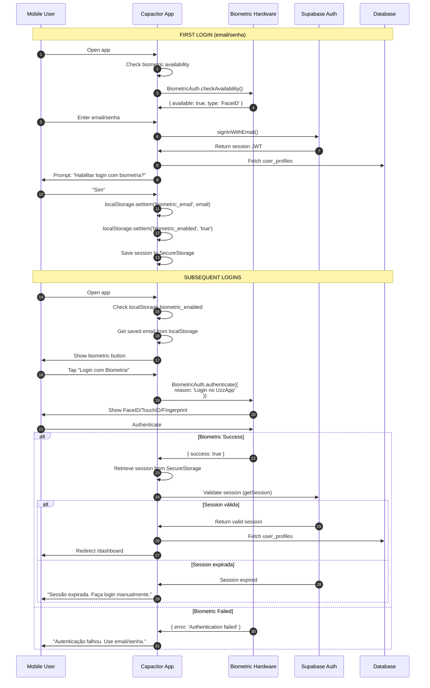
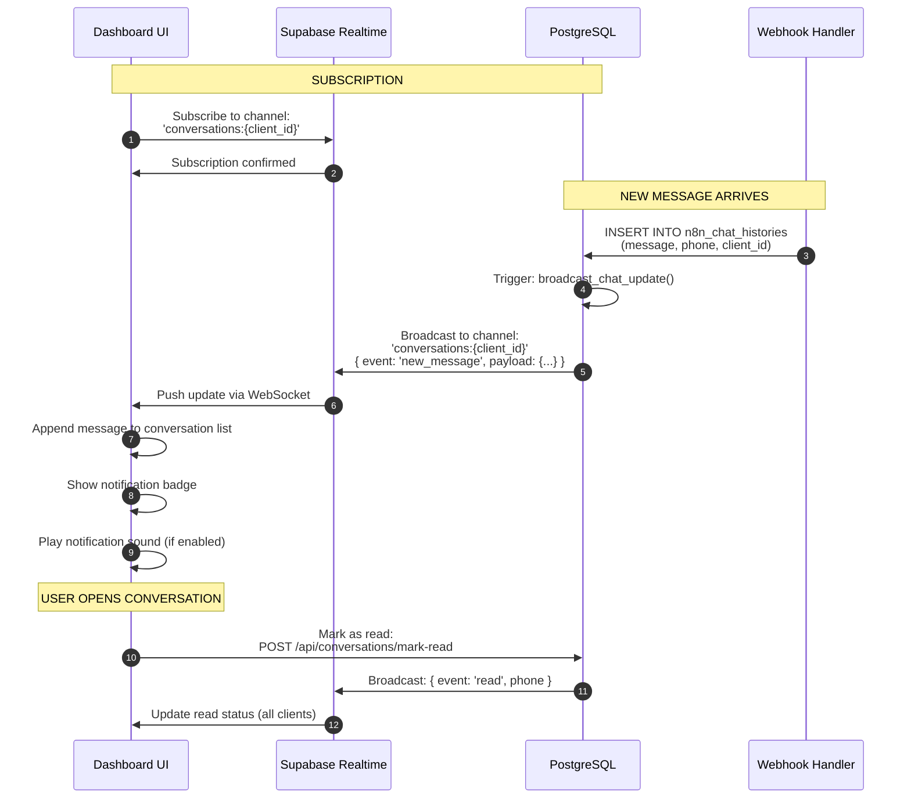
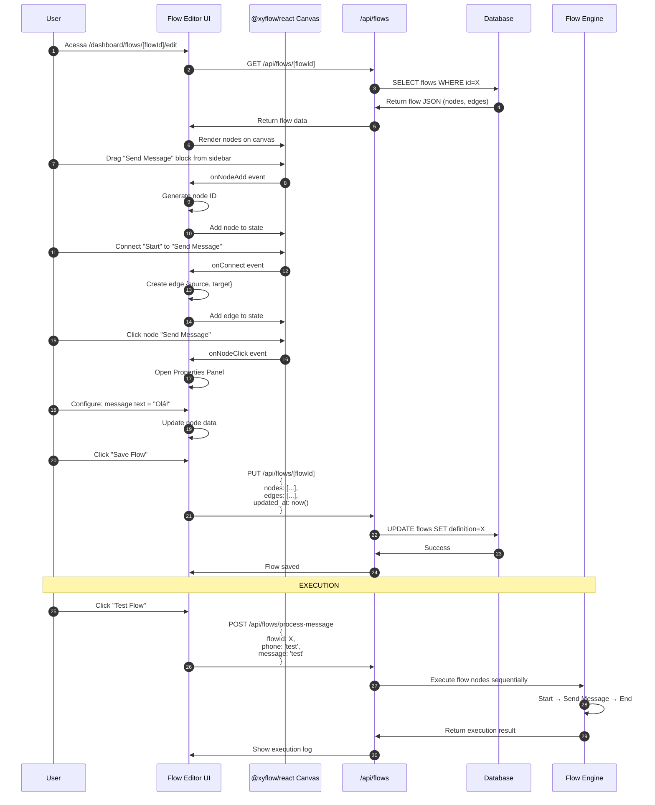
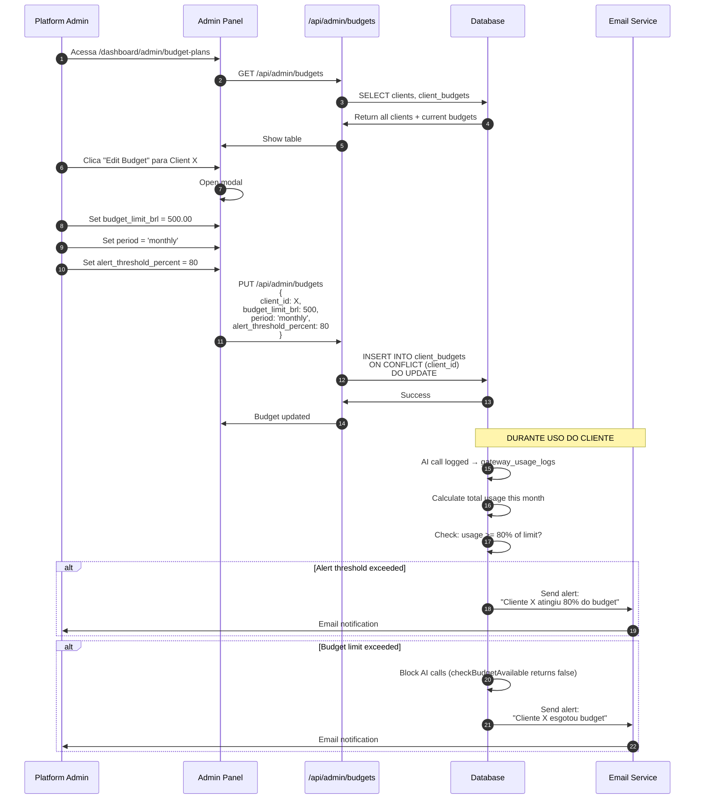

# MAIN FLOWS - ChatBot-Oficial

**Gerado em:** 2026-02-16
**Fonte:** Análise de chatbotFlow.ts + código relacionado

## Sumário

Este documento detalha os principais fluxos do sistema com diagramas Mermaid para visualização.

---

## 1. Fluxo Completo: Mensagem WhatsApp → Resposta AI



**Tempo total estimado:** 30-35 segundos (batching domina)

**Evidência:**
- chatbotFlow.ts:1-100 (imports e estrutura)
- CLAUDE.md (descrição do pipeline de 14 nodes)

---

## 2. Fluxo de Autenticação & Onboarding



**Evidência:**
- login/page.tsx:81-144 (handleSubmit)
- dashboard/page.tsx:24-61 (client-side auth check)

---

## 3. Fluxo de Budget Control (Pre-flight Check)

```mermaid
flowchart TD
    START[AI Request Triggered] --> CHECK_BUDGET{Check Budget Available}

    CHECK_BUDGET --> FETCH_BUDGET[SELECT client_budgets<br/>WHERE client_id=X]
    FETCH_BUDGET --> FETCH_USAGE[SELECT SUM cost_brl<br/>FROM gateway_usage_logs<br/>WHERE client_id=X<br/>AND created_at > period_start]

    FETCH_USAGE --> CALCULATE{current_usage<br/>< budget_limit?}

    CALCULATE -->|Yes| PROCEED[Proceed with AI call]
    CALCULATE -->|No| BLOCK[Return Error:<br/>'Budget exceeded']

    PROCEED --> CALL_AI[Direct AI Client:<br/>generateText]
    CALL_AI --> LOG_USAGE[INSERT gateway_usage_logs<br/>- promptTokens<br/>- completionTokens<br/>- cost_brl]

    LOG_USAGE --> RETURN[Return AI Response]

    BLOCK --> NOTIFY_USER[Notify user:<br/>"Orçamento esgotado"]
    NOTIFY_USER --> END[End]
    RETURN --> END

    style BLOCK fill:#ff6b6b
    style PROCEED fill:#51cf66
```

**Evidência:**
- direct-ai-client.ts:19 (`checkBudgetAvailable`)
- unified-tracking.ts (budget enforcement logic)

---

## 4. Fluxo de RAG (Knowledge Base)



**Evidência:**
- getRAGContext.ts (node function)
- chunking.ts (text splitting)
- CLAUDE.md (RAG system description)

---

## 5. Fluxo de Stripe Connect (Client Store)



**Evidência:**
- .env.mobile.example:59-90 (Stripe config)
- stripe-connect.ts (lib)
- /store/[clientSlug]/* pages

---

## 6. Fluxo de Human Handoff (Tool Call)



**Evidência:**
- handleHumanHandoff.ts (node function)
- gmail.ts (email sending)
- CLAUDE.md (tool calls description)

---

## 7. Fluxo Mobile: Biometric Auth



**Evidência:**
- login/page.tsx:29-45 (biometric check)
- login/page.tsx:47-79 (handleBiometricSuccess)
- biometricAuth.ts (lib)

---

## 8. Fluxo de Realtime Updates (Supabase Realtime)



**Evidência:**
- Migrations: 20250125_realtime_*.sql (5 files)
- CLAUDE.md (Realtime mencionado)

---

## 9. Fluxo de Visual Flow Editor (Drag-Drop)



**Evidência:**
- /dashboard/flows/[flowId]/edit/page.tsx
- components/flows/* (FlowCanvas, FlowPropertiesPanel, etc.)
- @xyflow/react package (dependencies.md)

---

## 10. Fluxo de Admin: Gerenciar Budgets



**Evidência:**
- /dashboard/admin/budget-plans/page.tsx
- /api/admin/budgets/route.ts
- unified-tracking.ts (budget check)

---

## Resumo dos Fluxos

| Fluxo | Tempo Médio | Complexidade | Crítico |
|-------|-------------|--------------|---------|
| 1. Mensagem → Resposta | 30-35s | Alta | ✅ Sim |
| 2. Autenticação | 2-5s | Média | ✅ Sim |
| 3. Budget Control | <100ms | Baixa | ✅ Sim |
| 4. RAG Upload/Query | 5-10s | Média | Não |
| 5. Stripe Connect | Variável | Alta | Não |
| 6. Human Handoff | 3-5s | Média | ✅ Sim |
| 7. Biometric Auth | 1-2s | Baixa | Não |
| 8. Realtime Updates | <1s | Baixa | Não |
| 9. Flow Editor | N/A | Alta | Não |
| 10. Admin Budget | 1-2s | Baixa | ✅ Sim |

**Fluxos críticos:** Afetam diretamente o core business (chatbot)

---

**FIM DOS FLUXOS PRINCIPAIS**

Próximos documentos a criar:
- 99_AI_CONTEXT_PACK.md (resumo para IA)
- Módulos individuais (modules/*.md)
- Database schema completo
