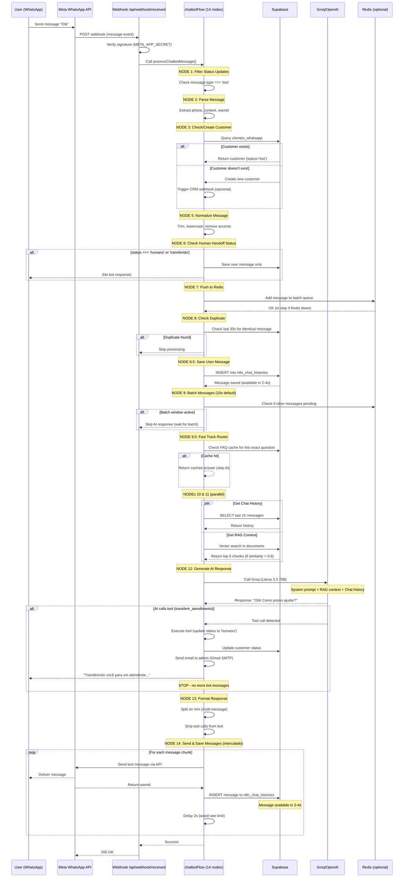
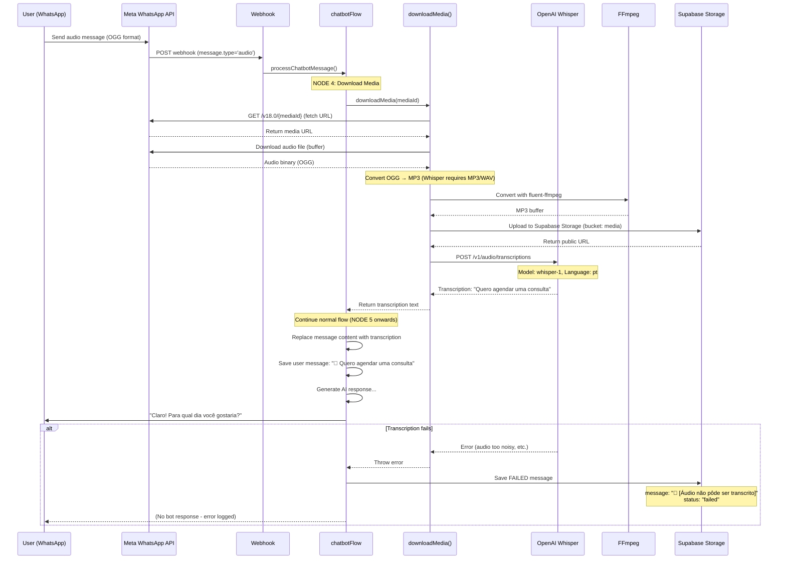
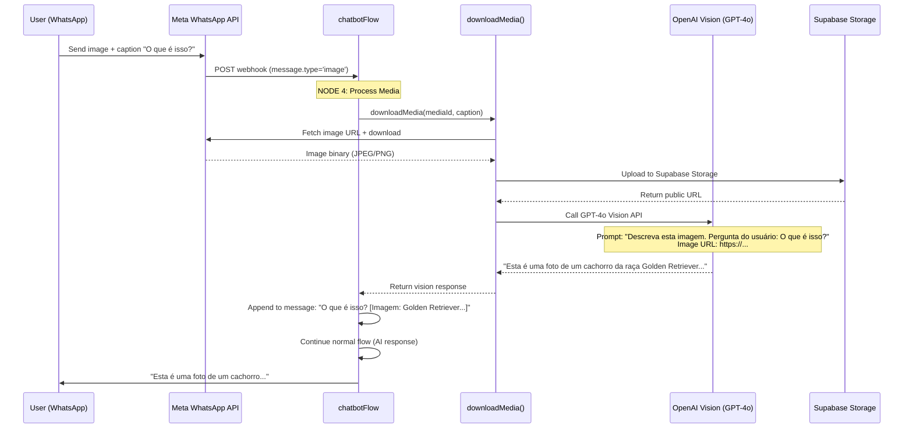
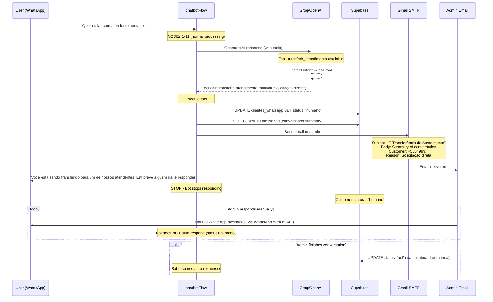
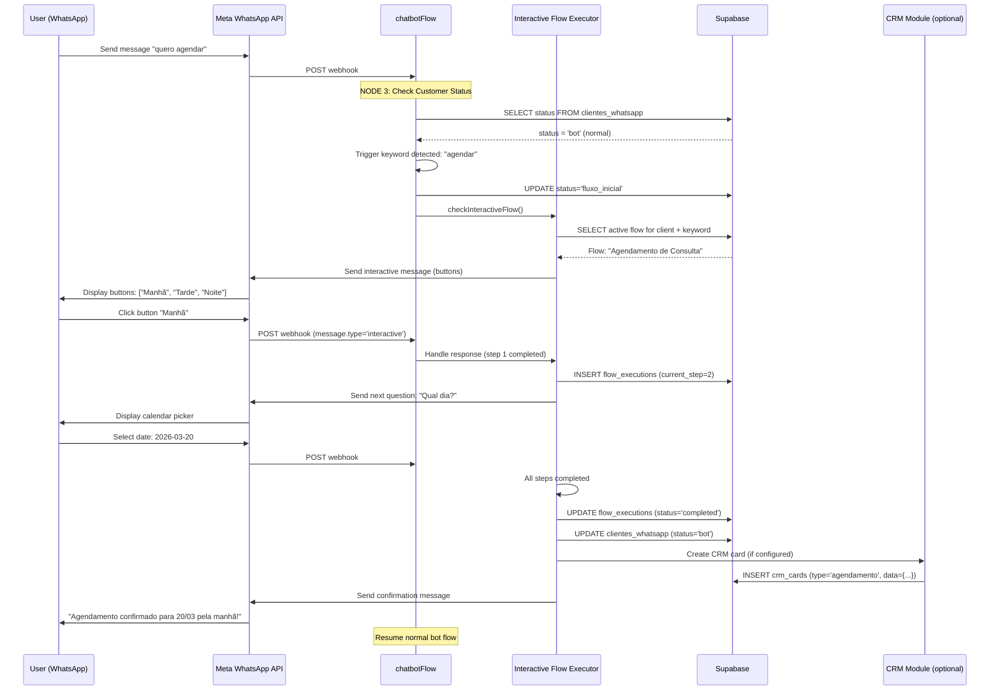
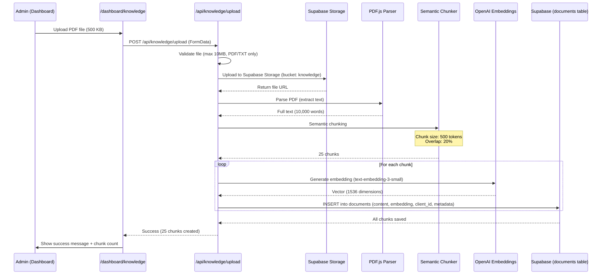
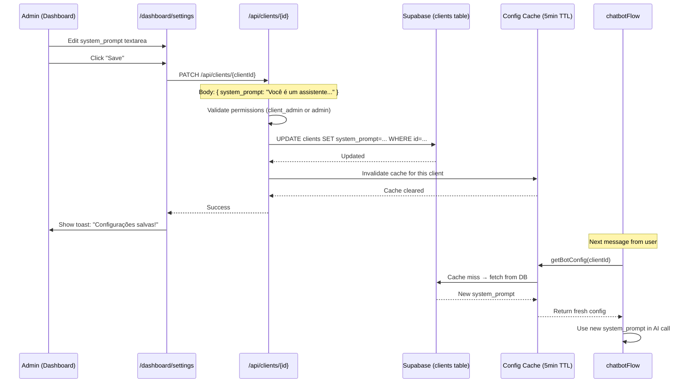
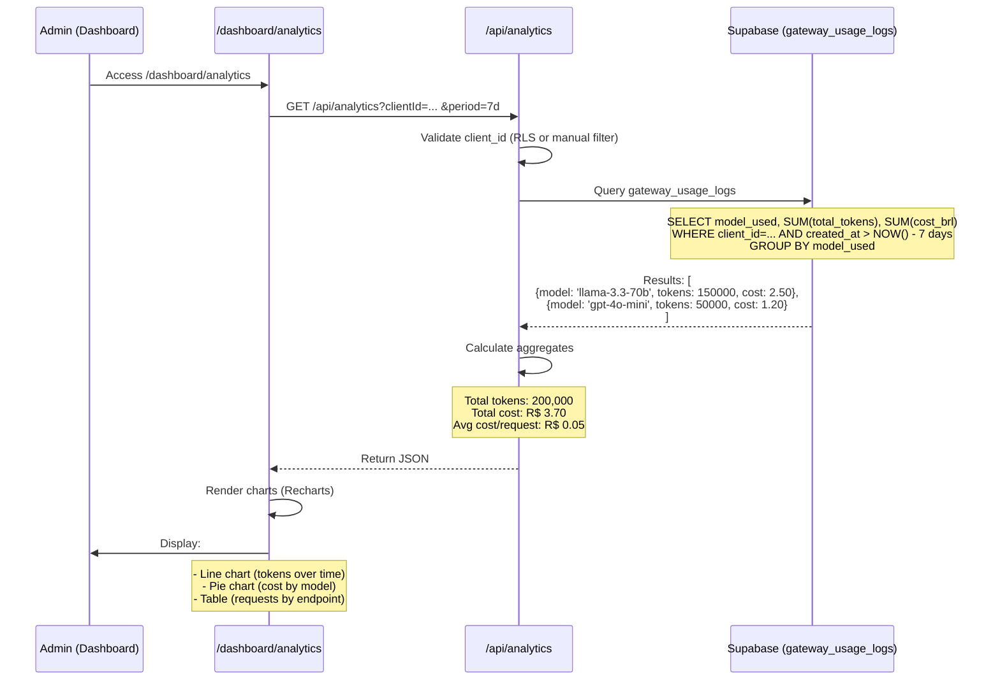
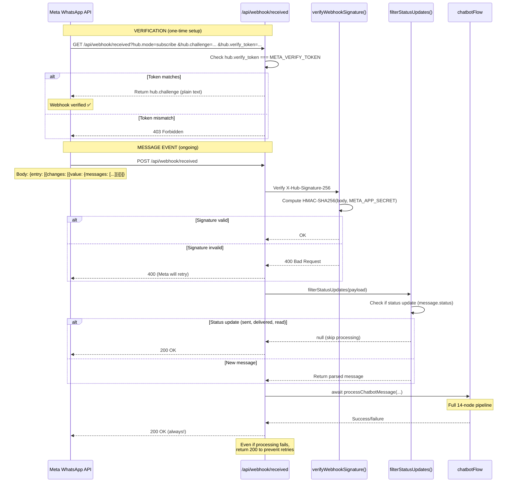
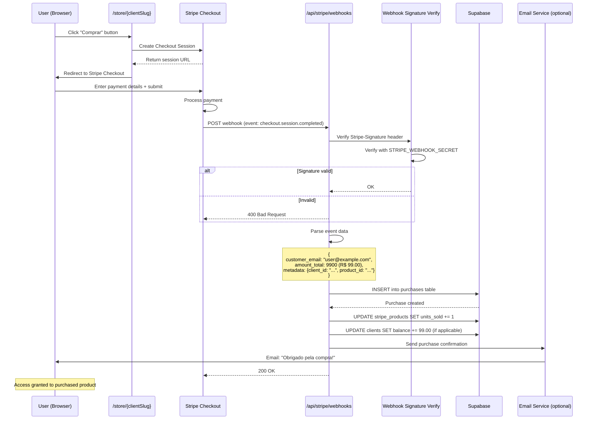

# Main User Flows

**Projeto:** ChatBot-Oficial (UzzApp WhatsApp SaaS)
**Data:** 2026-03-15
**Análise:** Baseada em código-fonte + arquitetura

---

## 📊 Overview

Este documento mapeia os **fluxos principais** do sistema do ponto de vista do usuário final (WhatsApp) e admin (Dashboard).

**Flows Cobertos:**
1. WhatsApp User: First Contact → Bot Response
2. WhatsApp User: Media Message (Audio/Image/PDF)
3. WhatsApp User: Human Handoff
4. WhatsApp User: Interactive Flow Execution
5. Admin: Upload Knowledge (RAG)
6. Admin: Configure Bot Settings
7. Admin: Create Message Template
8. Admin: View Analytics
9. Webhook: Meta WhatsApp → Backend
10. Webhook: Stripe Payment → Backend

---

## 🔄 Flow 1: WhatsApp User - First Contact

**Scenario:** Usuário novo manda primeira mensagem para número WhatsApp da empresa.

**Duration:** ~3-8 seconds (batching can add 10s)

**Key Points:**
- Customer auto-created on first contact
- Messages saved **immediately after sending** (prevents race condition)
- Batching prevents duplicate AI responses for rapid messages
- Fast Track Router uses FAQ cache to skip AI entirely

---

## 🎙️ Flow 2: WhatsApp User - Audio Message

**Scenario:** Usuário envia mensagem de áudio (voz).

**Duration:** ~5-15 seconds (audio processing)

**Key Points:**
- Audio automatically converted OGG → MP3
- Whisper transcription in Portuguese
- If transcription fails, message saved as FAILED (no silent failure)
- Transcribed text treated as normal message

**Supported Formats:** OGG (WhatsApp default), MP3, WAV, M4A

---

## 📸 Flow 3: WhatsApp User - Image with Question

**Scenario:** Usuário envia imagem com legenda "O que é isso?"

**Duration:** ~3-8 seconds (vision API)

**Key Points:**
- Image uploaded to Supabase Storage (permanent)
- GPT-4o Vision describes image in Portuguese
- Caption + image description merged for AI context

**Supported Formats:** JPEG, PNG, WEBP

---

## 👤 Flow 4: Human Handoff

**Scenario:** Usuário pede para falar com humano.

**Duration:** ~2-5 seconds

**Key Points:**
- AI autonomously decides when to transfer (via tool call)
- Email sent to admin with conversation summary
- Bot immediately stops responding (status='humano')
- Admin must manually reactivate bot (status='bot')

**Tool Detection:** AI detects keywords like "atendente", "humano", "pessoa real", "gerente"

---

## 📋 Flow 5: Interactive Flow Execution

**Scenario:** Cliente configurou fluxo interativo (ex: formulário de agendamento).

**Duration:** Variable (depends on user interaction speed)

**Key Points:**
- Customer status changes to 'fluxo_inicial' during execution
- Bot does NOT respond while flow is active
- Flow execution tracked in `flow_executions` table
- Can integrate with CRM (create cards, tasks, etc.)

**Flow Types:** Buttons, Lists, Calendar, Forms (via WhatsApp Interactive Messages)

---

## 📚 Flow 6: Admin - Upload Knowledge (RAG)

**Scenario:** Admin sobe PDF para knowledge base.

**Duration:** ~10-60 seconds (depends on file size)

**Key Points:**
- Maximum 10MB per file
- Automatic chunking with overlap (prevents context loss)
- Embeddings generated via OpenAI (text-embedding-3-small)
- Chunks searchable via vector similarity (pgvector)

**Supported Formats:** PDF, TXT

**Chunk Metadata:** Includes page number, file name, upload date

---

## ⚙️ Flow 7: Admin - Configure Bot Settings

**Scenario:** Admin altera system prompt do chatbot.

**Duration:** ~1-2 seconds + 5min cache TTL

**Configurable Settings:**
- `system_prompt` (AI personality)
- `primaryModelProvider` (groq | openai)
- `temperature` (0.0-2.0)
- `messageDelayMs` (delay between messages)
- `batchWindowMs` (message batching window)
- Vault credentials (OpenAI/Groq API keys)

**Cache:** 5-minute TTL to reduce DB queries. Invalidated on update.

---

## 📊 Flow 8: Admin - View Analytics

**Scenario:** Admin visualiza analytics de uso.

**Duration:** ~500ms-2s

**Analytics Available:**
- **Tokens:** Input, output, total (per model)
- **Cost:** BRL, USD (per model)
- **Requests:** Count, success rate
- **Latency:** Avg response time (ms)
- **Errors:** Count, error types

**Filters:** Date range, model, endpoint

**Tables Used:** `gateway_usage_logs`, `client_budgets`, `client_usage_stats`

---

## 🌐 Flow 9: Webhook - Meta WhatsApp

**Scenario:** Meta envia webhook para verificação ou entrega de mensagem.

**Duration:** ~3-15 seconds (depends on chatbot pipeline)

**Key Points:**
- Signature verification REQUIRED (prevent tampering)
- Status updates (delivered, read) are IGNORED
- Processing errors return 200 OK (to prevent Meta retries)
- Webhook MUST respond within 30s (Vercel timeout)

**Webhook URL Format:** `https://chat.luisfboff.com/api/webhook/received`

---

## 💳 Flow 10: Webhook - Stripe Payment

**Scenario:** Cliente compra produto na loja, Stripe envia webhook.

**Duration:** ~1-3 seconds

**Webhook Types:**
- `checkout.session.completed` → Purchase confirmed
- `customer.subscription.created` → Subscription started
- `invoice.payment_succeeded` → Recurring payment
- `account.updated` → Stripe Connect account status change

**Webhooks:**
- **V1 (Thin):** `/api/stripe/webhooks` (client purchases)
- **V2 (Connect):** `/api/stripe/webhooks/connect` (seller account events)
- **Platform:** `/api/stripe/platform/webhooks` (platform-level billing)

**Security:** Signature verification with `STRIPE_WEBHOOK_SECRET`

---

## 📈 Flow Metrics

| Flow | Avg Duration | Bottleneck | Optimization |
|------|-------------|------------|--------------|
| First Contact | 3-8s | AI response (2-5s) | Fast Track Router |
| Audio Message | 5-15s | Whisper API (3-10s) | Pre-download audio |
| Image Message | 3-8s | Vision API (2-5s) | Cache common images |
| Human Handoff | 2-5s | Email send (1-2s) | Async email queue |
| Interactive Flow | Variable | User interaction | N/A |
| RAG Upload | 10-60s | Embedding generation | Batch embeddings |
| Config Update | 1-2s + 5min cache | Cache TTL | Manual invalidation endpoint |
| Analytics | 500ms-2s | DB query | Materialized views |
| Meta Webhook | 3-15s | Full chatbot pipeline | N/A |
| Stripe Webhook | 1-3s | DB writes | Batch updates |

---

## 🎯 Key Takeaways

1. **All flows are asynchronous** - Webhooks return 200 OK before processing completes
2. **Intercalado pattern** - Messages sent and saved immediately (prevents race conditions)
3. **Batching prevents duplicates** - 10s window for grouping rapid messages
4. **Fast Track Router** - FAQ cache skips AI entirely for known questions
5. **Graceful degradation** - Redis optional, media processing errors saved (not silent)
6. **Multi-tenant isolation** - ALL queries filtered by client_id (RLS + code)
7. **Service role bypasses RLS** - Backend must manually filter by client_id

---

*Última atualização: 2026-03-15*
*Versão: 1.0*
*Baseado em análise de código-fonte + arquitetura*
