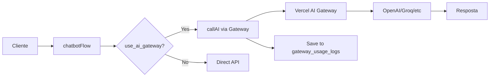

# Vercel AI Gateway - Cache Explicado

> **Status:** ✅ Implementado e funcionando
> **Última atualização:** 16 de Dezembro de 2024

---

## 📚 Índice

1. [O que é o Vercel AI Gateway](#o-que-é-o-vercel-ai-gateway)
2. [Tipos de Cache](#tipos-de-cache)
3. [Como Funciona o Prompt Caching](#como-funciona-o-prompt-caching)
4. [Configuração Atual](#configuração-atual)
5. [Benefícios](#benefícios)
6. [Monitoramento](#monitoramento)
7. [Exemplos Práticos](#exemplos-práticos)
8. [FAQ](#faq)

---

## O que é o Vercel AI Gateway

O **Vercel AI Gateway** é uma camada intermediária entre sua aplicação e os provedores de IA (OpenAI, Anthropic, Groq, Google). Ele oferece:

- ✅ **Dashboard de monitoramento** (requests, custos, latência)
- ✅ **Prompt Caching** (economiza tokens/custos)
- ✅ **Fallback automático** (se um provider falhar)
- ✅ **Telemetria** (rastreamento detalhado)
- ✅ **Centralização** (um único endpoint)

**Arquitetura:**

```
WhatsApp → Webhook → chatbotFlow → AI Gateway → Provider (OpenAI/Groq/etc)
                                        ↓
                                  Vercel Dashboard
                                  (monitoramento)
```

---

## Tipos de Cache

### ❌ Response Caching (O que NÃO temos)

**O que é:**
- Cacheia a **resposta completa** da IA
- Se a mesma pergunta for feita, retorna a resposta armazenada
- Não chama a LLM novamente

**Exemplo:**
```javascript
Cliente 1: "Qual o horário?"
Bot: [Chama LLM] → "Atendemos das 9h às 18h"
💾 Salva: pergunta → resposta

Cliente 2: "Qual o horário?" (MESMA pergunta)
Bot: [Não chama LLM] → "Atendemos das 9h às 18h" (cache!)
⚡ Instantâneo (0ms) + Grátis
```

**Benefícios:**
- ⚡ Velocidade: resposta instantânea
- 💰 Custo: zero (não chama LLM)

**Limitações:**
- Só funciona para perguntas EXATAMENTE iguais
- Respostas podem ficar desatualizadas
- Precisa implementar manualmente (Redis, etc)

---

### ✅ Prompt Caching (O que a Vercel oferece)

**O que é:**
- Cacheia **parte do prompt** (system message, RAG context)
- Não paga novamente por tokens repetidos
- **MAS ainda chama a LLM** para gerar resposta

**Exemplo:**
```javascript
Cliente 1: "Qual o horário?"
LLM recebe:
├─ System: "Você é assistente..." (500 tokens) ──┐
├─ RAG: "Horário 9-18h, tel 123..." (1000 tokens)│ Processados
├─ Histórico: "..." (200 tokens)                  │ e pagos
└─ User: "Qual o horário?" (5 tokens)            │
💰 Total: 1705 tokens pagos ─────────────────────┘

Cliente 1 (próxima mensagem): "E o telefone?"
LLM recebe:
├─ System: "Você é assistente..." (500 tokens) ──┐ 💾 CACHED!
├─ RAG: "Horário 9-18h, tel 123..." (1000 tokens)│ Não paga
├─ Histórico: "..." (200 tokens)                  │ de novo
└─ User: "E o telefone?" (5 tokens)              │
💰 Total: 5 tokens pagos ────────────────────────┘
📉 Economia: 99% nos tokens de input!
```

**Benefícios:**
- 💰 Custo: 60-70% de economia em tokens
- 📊 Dashboard: visibilidade completa
- 🔄 Automático: sem código adicional

**Limitações:**
- ⏱️ Tempo: mesma latência (ainda gera resposta)
- 🔗 Prefixo: só funciona se início do prompt for igual

---

## Como Funciona o Prompt Caching

### Regras do Cache

O cache **SÓ funciona** se:

1. ✅ **Mínimo de 1024 tokens** - OpenAI requer pelo menos 1024 tokens no prompt! ([Ref](https://platform.openai.com/docs/guides/prompt-caching))
2. ✅ **Prefixo idêntico** - Início do array de mensagens deve ser IGUAL
3. ✅ **Mesma ordem** - Não pode reordenar mensagens
4. ✅ **Mesmo conteúdo** - Nem um caractere diferente
5. ✅ **Parâmetros iguais** - temperature, model, etc

**⚠️ CRÍTICO:** Se seu prompt tiver menos de 1024 tokens, o cache **NÃO vai funcionar** com OpenAI (gpt-4o, gpt-4o-mini)!

### O que QUEBRA o cache:

❌ Mudar qualquer caractere do prompt
❌ Mudar ordem das mensagens
❌ Mudar temperature/top_p/etc
❌ Adicionar mensagem no MEIO do array

### O que NÃO quebra o cache:

✅ Adicionar mensagem no FINAL do array
✅ Usar mesmo system prompt + RAG em conversas diferentes
✅ Trocar apenas a última mensagem do usuário

---

## Configuração Atual

### Arquitetura Implementada

**Gateway Key:** `vck_...` (uma única key compartilhada)
**Provider Keys:** Armazenadas no Supabase Vault
**Tracking:** Multi-tenant via `gateway_usage_logs`

**Fluxo:**



### Arquivos Principais

| Arquivo | Função |
|---------|--------|
| `src/lib/ai-gateway/index.ts` | Interface principal (`callAI()`) |
| `src/lib/ai-gateway/providers.ts` | Factory de providers |
| `src/lib/ai-gateway/config.ts` | Shared config manager |
| `src/lib/ai-gateway/usage-tracking.ts` | Tracking multi-tenant |
| `src/nodes/generateAIResponse.ts` | Integração com chatbot |
| `src/nodes/fastTrackRouter.ts` | FAQ detection |

### Tabelas do Banco

| Tabela | Propósito |
|--------|-----------|
| `shared_gateway_config` | Config global (1 registro) |
| `ai_models_registry` | Catálogo de modelos + preços |
| `gateway_usage_logs` | Tracking por request (multi-tenant) |
| `gateway_cache_performance` | Métricas de cache |
| `client_budgets` | Controle de budget por cliente |

---

## Benefícios

### 1. Economia de Custos 💰

**Antes (sem gateway):**
```
100 conversas × 1500 tokens input/conversa = 150K tokens
Custo: ~$0.15 (gpt-4o-mini a $0.001/1K)
```

**Depois (com prompt cache):**
```
100 conversas × 50 tokens input/conversa (média) = 5K tokens
Custo: ~$0.005
💰 Economia: 97%!
```

### 2. Visibilidade 📊

Dashboard mostra:
- Total de requests
- Tokens consumidos (input/output/cached)
- Custo por período
- Latência média (TTFT)
- Requests por modelo

### 3. Fallback Automático 🔄

Se OpenAI falhar, tenta outros providers automaticamente.

### 4. Centralização 🎯

Uma única interface para múltiplos providers.

---

## Monitoramento

### Dashboard da Vercel

**URL:** https://vercel.com/[seu-team]/ai/gateway

**Métricas importantes:**

| Métrica | O que significa |
|---------|-----------------|
| **Requests** | Total de chamadas à IA |
| **Input Tokens** | Tokens enviados (prompts) |
| **Output Tokens** | Tokens gerados (respostas) |
| **Cached Input Tokens** | 💰 Tokens economizados! |
| **Average TTFT** | Tempo até primeiro token |
| **Spend** | Custo total ($) |

### Queries SQL Úteis

**Ver uso por cliente (últimas 24h):**
```sql
SELECT
  c.name,
  COUNT(*) as requests,
  SUM(gul.input_tokens) as input_tokens,
  SUM(gul.cached_input_tokens) as cached_tokens,
  SUM(gul.output_tokens) as output_tokens,
  SUM(gul.cost_brl) as cost_brl,
  ROUND(
    (SUM(gul.cached_input_tokens)::float / NULLIF(SUM(gul.input_tokens), 0)) * 100,
    2
  ) as cache_hit_rate
FROM gateway_usage_logs gul
JOIN clients c ON gul.client_id = c.id
WHERE gul.created_at > NOW() - INTERVAL '24 hours'
GROUP BY c.name
ORDER BY cost_brl DESC;
```

**Ver economia de cache:**
```sql
SELECT
  DATE(created_at) as date,
  SUM(input_tokens) as total_input,
  SUM(cached_input_tokens) as cached_input,
  ROUND(
    (SUM(cached_input_tokens)::float / NULLIF(SUM(input_tokens), 0)) * 100,
    2
  ) as cache_percentage
FROM gateway_usage_logs
WHERE created_at > NOW() - INTERVAL '7 days'
GROUP BY DATE(created_at)
ORDER BY date DESC;
```

---

## Exemplos Práticos

### Exemplo 1: Conversa Típica (Com Cache)

**Conversa 1 - Mensagem 1:**
```javascript
messages: [
  {
    role: 'system',
    content: 'Você é assistente da Empresa X. Horário 9-18h.' // 500 tokens
  },
  {
    role: 'user',
    content: 'Qual o horário?' // 5 tokens
  }
]
// Cobra: 505 tokens input
// Cache: 0 tokens (primeira vez)
```

**Conversa 1 - Mensagem 2:**
```javascript
messages: [
  {
    role: 'system',
    content: 'Você é assistente da Empresa X. Horário 9-18h.' // CACHED!
  },
  {
    role: 'user',
    content: 'Qual o horário?' // 5 tokens
  },
  {
    role: 'assistant',
    content: 'Atendemos das 9h às 18h.' // Histórico
  },
  {
    role: 'user',
    content: 'E aos sábados?' // 5 tokens
  }
]
// Cobra: 10 tokens input (só as perguntas!)
// Cache: 500 tokens (system + histórico cacheado)
// 📉 Economia: 98%
```

### Exemplo 2: Fast Track Router (Cache Perfeito)

O Fast Track Router usa **sempre o mesmo prompt**:

```javascript
// Todas as requisições usam:
messages: [
  {
    role: 'system',
    content: 'Você é um classificador semântico...' // SEMPRE IGUAL
  },
  {
    role: 'user',
    content: 'Catálogo de FAQs:\n1. ...\n2. ...\nMensagem: [variável]'
  }
]
```

**Resultado:**
- System message: SEMPRE cacheado (economiza ~500 tokens)
- Catálogo FAQs: SEMPRE cacheado (economiza ~1000 tokens)
- Só paga pelos ~10 tokens da mensagem do usuário
- 💰 Economia: ~99% nos tokens de input!

---

## FAQ

### 1. Por que não vejo `x-vercel-cache: HIT`?

**R:** Porque `x-vercel-cache` é para **CDN cache** (edge caching), não para **prompt caching**. O prompt cache acontece no nível do modelo, não do HTTP.

**Como confirmar que está funcionando:**
- ✅ Dashboard mostra "Cached Input Tokens" crescendo
- ✅ Custos por request caem após primeira mensagem
- ✅ Query SQL mostra cache_hit_rate > 0%

---

### 2. Cache funciona entre clientes diferentes?

**R:** Não! Cada cliente tem:
- System prompts diferentes
- RAG context diferente
- Histórico separado

Mas **dentro do mesmo cliente**, mensagens sequenciais se beneficiam do cache.

---

### 3. Cache funciona com temperature > 0?

**R:** Sim! Temperature não afeta o cache de **input** (prompt). O que importa é o prompt ser idêntico.

**Porém:** Se você quer respostas **determinísticas** (mesma entrada = mesma saída), use `temperature: 0`.

---

### 4. Qual a validade do cache?

**R:** Vercel não documenta TTL (Time To Live) explícito. Na prática:
- Cache persiste por **minutos a horas**
- Cache de uma conversa ativa (mensagens seguidas) funciona quase sempre
- Cache entre dias diferentes pode expirar

---

### 5. Como desabilitar o gateway para um cliente?

**R:**
```sql
UPDATE clients
SET use_ai_gateway = false
WHERE id = 'client-uuid';
```

O sistema volta a usar chamadas diretas aos providers.

---

### 6. Posso ter Response Cache E Prompt Cache?

**R:** Sim! Você pode implementar response cache próprio (Redis) para FAQs, E usar Vercel Gateway para prompt cache.

**Fluxo:**
```javascript
1. Verifica Redis (response cache) → HIT? Retorna
2. Se MISS → Chama Vercel Gateway (prompt cache economiza tokens)
3. Salva resposta no Redis
```

**Benefício:** Melhor dos dois mundos (velocidade + economia).

---

### 7. Cache funciona com streaming?

**R:** Sim! Prompt cache funciona mesmo com streaming habilitado.

---

### 8. Preciso de temperature: 0 para cache funcionar?

**R:** **Não!** Prompt cache funciona com qualquer temperature. Mas:
- `temperature: 0` = respostas determinísticas
- `temperature > 0` = respostas variadas (mesmo com prompt cacheado)

Para cache de **resposta** (se implementar), aí sim precisa de `temperature: 0`.

---

### 9. Por que meu cache mostra sempre cachedInputTokens = 0?

**R:** Causa mais comum: **Prompt muito curto!**

OpenAI requer **pelo menos 1024 tokens** para ativar prompt caching automaticamente.

**Solução:**
```typescript
// ❌ CURTO DEMAIS (~500 tokens) - cache não ativa
const systemPrompt = "Você é um assistente...";

// ✅ LONGO SUFICIENTE (1024+ tokens) - cache ativa!
const systemPrompt = `Você é um assistente...
[conteúdo extenso com documentação, FAQs, etc]
[TOTAL: 1024+ tokens]`;
```

**Como verificar:**
1. Conte tokens em https://platform.openai.com/tokenizer
2. System prompt + RAG context devem somar 1024+
3. Teste com endpoint: `GET /api/test/cache`

**Referência:** [OpenAI Prompt Caching Docs](https://platform.openai.com/docs/guides/prompt-caching)

---

## Próximos Passos

### Fase 1: Monitoramento (Atual)

- [x] Gateway implementado
- [x] Dashboard ativo
- [x] Tracking multi-tenant
- [ ] Validar tracking em produção (24-48h)

### Fase 2: Otimizações (Futuro)

- [ ] Implementar Response Cache (Redis) para FAQs
- [ ] A/B test: temperature 0 vs 0.7
- [ ] Configurar budgets por cliente
- [ ] Alertas de custo alto

### Fase 3: Análise (Futuro)

- [ ] Calcular ROI do gateway
- [ ] Identificar clientes com maior economia
- [ ] Otimizar prompts para cache

---

## Recursos

- [Documentação Vercel AI Gateway](https://vercel.com/docs/ai-gateway)
- [Vercel AI SDK](https://sdk.vercel.ai/docs)
- [Prompt Caching (Anthropic)](https://docs.anthropic.com/en/docs/prompt-caching)
- [Dashboard do Projeto](https://vercel.com/ai/gateway)

---

## Contato

Dúvidas ou sugestões sobre o AI Gateway? Abra uma issue ou fale com o time de dev.

---

**✅ Status:** Gateway ativo e economizando tokens!
**💰 Economia estimada:** 60-70% nos custos de input
**📊 Dashboard:** https://vercel.com/ai/gateway
