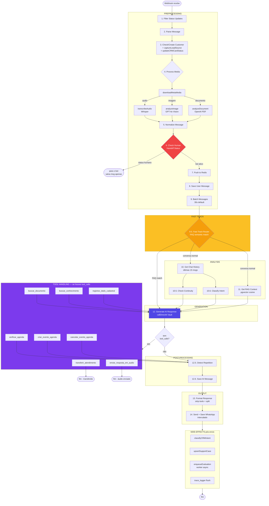
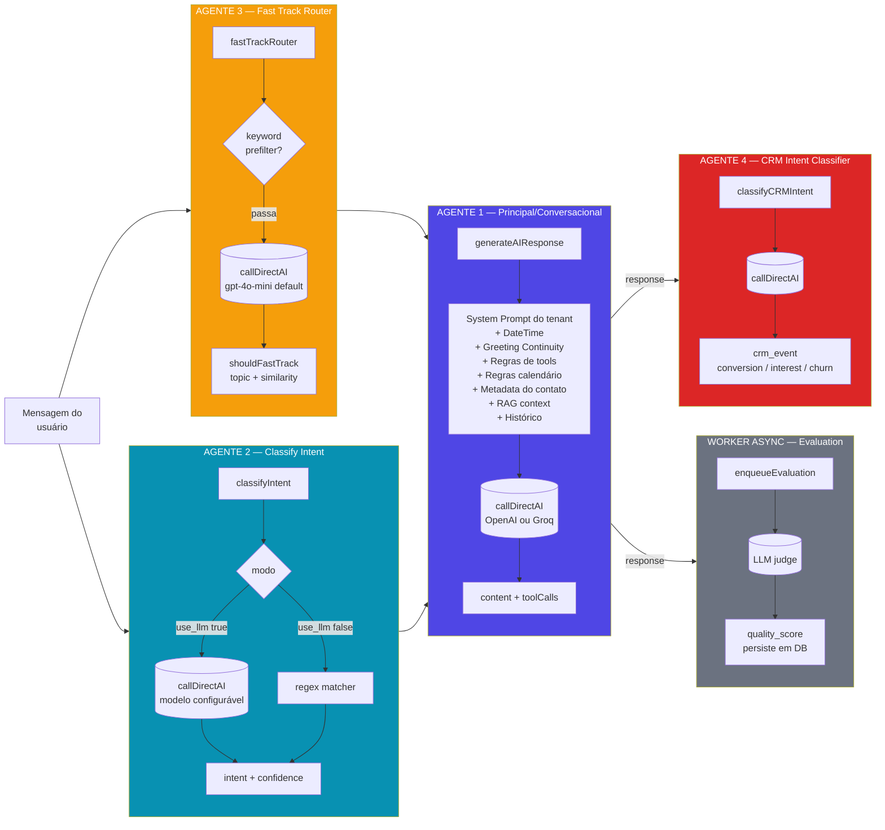
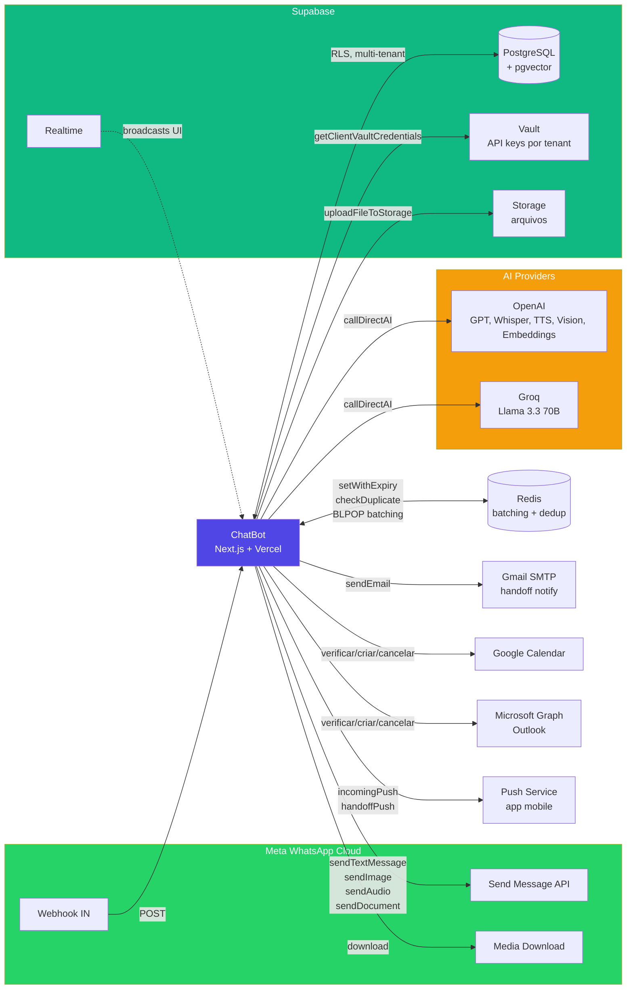
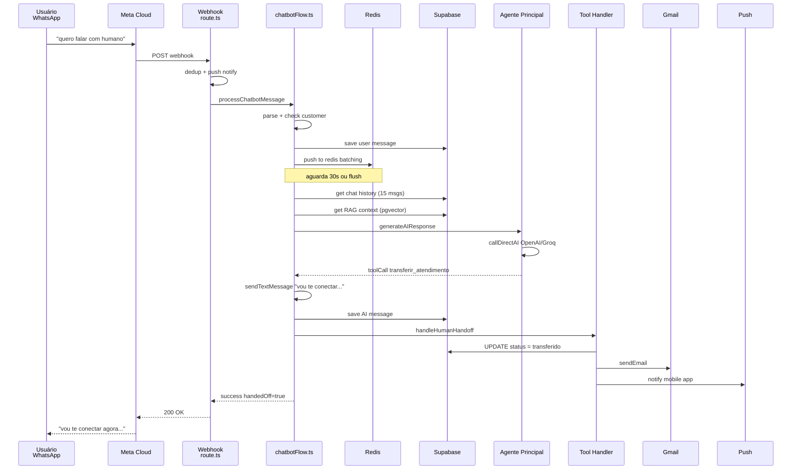
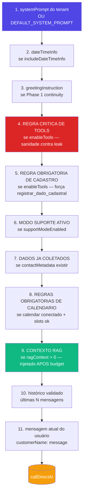

# Arquitetura do Chatbot — Fluxo Visual Completo

> Mapa fim-a-fim do que acontece desde o WhatsApp manda uma mensagem até o cliente receber a resposta.
> Gerado a partir do código real em `src/flows/chatbotFlow.ts`, `src/nodes/*`, `src/lib/agent-tools.ts` e `src/flows/flowMetadata.ts`.

---

## TL;DR — quantos agentes existem?

**4 agentes LLM principais** + 1 worker assíncrono:

| # | Agente | Onde mora | Modelo | Função |
|---|--------|-----------|--------|--------|
| 1 | **Agente Principal** (conversacional) | `src/nodes/generateAIResponse.ts` | OpenAI ou Groq (config do tenant) | Conversa com o cliente, decide tools |
| 2 | **Classify Intent** | `src/nodes/classifyIntent.ts` | LLM ou regex (config) | Classifica intenção da mensagem |
| 3 | **Fast Track Router** | `src/nodes/fastTrackRouter.ts` | LLM pequeno (default `gpt-4o-mini`) | Detecta FAQ p/ habilitar cache de prompt |
| 4 | **CRM Intent Classifier** | `src/lib/crm-intent-classifier.ts` | LLM | Classifica eventos de CRM pós-resposta |
| — | Evaluation Worker (async) | `src/lib/evaluation-worker.ts` | LLM | Avalia qualidade da resposta após envio |

Mais 3 “sub-agentes” de mídia que chamam só APIs especializadas (sem decisão):
- **transcribeAudio** → OpenAI Whisper
- **analyzeImage** → OpenAI GPT-4o Vision
- **analyzeDocument** → OpenAI (extração + sumário de PDF)

---

## 1. Visão geral — entrada da mensagem ao envio

```mermaid
flowchart TB
    META[WhatsApp / Meta Cloud API]
    WEBHOOK[/api/webhook/clientId/<br/>POST]
    DEDUP{Mensagem<br/>duplicada?}
    CONFIG[getClientConfig<br/>Vault + DB]
    PUSH[Push Notification<br/>app mobile]
    FLOW[processChatbotMessage<br/>chatbotFlow.ts]
    OUT[Meta Send Message API]
    DB[(Supabase<br/>n8n_chat_histories)]

    META -->|webhook POST| WEBHOOK
    WEBHOOK --> DEDUP
    DEDUP -->|sim| DROP[200 OK<br/>silencia]
    DEDUP -->|não| CONFIG
    CONFIG --> PUSH
    CONFIG --> FLOW
    FLOW -->|sendTextMessage| OUT
    FLOW -->|saveChatMessage| DB
    OUT -->|wamid| META

    style META fill:#25D366,color:#fff
    style FLOW fill:#4F46E5,color:#fff
    style DB fill:#10B981,color:#fff
```

**Pontos chave:**
- Webhook é multi-tenant: `/api/webhook/[clientId]` ([src/app/api/webhook/[clientId]/route.ts](src/app/api/webhook/%5BclientId%5D/route.ts))
- Dedup via `checkDuplicateMessage` (Redis) antes de processar
- Config do tenant (prompt, modelos, API keys, tools habilitadas) sai do Supabase **Vault**
- Push para app mobile dispara em paralelo ao `processChatbotMessage`

---

## 2. Pipeline completo — os 14 nodes (+ subnodes)



---

## 3. Os 4 agentes LLM em detalhe



**Quem usa qual provider:**
- **Agente 1**: provider configurado por tenant (`primaryModelProvider`: `openai` ou `groq`) — modelos `gpt-4o`, `gpt-5.4-nano`, `llama-3.3-70b`, etc.
- **Agentes 2, 3, 4**: também usam `callDirectAI` (mesma infra), provider conforme config.
- Sub-agentes de mídia (Whisper, GPT-4o Vision) usam `OpenAI` direto via `src/lib/openai.ts` com a key do tenant no Vault.

---

## 4. Sistema de tools — quem faz o quê

```mermaid
flowchart TD
    AI[Agente Principal<br/>generateAIResponse]
    DECIDE{LLM emite<br/>tool_calls?}

    AI --> DECIDE

    subgraph T_HANDOFF[transferir_atendimento]
        T1A[handleHumanHandoff]
        T1B[UPDATE clientes_whatsapp<br/>status = transferido]
        T1C[sendEmail Gmail<br/>notificationEmail]
        T1D[sendHumanHandoffNotification<br/>push mobile]
        T1E[sendTextMessage<br/>aviso ao cliente]
        T1A --> T1B & T1C & T1D & T1E
    end

    subgraph T_DOC[buscar_documento]
        T2A[handleDocumentSearchToolCall]
        T2B[searchDocumentInKnowledge]
        T2C{tipo}
        T2D[sendWhatsAppImage]
        T2E[sendWhatsAppDocument]
        T2F[2nd LLM call<br/>incorpora .txt]
        T2A --> T2B --> T2C
        T2C -->|imagem| T2D
        T2C -->|pdf/doc| T2E
        T2C -->|txt/md| T2F
    end

    subgraph T_KNOW[buscar_conhecimento]
        T3A[getRAGContextWithTrace]
        T3B[pgvector cosine]
        T3C[2nd LLM call<br/>com RAG injetado]
        T3A --> T3B --> T3C
    end

    subgraph T_AUDIO[enviar_resposta_em_audio]
        T4A[handleAudioToolCall]
        T4B[OpenAI TTS]
        T4C[uploadAudioToWhatsApp]
        T4D[sendWhatsAppAudio]
        T4A --> T4B --> T4C --> T4D
    end

    subgraph T_META[registrar_dado_cadastral]
        T5A[updateContactMetadata]
        T5B[(clientes_whatsapp.metadata)]
        T5A --> T5B
    end

    subgraph T_CAL[Calendar tools]
        T6A[handleCalendarToolCall]
        T6B{Google ou<br/>Microsoft?}
        T6C[Google Calendar API]
        T6D[Microsoft Graph API]
        T6A --> T6B --> T6C & T6D
    end

    DECIDE -->|transferir_atendimento| T_HANDOFF
    DECIDE -->|buscar_documento| T_DOC
    DECIDE -->|buscar_conhecimento| T_KNOW
    DECIDE -->|enviar_resposta_em_audio| T_AUDIO
    DECIDE -->|registrar_dado_cadastral| T_META
    DECIDE -->|verificar_agenda<br/>criar_evento_agenda<br/>alterar_evento_agenda<br/>cancelar_evento_agenda| T_CAL
    DECIDE -->|sem tool| FORMAT[Format Response]

    T_HANDOFF --> END_H([FIM — bot para])
    T_DOC --> AI2[2nd Generate]
    T_KNOW --> AI2
    T_AUDIO --> END_A([FIM — áudio])
    T_META --> CONTINUE[continua normal]
    T_CAL --> SUBST[content =<br/>resultado da tool]

    AI2 --> FORMAT
    CONTINUE --> FORMAT
    SUBST --> FORMAT

    style AI fill:#4F46E5,color:#fff
    style T_HANDOFF fill:#DC2626,color:#fff
    style T_AUDIO fill:#10B981,color:#fff
```



**Catálogo das 9 tools** (definidas em [src/lib/agent-tools.ts](src/lib/agent-tools.ts)):

| Tool | Habilitada por | Comportamento pós-execução |
|------|----------------|----------------------------|
| `transferir_atendimento` | `enableHumanHandoff` | **encerra fluxo**, status = transferido |
| `buscar_conhecimento` | `enableRAG` | re-chama LLM com RAG injetado |
| `buscar_documento` | `enableDocumentSearch` | envia mídia + (opcional) re-chama LLM |
| `enviar_resposta_em_audio` | `enableAudioResponse` | **encerra fluxo**, manda TTS |
| `registrar_dado_cadastral` | sempre | continua fluxo, salva metadata |
| `verificar_agenda` | calendar conectado + slots ok | substitui `content` pelo resultado |
| `criar_evento_agenda` | idem | substitui `content` |
| `alterar_evento_agenda` | idem | substitui `content` |
| `cancelar_evento_agenda` | idem | substitui `content` |

---

## 5. Conexões externas — o que está plugado



---

## 6. Tabelas Supabase tocadas no fluxo

| Tabela | Quando é tocada | Por qual node |
|--------|-----------------|---------------|
| `clientes_whatsapp` | ler/criar contato, atualizar status, salvar metadata | `checkOrCreateCustomer`, `handleHumanHandoff`, `updateContactMetadata` |
| `n8n_chat_histories` | salvar mensagem user/ai, ler histórico | `saveChatMessage`, `getChatHistory` |
| `documents` | RAG vector search | `getRAGContext`, `handleDocumentSearchToolCall` |
| `clients` | config do tenant (multi-tenant) | `getClientConfig` |
| `bot_configurations` | flags por node (fast track, intent, RAG, etc.) | múltiplos |
| `gateway_usage_logs` | tracking de cada chamada de LLM | `direct-ai-tracking` |
| `client_budgets` | gate antes de chamar LLM | `checkBudgetAvailable` |
| `traces` / `trace_events` | observabilidade da execução | `MessageTraceLogger` |
| `crm_cards` | CRM kanban automation | `updateCRMCardStatus`, `ensureCRMCard` |
| `support_cases` | classificação de bug/suporte | `upsertSupportCase` |
| `evaluations` | qualidade da resposta | `enqueueEvaluation` worker |

---

## 7. Caminhos de saída — como uma resposta chega no celular



---

## 8. Mapa rápido de arquivos

```
src/
├── app/api/webhook/[clientId]/route.ts    ← entrada, GET verify + POST process
├── flows/
│   ├── chatbotFlow.ts                     ← orquestrador (2884 linhas)
│   └── flowMetadata.ts                    ← single source of truth dos nodes
├── nodes/                                 ← funções puras, atomicas
│   ├── filterStatusUpdates.ts             ← 1
│   ├── parseMessage.ts                    ← 2
│   ├── checkOrCreateCustomer.ts           ← 3
│   ├── downloadMetaMedia.ts               ← 4a
│   ├── transcribeAudio.ts                 ← 4b (Whisper)
│   ├── analyzeImage.ts                    ← 4c (Vision)
│   ├── analyzeDocument.ts                 ← 4d (PDF)
│   ├── normalizeMessage.ts                ← 5
│   ├── checkHumanHandoffStatus.ts         ← 6
│   ├── pushToRedis.ts                     ← 7
│   ├── saveChatMessage.ts                 ← 8 + 12.6
│   ├── batchMessages.ts                   ← 9
│   ├── fastTrackRouter.ts                 ← 9.5  [LLM agent]
│   ├── getChatHistory.ts                  ← 10
│   ├── getRAGContext.ts                   ← 11
│   ├── checkContinuity.ts                 ← 10.5
│   ├── classifyIntent.ts                  ← 10.6 [LLM agent]
│   ├── generateAIResponse.ts              ← 12   [LLM agent — PRINCIPAL]
│   ├── handleHumanHandoff.ts              ← tool transferir_atendimento
│   ├── handleDocumentSearchToolCall.ts    ← tool buscar_documento
│   ├── handleCalendarToolCall.ts          ← tools de calendário
│   ├── updateContactMetadata.ts           ← tool registrar_dado_cadastral
│   ├── detectRepetition.ts                ← 12.5
│   ├── formatResponse.ts                  ← 13 (sanitiza tool leaks)
│   ├── sendWhatsAppMessage.ts             ← 14 (texto)
│   ├── sendWhatsAppAudio.ts               ← 14 (áudio)
│   ├── sendWhatsAppDocument.ts            ← 14 (doc)
│   ├── sendWhatsAppImage.ts               ← 14 (img)
│   ├── captureLeadSource.ts               ← side-effect 3
│   ├── updateCRMCardStatus.ts             ← side-effect múltiplos pontos
│   └── checkInteractiveFlow.ts            ← fluxos interativos (botões)
├── lib/
│   ├── direct-ai-client.ts                ← callDirectAI (Vault + provider routing)
│   ├── agent-tools.ts                     ← buildAllowedTools (catálogo)
│   ├── crm-intent-classifier.ts           ← [LLM agent — CRM]
│   ├── evaluation-worker.ts               ← worker async
│   ├── vault.ts                           ← credenciais por tenant
│   ├── config.ts                          ← getClientConfig
│   ├── redis.ts                           ← batching + dedup
│   ├── meta.ts                            ← sendTextMessage, sendMedia
│   ├── postgres.ts                        ← query() pool
│   ├── supabase.ts                        ← createServiceRoleClient
│   ├── trace-logger.ts                    ← observability
│   └── unified-tracking.ts                ← budget enforcement + usage log
└── handlers/
    └── handleAudioToolCall.ts             ← tool enviar_resposta_em_audio
```

---

## 9. Observações importantes

- **Multi-tenant total**: cada cliente tem sua URL de webhook (`/api/webhook/{clientId}`), suas próprias API keys (Vault), seu próprio prompt, modelo, tools habilitadas.
- **Redis batching** (node 9): se chegam 3 mensagens em sequência, o bot junta antes de chamar a IA — evita resposta tripla.
- **Race condition resolvida** (node 14): mensagens são salvas no DB **imediatamente após enviar**, antes do delay para a próxima — assim a próxima janela de batching já tem o histórico.
- **Tool calls vazadas** (problema atual com gpt-5.4-nano): `formatResponse` agora remove blocos JSON com chaves de tools conhecidas + frases narrativas inventadas. Detalhes em `memory/project_gpt54_nano_tool_leak.md`.
- **Encerradores de fluxo**: só 3 caminhos param o pipeline antes do `Send WhatsApp` normal:
  1. `checkHumanHandoffStatus` retorna humano ativo → para no node 6
  2. `transferir_atendimento` → para após o handoff
  3. `enviar_resposta_em_audio` → para após enviar TTS

- **Configuração visual**: tudo o que é `configurable: true` em `flowMetadata.ts` aparece em `/dashboard/flow-architecture` para o tenant ligar/desligar.

---

## 10. Anatomia do `generateAIResponse.ts` — todas as constantes

Esse arquivo é o **coração do Agente Principal**. Tem 14 constantes/blocos, divididos em 3 grupos: **helper**, **prompt padrão**, e **definições legadas de tools** (mantidas só para compatibilidade — as tools "vivas" estão em `src/lib/agent-tools.ts`).

### 10.1 Helper de validação de slots

#### `checkSlotsAreFilled` — [linha 18](src/nodes/generateAIResponse.ts#L18)
```ts
const checkSlotsAreFilled = (metadata, requiredSlots) => boolean
```
- **O que faz**: verifica se todos os campos obrigatórios (slots) já estão preenchidos no `metadata` do contato.
- **Quando é chamado**: dentro de `generateAIResponse`, antes de decidir se libera tools de calendário (V2: `agentV2.requireSlotsForCalendar`).
- **Por quê existe**: gating do Agent V2 — só deixa o LLM agendar evento depois que o cliente já forneceu nome, email, etc.
- **Note**: existe um **gêmeo** desse helper em `src/lib/agent-tools.ts:41`. Os dois fazem a mesma coisa — duplicação que vale unificar um dia.

### 10.2 Prompt padrão

#### `DEFAULT_SYSTEM_PROMPT` — [linha 31](src/nodes/generateAIResponse.ts#L31)
- **O que é**: prompt **fallback neutro** em XML tags (`<identity>`, `<rules>`).
- **Quando é usado**: só quando o tenant **não tem** `systemPrompt` configurado no Vault (raro). O código loga warning `[AI] Missing tenant system prompt; using neutral fallback`.
- **Por quê existe**: evitar bias de domínio (ex: agente "yoga" respondendo cliente que ainda não configurou nada).

### 10.3 Definições legadas de tools (formato OpenAI v1)

> ⚠️ **Importante**: estas constantes são definidas em formato `{ type: "function", function: {...} }` (formato Chat Completions clássico). Elas **não são mais usadas** no fluxo principal — apenas o array `tools` montado nas linhas ~582-588 chega de fato à API. As tools "vivas" são montadas em `buildAllowedTools()` em [src/lib/agent-tools.ts](src/lib/agent-tools.ts) e passadas pelo parâmetro `tools` do `callDirectAI`.
>
> O array antigo `legacyToolDefinitions` está com `false &&` (linha 665) — desabilitado. Ou seja, **estas constantes só servem hoje como fonte de `description`** (alguns lugares fazem `XYZ_TOOL_DEFINITION.function.description`).

#### `HUMAN_HANDOFF_TOOL_DEFINITION` — [linha 62](src/nodes/generateAIResponse.ts#L62)
- **Tool**: `transferir_atendimento`
- **Args**: `motivo: string`
- **Quando é chamado**: ainda referenciado em `legacyToolDefinitions.transferir_atendimento.description` (linha 668). Hoje **inerte** porque o flag está `false &&`.

#### `SEARCH_DOCUMENT_TOOL_DEFINITION` — [linha 81](src/nodes/generateAIResponse.ts#L81)
- **Tool**: `buscar_documento`
- **Args**: `query: string`, `document_type: any|catalog|manual|faq|image`
- **Quando**: idem — só `description` é referenciada.

#### `TTS_AUDIO_TOOL_DEFINITION` — [linha 108](src/nodes/generateAIResponse.ts#L108)
- **Tool**: `enviar_resposta_em_audio`
- **Args**: `texto_para_audio: string`
- **Quando**: idem.

#### `CHECK_CALENDAR_TOOL_DEFINITION` — [linha 131](src/nodes/generateAIResponse.ts#L131)
- **Tool**: `verificar_agenda`
- **Args**: `tipo` (`horarios_livres`|`eventos_existentes`), `data_inicio`, `data_fim`.
- **Quando**: idem.

#### `CREATE_CALENDAR_EVENT_TOOL_DEFINITION` — [linha 162](src/nodes/generateAIResponse.ts#L162)
- **Tool**: `criar_evento_agenda`
- **Args**: `titulo`, `data_hora_inicio`, `data_hora_fim`, `descricao?`, `email_participante?`
- **Quando**: idem.

#### `RESCHEDULE_CALENDAR_EVENT_TOOL_DEFINITION` — [linha 256](src/nodes/generateAIResponse.ts#L256)
- **Tool**: `alterar_evento_agenda`
- **Args**: `event_id`, `novo_titulo?`, `nova_data_hora_inicio?`, `nova_data_hora_fim?`
- **Quando**: idem.

#### `CANCEL_CALENDAR_EVENT_TOOL_DEFINITION` — [linha 288](src/nodes/generateAIResponse.ts#L288)
- **Tool**: `cancelar_evento_agenda`
- **Args**: `event_id?`, `event_ids?[]`, `titulo?`, `data_inicio?`, `data_fim?`
- **Quando**: idem.

#### `REGISTER_CONTACT_DATA_TOOL_DEFINITION` — [linha 224](src/nodes/generateAIResponse.ts#L224)
- **Tool**: `registrar_dado_cadastral`
- **Args**: `campo` (enum), `valor`, ou `campos: Record<string,string>`
- **Quando**: idem.

### 10.4 Catálogo de campos cadastrais

#### `CONTACT_METADATA_FIELDS` — [linha 200](src/nodes/generateAIResponse.ts#L200)
- **O que é**: tupla `as const` com os 20 campos válidos para `registrar_dado_cadastral` — `nome`, `cpf`, `email`, `como_conheceu`, `indicado_por`, `objetivo`, `experiencia`, `experiencia_yoga`, `periodo_preferido`, `dia_preferido`, `nome_completo`, `data_nascimento`, `rg`, `cep`, `endereco`, `bairro`, `cidade`, `estado`, `telefone_alternativo`, `profissao`.
- **Quando é usado**:
  - Como `enum` no Zod schema da tool `registrar_dado_cadastral`.
  - Listado dentro da regra de sistema "REGRA OBRIGATORIA DE CADASTRO" (linha 432) injetada no prompt — diz à LLM quais campos pode salvar.
- **Note**: existe **outra cópia** em `src/lib/agent-tools.ts:4` (mesma duplicação do helper).

#### `CONTACT_METADATA_FIELD_SET` — [linha 222](src/nodes/generateAIResponse.ts#L222)
- **O que é**: `Set<string>` derivado de `CONTACT_METADATA_FIELDS`.
- **Quando**: usado no `.refine()` do Zod schema legado para validar que pelo menos um campo válido foi enviado quando o LLM passa `campos: {...}`.

### 10.5 Constantes locais dentro de `generateAIResponse()` (a função em si)

A função na linha 354 monta o pacote final que vai pra LLM. Variáveis criadas dentro dela na ordem de execução:

| Var | Linha | O que carrega | Quando é usada |
|-----|-------|---------------|----------------|
| `configuredSystemPrompt` | 374 | `config.prompts.systemPrompt` trimmed | Detecta se tenant configurou prompt |
| `isUsingDefaultSystemPrompt` | 375 | bool | Só para logar warning |
| `systemPrompt` | 376 | prompt do tenant **OU** `DEFAULT_SYSTEM_PROMPT` | Vai como primeira mensagem `system` |
| `messages` | 385 | array que vira o payload | Acumula mensagens system + history + user |
| `dateTimeInfo` | 396 | string com data/hora Brasília | Injetado se `includeDateTimeInfo=true` (default sim) |
| `metaLines` | 452 | bullets dos dados já coletados do contato | Vira system message "DADOS JÁ COLETADOS DESTE CONTATO — NÃO pergunte novamente" |
| `calendarToolsAllowed` | 515 | bool — tools de calendar liberadas? | Gate para regras de calendário no prompt |
| `validHistory` | 545 | filtra histórico inválido | Append no `messages` |
| `tools` | 581 | array de definições legadas | Hoje **não vai pra API** — só montado para compatibilidade futura |
| `budgetAvailable` | 591 | bool — tem orçamento? | Aborta se acabou o crédito do tenant |
| `currentUserMessage` | 599 | a mensagem atual do user | Separada do resto p/ enforce de budget |
| `priorMessages` | 600 | tudo antes da mensagem atual | Idem |
| `budgetedContext` | 601 | output de `enforceInputBudget` | Versão truncada respeitando token limits |
| `finalMessages` | 618 | array final que vai pra LLM | Construído na ordem: system → knowledge_context → history → user |
| `allowedTools` | 634 | tools "vivas" via `buildAllowedTools()` | Esse SIM vai pra API (parâmetro `tools` do `callDirectAI`) |
| `coreMessages` | 647 | `finalMessages` convertido pra `CoreMessage` (AI SDK) | Param `messages` do `callDirectAI` |
| `result` | 653 | resposta do LLM (text + toolCalls + usage) | Convertida em `AIResponse` no `return` |
| `toolCallNames` | 879 | só pra log | Console |

### 10.6 Mensagens de sistema injetadas dinamicamente

A função NÃO usa apenas `DEFAULT_SYSTEM_PROMPT`. Ela monta um **stack** de system messages na ordem:



Cada bloco "se X" é configurável: tenant pode desligar tools, RAG, suporte, calendário, etc.

### 10.7 Resumo: por que existem tantas constantes "mortas"?

- O arquivo carrega **dívida histórica** da migração `AI Gateway → Direct AI`. As `*_TOOL_DEFINITION` no formato OpenAI v1 eram passadas direto antes; hoje o `buildAllowedTools()` em `agent-tools.ts` (formato AI SDK v5 com Zod) é a fonte real.
- A estrutura `legacyToolDefinitions` em `callDirectAI` ainda existe como caminho condicional (`false && enableTools && config.settings.enableTools`) — fica como **interruptor desligado** caso precise voltar ao formato antigo.
- Limpeza pendente: remover as 7 `*_TOOL_DEFINITION` constantes (e o bloco `legacyToolDefinitions`) deixaria o arquivo ~250 linhas menor sem mudar comportamento, já que `buildAllowedTools` cobre tudo.
