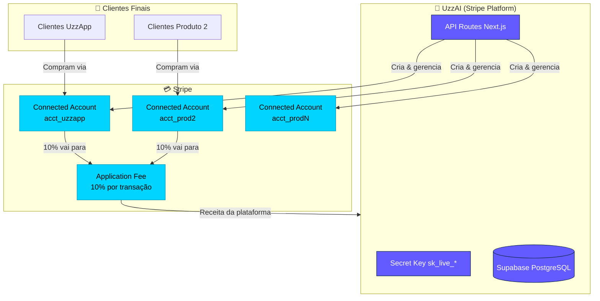
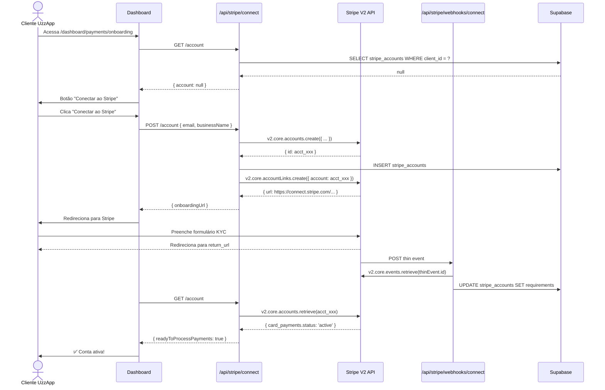
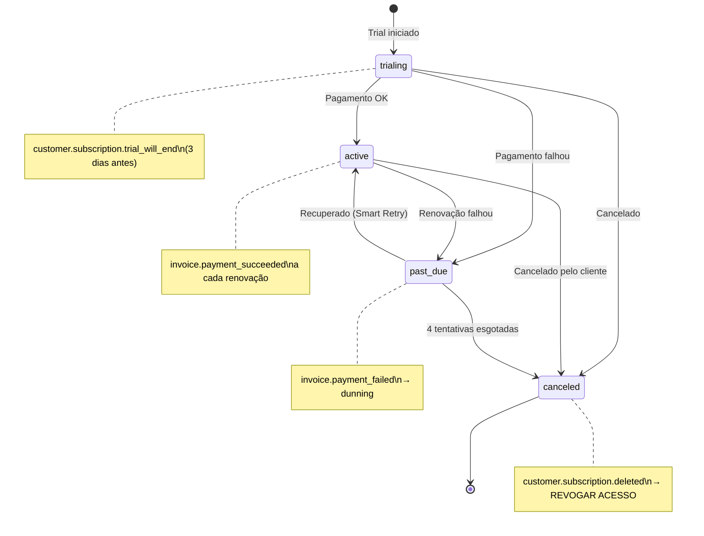
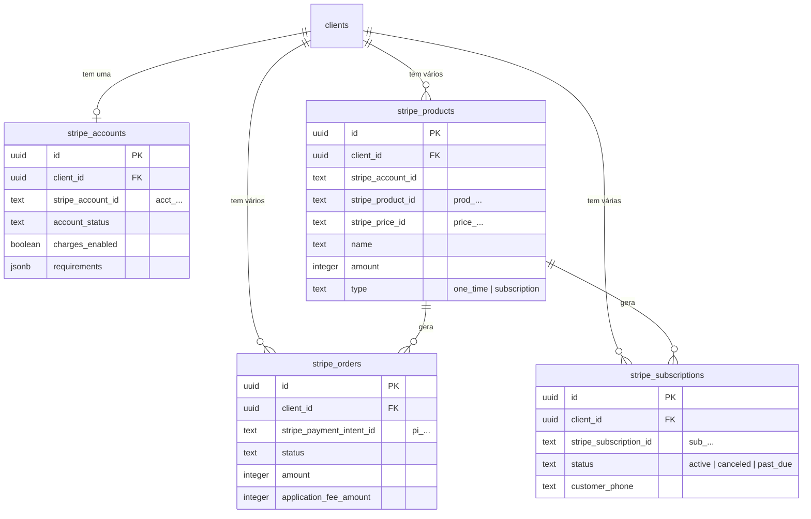

# Stripe Connect — Plano de Integração Completo

> **Versão:** 2.0
> **Data:** 10/03/2026
> **Contexto:** Integração Stripe Connect na plataforma UzzAI (ChatBot-Oficial)
> **Status:** Planejamento finalizado — pronto para implementação

---

## Índice

1. [Decisão de Arquitetura: Onde vive o código Stripe](#1-decisão-de-arquitetura-onde-vive-o-código-stripe)
2. [Visão Estratégica: Multi-Produto](#2-visão-estratégica-multi-produto)
3. [Estrutura de Pastas — Definitiva](#3-estrutura-de-pastas--definitiva)
4. [Arquitetura: Stripe Platform vs Connect](#4-arquitetura-stripe-platform-vs-connect)
5. [Variáveis de Ambiente e Instalação](#5-variáveis-de-ambiente-e-instalação)
6. [Fase 1 — Migration do Banco de Dados](#6-fase-1--migration-do-banco-de-dados)
7. [Fase 2 — Biblioteca Core Stripe](#7-fase-2--biblioteca-core-stripe)
8. [Fase 3 — API Routes](#8-fase-3--api-routes)
9. [Fase 4 — Dashboard (Painel do Cliente)](#9-fase-4--dashboard-painel-do-cliente)
10. [Fase 5 — Storefront Público](#10-fase-5--storefront-público)
11. [Fase 6 — Componentes](#11-fase-6--componentes)
12. [Fase 7 — Modificações Existentes](#12-fase-7--modificações-existentes)
13. [Arquitetura de Cobranças](#13-arquitetura-de-cobranças)
14. [Webhooks: V1 e V2](#14-webhooks-v1-e-v2)
15. [Fluxos Completos (Diagramas)](#15-fluxos-completos-diagramas)
16. [Checklist de Go-Live](#16-checklist-de-go-live)
17. [Insights da Reunião Stripe (23/02/2026)](#17-insights-da-reunião-stripe-23022026)
18. [Pós-Implementação: Documentos a Criar](#18-pós-implementação-documentos-a-criar)

---

## 1. Decisão de Arquitetura: Onde vive o código Stripe

### Contexto da decisão

Este repositório (`ChatBot-Oficial`) é o produto UzzApp — um chatbot WhatsApp SaaS. A integração Stripe está sendo construída aqui por ser o projeto ativo, mas o **código Stripe pertence à plataforma UzzAI**, não ao chatbot.

### Estratégia adotada: Modular dentro de `src/`, extração futura simples

O código Stripe fica **dentro de `src/`** por ser um projeto Next.js (que exige rotas em `src/app/`), mas **totalmente isolado** em subpastas próprias. Nenhum arquivo Stripe toca código de chatbot e vice-versa.

```
Hoje (MVP):
  ChatBot-Oficial/src/app/api/stripe/   ← código Stripe aqui, isolado
  ChatBot-Oficial/src/lib/stripe*.ts    ← lib Stripe aqui, isolada

Futuro (quando tiver 2º produto):
  uzzai-platform/                       ← novo repo
  └── copiar as pastas stripe de src/   ← extração simples, sem reescrita
```

### Por que NÃO criamos um `stripe-module/` separado agora

Foi considerada uma pasta raiz `stripe-module/` independente de `src/`, com rotas finas em `src/app/api/stripe/` apenas importando de lá. Decisão: **não vale a complexidade agora**.

- Adiciona indireção (handler → re-export → route) sem benefício imediato
- Next.js funciona naturalmente com tudo em `src/`
- A extração futura é igualmente simples copiando as pastas identificadas

### Convenção obrigatória em todos os arquivos Stripe

Todo arquivo pertencente ao módulo Stripe deve ter este comentário no topo:

```typescript
// @stripe-module
// Este arquivo pertence ao módulo de pagamentos Stripe.
// Para extrair para repositório próprio, copiar:
//   src/lib/stripe.ts, src/lib/stripe-connect.ts
//   src/app/api/stripe/
//   src/app/dashboard/payments/
//   src/app/store/
//   src/components/Stripe*.tsx, ProductCard.tsx, ProductForm.tsx, SubscriptionsList.tsx
```

---

## 2. Visão Estratégica: Multi-Produto

### A pergunta certa: preciso repetir essa integração para cada produto?

**Resposta: NÃO.** A integração é feita uma única vez na plataforma. Cada produto ou cliente vira uma "conta conectada" (Connected Account). O código é 100% reutilizável.

### Como funciona o modelo

```
UzzAI (Stripe Platform Account — sua conta mestre)
├── UzzApp       → Connected Account (acct_uzzapp)
├── Produto 2    → Connected Account (acct_prod2)
├── Produto 3    → Connected Account (acct_prod3)
└── Produto N    → Connected Account (acct_prodN)
```

Para adicionar um novo produto no futuro:
1. Criar um Connected Account via API — **já está no código**
2. Fazer o onboarding — **já está no código**
3. Criar produtos/preços na conta — **já está no código**
4. Apontar o storefront para o `slug` correto — **já está no código**

Custo de adicionar o Produto 2: praticamente zero em código.

### Como o outro repositório se conecta a este

Quando existir um segundo produto em outro repo, ele tem duas opções:

**Opção A — Delegar para esta plataforma (recomendado):**
```
Produto 2 → POST https://chat.luisfboff.com/api/stripe/checkout
           → recebe { url: 'https://checkout.stripe.com/...' }
```
Sem nenhuma chave Stripe no outro repo.

**Opção B — Stripe próprio apontando para a mesma conta:**
```typescript
// No outro repo — mesma STRIPE_SECRET_KEY, diferente stripeAccount
const stripe = new Stripe(process.env.STRIPE_SECRET_KEY) // mesma chave
stripe.checkout.sessions.create({ ... }, { stripeAccount: 'acct_xxx' })
```

### Como encontrar o `stripe_account_id` de um cliente

```sql
-- Via Supabase
SELECT stripe_account_id FROM stripe_accounts WHERE client_id = 'uuid-do-cliente';
```

```bash
# Via API deste repo
GET /api/stripe/connect/account
Authorization: Bearer <token>
```

```
# Via Stripe Dashboard
Stripe Dashboard → Connect → Accounts → clicar na conta → URL contém acct_xxx
```

---

## 3. Estrutura de Pastas — Definitiva

```
src/
│
├── lib/
│   ├── supabase.ts              ← chatbot
│   ├── vault.ts                 ← chatbot
│   ├── config.ts                ← chatbot
│   ├── stripe.ts                ← @stripe-module  ← COPIAR
│   └── stripe-connect.ts        ← @stripe-module  ← COPIAR
│
├── app/
│   ├── api/
│   │   ├── webhook/             ← chatbot (WhatsApp)
│   │   ├── config/              ← chatbot
│   │   ├── knowledge/           ← chatbot
│   │   └── stripe/              ← @stripe-module  ← COPIAR PASTA INTEIRA
│   │       ├── connect/
│   │       │   ├── account/route.ts
│   │       │   ├── account-link/route.ts
│   │       │   └── products/
│   │       │       ├── route.ts
│   │       │       └── [id]/route.ts
│   │       ├── checkout/route.ts
│   │       ├── billing-portal/route.ts
│   │       └── webhooks/
│   │           ├── route.ts          ← V1 eventos de assinatura
│   │           └── connect/route.ts  ← V2 thin events
│   │
│   ├── dashboard/
│   │   ├── flow-architecture/   ← chatbot
│   │   ├── knowledge/           ← chatbot
│   │   ├── debug/               ← chatbot
│   │   └── payments/            ← @stripe-module  ← COPIAR PASTA INTEIRA
│   │       ├── page.tsx
│   │       ├── onboarding/page.tsx
│   │       └── products/page.tsx
│   │
│   └── store/                   ← @stripe-module  ← COPIAR PASTA INTEIRA
│       └── [clientSlug]/
│           ├── page.tsx
│           ├── [productId]/page.tsx
│           ├── success/page.tsx
│           └── cancel/page.tsx
│
└── components/
    ├── DashboardNavigation.tsx  ← chatbot (modificar — adicionar item)
    ├── ConversationTable.tsx    ← chatbot
    ├── StripeOnboardingCard.tsx ← @stripe-module  ← COPIAR
    ├── ProductCard.tsx          ← @stripe-module  ← COPIAR
    ├── ProductForm.tsx          ← @stripe-module  ← COPIAR
    └── SubscriptionsList.tsx    ← @stripe-module  ← COPIAR
```

**Regra de ouro:** Nenhum arquivo `← chatbot` importa algo `← @stripe-module` e vice-versa. A única exceção é `DashboardNavigation.tsx` que recebe um link `/dashboard/payments` — apenas uma string, sem dependência de código.

---

## 4. Arquitetura: Stripe Platform vs Connect



**Modelo de receita:**
- Cada venda dos clientes → você recebe `application_fee_amount` automaticamente
- Configurável via `STRIPE_APPLICATION_FEE_PERCENT=10`
- Stripe deposita direto na conta platform, sem ação manual

---

## 5. Variáveis de Ambiente e Instalação

### Instalar dependências

```bash
npm install stripe@latest @stripe/stripe-js
```

### Adicionar ao `.env.local`

```env
# ============================================================
# STRIPE — Plataforma (conta mestre UzzAI)
# ============================================================

# Chave secreta — NUNCA expor no frontend
# Obter em: https://dashboard.stripe.com/apikeys
STRIPE_SECRET_KEY=sk_live_...
# PLACEHOLDER: Substitua pela chave secreta do Stripe Dashboard

# Chave pública — segura para o frontend
# Obter em: https://dashboard.stripe.com/apikeys
NEXT_PUBLIC_STRIPE_PUBLISHABLE_KEY=pk_live_...
# PLACEHOLDER: Substitua pela chave pública do Stripe Dashboard

# Secret webhooks V1 (eventos de assinatura padrão)
# Obter em: Stripe Dashboard > Developers > Webhooks > endpoint > Signing secret
STRIPE_WEBHOOK_SECRET=whsec_...
# PLACEHOLDER: Gerado ao criar o endpoint de webhook V1

# Secret webhooks V2 (thin events — contas conectadas)
# Obter em: Stripe Dashboard > Developers > Webhooks > Connected accounts > Signing secret
STRIPE_CONNECT_WEBHOOK_SECRET=whsec_...
# PLACEHOLDER: Gerado ao criar o endpoint de webhook V2

# Taxa de plataforma em % aplicada em cada transação
STRIPE_APPLICATION_FEE_PERCENT=10

# URL base da aplicação — usado em return_url, success_url, etc.
NEXT_PUBLIC_APP_URL=https://chat.luisfboff.com
```

> **Erro explícito se não configurado:**
> ```
> Error: STRIPE_SECRET_KEY is not configured.
> Add it to your .env.local file.
> Get your key at https://dashboard.stripe.com/apikeys
> ```

---

## 6. Fase 1 — Migration do Banco de Dados

### Por que precisamos do banco?

O Stripe armazena tudo internamente. O banco de dados é para **você**:

| Tabela | Por que precisa |
|--------|-----------------|
| `stripe_accounts` | Saber qual `acct_xxx` pertence a qual cliente. Sem isso, não há como saber de quem é cada conta conectada. |
| `stripe_products` | Listar produtos no dashboard e storefront sem chamar a API do Stripe a cada request. |
| `stripe_subscriptions` | Saber quem está ativo, cancelado, em trial — para liberar ou bloquear acesso. |
| `stripe_orders` | Histórico de compras únicas. |
| `webhook_events` | Idempotência: evitar processar o mesmo evento duas vezes (Stripe reenvia por até 3 dias). |

### Criar a migration

```bash
supabase migration new stripe_connect
# Editar supabase/migrations/TIMESTAMP_stripe_connect.sql
supabase db push
```

### Tabelas

#### `stripe_accounts` — Conta conectada por cliente

```sql
CREATE TABLE IF NOT EXISTS public.stripe_accounts (
  id                      UUID        DEFAULT gen_random_uuid() PRIMARY KEY,
  client_id               UUID        NOT NULL REFERENCES public.clients(id) ON DELETE CASCADE,
  stripe_account_id       TEXT        NOT NULL UNIQUE,    -- acct_...
  account_status          TEXT        NOT NULL DEFAULT 'pending'
                          CHECK (account_status IN ('pending','onboarding','active','restricted','disabled')),
  charges_enabled         BOOLEAN     NOT NULL DEFAULT false,
  payouts_enabled         BOOLEAN     NOT NULL DEFAULT false,
  details_submitted       BOOLEAN     NOT NULL DEFAULT false,
  country                 TEXT        NOT NULL DEFAULT 'BR',
  currency                TEXT        NOT NULL DEFAULT 'brl',
  requirements            JSONB       DEFAULT '[]'::jsonb, -- atualizado via V2 thin events
  metadata                JSONB       DEFAULT '{}'::jsonb,
  created_at              TIMESTAMPTZ NOT NULL DEFAULT NOW(),
  updated_at              TIMESTAMPTZ NOT NULL DEFAULT NOW(),
  UNIQUE(client_id)       -- um Connected Account por cliente
);
```

**RLS:** Clientes veem apenas a própria conta. `service_role` acesso total.

---

#### `stripe_products` — Produtos nas contas conectadas

```sql
CREATE TABLE IF NOT EXISTS public.stripe_products (
  id                    UUID        DEFAULT gen_random_uuid() PRIMARY KEY,
  client_id             UUID        NOT NULL REFERENCES public.clients(id) ON DELETE CASCADE,
  stripe_account_id     TEXT        NOT NULL,             -- acct_... (denormalizado)
  stripe_product_id     TEXT        NOT NULL,             -- prod_...
  stripe_price_id       TEXT,                             -- price_... (preço padrão)
  name                  TEXT        NOT NULL,
  description           TEXT,
  type                  TEXT        NOT NULL DEFAULT 'one_time'
                        CHECK (type IN ('one_time', 'subscription')),
  amount                INTEGER     NOT NULL,             -- em centavos
  currency              TEXT        NOT NULL DEFAULT 'brl',
  interval              TEXT        CHECK (interval IN ('month', 'year', NULL)),
  active                BOOLEAN     NOT NULL DEFAULT true,
  created_at            TIMESTAMPTZ NOT NULL DEFAULT NOW(),
  updated_at            TIMESTAMPTZ NOT NULL DEFAULT NOW()
);
```

**RLS:** Clientes gerenciam seus produtos. `anon` pode ler produtos ativos (storefront público).

---

#### `stripe_subscriptions` — Assinaturas sincronizadas via webhook

```sql
CREATE TABLE IF NOT EXISTS public.stripe_subscriptions (
  id                        UUID        DEFAULT gen_random_uuid() PRIMARY KEY,
  client_id                 UUID        NOT NULL REFERENCES public.clients(id) ON DELETE CASCADE,
  stripe_account_id         TEXT        NOT NULL,
  stripe_subscription_id    TEXT        NOT NULL UNIQUE,  -- sub_...
  stripe_customer_id        TEXT        NOT NULL,         -- cus_...
  stripe_price_id           TEXT        NOT NULL,
  product_id                UUID        REFERENCES public.stripe_products(id),
  status                    TEXT        NOT NULL,         -- active, canceled, past_due, trialing
  customer_email            TEXT,
  customer_name             TEXT,
  customer_phone            TEXT,                        -- para vincular ao WhatsApp
  current_period_start      TIMESTAMPTZ,
  current_period_end        TIMESTAMPTZ,
  cancel_at_period_end      BOOLEAN     DEFAULT false,
  canceled_at               TIMESTAMPTZ,
  created_at                TIMESTAMPTZ NOT NULL DEFAULT NOW(),
  updated_at                TIMESTAMPTZ NOT NULL DEFAULT NOW()
);
```

---

#### `stripe_orders` — Pedidos únicos (direct charges)

```sql
CREATE TABLE IF NOT EXISTS public.stripe_orders (
  id                        UUID        DEFAULT gen_random_uuid() PRIMARY KEY,
  client_id                 UUID        NOT NULL REFERENCES public.clients(id) ON DELETE CASCADE,
  stripe_account_id         TEXT        NOT NULL,
  stripe_payment_intent_id  TEXT        NOT NULL UNIQUE,  -- pi_...
  stripe_session_id         TEXT,                         -- cs_...
  product_id                UUID        REFERENCES public.stripe_products(id),
  status                    TEXT        NOT NULL,          -- pending, succeeded, failed
  amount                    INTEGER     NOT NULL,
  application_fee_amount    INTEGER,                      -- taxa da plataforma
  currency                  TEXT        NOT NULL DEFAULT 'brl',
  customer_email            TEXT,
  customer_name             TEXT,
  customer_phone            TEXT,
  created_at                TIMESTAMPTZ NOT NULL DEFAULT NOW(),
  updated_at                TIMESTAMPTZ NOT NULL DEFAULT NOW()
);
```

---

#### `webhook_events` — Idempotência de webhooks

```sql
CREATE TABLE IF NOT EXISTS public.webhook_events (
  id                UUID        DEFAULT gen_random_uuid() PRIMARY KEY,
  stripe_event_id   TEXT        NOT NULL UNIQUE,   -- event.id do Stripe (chave de deduplicação)
  event_type        TEXT        NOT NULL,
  status            TEXT        NOT NULL DEFAULT 'received'
                    CHECK (status IN ('received', 'processing', 'processed', 'failed')),
  error_message     TEXT,
  processed_at      TIMESTAMPTZ,
  created_at        TIMESTAMPTZ NOT NULL DEFAULT NOW()
);
```

> **Por que crítico:** Stripe reenvia webhooks automaticamente por até 3 dias em caso de falha. Sem esta tabela, um cliente pode ser cobrado em duplicata ou ter acesso liberado incorretamente. A constraint `UNIQUE` em `stripe_event_id` garante que o mesmo evento nunca seja processado duas vezes.

---

## 7. Fase 2 — Biblioteca Core Stripe

### `src/lib/stripe.ts`

```typescript
// @stripe-module
// Este arquivo pertence ao módulo de pagamentos Stripe.

import Stripe from 'stripe'

if (!process.env.STRIPE_SECRET_KEY) {
  throw new Error(
    'STRIPE_SECRET_KEY is not configured. ' +
    'Add it to your .env.local file. ' +
    'Get your key at https://dashboard.stripe.com/apikeys'
  )
}

// Singleton — mesma instância em toda a aplicação
// Versão da API usada automaticamente pelo SDK (2026-02-25.clover)
export const stripeClient = new Stripe(process.env.STRIPE_SECRET_KEY)

// Construir evento V1 a partir de webhook (valida assinatura)
export const constructWebhookEvent = (
  rawBody: string,
  signature: string,
  secret: string
): Stripe.Event =>
  stripeClient.webhooks.constructEvent(rawBody, signature, secret)
```

---

### `src/lib/stripe-connect.ts`

```typescript
// @stripe-module
// Este arquivo pertence ao módulo de pagamentos Stripe.

// Funções puras — functional style, sem classes, seguindo padrão do projeto

// Criar Connected Account (V2 API)
export const createConnectedAccount = async (params: {
  clientId: string
  email: string
  businessName: string
}): Promise<{ stripeAccountId: string }> => {
  const account = await stripeClient.v2.core.accounts.create({
    display_name: params.businessName,
    contact_email: params.email,
    identity: { country: 'us' },
    dashboard: 'full',
    defaults: {
      responsibilities: {
        fees_collector: 'stripe',
        losses_collector: 'stripe',
      },
    },
    configuration: {
      customer: {},
      merchant: {
        capabilities: { card_payments: { requested: true } },
      },
    },
  })

  const supabase = createServiceClient()
  await supabase.from('stripe_accounts').insert({
    client_id: params.clientId,
    stripe_account_id: account.id,
    account_status: 'pending',
  })

  return { stripeAccountId: account.id }
}

// Gerar link de onboarding
export const createAccountLink = async (params: {
  stripeAccountId: string
  returnUrl: string
  refreshUrl: string
}): Promise<{ url: string }> => {
  const accountLink = await stripeClient.v2.core.accountLinks.create({
    account: params.stripeAccountId,
    use_case: {
      type: 'account_onboarding',
      account_onboarding: {
        configurations: ['merchant', 'customer'],
        refresh_url: params.refreshUrl,
        return_url: params.returnUrl,
      },
    },
  })
  return { url: accountLink.url }
}

// Status da conta — sempre busca direto da API Stripe, não do banco
export const getAccountStatus = async (stripeAccountId: string) => {
  const account = await stripeClient.v2.core.accounts.retrieve(stripeAccountId, {
    include: ['configuration.merchant', 'requirements'],
  })

  const readyToProcessPayments =
    account?.configuration?.merchant?.capabilities?.card_payments?.status === 'active'

  const requirementsStatus = account.requirements?.summary?.minimum_deadline?.status
  const onboardingComplete =
    requirementsStatus !== 'currently_due' && requirementsStatus !== 'past_due'

  return { readyToProcessPayments, onboardingComplete, requirementsStatus }
}

// Criar produto na conta conectada (header Stripe-Account)
export const createProductOnConnectedAccount = async (params: {
  stripeAccountId: string
  name: string
  description?: string
  amountCentavos: number
  currency: string
  type: 'one_time' | 'subscription'
  interval?: 'month' | 'year'
}) => {
  return stripeClient.products.create(
    {
      name: params.name,
      description: params.description,
      default_price_data: {
        unit_amount: params.amountCentavos,
        currency: params.currency,
        ...(params.type === 'subscription' && params.interval
          ? { recurring: { interval: params.interval } }
          : {}),
      },
    },
    { stripeAccount: params.stripeAccountId }
  )
}

// Listar produtos de uma conta conectada
export const listProductsFromConnectedAccount = async (stripeAccountId: string) => {
  const products = await stripeClient.products.list(
    { limit: 20, active: true, expand: ['data.default_price'] },
    { stripeAccount: stripeAccountId }
  )
  return products.data
}
```

---

## 8. Fase 3 — API Routes

Todas seguem o padrão do projeto: `export const dynamic = 'force-dynamic'`, auth via `createServerClient()`, lookup `client_id` via `user_profiles`, try-catch, HTTP status codes.

### Mapa de rotas

| Rota | Método | Auth | Propósito |
|------|--------|------|-----------|
| `/api/stripe/connect/account` | GET | ✅ | Status da conta conectada |
| `/api/stripe/connect/account` | POST | ✅ | Criar conta conectada |
| `/api/stripe/connect/account-link` | POST | ✅ | Gerar URL de onboarding |
| `/api/stripe/connect/products` | GET | ✅ | Listar produtos |
| `/api/stripe/connect/products` | POST | ✅ | Criar produto |
| `/api/stripe/connect/products/[id]` | PUT | ✅ | Atualizar produto |
| `/api/stripe/connect/products/[id]` | DELETE | ✅ | Arquivar produto |
| `/api/stripe/checkout` | POST | ❌ público | Criar sessão de checkout |
| `/api/stripe/billing-portal` | POST | ❌ público | Criar sessão do portal |
| `/api/stripe/webhooks` | POST | ❌ Stripe | V1 — eventos de assinatura |
| `/api/stripe/webhooks/connect` | POST | ❌ Stripe | V2 thin events |

---

### Padrão crítico — Webhook V1

```typescript
// @stripe-module
export const dynamic = 'force-dynamic'

export async function POST(request: NextRequest) {
  // ⚠️ CRÍTICO: corpo RAW obrigatório — request.json() quebra a validação
  const rawBody = await request.text()
  const signature = request.headers.get('stripe-signature')

  if (!signature) {
    return NextResponse.json({ error: 'No signature' }, { status: 400 })
  }

  let event: Stripe.Event
  try {
    event = constructWebhookEvent(rawBody, signature, process.env.STRIPE_WEBHOOK_SECRET!)
  } catch (err) {
    return NextResponse.json({ error: 'Invalid signature' }, { status: 400 })
  }

  // ⚠️ Idempotência — checar antes de processar
  const supabase = createServiceClient()
  const { data: existing } = await supabase
    .from('webhook_events')
    .select('id')
    .eq('stripe_event_id', event.id)
    .single()

  if (existing) {
    return NextResponse.json({ received: true, duplicate: true })
  }

  await supabase.from('webhook_events').insert({
    stripe_event_id: event.id,
    event_type: event.type,
    status: 'processing',
  })

  switch (event.type) {
    case 'checkout.session.completed':
      await handleCheckoutCompleted(event.data.object as Stripe.Checkout.Session)
      break
    case 'customer.subscription.updated':
      await handleSubscriptionUpdated(event.data.object as Stripe.Subscription)
      break
    case 'customer.subscription.deleted':
      await handleSubscriptionDeleted(event.data.object as Stripe.Subscription)
      break
    case 'invoice.payment_succeeded':
      await handleInvoicePaid(event.data.object as Stripe.Invoice)
      break
    case 'invoice.payment_failed':
      await handleInvoicePaymentFailed(event.data.object as Stripe.Invoice)
      break
  }

  await supabase
    .from('webhook_events')
    .update({ status: 'processed', processed_at: new Date().toISOString() })
    .eq('stripe_event_id', event.id)

  // ⚠️ Sempre 200 — Stripe para de retentar ao receber 200
  return NextResponse.json({ received: true })
}
```

---

### Webhook V2 Thin Events

```typescript
// @stripe-module
export const dynamic = 'force-dynamic'

export async function POST(request: NextRequest) {
  const rawBody = await request.text()
  const signature = request.headers.get('stripe-signature')!

  let thinEvent: Stripe.ThinEvent
  try {
    thinEvent = stripeClient.parseThinEvent(
      rawBody, signature, process.env.STRIPE_CONNECT_WEBHOOK_SECRET!
    )
  } catch (err) {
    return NextResponse.json({ error: 'Invalid signature' }, { status: 400 })
  }

  // Thin events não têm payload completo — buscar evento completo
  const event = await stripeClient.v2.core.events.retrieve(thinEvent.id)

  switch (event.type) {
    case 'v2.core.account[requirements].updated':
      await syncAccountRequirements((event.data as any).account_id)
      break
    case 'v2.core.account[configuration.merchant].capability_status_updated':
      await syncAccountCapabilities((event.data as any).account_id)
      break
    case 'v2.core.account[configuration.customer].capability_status_updated':
      await syncAccountCapabilities((event.data as any).account_id)
      break
  }

  return NextResponse.json({ received: true })
}
```

---

## 9. Fase 4 — Dashboard (Painel do Cliente)

```
/dashboard/payments              → Visão geral: tabs com onboarding, produtos, pedidos, assinaturas
/dashboard/payments/onboarding   → Fluxo de conexão/reconexão Stripe
/dashboard/payments/products     → Gerenciar catálogo de produtos
```

### Lógica de status no onboarding

```
Sem conta      → botão "Conectar ao Stripe"
pending        → "Conta criada, aguardando onboarding"
onboarding     → "Onboarding em andamento — clique para continuar"
active         → "✅ Pronto para receber pagamentos"
restricted     → "⚠️ Conta com restrições — verificar requisitos"
```

---

## 10. Fase 5 — Storefront Público

```
/store/[clientSlug]                → Lista produtos ativos
/store/[clientSlug]/[productId]    → Detalhe + botão Comprar
/store/[clientSlug]/success        → Confirmação pós-compra
/store/[clientSlug]/cancel         → Checkout cancelado
```

> **Nota importante:** A URL usa `clientSlug` por questões de UX. Nunca exponha `stripe_account_id` diretamente na URL. O mapeamento slug → accountId fica na tabela `clients`.

### Checkout público (direct charge)

```typescript
// @stripe-module
// Rota pública — sem auth — chamada pelo storefront

export async function POST(request: NextRequest) {
  const { productId, clientSlug } = await request.json()

  const supabase = createServiceClient()
  const { data: product } = await supabase
    .from('stripe_products')
    .select('*, clients!inner(slug)')
    .eq('id', productId)
    .eq('clients.slug', clientSlug)
    .single()

  const feePercent = Number(process.env.STRIPE_APPLICATION_FEE_PERCENT || 10)
  const feeAmount = Math.floor(product.amount * feePercent / 100)

  const session = await stripeClient.checkout.sessions.create(
    {
      mode: product.type === 'subscription' ? 'subscription' : 'payment',
      line_items: [{ price: product.stripe_price_id, quantity: 1 }],
      payment_intent_data: product.type === 'one_time' ? {
        application_fee_amount: feeAmount,
        transfer_data: { destination: product.stripe_account_id },
      } : undefined,
      subscription_data: product.type === 'subscription' ? {
        application_fee_percent: feePercent,
        transfer_data: { destination: product.stripe_account_id },
      } : undefined,
      success_url: `${process.env.NEXT_PUBLIC_APP_URL}/store/${clientSlug}/success?session_id={CHECKOUT_SESSION_ID}`,
      cancel_url: `${process.env.NEXT_PUBLIC_APP_URL}/store/${clientSlug}/cancel`,
    },
    { stripeAccount: product.stripe_account_id }
  )

  return NextResponse.json({ url: session.url })
}
```

---

## 11. Fase 6 — Componentes

| Componente | Arquivo | Propósito |
|------------|---------|-----------|
| `StripeOnboardingCard` | `src/components/StripeOnboardingCard.tsx` | Status da conta + requisitos + botão onboarding |
| `ProductCard` | `src/components/ProductCard.tsx` | Card de produto no storefront |
| `ProductForm` | `src/components/ProductForm.tsx` | Modal criar/editar produto no dashboard |
| `SubscriptionsList` | `src/components/SubscriptionsList.tsx` | Tabela de assinaturas com status badges |

Todos com `// @stripe-module` no topo.

---

## 12. Fase 7 — Modificações Existentes

### `src/components/DashboardNavigation.tsx`

Adicionar no grupo de navegação:

```typescript
import { CreditCard } from 'lucide-react'

{
  href: '/dashboard/payments',
  icon: <CreditCard className="h-5 w-5 flex-shrink-0" />,
  label: 'Pagamentos',
  tooltip: 'Stripe Connect — produtos, checkout e assinaturas',
}
```

---

## 13. Arquitetura de Cobranças

### Direct Charge — pagamento único

```
Cliente final paga R$ 100
├── R$ 90 → conta conectada (cliente seu)
└── R$ 10 → UzzAI (application fee 10%)
```

```typescript
stripeClient.checkout.sessions.create(
  {
    mode: 'payment',
    payment_intent_data: {
      application_fee_amount: 1000, // 10% de R$100
      transfer_data: { destination: 'acct_xxx' },
    },
  },
  { stripeAccount: 'acct_xxx' }
)
```

### Subscription com taxa recorrente

```typescript
stripeClient.checkout.sessions.create(
  {
    mode: 'subscription',
    subscription_data: {
      application_fee_percent: 10, // 10% de cada cobrança
      transfer_data: { destination: 'acct_xxx' },
    },
  },
  { stripeAccount: 'acct_xxx' }
)
```

### Billing Portal

```typescript
// Para contas V2: usar customer_account (acct_), NÃO customer (cus_)
const session = await stripeClient.billingPortal.sessions.create(
  {
    customer_account: 'acct_xxx',
    return_url: `${process.env.NEXT_PUBLIC_APP_URL}/dashboard`,
  },
  { stripeAccount: 'acct_xxx' }
)
```

---

## 14. Webhooks: V1 e V2

### Dois endpoints, dois registros no Stripe Dashboard

| Tipo | Endpoint | Onde registrar |
|------|----------|----------------|
| V1 Standard | `/api/stripe/webhooks` | Stripe Dashboard → Webhooks |
| V2 Thin Events | `/api/stripe/webhooks/connect` | Stripe Dashboard → Webhooks → Connected Accounts |

### Desenvolvimento local

```bash
# V1 — assinaturas
stripe listen --forward-to localhost:3000/api/stripe/webhooks

# V2 — thin events (contas conectadas)
stripe listen \
  --thin-events 'v2.core.account[requirements].updated,v2.core.account[configuration.merchant].capability_status_updated,v2.core.account[configuration.customer].capability_status_updated' \
  --forward-thin-to localhost:3000/api/stripe/webhooks/connect
```

### Eventos V1 necessários

| Evento | Ação |
|--------|------|
| `checkout.session.completed` | Criar pedido ou assinatura inicial |
| `customer.subscription.created` | Nova assinatura — liberar acesso |
| `customer.subscription.updated` | Mudança de plano, pausa, reativação |
| `customer.subscription.deleted` | **REVOGAR ACESSO** |
| `customer.subscription.trial_will_end` | Enviar email 3 dias antes do trial acabar |
| `invoice.payment_succeeded` | Renovação OK — manter acesso |
| `invoice.payment_failed` | Renovação falhou — iniciar dunning |
| `charge.dispute.created` | Chargeback — investigar |

### Regras críticas

1. **Corpo RAW** — `request.text()` antes de qualquer coisa
2. **Responder 200 em < 500ms** — não fazer processamento pesado no handler
3. **Idempotência** — checar `webhook_events` antes de processar
4. **Nunca confiar no frontend** — confirmação autoritativa vem sempre do webhook

### Dunning (Smart Retries)

```
Tentativa 1: No vencimento
Tentativa 2: +3 dias  → email: falha de pagamento
Tentativa 3: +8 dias  → suspender acesso parcial
Tentativa 4: +15 dias → suspender acesso total
Cancelamento: após 4 falhas → customer.subscription.deleted → REVOGAR
```

Configurar: Stripe Dashboard → Settings → Billing → Subscriptions → Smart Retries

---

## 15. Fluxos Completos (Diagramas)

### Onboarding de Conta Conectada



---

### Ciclo de Vida de Assinatura



---

### Modelo de Dados



---

## 16. Checklist de Go-Live

### Stripe Dashboard

- [ ] Conta em modo **live**
- [ ] Chaves trocadas: `sk_test_` → `sk_live_`, `pk_test_` → `pk_live_`
- [ ] Endpoint V1 registrado (HTTPS)
- [ ] Endpoint V2 Connect registrado
- [ ] Signing secrets configurados nas variáveis de ambiente
- [ ] Smart Retries configurado (4 tentativas)

### Código

- [ ] `request.text()` antes de qualquer parse nos webhooks
- [ ] Validação de assinatura em ambos os endpoints
- [ ] Idempotência via `webhook_events`
- [ ] Resposta 200 em < 500ms
- [ ] Comentário `// @stripe-module` em todos os arquivos

### Banco

- [ ] Migration aplicada (`supabase db push`)
- [ ] RLS testada (isolamento entre clientes)
- [ ] Política `anon` para produtos ativos (storefront)

### Testes

- [ ] Connected Account criado e onboarding completo
- [ ] Produto criado na conta conectada
- [ ] Compra de teste realizada (R$ 1,00)
- [ ] Taxa de plataforma coletada
- [ ] Webhook `checkout.session.completed` processado
- [ ] Portal de assinatura funcionando

---

## 17. Insights da Reunião Stripe (23/02/2026)

> Nicolas Cardozo (Dev. Help) + Juan Gomez (Account Executive)

### Decisões

| Decisão | Detalhes |
|---------|----------|
| Stripe Checkout para MVP | Mais rápido, menos código, sem UI de pagamento própria |
| Payment Element para V2 | Quando precisar de controle total de UX |
| PIX apenas one-time | Sem suporte a recorrência automática |
| Cartão para assinaturas | Único método com recorrência |

### Red flags de Nicolas

> *"Integrar Stripe é simples. AUTOMATIZAR via webhooks é a parte difícil."*

1. **Webhooks sem idempotência** → cobranças duplicadas, acesso liberado incorretamente
2. **Body parseado no webhook** → `request.json()` antes de validar quebra a assinatura
3. **Mistura de chaves test/live** → usar variáveis separadas por ambiente

### Cartões de teste

| Situação | Número |
|----------|--------|
| Pagamento válido | `4242 4242 4242 4242` |
| 3D Secure | `4000 0025 0000 3155` |
| Cartão recusado | `4000 0000 0000 9995` |

---

## 18. Pós-Implementação: Documentos a Criar

> **Atenção:** Os documentos abaixo devem ser criados **após a implementação estar completa e funcional**, não antes. Eles documentam o que foi feito, não o que será feito.

---

### Documento 1 — `docs/STRIPE_EXTRACTION_GUIDE.md`

**Quando criar:** Ao finalizar a implementação completa.

**Conteúdo esperado:**

```markdown
# Guia de Extração do Módulo Stripe

Este documento descreve exatamente o que copiar deste repositório
para criar um repositório independente de pagamentos UzzAI.

## O que copiar

### Pastas completas (copiar inteiro)
- src/app/api/stripe/
- src/app/dashboard/payments/
- src/app/store/
- supabase/migrations/ (apenas as migrations stripe_*)

### Arquivos individuais
- src/lib/stripe.ts
- src/lib/stripe-connect.ts
- src/components/StripeOnboardingCard.tsx
- src/components/ProductCard.tsx
- src/components/ProductForm.tsx
- src/components/SubscriptionsList.tsx

## O que NÃO copiar
- src/app/api/webhook/       (WhatsApp — chatbot)
- src/flows/                  (chatbot)
- src/nodes/                  (chatbot)
- src/lib/vault.ts            (chatbot)
- qualquer coisa sem @stripe-module

## Dependências necessárias no novo repo
- stripe
- @stripe/stripe-js
- next (App Router)
- @supabase/supabase-js

## Variáveis de ambiente necessárias
(lista das vars da seção 5 deste documento)

## Ajustes após a cópia
- Atualizar imports relativos que apontavam para src/lib/supabase
- Criar novo projeto Supabase ou reutilizar o existente
- Registrar novos endpoints de webhook no Stripe Dashboard
```

---

### Documento 2 — `docs/STRIPE_MIGRATIONS.md`

**Quando criar:** Ao finalizar e aplicar as migrations com `supabase db push`.

**Conteúdo esperado:**

```markdown
# Migrations Stripe — Registro Completo

## Migration: stripe_connect
Arquivo: supabase/migrations/TIMESTAMP_stripe_connect.sql
Aplicada em: DD/MM/AAAA
Status: ✅ Aplicada em produção

### Tabelas criadas
- stripe_accounts     — conta conectada por cliente
- stripe_products     — produtos nas contas conectadas
- stripe_subscriptions — assinaturas sincronizadas via webhook
- stripe_orders       — pedidos únicos (direct charges)
- webhook_events      — idempotência de webhooks

### Para reverter (se necessário)
```sql
DROP TABLE IF EXISTS public.webhook_events;
DROP TABLE IF EXISTS public.stripe_orders;
DROP TABLE IF EXISTS public.stripe_subscriptions;
DROP TABLE IF EXISTS public.stripe_products;
DROP TABLE IF EXISTS public.stripe_accounts;
```
⚠️ CUIDADO: operação irreversível em produção.

### Relacionamentos criados
- stripe_accounts.client_id → clients.id
- stripe_products.client_id → clients.id
- stripe_subscriptions.client_id → clients.id
- stripe_orders.client_id → clients.id

### RLS configurada
- Autenticados: veem apenas dados do próprio client_id
- service_role: acesso total (usado nos webhooks)
- anon: leitura de stripe_products ativos (storefront público)
```

---

*Documento atualizado em 10/03/2026. Versão 2.0 — inclui decisão de arquitetura, estrutura modular definitiva e guia pós-implementação.*
