# 🗄️ Arquitetura Completa do Banco de Dados - UZZ.AI ChatBot

**Gerado em:** 16/01/2026  
**Database:** PostgreSQL 17.6  
**Total de Tabelas:** 28  
**Total de Relacionamentos:** 294

---

## 📊 Diagrama ER Principal - Visão Geral Completa

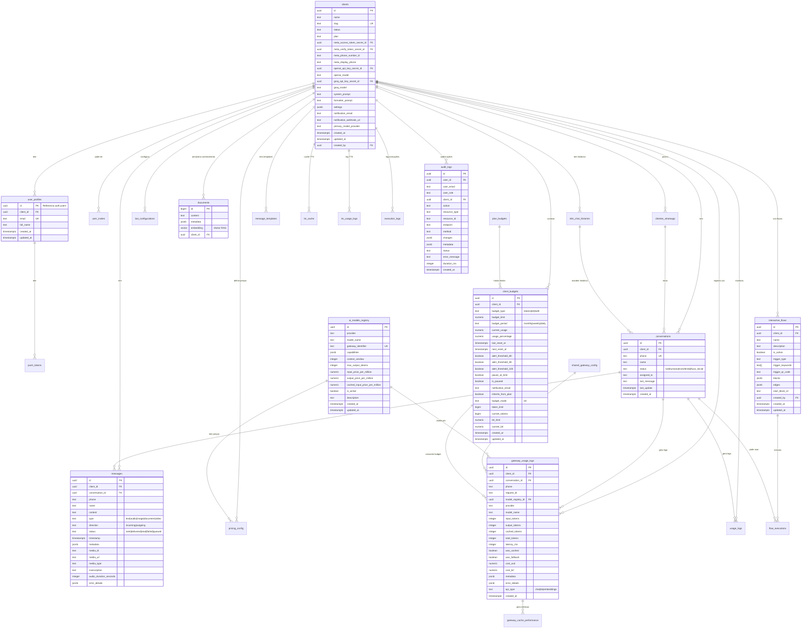

---

## 📋 Módulos da Arquitetura

### 1️⃣ Autenticação e Usuários

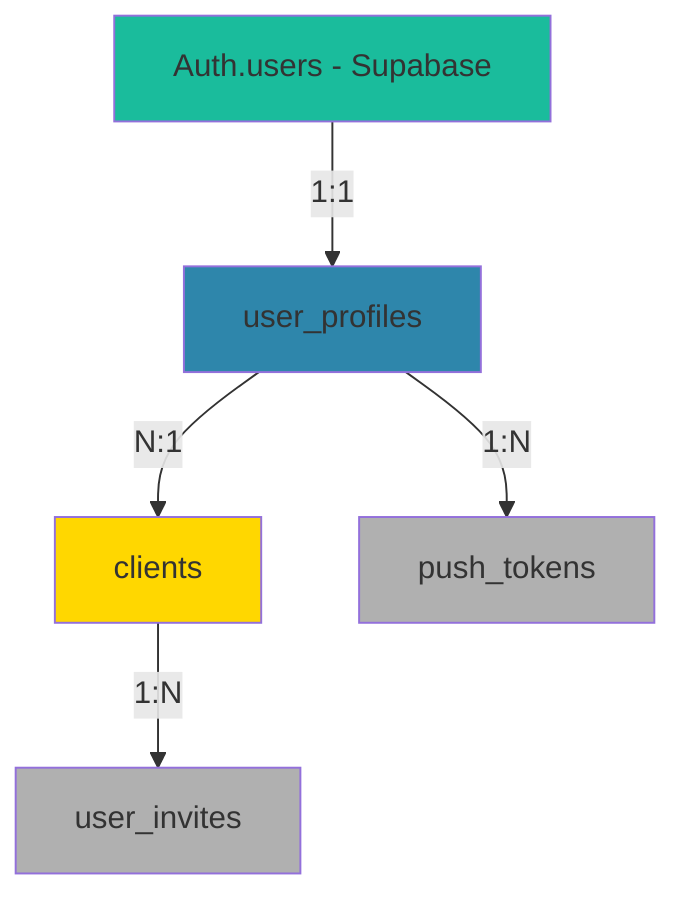

**📝 Notas:**
- `user_profiles` vincula usuários do Supabase Auth aos clientes
- Multi-tenancy: cada usuário pertence a um cliente
- `push_tokens` para notificações mobile/web

---

### 2️⃣ Conversas e Mensagens

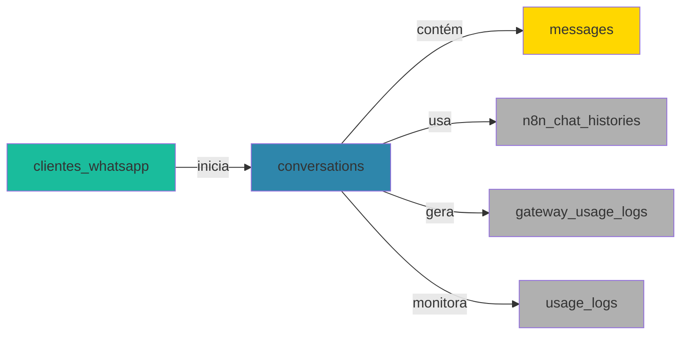

**📊 Estados de Conversação:**

| Status | Descrição | Ícone |
|--------|-----------|-------|
| `bot` | Bot respondendo automaticamente | 🤖 |
| `humano` | Atendimento humano ativo | 👤 |
| `transferido` | Aguardando atendimento humano | ⏳ |
| `fluxo_inicial` | Fluxo interativo ativo | 🔄 |

---

### 3️⃣ Gateway e IA

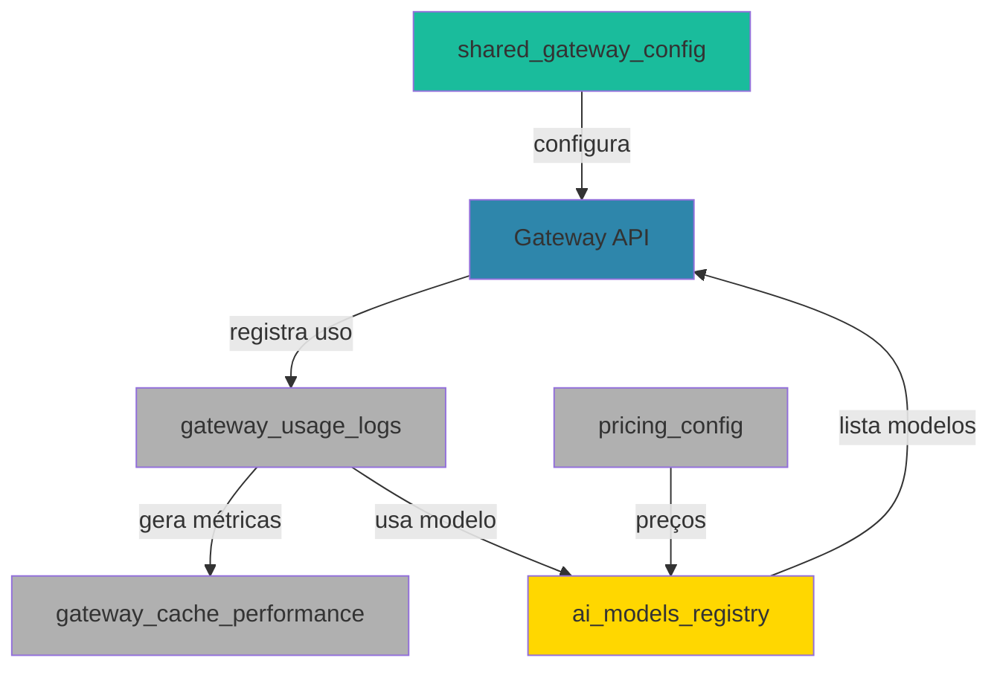

**📝 Funcionalidades:**
- **Unified Gateway:** Roteamento inteligente de APIs de IA
- **Model Registry:** Catálogo de modelos (OpenAI, Groq, Anthropic, etc.)
- **Caching:** Cache de respostas para economia
- **Fallback Chain:** Cadeia de fallback automática

---

### 4️⃣ Budget e Pricing

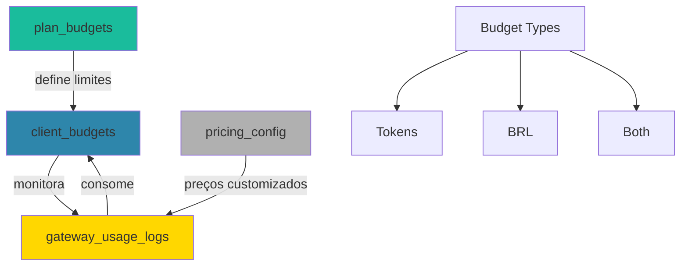

**💰 Tipos de Budget:**

| Tipo | Descrição | Métricas |
|------|-----------|----------|
| `tokens` | Limite por tokens | `token_limit`, `current_tokens` |
| `brl` | Limite por R$ | `brl_limit`, `current_brl` |
| `both` | Ambos os limites | Tokens + BRL |

---

### 5️⃣ Fluxos Interativos

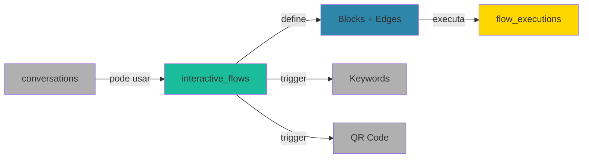

**📝 Estrutura:**
- **Blocks:** Blocos de interação (mensagem, condição, ação)
- **Edges:** Conexões entre blocos
- **Triggers:** Keywords ou QR Codes

---

### 6️⃣ RAG e Conhecimento

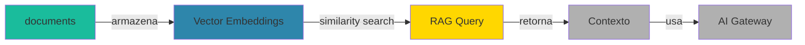

**📝 Funcionalidades:**
- **Vector Store:** Armazenamento de embeddings (pgvector)
- **Similarity Search:** Busca por similaridade semântica
- **Multi-tenant:** Cada cliente tem seus documentos

---

### 7️⃣ TTS (Text-to-Speech)

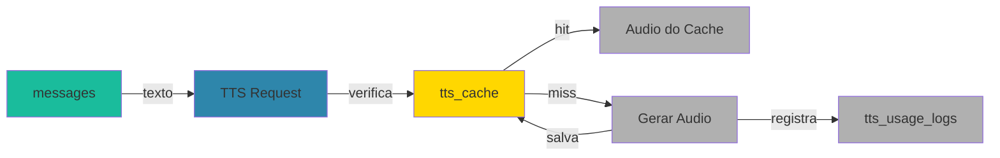

**📝 Cache Strategy:**
- Hash do texto + voz + provider
- Evita regenerar áudios idênticos
- Economia de custos e latência

---

## 📊 Tabelas Detalhadas por Categoria

### 🔐 Autenticação e Segurança

| Tabela | Descrição | Campos Principais |
|--------|-----------|-------------------|
| `user_profiles` | Perfis de usuários | `id`, `client_id`, `email` |
| `user_invites` | Convites de usuários | `id`, `client_id`, `email`, `token` |
| `push_tokens` | Tokens para push notifications | `id`, `user_id`, `token`, `platform` |
| `audit_logs` | Logs de auditoria | `id`, `user_id`, `action`, `resource_type` |

### 💬 Conversas e Mensagens

| Tabela | Descrição | Campos Principais |
|--------|-----------|-------------------|
| `conversations` | Conversas ativas | `id`, `client_id`, `phone`, `status` |
| `messages` | Mensagens individuais | `id`, `conversation_id`, `content`, `direction` |
| `n8n_chat_histories` | Histórico do n8n | `id`, `session_id`, `message` (JSONB) |
| `clientes_whatsapp` | Clientes WhatsApp | `telefone` (PK), `nome`, `status` |

### 🤖 IA e Gateway

| Tabela | Descrição | Campos Principais |
|--------|-----------|-------------------|
| `ai_models_registry` | Catálogo de modelos | `id`, `provider`, `model_name`, `gateway_identifier` |
| `shared_gateway_config` | Configuração do gateway | `id`, `gateway_api_key_secret_id` |
| `gateway_usage_logs` | Logs de uso do gateway | `id`, `client_id`, `model_registry_id`, `tokens` |
| `gateway_cache_performance` | Métricas de cache | `id`, `cache_key`, `hit_count`, `miss_count` |

### 💰 Budget e Pricing

| Tabela | Descrição | Campos Principais |
|--------|-----------|-------------------|
| `client_budgets` | Budgets por cliente | `id`, `client_id`, `budget_limit`, `current_usage` |
| `plan_budgets` | Budgets por plano | `id`, `plan_name`, `budget_limit` |
| `pricing_config` | Configuração de preços | `id`, `client_id`, `provider`, `model`, `prompt_price` |

### 📋 Fluxos e Templates

| Tabela | Descrição | Campos Principais |
|--------|-----------|-------------------|
| `interactive_flows` | Fluxos interativos | `id`, `client_id`, `blocks` (JSONB), `edges` (JSONB) |
| `flow_executions` | Execuções de fluxos | `id`, `flow_id`, `conversation_id`, `current_block_id` |
| `message_templates` | Templates de mensagens | `id`, `client_id`, `name`, `components` (JSONB) |

### 📚 RAG e Conhecimento

| Tabela | Descrição | Campos Principais |
|--------|-----------|-------------------|
| `documents` | Documentos RAG | `id`, `content`, `embedding` (vector), `metadata` |

### 🎤 TTS (Text-to-Speech)

| Tabela | Descrição | Campos Principais |
|--------|-----------|-------------------|
| `tts_cache` | Cache de áudios TTS | `id`, `client_id`, `text_hash`, `audio_url` |
| `tts_usage_logs` | Logs de uso TTS | `id`, `client_id`, `provider`, `duration_seconds` |

### 📊 Analytics e Logs

| Tabela | Descrição | Campos Principais |
|--------|-----------|-------------------|
| `usage_logs` | Logs de uso geral | `id`, `client_id`, `source`, `tokens_used` |
| `execution_logs` | Logs de execução n8n | `id`, `execution_id`, `node_name`, `status` |

---

## 🔗 Relacionamentos Críticos

### Cliente como Centro

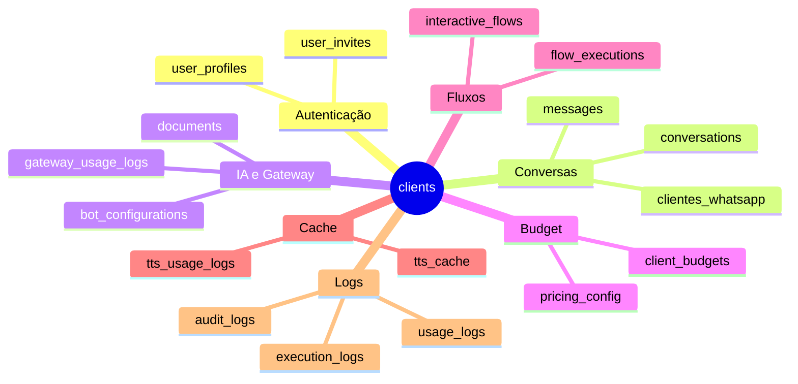

---

## 📈 Fluxo de Dados Principal

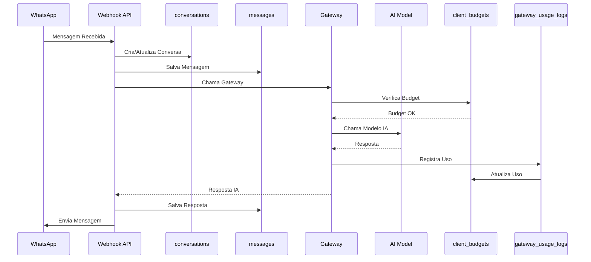

---

## 🔐 Segurança (RLS)

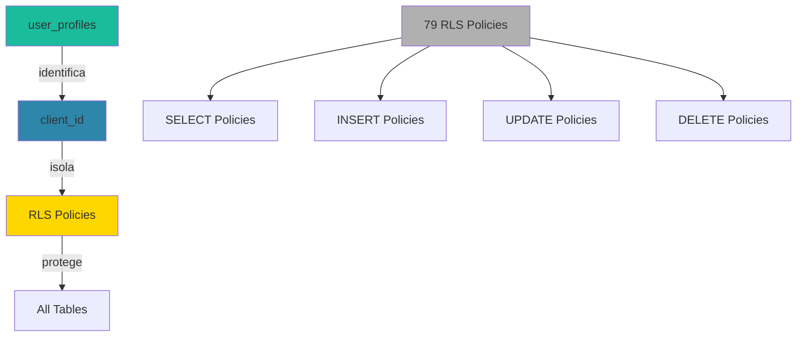

**📝 Princípio:**
- Multi-tenancy garantido por RLS
- Cada cliente vê apenas seus dados
- Isolamento automático via `client_id`

---

## 📊 Estatísticas do Banco

| Métrica | Valor |
|---------|-------|
| **Total de Tabelas** | 28 |
| **Total de Colunas** | ~400+ |
| **Foreign Keys** | 294 |
| **RLS Policies** | 79 |
| **Triggers** | 19 |
| **Funções** | 202 |
| **Índices** | 182 |

---

## 🎯 Padrões de Design

### 1. Multi-Tenancy
- Todas as tabelas têm `client_id` (exceto `clients`)
- RLS garante isolamento
- `user_profiles` vincula usuário ao cliente

### 2. Soft Deletes
- Algumas tabelas usam `is_active` ou `status`
- Histórico preservado em backups

### 3. JSONB para Flexibilidade
- `settings`, `metadata`, `blocks`, `edges` em JSONB
- Permite evolução sem migrations

### 4. Timestamps Padrão
- `created_at` e `updated_at` em todas as tabelas
- Triggers automáticos para `updated_at`

### 5. UUIDs para PKs
- Maioria das tabelas usa UUID
- Evita exposição de sequências
- Melhor para distribuição

---

## 🔄 Migrations Status

### ✅ Sincronizadas (22 tabelas)
- `ai_models_registry`
- `audit_logs`
- `bot_configurations`
- `client_budgets`
- `clients`
- `conversations`
- E mais 16...

### ⚠️ Nas Migrations mas NÃO no Banco (6)
- `budget_plan_templates`
- `client_budget_limits`
- `gateway_configurations`
- E mais 3...

### ⚠️ No Banco mas NÃO nas Migrations (6)
- `clientes_whatsapp`
- `documents`
- `n8n_chat_histories`
- `push_tokens`
- E mais 2...

---

## 📝 Notas Finais

- **Database:** PostgreSQL 17.6 via Supabase
- **Extensions:** pgvector (RAG), pg_trgm (busca)
- **RLS:** 79 políticas ativas
- **Total de Migrations:** 89 arquivos SQL
- **Última Atualização:** 16/01/2026

---

**🎯 Este documento foi gerado automaticamente pelo script de exportação do schema.**

