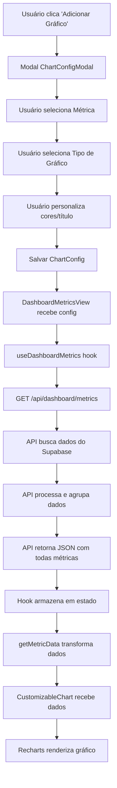

# 🔄 Diagrama de Fluxo - Sistema de Gráficos

## 📊 Fluxo Completo de Dados



---

## 🎯 Fluxo Detalhado por Etapa

### **1. Seleção de Métrica no Modal**

```typescript
// Usuário seleciona: "Conversas por Dia"
metricType: 'conversations_per_day'
```

**Onde:** `ChartConfigModal.tsx` → Dropdown "Métrica"

---

### **2. Busca de Dados na API**

```typescript
// API busca do banco
GET /api/dashboard/metrics?startDate=...&endDate=...

// Retorna:
{
  conversations: [
    { date: "2026-01-15", total: 10, active: 5, ... },
    { date: "2026-01-16", total: 12, active: 6, ... }
  ],
  messages: [...],
  tokens: [...],
  // ... todas as métricas
}
```

**Onde:** `src/app/api/dashboard/metrics/route.ts`

---

### **3. Transformação de Dados**

```typescript
// Hook transforma baseado na métrica escolhida
getMetricData('conversations_per_day')

// Retorna:
[
  { date: "2026-01-15", total: 10, ativo: 5, transferido: 2, humano: 3 },
  { date: "2026-01-16", total: 12, ativo: 6, transferido: 3, humano: 3 }
]
```

**Onde:** `src/hooks/useDashboardMetrics.ts` → função `getMetricData`

---

### **4. Renderização do Gráfico**

```typescript
// CustomizableChart recebe:
config = {
  metricType: 'conversations_per_day',
  type: 'line',
  colors: { primary: '#1ABC9C', secondary: '#2E86AB' }
}

data = [
  { date: "2026-01-15", total: 10, ativo: 5, ... },
  { date: "2026-01-16", total: 12, ativo: 6, ... }
]

// Componente detecta automaticamente:
// - Chaves: total, ativo, transferido, humano
// - Cria séries para cada chave
// - Aplica cores (primeira = primary, outras = secondary)
```

**Onde:** `src/components/CustomizableChart.tsx`

---

## 🔑 Pontos-Chave

### **1. Uma API, Múltiplas Métricas**

A API retorna **TODAS** as métricas de uma vez:
- ✅ Performance melhor (uma requisição)
- ✅ Dados sempre sincronizados
- ✅ Fácil adicionar novas métricas

### **2. Transformação Dinâmica**

O hook transforma os dados **conforme a métrica escolhida**:
- Cada métrica tem sua própria transformação
- Mantém estrutura consistente (`date` + valores)
- Facilita renderização no gráfico

### **3. Detecção Automática de Séries**

O `CustomizableChart` detecta automaticamente:
- Quais chaves usar (remove `date` e `label`)
- Quantas séries criar
- Quais cores aplicar

---

## 📝 Estrutura de Dados Esperada

### **Formato Padrão:**

```typescript
interface MetricDataPoint {
  date: string        // SEMPRE presente (chave para eixo X)
  [key: string]: any  // Outras chaves = séries do gráfico
}
```

### **Exemplos:**

```typescript
// Conversas por Dia
{ date: "2026-01-15", total: 10, ativo: 5, transferido: 2, humano: 3 }

// Mensagens por Dia
{ date: "2026-01-15", total: 100, recebidas: 50, enviadas: 50 }

// Tokens por Dia
{ date: "2026-01-15", total: 50000, openai: 30000, groq: 20000 }
```

---

## 🎨 Como o Gráfico Usa os Dados

### **Exemplo: Gráfico de Linha**

```typescript
// Dados recebidos:
[
  { date: "2026-01-15", total: 10, ativo: 5 },
  { date: "2026-01-16", total: 12, ativo: 6 }
]

// CustomizableChart cria:
<LineChart>
  <Line dataKey="total" stroke="#1ABC9C" />    // Cor primária
  <Line dataKey="ativo" stroke="#2E86AB" />    // Cor secundária
  <XAxis dataKey="date" />                      // Eixo X = datas
</LineChart>
```

**Resultado:**
- **Linha verde:** `total` (10, 12, ...)
- **Linha azul:** `ativo` (5, 6, ...)
- **Eixo X:** Datas (2026-01-15, 2026-01-16, ...)

---

## 🔄 Mudando de Métrica

### **Cenário: Trocar de "Conversas" para "Mensagens"**

1. **Usuário edita gráfico** → Clica no ícone de configuração
2. **Modal abre** → Mostra configuração atual
3. **Usuário muda métrica** → Seleciona "Mensagens por Dia"
4. **Salva** → `metricType` muda de `'conversations_per_day'` para `'messages_per_day'`
5. **Hook detecta mudança** → `getMetricData('messages_per_day')`
6. **Transformação diferente** → Retorna dados de mensagens
7. **Gráfico atualiza** → Mostra séries `recebidas` e `enviadas`

---

## 💡 Resumo

1. **Métrica = Fonte de Dados** → Define quais dados buscar
2. **Tipo de Gráfico = Visualização** → Define como mostrar
3. **Cores = Estilo** → Define aparência
4. **Transformação = Adaptação** → Converte dados da API para formato do gráfico
5. **Renderização = Exibição** → Recharts cria o gráfico visual

---

**Última Atualização:** 2026-01-16

