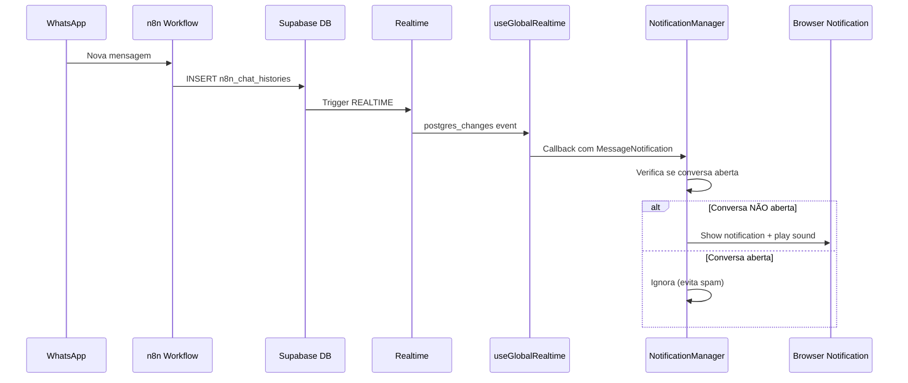
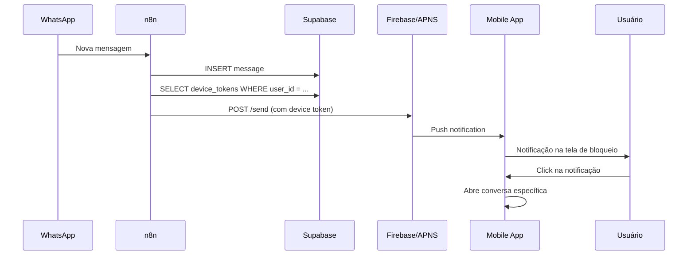

# 🔔 Sistema de Notificações - Plano Completo

## 📋 Visão Geral

Sistema de notificações em tempo real para alertar usuários sobre novas mensagens WhatsApp no dashboard.

**Status Atual:** Fase 1 Implementada (Browser Notifications)  
**Próxima Fase:** Push Notifications Mobile  
**Data:** 2025-11-25

---

## 🎯 Objetivos

### Objetivos Principais
1. ✅ Alertar usuário quando nova mensagem chega
2. ✅ Funcionar com dashboard em background
3. ✅ Som audível de notificação
4. ✅ Notificação visual (desktop/mobile)
5. ⏳ Funcionar com app mobile fechado (Fase 2)

### Requisitos Não-Funcionais
- Performance: < 100ms para processar notificação
- Bateria: Consumo mínimo em mobile
- UX: Não ser intrusivo (auto-fecha após 5s)
- Privacidade: Truncar mensagens sensíveis

---

## 🏗️ Arquitetura

### Visão Geral do Fluxo



### Stack Tecnológica

**Frontend:**
- React Hooks (useNotifications, useGlobalRealtimeNotifications)
- Browser Notifications API
- HTML5 Audio API
- Next.js App Router

**Backend:**
- Supabase Realtime (PostgreSQL logical replication)
- n8n workflows (message processing)

**Mobile (Fase 2):**
- Capacitor Push Notifications Plugin
- Firebase Cloud Messaging (FCM)
- Apple Push Notification Service (APNS)

---

## 📦 Componentes Implementados

### 1. `useNotifications` Hook

**Localização:** `src/hooks/useNotifications.ts`

**Responsabilidades:**
- Gerenciar permissões do Browser Notifications API
- Tocar som de notificação (HTML5 Audio)
- Criar notificações nativas do SO
- Fallback para Toast se bloqueado

**API:**
```typescript
const { 
  permissionStatus,    // 'granted' | 'denied' | 'default' | 'unsupported'
  requestPermission,   // () => Promise<boolean>
  notify,              // (title, options) => void
  playSound,           // () => void
  isSupported          // boolean
} = useNotifications({
  enabled: true,
  sound: true,
  soundUrl: '/notification.mp3'
})
```

**Características:**
- ✅ Request automático de permissão (com delay)
- ✅ Fallback para Toast (shadcn/ui)
- ✅ Som customizável (MP3)
- ✅ Volume 50% (não assusta usuário)
- ✅ Auto-close notificação após 5s
- ✅ Tag única por conversa (evita duplicatas)

### 2. `useGlobalRealtimeNotifications` Hook

**Localização:** `src/hooks/useGlobalRealtimeNotifications.ts`

**Responsabilidades:**
- Monitorar TODAS as mensagens via Supabase Realtime
- Filtrar apenas mensagens de usuário (role='user')
- Passar dados estruturados para callbacks

**API:**
```typescript
const { 
  lastUpdatePhone,     // string | null
  lastNotification,    // MessageNotification | null
  isConnected          // boolean
} = useGlobalRealtimeNotifications(
  onNewMessage?: (notification: MessageNotification) => void
)

interface MessageNotification {
  phone: string
  message: string
  senderName?: string
  timestamp: string
}
```

**Características:**
- ✅ Subscription global (sem filtro por client_id)
- ✅ Retry automático em caso de desconexão
- ✅ Callback opcional (usado por NotificationManager)
- ✅ Estado compartilhado (lastUpdatePhone para outros componentes)

### 3. `NotificationManager` Component

**Localização:** `src/components/NotificationManager.tsx`

**Responsabilidades:**
- Orquestrar notificações globalmente
- Solicitar permissão automaticamente
- Decidir quando notificar (conversa aberta ou não)
- Integrar useNotifications + useGlobalRealtimeNotifications

**Lógica de Decisão:**
```typescript
const currentPhone = pathname.split('/conversations/')[1]

if (currentPhone !== notification.phone) {
  // Notificar - usuário NÃO está vendo essa conversa
  notify(title, options)
} else {
  // Ignorar - usuário JÁ está vendo a conversa
}
```

**Características:**
- ✅ Componente invisível (sem UI)
- ✅ Montado no layout.tsx (ativo em todas páginas)
- ✅ Request de permissão com delay de 2s
- ✅ Trunca mensagens longas (50 chars)
- ✅ Link direto para conversa (click notification)

### 4. `NotificationToggle` Button

**Localização:** `src/components/NotificationManager.tsx`

**Responsabilidades:**
- UI para ativar/desativar notificações
- Indicador visual do estado

**Características:**
- ✅ Ícone Bell (ativado) / BellOff (desativado)
- ✅ Cor verde quando ativado
- ✅ Tooltip informativo
- ✅ Click solicita permissão se negada

---

## 🚀 Implementação - Fase 1 (CONCLUÍDA)

### Status: ✅ Implementado

### Funcionalidades Entregues

1. **Browser Notifications API**
   - Notificações nativas do sistema operacional
   - Funciona com aba em background
   - Som customizável
   - Auto-fecha após 5 segundos
   - Click abre conversa específica

2. **Gerenciamento Inteligente**
   - Solicita permissão automaticamente (delay 2s)
   - Apenas notifica conversas não abertas
   - Filtra mensagens de bot (só usuário)
   - Trunca mensagens longas

3. **Sistema de Fallback**
   - Toast se notificações bloqueadas
   - Toast se navegador não suporta
   - Toast se erro ao mostrar

4. **UI Components**
   - Botão toggle no header
   - Estado visual (Bell/BellOff)
   - Tooltip informativo

### Arquivos Modificados

```
src/
├── hooks/
│   ├── useNotifications.ts                    [CRIADO]
│   └── useGlobalRealtimeNotifications.ts      [MODIFICADO - callback support]
│
├── components/
│   ├── NotificationManager.tsx                [CRIADO]
│   └── DashboardClient.tsx                    [MODIFICADO - botão toggle]
│
├── app/
│   └── layout.tsx                             [MODIFICADO - NotificationManager]
│
└── public/
    └── NOTIFICATION_SOUND.md                  [CRIADO - guia]
```

### Configuração Necessária

**1. Som de Notificação (Opcional)**

Baixe um arquivo MP3 e coloque em:
```
public/notification.mp3
```

**Sugestões:**
- https://notificationsounds.com/ (sons gratuitos)
- https://mixkit.co/free-sound-effects/notification/
- Usar som do WhatsApp Web (grave e salve)

**2. Permissões do Navegador**

O sistema solicita automaticamente, mas usuário pode:
- Aceitar ✅ → Notificações funcionam
- Negar ❌ → Fallback para Toast
- Ignorar ⏸️ → Pode ativar depois com botão

---

## 🐛 Troubleshooting - Fase 1

### Problema: Notificações não aparecem

**1. Verificar permissão do navegador**

Abra DevTools (F12) e digite:
```javascript
console.log(Notification.permission)
// Esperado: "granted"
```

Se retornar `"denied"`:
- Chrome: Settings → Privacy → Site settings → Notifications
- Firefox: Settings → Privacy & Security → Permissions
- Safari: Preferences → Websites → Notifications

**2. Verificar se realtime está conectado**

```javascript
// No console:
// Deve aparecer logs: "📨 [GlobalRealtime] Payload recebido"
```

**3. Verificar se callback está registrado**

```javascript
// Deve aparecer: "🔔 [GlobalRealtime] Chamando callback de notificação"
// Se aparecer: "⚠️ Nenhum callback registrado" → NotificationManager não montou
```

**4. Verificar pathname**

```javascript
// Deve aparecer: "📍 [NotificationManager] Pathname: /conversations/..."
// Se pathname não bater com phone da mensagem → Notifica
// Se pathname = phone da mensagem → Ignora
```

### Problema: Som não toca

**1. Arquivo não encontrado**

Acesse: `http://localhost:3000/notification.mp3`
- ✅ Toca som → Arquivo OK
- ❌ 404 → Arquivo não existe em `/public`

**2. Formato não suportado**

Use **MP3** (suporte universal)
- ❌ WAV → Arquivo muito grande
- ❌ OGG → Suporte limitado
- ⚠️ M4A → Pode não funcionar em Firefox

**3. Volume mutado**

- Verificar volume do sistema
- Verificar se site não está mutado no navegador

### Problema: Notificações em mobile não funcionam

**Esperado:** Browser Notifications tem suporte limitado em mobile:
- Chrome Android: ⚠️ Funciona mas precisa tab aberta
- Safari iOS: ❌ Não suporta
- Firefox Android: ⚠️ Parcial

**Solução:** Implementar Push Notifications (Fase 2)

---

## 🚀 Fase 2 - Push Notifications Mobile (PLANEJAMENTO)

### Status: ⏳ Não Iniciado

### Objetivo

Notificações funcionando **mesmo com app fechado** no Android/iOS.

### Arquitetura Proposta



### Stack Tecnológica

**Frontend (Capacitor):**
```bash
npm install @capacitor/push-notifications
```

**Backend (n8n):**
- HTTP Request Node para FCM/APNS
- Credentials armazenadas em n8n

**Serviços Cloud:**
- Firebase Cloud Messaging (Android)
- Apple Push Notification Service (iOS)

### Implementação Necessária

#### 1. Database Schema

```sql
-- Armazenar tokens de dispositivos
CREATE TABLE device_tokens (
  id UUID PRIMARY KEY DEFAULT uuid_generate_v4(),
  user_id UUID REFERENCES auth.users(id) ON DELETE CASCADE,
  client_id UUID REFERENCES clients(id),
  token TEXT NOT NULL,
  platform TEXT CHECK (platform IN ('ios', 'android', 'web')),
  device_info JSONB, -- {model, os_version, app_version}
  created_at TIMESTAMPTZ DEFAULT NOW(),
  last_used_at TIMESTAMPTZ DEFAULT NOW(),
  is_active BOOLEAN DEFAULT true,
  UNIQUE(user_id, token)
);

-- Index para buscar tokens ativos de um usuário
CREATE INDEX idx_device_tokens_user_active 
ON device_tokens(user_id, is_active) 
WHERE is_active = true;
```

#### 2. Frontend - Registro de Token

```typescript
// src/hooks/usePushNotifications.ts
import { PushNotifications } from '@capacitor/push-notifications'
import { Capacitor } from '@capacitor/core'

export const usePushNotifications = () => {
  useEffect(() => {
    if (Capacitor.getPlatform() === 'web') {
      return // Só mobile
    }

    const registerPush = async () => {
      // Solicitar permissão
      const permission = await PushNotifications.requestPermissions()
      
      if (permission.receive === 'granted') {
        // Registrar no FCM/APNS
        await PushNotifications.register()
      }
    }

    // Listener para quando token é gerado
    PushNotifications.addListener('registration', async (token) => {
      console.log('📱 Push token:', token.value)
      
      // Salvar no banco
      const supabase = createClientBrowser()
      await supabase.from('device_tokens').upsert({
        user_id: user.id,
        token: token.value,
        platform: Capacitor.getPlatform(),
        device_info: {
          model: await Device.getInfo(),
        }
      })
    })

    // Listener para quando notificação chega
    PushNotifications.addListener('pushNotificationReceived', (notification) => {
      console.log('🔔 Push recebido:', notification)
      // Atualizar UI se app aberto
    })

    // Listener para quando usuário clica na notificação
    PushNotifications.addListener('pushNotificationActionPerformed', (action) => {
      console.log('👆 Click na notificação:', action)
      
      // Navegar para conversa
      const phone = action.notification.data.phone
      if (phone) {
        router.push(`/conversations/${phone}`)
      }
    })

    registerPush()

    return () => {
      PushNotifications.removeAllListeners()
    }
  }, [])
}
```

#### 3. Backend - n8n Workflow

**Trigger:** Nova mensagem em `n8n_chat_histories`

**Nodes:**
1. **PostgreSQL - Get Device Tokens**
   ```sql
   SELECT token, platform
   FROM device_tokens
   WHERE user_id = (
     SELECT user_id FROM user_profiles WHERE client_id = {{$json.client_id}}
   )
   AND is_active = true
   ```

2. **Function - Prepare FCM Payload**
   ```javascript
   const phone = items[0].json.session_id
   const message = items[0].json.message
   
   return items.map(item => ({
     json: {
       to: item.json.token,
       notification: {
         title: '💬 Nova mensagem WhatsApp',
         body: message.substring(0, 100),
         icon: 'https://yourdomain.com/icon-192x192.png',
         badge: 'https://yourdomain.com/badge-96x96.png',
         sound: 'default'
       },
       data: {
         phone: phone,
         url: `/conversations/${phone}`,
         click_action: 'FLUTTER_NOTIFICATION_CLICK'
       }
     }
   }))
   ```

3. **HTTP Request - Send to FCM**
   ```
   Method: POST
   URL: https://fcm.googleapis.com/fcm/send
   Headers:
     Authorization: key={{$credentials.fcmServerKey}}
     Content-Type: application/json
   Body: {{$json}}
   ```

4. **Switch - Handle Platform**
   - If Android → FCM endpoint
   - If iOS → APNS endpoint (different payload format)

#### 4. Firebase Configuration

**1. Criar projeto Firebase**
- https://console.firebase.google.com/
- Adicionar app Android/iOS
- Baixar `google-services.json` (Android)
- Baixar `GoogleService-Info.plist` (iOS)

**2. Configurar Capacitor**

```json
// capacitor.config.ts
{
  "plugins": {
    "PushNotifications": {
      "presentationOptions": ["badge", "sound", "alert"]
    }
  }
}
```

**3. Android - Configure FCM**

```xml
<!-- android/app/src/main/AndroidManifest.xml -->
<meta-data
  android:name="com.google.firebase.messaging.default_notification_icon"
  android:resource="@drawable/ic_notification" />
<meta-data
  android:name="com.google.firebase.messaging.default_notification_color"
  android:resource="@color/notification_color" />
```

**4. iOS - Configure APNS**

- Gerar certificado APNS no Apple Developer
- Upload para Firebase Console
- Configurar entitlements em Xcode

#### 5. Segurança

**Validação de Token:**
```sql
-- Expirar tokens antigos (não usados por 30 dias)
UPDATE device_tokens
SET is_active = false
WHERE last_used_at < NOW() - INTERVAL '30 days';
```

**Rate Limiting:**
- Limitar 10 notificações/minuto por usuário
- Implementar no n8n com Redis ou throttle node

**Privacidade:**
- Não enviar conteúdo completo da mensagem
- Apenas "Nova mensagem de [Nome]"
- Conteúdo só visível ao abrir app

---

## 📊 Comparação de Abordagens

| Característica | Browser Notifications (Fase 1) | Push Notifications (Fase 2) |
|---------------|----------------------------------|------------------------------|
| **Plataforma** | Web (desktop/mobile browser) | Android/iOS app nativo |
| **App Fechado** | ❌ Não funciona | ✅ Funciona |
| **Background Tab** | ✅ Funciona | ✅ Funciona |
| **Permissão** | Por site | Por app |
| **Som** | Customizável | Sistema padrão |
| **Badge** | ❌ Não suporta | ✅ Badge no ícone |
| **Setup** | Simples (puro frontend) | Complexo (backend + cloud) |
| **Custo** | Gratuito | FCM gratuito (até limite) |
| **Confiabilidade** | ⚠️ Depende de conexão | ✅ Alta (serviço cloud) |

---

## 🎯 Roadmap

### ✅ Fase 1 - Browser Notifications (CONCLUÍDA)
- [x] Hook useNotifications
- [x] Hook useGlobalRealtimeNotifications com callback
- [x] Componente NotificationManager
- [x] Botão toggle UI
- [x] Som de notificação
- [x] Filtro por conversa aberta
- [x] Documentação

### ⏳ Fase 2 - Push Notifications Mobile (PLANEJADA)
- [ ] Database schema (device_tokens table)
- [ ] Hook usePushNotifications (Capacitor)
- [ ] n8n workflow para envio (FCM/APNS)
- [ ] Firebase project setup
- [ ] Android configuration
- [ ] iOS configuration (requer Mac)
- [ ] Deep linking para abrir conversa
- [ ] Badge count no ícone
- [ ] Testes em dispositivos reais

### 🔮 Fase 3 - Recursos Avançados (FUTURO)
- [ ] Notificações agrupadas (múltiplas mensagens)
- [ ] Notificações ricas (imagem/vídeo preview)
- [ ] Quick reply (responder direto da notificação)
- [ ] Snooze de notificações
- [ ] Do Not Disturb (horários customizados)
- [ ] Notificações por categoria (urgente/normal)
- [ ] Analytics (delivery rate, click rate)

---

## 📚 Referências

### Documentação Oficial
- [MDN - Notifications API](https://developer.mozilla.org/en-US/docs/Web/API/Notifications_API)
- [MDN - Push API](https://developer.mozilla.org/en-US/docs/Web/API/Push_API)
- [Capacitor Push Notifications](https://capacitorjs.com/docs/apis/push-notifications)
- [Firebase Cloud Messaging](https://firebase.google.com/docs/cloud-messaging)
- [Apple Push Notifications](https://developer.apple.com/documentation/usernotifications)

### Exemplos de Código
- [Supabase Realtime Examples](https://supabase.com/docs/guides/realtime)
- [FCM Server Implementation](https://firebase.google.com/docs/cloud-messaging/server)
- [Capacitor Push Example App](https://github.com/ionic-team/capacitor-push-demo)

### Ferramentas
- [FCM Testing Tool](https://firebase.google.com/docs/cloud-messaging/send-message)
- [APNS Testing Tool](https://developer.apple.com/documentation/usernotifications/testing_notifications_using_the_push_notification_console)
- [Notification Sound Library](https://notificationsounds.com/)

---

## 🤝 Contribuindo

### Reportar Bugs

Se notificações não funcionarem:
1. Abrir DevTools (F12)
2. Reproduzir o problema
3. Copiar logs do console (começam com 🔔, 📨, 📍)
4. Criar issue com logs

### Adicionar Recursos

Pull requests são bem-vindos para:
- Novos sons de notificação
- Melhorias de UX
- Suporte a novos navegadores
- Otimizações de performance

---

## 📝 Changelog

### 2025-11-25 - v1.0.0 (Fase 1 Completa)
- ✅ Implementado Browser Notifications
- ✅ Som de notificação customizável
- ✅ Filtro inteligente (conversa aberta)
- ✅ UI toggle button
- ✅ Sistema de fallback (Toast)
- ✅ Logs de debug completos
- ✅ Documentação completa

### Próxima Release - v2.0.0 (Fase 2)
- ⏳ Push Notifications mobile
- ⏳ Firebase/APNS integration
- ⏳ n8n workflow para envio
- ⏳ Deep linking
- ⏳ Badge count

---

**Autor:** ChatBot-Oficial Team  
**Última Atualização:** 2025-11-25  
**Status:** Fase 1 Implementada ✅
