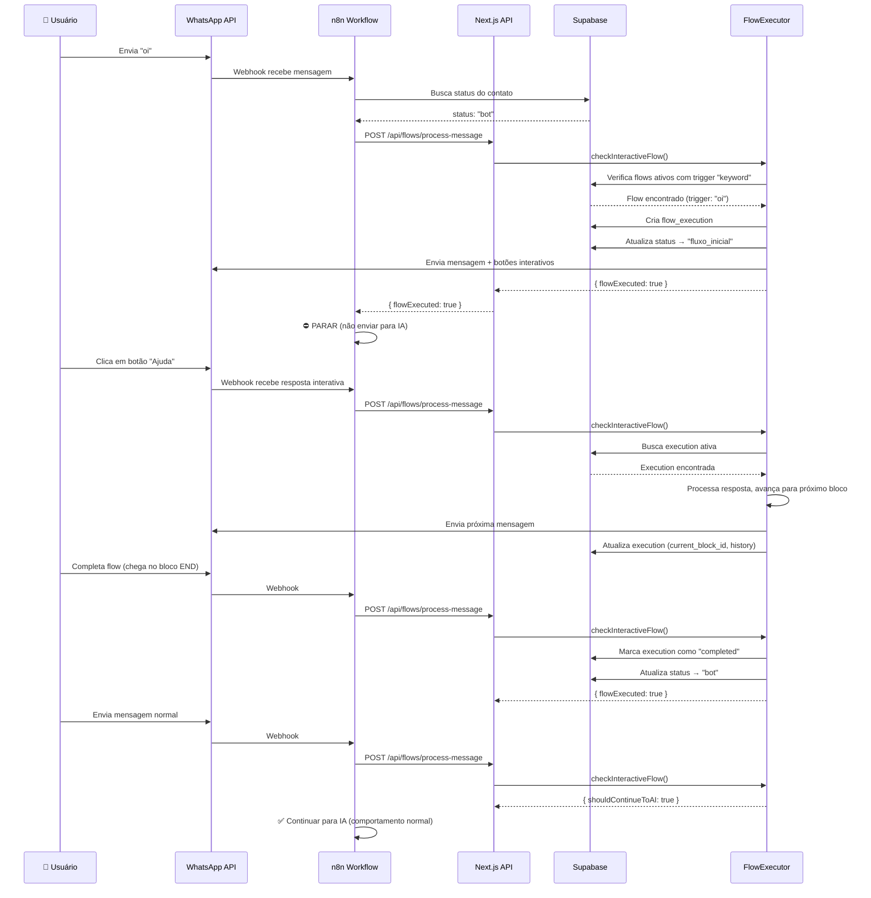

# ✅ Checklist de Produção - Sistema de Flows Interativos

**Data**: 2025-12-07  
**Fase Atual**: Phase 5 - Editor Drag-and-Drop  
**Status**: ⚠️ **PARCIALMENTE IMPLEMENTADO**

---

## 📋 O que está PRONTO ✅

### 1. ✅ Editor de Flows (Dashboard)
- [x] Interface drag-and-drop funcional
- [x] Criação de flows visuais
- [x] Salvar flows no banco (`interactive_flows` table)
- [x] Nome editável do flow
- [x] Deletar edges (conexões)
- [x] 9 tipos de blocos disponíveis

**Localização**: `/dashboard/flows/[flowId]/edit`

### 2. ✅ Backend - FlowExecutor
- [x] Executar flows interativos
- [x] Gerenciar estado de execução (`flow_executions` table)
- [x] Controlar transições de status (bot → fluxo_inicial → bot/humano)
- [x] Processar respostas de listas/botões interativos
- [x] Avaliar condições

**Localização**: `src/lib/flows/flowExecutor.ts`

### 3. ✅ Integração com Webhook (chatbotFlow.ts)
- [x] Detecta status `fluxo_inicial`
- [x] Chama `checkInteractiveFlow`
- [x] Continua flows ativos
- [x] Inicia novos flows baseado em triggers

**Localização**: `src/flows/chatbotFlow.ts` (linhas 189-218)

### 4. ✅ Database Schema
- [x] Tabela `interactive_flows`
- [x] Tabela `flow_executions`
- [x] Status `fluxo_inicial` na tabela `clientes_whatsapp`
- [x] Índices de performance

---

## ❌ O que está FALTANDO

### 1. ❌ **CRÍTICO**: Atualização do `IA.json` (n8n)

**PROBLEMA**: Seu workflow n8n (`IA.json`) ainda não está chamando o endpoint Next.js que executa os flows.

**O que precisa fazer**:

1. **Adicionar um nó HTTP Request no n8n** que chama:
   ```
   POST https://seu-dominio.com/api/flows/process-message
   ```

2. **Payload**:
   ```json
   {
     "clientId": "{{ $json.client_id }}",
     "phone": "{{ $json.from }}",
     "content": "{{ $json.text.body }}",
     "type": "{{ $json.type }}",
     "interactiveResponseId": "{{ $json.interactive?.button_reply?.id || $json.interactive?.list_reply?.id }}"
   }
   ```

3. **Posição no workflow**: ANTES do processamento de IA
   - Logo após receber a mensagem do WhatsApp
   - Verificar se `status === 'fluxo_inicial'`
   - Se `flowExecuted: true`, PARAR o workflow (não enviar para IA)

**Status**: ⚠️ **BLOQUEADOR - Sem isso, os flows NÃO funcionam no WhatsApp**

---

### 2. ❌ **IMPORTANTE**: Endpoint de Processamento de Mensagens

**O que precisa**: Criar endpoint que o n8n vai chamar.

**Arquivo**: `src/app/api/flows/process-message/route.ts`

```typescript
import { NextRequest, NextResponse } from 'next/server'
import { checkInteractiveFlow } from '@/nodes/checkInteractiveFlow'

export const dynamic = 'force-dynamic'

export async function POST(request: NextRequest) {
  try {
    const { clientId, phone, content, type, interactiveResponseId } = await request.json()

    // Valida campos obrigatórios
    if (!clientId || !phone) {
      return NextResponse.json(
        { error: 'Missing required fields' },
        { status: 400 }
      )
    }

    // Executa o flow checker
    const result = await checkInteractiveFlow({
      clientId,
      phone,
      content: content || '',
      isInteractiveReply: type === 'interactive',
      interactiveResponseId,
    })

    return NextResponse.json({
      success: true,
      flowExecuted: result.flowExecuted,
      flowStarted: result.flowStarted,
      flowName: result.flowName,
      shouldContinueToAI: result.shouldContinueToAI,
    })
  } catch (error: any) {
    console.error('❌ [API] Error processing message:', error)
    return NextResponse.json(
      { error: error.message },
      { status: 500 }
    )
  }
}
```

**Status**: ⚠️ **BLOQUEADOR - Precisa criar este arquivo**

---

### 3. ❌ **INTERFACE**: Gerenciador de Triggers

**Problema**: Você não consegue editar o `trigger_type` e `trigger_keywords` pelo dashboard.

**Solução**: Adicionar painel de configuração de triggers no editor.

**Onde adicionar**: `src/components/flows/FlowPropertiesPanel.tsx`

**Campos necessários**:
- **Trigger Type** (dropdown):
  - `keyword` - Inicia quando usuário envia palavra-chave específica
  - `always` - Inicia automaticamente para TODOS os contatos
  - `manual` - Só inicia via API (use com cuidado)
  
- **Trigger Keywords** (campo de texto, se type === 'keyword'):
  - Lista de palavras separadas por vírgula
  - Ex: "oi, olá, menu, começar"

**Status**: ⚠️ **IMPORTANTE - Atualmente só pode editar pelo SQL**

---

### 4. ❌ **FRONTEND**: Badge de Status nos Contatos

**Problema**: Dashboard mostra "desconhecido" quando status é `fluxo_inicial`.

**Arquivo para corrigir**: Provavelmente em `src/components/ConversationList.tsx` ou similar

**Adicionar**:
```typescript
const getStatusBadge = (status: string) => {
  switch (status) {
    case 'bot':
      return <Badge variant="default">🤖 Bot</Badge>
    case 'humano':
      return <Badge variant="destructive">👤 Humano</Badge>
    case 'fluxo_inicial':
      return <Badge variant="secondary">🔄 Em Flow</Badge>
    case 'transferido':
      return <Badge variant="outline">↪️ Transferido</Badge>
    default:
      return <Badge variant="outline">❓ Desconhecido</Badge>
  }
}
```

**Status**: ⚠️ **IMPORTANTE - Afeta UX**

---

## 🔧 Como Testar o Sistema Completo

### Teste 1: Criar Flow no Dashboard

1. Acesse `/dashboard/flows`
2. Clique em "Novo Flow"
3. Adicione blocos:
   - **Start** (obrigatório)
   - **Message** - "Olá! Escolha uma opção:"
   - **Interactive Buttons** - Botões: "Ajuda" | "Contato"
   - **End**
4. Conecte os blocos
5. Clique em "Salvar"
6. Ative o flow (toggle "Ativo")

✅ **Esperado**: Flow salvo no banco com `is_active = true`

---

### Teste 2: Configurar Trigger (via SQL - TEMPORÁRIO)

```sql
-- Alterar o flow para trigger "always" (inicia automaticamente)
UPDATE interactive_flows
SET 
  trigger_type = 'always',
  trigger_keywords = NULL
WHERE id = 'SEU_FLOW_ID';
```

**OU**

```sql
-- Alterar o flow para trigger "keyword"
UPDATE interactive_flows
SET 
  trigger_type = 'keyword',
  trigger_keywords = ARRAY['oi', 'olá', 'menu']
WHERE id = 'SEU_FLOW_ID';
```

---

### Teste 3: Enviar Mensagem pelo WhatsApp (APÓS implementar endpoint)

1. Envie mensagem "oi" para o número do chatbot
2. **Esperado**:
   - n8n recebe mensagem
   - Chama `POST /api/flows/process-message`
   - Endpoint inicia flow
   - Status muda para `fluxo_inicial`
   - Flow envia primeiro bloco (mensagem + botões)
3. Clique em um botão
4. **Esperado**:
   - n8n detecta resposta interativa
   - Chama endpoint novamente
   - Flow continua para próximo bloco
5. Ao terminar flow:
   - Status volta para `bot`
   - Próximas mensagens voltam para IA

---

## 📊 Fluxo Completo (Como DEVERIA funcionar)



---

## 🎯 Priorização de Tarefas

### 🔴 **URGENTE** (Sem isso, NADA funciona)

1. ✅ Criar endpoint `/api/flows/process-message` (10 min)
2. ✅ Atualizar `IA.json` para chamar endpoint (30 min)
3. ✅ Testar flow completo no WhatsApp (15 min)

### 🟡 **IMPORTANTE** (Melhora UX)

4. ✅ Adicionar badge "Em Flow" no dashboard (15 min)
5. ✅ Criar painel de configuração de triggers no editor (1 hora)

### 🟢 **DESEJÁVEL** (Features extras)

6. Preview do flow no editor
7. Analytics de flows (taxa de conclusão, abandono)
8. A/B testing de flows

---

## 🐛 Troubleshooting

### Problema: "Status aparece como desconhecido"
**Causa**: Frontend não reconhece status `fluxo_inicial`  
**Solução**: Adicionar case no componente de status badge (#4 acima)

---

### Problema: "Enviei mensagem mas flow não iniciou"
**Causa**: n8n não está chamando o endpoint Next.js  
**Solução**: Verificar se adicionou o nó HTTP Request no `IA.json` (#2 acima)

---

### Problema: "Flow inicia mas não continua"
**Causa**: n8n não está enviando `interactiveResponseId` corretamente  
**Solução**: Verificar payload do webhook no n8n:
```javascript
// No n8n, extrair o ID da resposta interativa:
const responseId = 
  $json.interactive?.button_reply?.id || 
  $json.interactive?.list_reply?.id
```

---

### Problema: "Flow completa mas status não volta para 'bot'"
**Causa**: Bloco END não está configurado corretamente  
**Solução**: Verificar se o último bloco do flow é do tipo `end`

---

## 📞 Sobre os Trigger Types

### `keyword` - Palavra-chave
- **Quando usar**: Flow específico para determinadas perguntas
- **Exemplo**: 
  - Keywords: `["preço", "quanto custa", "valor"]`
  - Flow: Apresentação de planos e preços

### `always` - Sempre ativo
- **Quando usar**: Flow de boas-vindas para novos contatos
- **⚠️ CUIDADO**: TODOS os contatos novos entram nesse flow automaticamente
- **Exemplo**: 
  - Flow de onboarding
  - "Olá! Bem-vindo! Como posso ajudar?"

### `manual` - Manual
- **Quando usar**: Flow iniciado por ação manual (dashboard ou API)
- **Exemplo**: 
  - Flow de pesquisa de satisfação
  - Flow de follow-up pós-venda

---

## ✅ Como Saber se Está Funcionando

1. **No Dashboard**:
   - Status do contato muda para "🔄 Em Flow"
   - Histórico de mensagens mostra os botões/listas enviados

2. **No WhatsApp**:
   - Usuário recebe mensagens com botões interativos
   - Ao clicar, recebe próxima mensagem do flow
   - Ao completar, volta a responder normalmente (IA)

3. **No Banco de Dados**:
   ```sql
   -- Verificar execuções ativas
   SELECT 
     fe.id,
     fe.phone,
     fe.status,
     fe.current_block_id,
     if_.name as flow_name,
     fe.created_at
   FROM flow_executions fe
   JOIN interactive_flows if_ ON fe.flow_id = if_.id
   WHERE fe.status = 'active'
   ORDER BY fe.created_at DESC;
   ```

4. **Nos Logs**:
   - `🚀 [FlowExecutor] Starting flow...`
   - `✅ [FlowExecutor] Status changed: bot → fluxo_inicial`
   - `▶️ [FlowExecutor] Continuing flow...`
   - `✅ [FlowExecutor] Status changed: fluxo_inicial → bot`

---

## 🚀 Próximos Passos (em ordem)

1. [ ] Criar endpoint `/api/flows/process-message`
2. [ ] Atualizar `IA.json` (n8n workflow)
3. [ ] Testar flow completo
4. [ ] Adicionar badge de status no dashboard
5. [ ] Criar painel de triggers no editor
6. [ ] Documentar para equipe

---

**Resumo**: O backend está 95% pronto. Falta apenas conectar o n8n com o Next.js através do endpoint de processamento de mensagens. Depois disso, os flows funcionarão end-to-end no WhatsApp. 🎉
