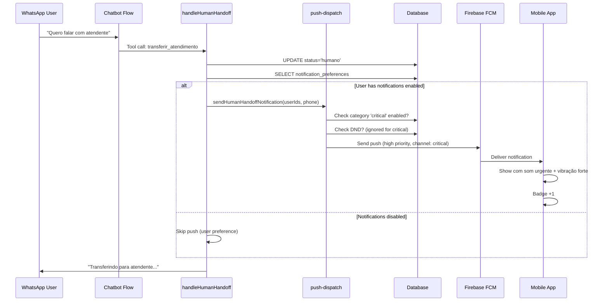

# PLANO: Sistema de Notificações Push Categorizadas

**Data:** 2026-03-15
**Status:** 📋 Planejamento
**Objetivo:** Implementar tipos de notificações com prioridades diferentes e preferências configuráveis pelo usuário.

---

## 1. ANÁLISE DO SISTEMA ATUAL

### 1.1 Arquivos Existentes (Evidência do Checkpoint)

| Arquivo | Propósito | Evidência |
|---------|-----------|-----------|
| `src/lib/pushNotifications.ts` | Helpers de push | Glob lib/*.ts |
| `src/lib/firebase-admin.ts` | Firebase Admin SDK | Glob lib/*.ts |
| `src/lib/push-dispatch.ts` | Dispatch de notificações | Glob lib/*.ts |
| `src/components/PushNotificationsProvider.tsx` | Provider React | Glob components/*.tsx |
| `@capacitor/push-notifications` | Plugin Capacitor | package.json:34 |
| `firebase-admin` | Backend SDK | package.json:73 |

### 1.2 Sistema Atual (Inferido)

**Push flow esperado:**
```
Evento (nova mensagem) → push-dispatch.ts → Firebase Cloud Messaging (FCM) → Mobile App → PushNotificationsProvider → Show notification
```

---

## 2. CATEGORIAS DE NOTIFICAÇÕES (Proposta)

### 2.1 Tipos Propostos

| Categoria | Prioridade | Som | Vibração | Badge | Uso |
|-----------|-----------|------|----------|-------|-----|
| **critical** | Alta | Sim (custom) | Forte | +1 | Transferência humano, erro crítico |
| **important** | Média-Alta | Sim (default) | Média | +1 | Nova mensagem (primeira de conversa) |
| **normal** | Média | Sim | Leve | +1 | Nova mensagem (continuação) |
| **low** | Baixa | Não | Não | Não | Atualizações status, confirmações |
| **marketing** | Baixa | Não | Não | Não | Anúncios, dicas, novidades |

### 2.2 Eventos Mapeados

| Evento | Categoria | Título | Body (exemplo) |
|--------|-----------|--------|----------------|
| Human handoff | **critical** | ⚠️ Transferência para Atendente | "Cliente {phone} solicitou atendente humano" |
| First message in conversation | **important** | 💬 Nova Conversa | "Nova mensagem de {name}" |
| Continuation message | **normal** | 💬 {name} | "Enviou uma mensagem" |
| Message status (read) | **low** | ✓ Lida | "Sua mensagem foi lida" |
| Budget alert (80%) | **important** | 💰 Alerta de Orçamento | "Você atingiu 80% do seu crédito AI" |
| Budget exceeded | **critical** | 🚨 Orçamento Esgotado | "Créditos AI esgotados. Recarregue agora." |
| System update | **marketing** | 🎉 Novidade! | "Nova funcionalidade disponível" |

---

## 3. O QUE FAZER NO FIREBASE CONSOLE

### 3.1 Notification Channels (Android)

**⚠️ NOTA IMPORTANTE:** Channels são criados **no código mobile** (MainActivity.java), NÃO no Firebase Console. Firebase Console é apenas para analytics.

**Configuração esperada (implementar no código):**

```json
// Canal 1: Critical Notifications
{
  "id": "critical_notifications",
  "name": "Notificações Urgentes",
  "description": "Transferências, alertas críticos",
  "importance": "high",
  "sound": "urgent_notification.mp3",
  "vibration": [0, 500, 200, 500]
}

// Canal 2: Important Notifications
{
  "id": "important_notifications",
  "name": "Notificações Importantes",
  "description": "Novas conversas, alertas de orçamento",
  "importance": "high",
  "sound": "default",
  "vibration": [0, 300, 200, 300]
}

// Canal 3: Normal Messages
{
  "id": "normal_messages",
  "name": "Mensagens",
  "description": "Mensagens de conversas existentes",
  "importance": "default",
  "sound": "default",
  "vibration": [0, 200]
}

// Canal 4: Low Priority
{
  "id": "low_priority",
  "name": "Atualizações",
  "description": "Confirmações e status",
  "importance": "low",
  "sound": "none",
  "vibration": "none"
}

// Canal 5: Marketing
{
  "id": "marketing",
  "name": "Novidades",
  "description": "Anúncios e dicas",
  "importance": "low",
  "sound": "none",
  "vibration": "none"
}
```

### 3.2 Firebase Cloud Messaging Setup

**NO FIREBASE CONSOLE:**

1. **Project Settings > Cloud Messaging**
   - Obter `Server Key` (para backend) → copiar para `.env` como `FIREBASE_SERVER_KEY`
   - Obter `Sender ID` (para mobile app) → copiar para config mobile

2. **Firebase Analytics** (opcional)
   - Habilitar analytics para tracking de open rate por categoria
   - Dashboard: "Cloud Messaging" > "Reports"

3. **Custom Sounds**
   - NÃO é configurado no console
   - Adicionar arquivos `.mp3` no app bundle (ver seção 4.5)

---

## 4. O QUE FAZER NO CÓDIGO (Next.js + Capacitor)

### 4.1 Database Schema (Nova Tabela)

**Migration:** `supabase migration new add_notification_preferences`

**Arquivo:** `supabase/migrations/TIMESTAMP_add_notification_preferences.sql`

```sql
-- Tabela de preferências de notificação por usuário
CREATE TABLE notification_preferences (
  id UUID PRIMARY KEY DEFAULT uuid_generate_v4(),
  user_id UUID NOT NULL REFERENCES auth.users(id) ON DELETE CASCADE,
  client_id UUID NOT NULL REFERENCES clients(id) ON DELETE CASCADE,

  -- Preferências por categoria (JSON para flexibilidade)
  preferences JSONB NOT NULL DEFAULT '{
    "critical": {"enabled": true, "sound": true, "vibration": true},
    "important": {"enabled": true, "sound": true, "vibration": true},
    "normal": {"enabled": true, "sound": true, "vibration": true},
    "low": {"enabled": false, "sound": false, "vibration": false},
    "marketing": {"enabled": false, "sound": false, "vibration": false}
  }'::jsonb,

  -- Horários de silêncio (Do Not Disturb)
  dnd_enabled BOOLEAN DEFAULT false,
  dnd_start_time TIME,  -- Ex: '22:00:00'
  dnd_end_time TIME,    -- Ex: '07:00:00'
  dnd_days INTEGER[],   -- [0,6] = domingo e sábado

  -- FCM token (device registration)
  fcm_token TEXT,
  device_type TEXT,     -- 'ios' | 'android'
  device_name TEXT,

  created_at TIMESTAMPTZ DEFAULT NOW(),
  updated_at TIMESTAMPTZ DEFAULT NOW(),

  UNIQUE(user_id, device_type)  -- Um registro por dispositivo
);

-- RLS Policy
CREATE POLICY "Users manage own notification preferences"
ON notification_preferences
FOR ALL
USING (user_id = auth.uid());

-- Index
CREATE INDEX idx_notification_prefs_user ON notification_preferences(user_id);
CREATE INDEX idx_notification_prefs_client ON notification_preferences(client_id);

-- Trigger para updated_at
CREATE TRIGGER update_notification_preferences_updated_at
BEFORE UPDATE ON notification_preferences
FOR EACH ROW
EXECUTE FUNCTION update_updated_at_column();

-- Tabela de log de notificações enviadas (analytics)
CREATE TABLE notification_logs (
  id UUID PRIMARY KEY DEFAULT uuid_generate_v4(),
  user_id UUID NOT NULL REFERENCES auth.users(id),
  client_id UUID NOT NULL REFERENCES clients(id),
  category TEXT NOT NULL,  -- 'critical', 'important', etc.
  title TEXT NOT NULL,
  body TEXT,
  data JSONB,              -- Payload customizado
  sent_at TIMESTAMPTZ DEFAULT NOW(),
  delivered_at TIMESTAMPTZ,
  opened_at TIMESTAMPTZ,
  status TEXT DEFAULT 'sent'  -- 'sent' | 'delivered' | 'opened' | 'failed'
);

CREATE INDEX idx_notification_logs_user_date ON notification_logs(user_id, sent_at DESC);
CREATE INDEX idx_notification_logs_category ON notification_logs(category);
```

**Executar:**
```bash
supabase db push
```

### 4.2 TypeScript Types

**Arquivo:** `src/lib/types.ts` (adicionar ao arquivo existente)

```typescript
// Adicionar ao arquivo existente src/lib/types.ts

export type NotificationCategory =
  | 'critical'
  | 'important'
  | 'normal'
  | 'low'
  | 'marketing'

export interface NotificationPreferences {
  critical: {
    enabled: boolean
    sound: boolean
    vibration: boolean
  }
  important: {
    enabled: boolean
    sound: boolean
    vibration: boolean
  }
  normal: {
    enabled: boolean
    sound: boolean
    vibration: boolean
  }
  low: {
    enabled: boolean
    sound: boolean
    vibration: boolean
  }
  marketing: {
    enabled: boolean
    sound: boolean
    vibration: boolean
  }
}

export interface NotificationConfig {
  category: NotificationCategory
  title: string
  body: string
  data?: Record<string, any>
  imageUrl?: string
  actionButtons?: Array<{
    id: string
    title: string
    action: string
  }>
}

export interface UserNotificationSettings {
  id: string
  user_id: string
  client_id: string
  preferences: NotificationPreferences
  dnd_enabled: boolean
  dnd_start_time?: string
  dnd_end_time?: string
  dnd_days?: number[]
  fcm_token?: string
  device_type?: 'ios' | 'android'
  device_name?: string
}
```

### 4.3 Backend: Push Dispatch Service (Refatorado)

**Arquivo:** `src/lib/push-dispatch.ts` (REFATORAR COMPLETAMENTE)

```typescript
/**
 * Push Dispatch Service - Categorized Notifications
 *
 * Envia notificações push categorizadas respeitando preferências do usuário
 */

import admin from 'firebase-admin'
import { createServiceRoleClient } from './supabase'
import type { NotificationCategory, NotificationConfig } from './types'

// Inicializar Firebase Admin (se ainda não foi)
if (!admin.apps.length) {
  const serviceAccount = JSON.parse(
    process.env.FIREBASE_SERVICE_ACCOUNT_KEY || '{}'
  )
  admin.initializeApp({
    credential: admin.credential.cert(serviceAccount),
  })
}

// Configurações de prioridade por categoria (Android)
const ANDROID_PRIORITY_MAP: Record<NotificationCategory, 'high' | 'default' | 'low'> = {
  critical: 'high',
  important: 'high',
  normal: 'default',
  low: 'low',
  marketing: 'low',
}

// Configurações de channel ID (Android)
const ANDROID_CHANNEL_MAP: Record<NotificationCategory, string> = {
  critical: 'critical_notifications',
  important: 'important_notifications',
  normal: 'normal_messages',
  low: 'low_priority',
  marketing: 'marketing',
}

// Configurações de interruptionLevel (iOS 15+)
const IOS_INTERRUPTION_MAP: Record<NotificationCategory, string> = {
  critical: 'critical',      // Ignora DND, toca sempre
  important: 'time-sensitive', // Toca mesmo em DND se permitido
  normal: 'active',          // Toca normalmente
  low: 'passive',            // Silencioso
  marketing: 'passive',      // Silencioso
}

/**
 * Verifica se está em horário de DND (Do Not Disturb)
 */
const isInDNDPeriod = (
  dndEnabled: boolean,
  dndStartTime?: string,
  dndEndTime?: string,
  dndDays?: number[]
): boolean => {
  if (!dndEnabled || !dndStartTime || !dndEndTime) return false

  const now = new Date()
  const currentDay = now.getDay() // 0 = domingo
  const currentTime = `${now.getHours().toString().padStart(2, '0')}:${now.getMinutes().toString().padStart(2, '0')}:00`

  // Verificar se hoje está nos dias de DND
  if (dndDays && dndDays.length > 0 && !dndDays.includes(currentDay)) {
    return false
  }

  // Verificar se está no horário de DND
  if (dndStartTime <= dndEndTime) {
    // Ex: 22:00 - 07:00 (mesmo dia)
    return currentTime >= dndStartTime && currentTime <= dndEndTime
  } else {
    // Ex: 22:00 - 07:00 (atravessa meia-noite)
    return currentTime >= dndStartTime || currentTime <= dndEndTime
  }
}

/**
 * Envia notificação push categorizada para um usuário
 */
export const sendCategorizedPush = async (
  userId: string,
  config: NotificationConfig
): Promise<{ success: boolean; messageId?: string; error?: string }> => {
  try {
    const supabase = createServiceRoleClient()

    // 1. Buscar preferências do usuário
    const { data: settings, error: settingsError } = await supabase
      .from('notification_preferences')
      .select('*')
      .eq('user_id', userId)
      .single()

    if (settingsError || !settings) {
      console.warn(`No notification settings for user ${userId}`)
      return { success: false, error: 'No notification settings found' }
    }

    // 2. Verificar se categoria está habilitada
    const categoryPrefs = settings.preferences[config.category]
    if (!categoryPrefs?.enabled) {
      console.log(`Category ${config.category} disabled for user ${userId}`)
      return { success: false, error: 'Category disabled by user' }
    }

    // 3. Verificar DND (exceto para critical)
    if (config.category !== 'critical') {
      if (isInDNDPeriod(
        settings.dnd_enabled,
        settings.dnd_start_time,
        settings.dnd_end_time,
        settings.dnd_days
      )) {
        console.log(`User ${userId} in DND period, skipping ${config.category} notification`)
        return { success: false, error: 'User in DND period' }
      }
    }

    // 4. Verificar FCM token
    if (!settings.fcm_token) {
      console.warn(`No FCM token for user ${userId}`)
      return { success: false, error: 'No FCM token' }
    }

    // 5. Construir payload FCM
    const deviceType = settings.device_type || 'android'

    const message: admin.messaging.Message = {
      token: settings.fcm_token,
      notification: {
        title: config.title,
        body: config.body,
        imageUrl: config.imageUrl,
      },
      data: {
        category: config.category,
        ...(config.data || {}),
      },
      android: {
        priority: ANDROID_PRIORITY_MAP[config.category],
        notification: {
          channelId: ANDROID_CHANNEL_MAP[config.category],
          sound: categoryPrefs.sound ? 'default' : undefined,
          priority: ANDROID_PRIORITY_MAP[config.category],
          // Vibração customizada se habilitada
          vibrateTimingsMillis: categoryPrefs.vibration
            ? config.category === 'critical' ? [0, 500, 200, 500]
              : config.category === 'important' ? [0, 300, 200, 300]
              : [0, 200]
            : undefined,
        },
      },
      apns: {
        headers: {
          'apns-priority': config.category === 'critical' || config.category === 'important' ? '10' : '5',
        },
        payload: {
          aps: {
            alert: {
              title: config.title,
              body: config.body,
            },
            sound: categoryPrefs.sound ? 'default' : undefined,
            badge: 1, // Increment badge
            // iOS 15+: interruptionLevel
            'interruption-level': IOS_INTERRUPTION_MAP[config.category],
            // iOS 15+: relevanceScore (0.0 - 1.0)
            'relevance-score': config.category === 'critical' ? 1.0
              : config.category === 'important' ? 0.8
              : config.category === 'normal' ? 0.5
              : 0.2,
          },
        },
      },
    }

    // 6. Adicionar action buttons (se existir)
    if (config.actionButtons && deviceType === 'android') {
      // Android: usar data payload para processar no app
      message.data = {
        ...message.data,
        actions: JSON.stringify(config.actionButtons),
      }
    }

    // 7. Enviar via FCM
    const response = await admin.messaging().send(message)

    // 8. Logar notificação enviada
    await supabase.from('notification_logs').insert({
      user_id: userId,
      client_id: settings.client_id,
      category: config.category,
      title: config.title,
      body: config.body,
      data: config.data || {},
      status: 'sent',
    })

    console.log(`✅ Push sent to user ${userId} (${config.category}):`, response)

    return { success: true, messageId: response }

  } catch (error) {
    console.error('❌ Error sending push notification:', error)
    return { success: false, error: String(error) }
  }
}

/**
 * Envia notificação para múltiplos usuários (broadcast)
 */
export const sendBatchCategorizedPush = async (
  userIds: string[],
  config: NotificationConfig
): Promise<{ sent: number; failed: number }> => {
  const results = await Promise.allSettled(
    userIds.map(userId => sendCategorizedPush(userId, config))
  )

  const sent = results.filter(r => r.status === 'fulfilled' && r.value.success).length
  const failed = results.length - sent

  return { sent, failed }
}

/**
 * Helpers para eventos específicos
 */

export const sendHumanHandoffNotification = async (
  userIds: string[],
  phone: string,
  customerName?: string
) => {
  return sendBatchCategorizedPush(userIds, {
    category: 'critical',
    title: '⚠️ Transferência para Atendente',
    body: `${customerName || phone} solicitou atendimento humano`,
    data: {
      type: 'human_handoff',
      phone,
      action: 'open_chat',
    },
  })
}

export const sendNewMessageNotification = async (
  userId: string,
  phone: string,
  customerName: string,
  messagePreview: string,
  isFirstMessage: boolean
) => {
  return sendCategorizedPush(userId, {
    category: isFirstMessage ? 'important' : 'normal',
    title: isFirstMessage ? `💬 Nova Conversa` : `💬 ${customerName}`,
    body: messagePreview,
    data: {
      type: 'new_message',
      phone,
      action: 'open_conversation',
    },
  })
}

export const sendBudgetAlertNotification = async (
  userId: string,
  percentUsed: number,
  limitBrl: number
) => {
  const isCritical = percentUsed >= 100

  return sendCategorizedPush(userId, {
    category: isCritical ? 'critical' : 'important',
    title: isCritical ? '🚨 Orçamento Esgotado' : '💰 Alerta de Orçamento',
    body: isCritical
      ? `Créditos AI esgotados. Recarregue agora.`
      : `Você atingiu ${percentUsed}% do seu orçamento (R$ ${limitBrl.toFixed(2)})`,
    data: {
      type: 'budget_alert',
      percent_used: percentUsed,
      action: 'open_billing',
    },
  })
}
```

### 4.4 Integração com Chatbot Flow

**Arquivo:** `src/nodes/handleHumanHandoff.ts` (MODIFICAR)

Adicionar no final da função:

```typescript
// Adicionar import no topo
import { sendHumanHandoffNotification } from '@/lib/push-dispatch'

// No final da função handleHumanHandoff, adicionar:

// NOVO: Enviar notificação push para atendentes
try {
  const supabase = createServiceRoleClient()

  // Buscar usuários do cliente que devem receber notificação
  const { data: users } = await supabase
    .from('user_profiles')
    .select('id, user_id')
    .eq('client_id', clientId)
    .eq('is_active', true)
    // Opcional: filtrar por role (ex: somente atendentes/admins)
    // .in('role', ['admin', 'agent'])

  if (users && users.length > 0) {
    const userIds = users.map(u => u.user_id)

    await sendHumanHandoffNotification(
      userIds,
      phone,
      customer.nome || undefined
    )

    console.log(`✅ Push notifications sent to ${userIds.length} users`)
  }
} catch (error) {
  console.error('❌ Error sending handoff push notification:', error)
  // Não falhar o flow por erro de notificação
}
```

**Arquivo:** `src/nodes/saveChatMessage.ts` (MODIFICAR)

Adicionar após salvar mensagem do usuário:

```typescript
// Adicionar import no topo
import { sendNewMessageNotification } from '@/lib/push-dispatch'

// Após salvar mensagem, adicionar:

// NOVO: Se é mensagem do usuário (não do bot), enviar push
if (message.type === 'human') {
  try {
    const supabase = createServiceRoleClient()

    // Verificar se é primeira mensagem da conversa (últimas 24h)
    const { data: recentMessages } = await supabase
      .from('n8n_chat_histories')
      .select('id')
      .eq('client_id', clientId)
      .eq('telefone', phone)
      .gte('created_at', new Date(Date.now() - 24 * 60 * 60 * 1000).toISOString())
      .limit(2)

    const isFirstMessage = !recentMessages || recentMessages.length <= 1

    // Buscar usuários para notificar
    const { data: users } = await supabase
      .from('user_profiles')
      .select('id, user_id')
      .eq('client_id', clientId)
      .eq('is_active', true)

    if (users && users.length > 0) {
      // Buscar nome do cliente
      const { data: customer } = await supabase
        .from('clientes_whatsapp')
        .select('nome')
        .eq('telefone', phone)
        .eq('client_id', clientId)
        .single()

      // Enviar para cada usuário
      for (const user of users) {
        await sendNewMessageNotification(
          user.user_id,
          phone.toString(),
          customer?.nome || phone.toString(),
          content.substring(0, 100), // Preview
          isFirstMessage
        )
      }
    }
  } catch (error) {
    console.error('❌ Error sending new message push:', error)
    // Não falhar o flow
  }
}
```

### 4.5 Mobile: Notification Channels (Android)

**Arquivo:** `android/app/src/main/java/com/chatbot/app/MainActivity.java` (CRIAR/MODIFICAR)

```java
package com.chatbot.app;

import android.app.NotificationChannel;
import android.app.NotificationManager;
import android.os.Build;
import android.os.Bundle;
import com.getcapacitor.BridgeActivity;

public class MainActivity extends BridgeActivity {
  @Override
  public void onCreate(Bundle savedInstanceState) {
    super.onCreate(savedInstanceState);

    // Criar notification channels (Android 8.0+)
    if (Build.VERSION.SDK_INT >= Build.VERSION_CODES.O) {
      createNotificationChannels();
    }
  }

  private void createNotificationChannels() {
    NotificationManager manager = getSystemService(NotificationManager.class);

    // Canal 1: Critical Notifications
    NotificationChannel criticalChannel = new NotificationChannel(
      "critical_notifications",
      "Notificações Urgentes",
      NotificationManager.IMPORTANCE_HIGH
    );
    criticalChannel.setDescription("Transferências, alertas críticos");
    criticalChannel.enableVibration(true);
    criticalChannel.setVibrationPattern(new long[]{0, 500, 200, 500});
    criticalChannel.setShowBadge(true);
    manager.createNotificationChannel(criticalChannel);

    // Canal 2: Important Notifications
    NotificationChannel importantChannel = new NotificationChannel(
      "important_notifications",
      "Notificações Importantes",
      NotificationManager.IMPORTANCE_HIGH
    );
    importantChannel.setDescription("Novas conversas, alertas de orçamento");
    importantChannel.enableVibration(true);
    importantChannel.setVibrationPattern(new long[]{0, 300, 200, 300});
    importantChannel.setShowBadge(true);
    manager.createNotificationChannel(importantChannel);

    // Canal 3: Normal Messages
    NotificationChannel normalChannel = new NotificationChannel(
      "normal_messages",
      "Mensagens",
      NotificationManager.IMPORTANCE_DEFAULT
    );
    normalChannel.setDescription("Mensagens de conversas existentes");
    normalChannel.enableVibration(true);
    normalChannel.setVibrationPattern(new long[]{0, 200});
    normalChannel.setShowBadge(true);
    manager.createNotificationChannel(normalChannel);

    // Canal 4: Low Priority
    NotificationChannel lowChannel = new NotificationChannel(
      "low_priority",
      "Atualizações",
      NotificationManager.IMPORTANCE_LOW
    );
    lowChannel.setDescription("Confirmações e status");
    lowChannel.setShowBadge(false);
    manager.createNotificationChannel(lowChannel);

    // Canal 5: Marketing
    NotificationChannel marketingChannel = new NotificationChannel(
      "marketing",
      "Novidades",
      NotificationManager.IMPORTANCE_LOW
    );
    marketingChannel.setDescription("Anúncios e dicas");
    marketingChannel.setShowBadge(false);
    manager.createNotificationChannel(marketingChannel);
  }
}
```

**Custom Sound (Opcional):**

1. Adicionar arquivo de som: `android/app/src/main/res/raw/urgent_notification.mp3`
2. Modificar channel critical:

```java
import android.net.Uri;
import android.media.AudioAttributes;

Uri soundUri = Uri.parse("android.resource://" + getPackageName() + "/" + R.raw.urgent_notification);
AudioAttributes audioAttributes = new AudioAttributes.Builder()
    .setUsage(AudioAttributes.USAGE_NOTIFICATION)
    .build();
criticalChannel.setSound(soundUri, audioAttributes);
```

### 4.6 Mobile: iOS Configuration

**Arquivo:** `ios/App/App/Info.plist` (MODIFICAR)

Adicionar suporte a interruption levels:

```xml
<key>UIBackgroundModes</key>
<array>
  <string>remote-notification</string>
</array>

<!-- iOS 15+: Suporte a critical alerts -->
<key>UIUserNotificationSettings</key>
<dict>
  <key>UNAuthorizationOptionCriticalAlert</key>
  <true/>
</dict>
```

**Arquivo:** `ios/App/App/AppDelegate.swift` (MODIFICAR)

```swift
import UserNotifications

@UIApplicationMain
class AppDelegate: UIResponder, UIApplicationDelegate {

  func application(_ application: UIApplication,
                   didFinishLaunchingWithOptions launchOptions: [UIApplication.LaunchOptionsKey: Any]?) -> Bool {

    // Solicitar permissão para critical alerts (iOS 15+)
    if #available(iOS 15.0, *) {
      UNUserNotificationCenter.current().requestAuthorization(
        options: [.alert, .sound, .badge, .criticalAlert]
      ) { granted, error in
        print("Critical alerts permission: \(granted)")
      }
    }

    return true
  }
}
```

### 4.7 UI: Página de Configurações de Notificações

**Arquivo:** `src/app/dashboard/settings/notifications/page.tsx` (CRIAR)

```typescript
'use client'

import { useEffect, useState } from 'react'
import { createClientBrowser } from '@/lib/supabase-browser'
import { Card } from '@/components/ui/card'
import { Switch } from '@/components/ui/switch'
import { Label } from '@/components/ui/label'
import { Button } from '@/components/ui/button'
import { toast } from 'react-hot-toast'
import type { NotificationPreferences } from '@/lib/types'

interface CategoryConfig {
  key: keyof NotificationPreferences
  label: string
  description: string
  icon: string
}

const CATEGORIES: CategoryConfig[] = [
  {
    key: 'critical',
    label: 'Urgentes',
    description: 'Transferências para atendente, alertas críticos',
    icon: '⚠️',
  },
  {
    key: 'important',
    label: 'Importantes',
    description: 'Novas conversas, alertas de orçamento',
    icon: '💬',
  },
  {
    key: 'normal',
    label: 'Mensagens',
    description: 'Continuação de conversas existentes',
    icon: '📱',
  },
  {
    key: 'low',
    label: 'Atualizações',
    description: 'Confirmações e atualizações de status',
    icon: '✓',
  },
  {
    key: 'marketing',
    label: 'Novidades',
    description: 'Anúncios, dicas e funcionalidades novas',
    icon: '🎉',
  },
]

export default function NotificationSettingsPage() {
  const [loading, setLoading] = useState(true)
  const [saving, setSaving] = useState(false)
  const [preferences, setPreferences] = useState<NotificationPreferences | null>(null)
  const [dndEnabled, setDndEnabled] = useState(false)
  const [dndStart, setDndStart] = useState('22:00')
  const [dndEnd, setDndEnd] = useState('07:00')

  useEffect(() => {
    fetchPreferences()
  }, [])

  const fetchPreferences = async () => {
    try {
      const supabase = createClientBrowser()
      const { data: { user } } = await supabase.auth.getUser()

      if (!user) return

      const { data, error } = await supabase
        .from('notification_preferences')
        .select('*')
        .eq('user_id', user.id)
        .single()

      if (error && error.code !== 'PGRST116') {
        throw error
      }

      if (data) {
        setPreferences(data.preferences)
        setDndEnabled(data.dnd_enabled || false)
        setDndStart(data.dnd_start_time?.substring(0, 5) || '22:00')
        setDndEnd(data.dnd_end_time?.substring(0, 5) || '07:00')
      } else {
        // Criar preferências padrão
        const { data: profile } = await supabase
          .from('user_profiles')
          .select('client_id')
          .eq('id', user.id)
          .single()

        if (profile) {
          const { data: newPrefs } = await supabase
            .from('notification_preferences')
            .insert({
              user_id: user.id,
              client_id: profile.client_id,
            })
            .select('preferences')
            .single()

          if (newPrefs) {
            setPreferences(newPrefs.preferences)
          }
        }
      }
    } catch (error) {
      console.error('Error fetching preferences:', error)
      toast.error('Erro ao carregar preferências')
    } finally {
      setLoading(false)
    }
  }

  const updatePreference = (
    category: keyof NotificationPreferences,
    field: 'enabled' | 'sound' | 'vibration',
    value: boolean
  ) => {
    if (!preferences) return

    setPreferences({
      ...preferences,
      [category]: {
        ...preferences[category],
        [field]: value,
      },
    })
  }

  const savePreferences = async () => {
    try {
      setSaving(true)
      const supabase = createClientBrowser()
      const { data: { user } } = await supabase.auth.getUser()

      if (!user) return

      const { error } = await supabase
        .from('notification_preferences')
        .update({
          preferences,
          dnd_enabled: dndEnabled,
          dnd_start_time: `${dndStart}:00`,
          dnd_end_time: `${dndEnd}:00`,
        })
        .eq('user_id', user.id)

      if (error) throw error

      toast.success('Preferências salvas com sucesso!')
    } catch (error) {
      console.error('Error saving preferences:', error)
      toast.error('Erro ao salvar preferências')
    } finally {
      setSaving(false)
    }
  }

  if (loading) {
    return <div className="p-6">Carregando...</div>
  }

  if (!preferences) {
    return <div className="p-6">Erro ao carregar preferências</div>
  }

  return (
    <div className="p-6 max-w-4xl mx-auto space-y-6">
      <div>
        <h1 className="text-3xl font-bold">Notificações</h1>
        <p className="text-muted-foreground mt-2">
          Configure quais notificações você deseja receber no aplicativo móvel
        </p>
      </div>

      {/* Categorias de Notificação */}
      <Card className="p-6 space-y-6">
        <div>
          <h2 className="text-xl font-semibold">Tipos de Notificação</h2>
          <p className="text-sm text-muted-foreground mt-1">
            Escolha quais categorias de notificação deseja receber
          </p>
        </div>

        <div className="space-y-4">
          {CATEGORIES.map((category) => {
            const prefs = preferences[category.key]

            return (
              <div key={category.key} className="border rounded-lg p-4 space-y-3">
                <div className="flex items-start justify-between">
                  <div className="flex items-start gap-3">
                    <span className="text-2xl">{category.icon}</span>
                    <div>
                      <Label className="text-base font-medium">{category.label}</Label>
                      <p className="text-sm text-muted-foreground">{category.description}</p>
                    </div>
                  </div>
                  <Switch
                    checked={prefs.enabled}
                    onCheckedChange={(checked) => updatePreference(category.key, 'enabled', checked)}
                  />
                </div>

                {prefs.enabled && (
                  <div className="ml-11 flex gap-6">
                    <div className="flex items-center gap-2">
                      <Switch
                        id={`${category.key}-sound`}
                        checked={prefs.sound}
                        onCheckedChange={(checked) => updatePreference(category.key, 'sound', checked)}
                      />
                      <Label htmlFor={`${category.key}-sound`} className="text-sm">
                        Som
                      </Label>
                    </div>
                    <div className="flex items-center gap-2">
                      <Switch
                        id={`${category.key}-vibration`}
                        checked={prefs.vibration}
                        onCheckedChange={(checked) => updatePreference(category.key, 'vibration', checked)}
                      />
                      <Label htmlFor={`${category.key}-vibration`} className="text-sm">
                        Vibração
                      </Label>
                    </div>
                  </div>
                )}
              </div>
            )
          })}
        </div>
      </Card>

      {/* Modo Não Perturbe */}
      <Card className="p-6 space-y-4">
        <div className="flex items-center justify-between">
          <div>
            <h2 className="text-xl font-semibold">Não Perturbe</h2>
            <p className="text-sm text-muted-foreground mt-1">
              Silenciar notificações em horários específicos (exceto urgentes)
            </p>
          </div>
          <Switch checked={dndEnabled} onCheckedChange={setDndEnabled} />
        </div>

        {dndEnabled && (
          <div className="grid grid-cols-2 gap-4">
            <div>
              <Label htmlFor="dnd-start">Início</Label>
              <input
                id="dnd-start"
                type="time"
                value={dndStart}
                onChange={(e) => setDndStart(e.target.value)}
                className="w-full px-3 py-2 border rounded-lg mt-1"
              />
            </div>
            <div>
              <Label htmlFor="dnd-end">Fim</Label>
              <input
                id="dnd-end"
                type="time"
                value={dndEnd}
                onChange={(e) => setDndEnd(e.target.value)}
                className="w-full px-3 py-2 border rounded-lg mt-1"
              />
            </div>
          </div>
        )}
      </Card>

      {/* Botão Salvar */}
      <div className="flex justify-end">
        <Button onClick={savePreferences} disabled={saving} size="lg">
          {saving ? 'Salvando...' : 'Salvar Preferências'}
        </Button>
      </div>
    </div>
  )
}
```

**Adicionar rota no dashboard/settings:**

Modificar `src/app/dashboard/settings/page.tsx` para incluir link:

```typescript
<Link href="/dashboard/settings/notifications" className="block">
  <Card className="p-6 hover:bg-muted/50 transition-colors cursor-pointer">
    <div className="flex items-center gap-3">
      <span className="text-2xl">🔔</span>
      <div>
        <h3 className="text-lg font-semibold">Notificações</h3>
        <p className="text-sm text-muted-foreground mt-1">
          Configure tipos e horários de notificações push
        </p>
      </div>
    </div>
  </Card>
</Link>
```

---

## 5. CHECKLIST DE IMPLEMENTAÇÃO

### 5.1 Backend (Next.js)

- [ ] **Migration:** Criar `supabase/migrations/TIMESTAMP_add_notification_preferences.sql`
- [ ] **Deploy Migration:** Executar `supabase db push`
- [ ] **Types:** Adicionar types em `src/lib/types.ts`
- [ ] **Push Service:** Refatorar `src/lib/push-dispatch.ts` (categorized push)
- [ ] **Human Handoff:** Modificar `src/nodes/handleHumanHandoff.ts` (adicionar push)
- [ ] **Save Message:** Modificar `src/nodes/saveChatMessage.ts` (adicionar push)
- [ ] **Env Vars:** Adicionar `FIREBASE_SERVER_KEY` em `.env` e Vercel
- [ ] **Test:** Testar envio com curl/Postman

### 5.2 Mobile (Android)

- [ ] **Channels:** Modificar `android/app/src/main/java/com/chatbot/app/MainActivity.java`
- [ ] **(Opcional) Custom Sound:** Adicionar `android/app/src/main/res/raw/urgent_notification.mp3`
- [ ] **Build:** `npm run build:mobile && npm run cap:sync`
- [ ] **Test Device:** Instalar em device físico Android
- [ ] **Verify Channels:** Configurações > Apps > UzzApp > Notificações (verificar 5 canais)
- [ ] **Test Notifications:** Enviar cada categoria via backend

### 5.3 Mobile (iOS)

- [ ] **Permissions:** Modificar `ios/App/App/Info.plist`
- [ ] **Critical Alerts:** Modificar `ios/App/App/AppDelegate.swift`
- [ ] **Build:** `npx cap open ios` > Build
- [ ] **Test Device:** Instalar em device físico iOS
- [ ] **Verify Permissions:** Verificar critical alerts permission granted
- [ ] **Test Notifications:** Enviar cada categoria via backend

### 5.4 UI (Dashboard)

- [ ] **Page:** Criar `src/app/dashboard/settings/notifications/page.tsx`
- [ ] **Link:** Adicionar link em `src/app/dashboard/settings/page.tsx`
- [ ] **Test Toggles:** Testar habilitar/desabilitar cada categoria
- [ ] **Test DND:** Configurar horário DND, testar salvar
- [ ] **Test Persistence:** Recarregar página, verificar preferências salvas

### 5.5 Firebase Console

- [ ] **Access Console:** https://console.firebase.google.com
- [ ] **Get Server Key:** Project Settings > Cloud Messaging > Server Key → copiar
- [ ] **Add to Env:** Adicionar em `.env` como `FIREBASE_SERVER_KEY`
- [ ] **Enable Analytics:** (Opcional) Habilitar Cloud Messaging analytics
- [ ] **(Opcional) Test Send:** Testar envio manual via console

### 5.6 Testing End-to-End

- [ ] **Test 1:** Human handoff → App recebe notificação critical?
- [ ] **Test 2:** Nova conversa → App recebe notificação important?
- [ ] **Test 3:** Mensagem continuação → App recebe notificação normal?
- [ ] **Test 4:** Desabilitar categoria → Notificação bloqueada?
- [ ] **Test 5:** Ativar DND → Notificações normal/important bloqueadas?
- [ ] **Test 6:** DND ativo + critical → Notificação critical ainda chega?
- [ ] **Test 7:** Budget alert → Notificação important recebida?
- [ ] **Test 8:** Som desabilitado → Notificação silenciosa?
- [ ] **Test 9:** Vibração desabilitada → Sem vibração?
- [ ] **Test 10:** iOS interruption levels → Critical ignora DND?

---

## 6. EXEMPLO DE FLUXO COMPLETO

### Cenário: Transferência para Humano



---

## 7. ESTIMATIVA DE ESFORÇO

| Tarefa | Tempo | Complexidade | Responsável |
|--------|-------|--------------|-------------|
| Migration + Types | 1h | Baixa | Backend Dev |
| Refatorar push-dispatch.ts | 3h | Média | Backend Dev |
| Modificar nodes (handoff, saveMessage) | 2h | Baixa | Backend Dev |
| UI Settings page | 4h | Média | Frontend Dev |
| Android channels (MainActivity) | 2h | Média | Mobile Dev |
| iOS configuration (Info.plist, AppDelegate) | 2h | Média | Mobile Dev |
| Testing E2E (todas categorias) | 4h | Alta | QA |
| **TOTAL** | **18h** | **Média** | **3 devs** |

**Distribuição recomendada:**
- **Backend:** 6h (migration + push service + nodes)
- **Frontend:** 4h (UI settings page)
- **Mobile:** 4h (Android + iOS config)
- **QA:** 4h (testing completo)

---

## 8. VARIÁVEIS DE AMBIENTE NECESSÁRIAS

**Adicionar em `.env.local` e Vercel:**

```env
# Firebase Admin (Push Notifications)
FIREBASE_SERVICE_ACCOUNT_KEY={"type":"service_account","project_id":"..."}
FIREBASE_SERVER_KEY=AAAA...

# Opcional: se quiser override do sender ID
FIREBASE_SENDER_ID=123456789012
```

**Como obter:**

1. **FIREBASE_SERVICE_ACCOUNT_KEY:**
   - Firebase Console > Project Settings > Service Accounts
   - Click "Generate new private key"
   - Download JSON, copiar conteúdo completo

2. **FIREBASE_SERVER_KEY:**
   - Firebase Console > Project Settings > Cloud Messaging
   - Copiar "Server key" (legacy, mas ainda funciona)

---

## 9. TROUBLESHOOTING

### 9.1 Notificações não chegam

**Checklist:**
- [ ] FCM token registrado no DB? (`SELECT fcm_token FROM notification_preferences`)
- [ ] Firebase Server Key correto em `.env`?
- [ ] App tem permissões? (iOS: Settings > UzzApp > Notifications)
- [ ] Categoria habilitada? (`preferences.critical.enabled = true`)
- [ ] DND não está bloqueando? (testar com critical que ignora DND)
- [ ] Android: Channels criados? (Settings > Apps > UzzApp > Notifications > ver 5 canais)

**Debug:**
```bash
# Ver logs FCM no backend
vercel logs --follow

# Ver notification_logs no DB
SELECT * FROM notification_logs ORDER BY sent_at DESC LIMIT 10;
```

### 9.2 Notificações chegam mas sem som/vibração

**Possíveis causas:**
- Preferência de som/vibração desabilitada no DB
- Android: Channel configurado como IMPORTANCE_LOW
- iOS: App em modo "Do Not Disturb" global
- Device em modo silencioso (hardware)

**Fix:**
- Verificar `preferences.critical.sound = true` e `.vibration = true`
- Android: Recriar channels com IMPORTANCE_HIGH
- iOS: Testar com `interruption-level: critical`

### 9.3 Critical alerts não funcionam no iOS

**Requisitos:**
- iOS 15+ (interruption levels)
- Permission `UNAuthorizationOptionCriticalAlert` solicitada
- User precisa aprovar critical alerts explicitamente

**Fix:**
- Verificar `Info.plist` tem `UNAuthorizationOptionCriticalAlert`
- Re-solicitar permissão com `.criticalAlert` option
- User pode ter negado → pedir para ir em Settings e habilitar

---

## 10. PRÓXIMOS PASSOS APÓS IMPLEMENTAÇÃO

### 10.1 Analytics

- [ ] Dashboard de métricas de notificações
  - Open rate por categoria
  - Delivery rate
  - Opt-out rate
- [ ] Query exemplo:
```sql
SELECT
  category,
  COUNT(*) as sent,
  COUNT(CASE WHEN delivered_at IS NOT NULL THEN 1 END) as delivered,
  COUNT(CASE WHEN opened_at IS NOT NULL THEN 1 END) as opened,
  ROUND(100.0 * COUNT(CASE WHEN opened_at IS NOT NULL THEN 1 END) / COUNT(*), 2) as open_rate_percent
FROM notification_logs
WHERE sent_at > NOW() - INTERVAL '30 days'
GROUP BY category
ORDER BY open_rate_percent DESC;
```

### 10.2 Melhorias Futuras

1. **Rich Notifications:**
   - Adicionar imagens (ex: foto do cliente que enviou mensagem)
   - Action buttons (ex: "Responder", "Marcar como lida")

2. **Notificações Agrupadas:**
   - Agrupar múltiplas mensagens do mesmo cliente
   - "3 novas mensagens de João Silva"

3. **Smart Timing:**
   - ML para detectar quando user mais engaja
   - Enviar em horário otimizado (exceto critical)

4. **A/B Testing:**
   - Testar diferentes copy de títulos/bodies
   - Testar com/sem emojis
   - Medir open rate

5. **Notificações In-App:**
   - Toast notifications dentro do dashboard web
   - Complementar push notifications mobile

6. **Web Push:**
   - Adicionar suporte a web push (PWA)
   - Usar Web Push API + Service Workers

---

## 11. REFERÊNCIAS

- [Firebase Cloud Messaging Docs](https://firebase.google.com/docs/cloud-messaging)
- [Android Notification Channels](https://developer.android.com/develop/ui/views/notifications/channels)
- [iOS Interruption Levels](https://developer.apple.com/documentation/usernotifications/unnotificationinterruptionlevel)
- [Capacitor Push Notifications](https://capacitorjs.com/docs/apis/push-notifications)
- [Firebase Admin SDK Node.js](https://firebase.google.com/docs/admin/setup)

---

**📋 FIM DO PLANO**

**Status:** Pronto para implementação

**Última atualização:** 2026-03-15

**Próxima ação:** Revisar com equipe técnica e aprovar para sprint
