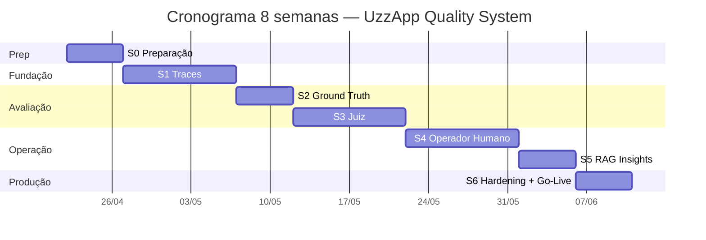
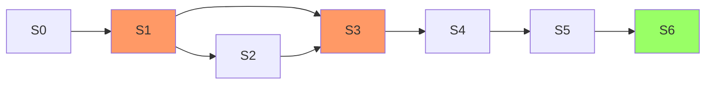

# Plano Mestre — Observabilidade, Feedback e Controle (UzzApp)

> **Documento mestre** do programa que entrega ao UzzApp um sistema de **observabilidade**, **avaliação automática (juiz LLM)**, **feedback humano** e **loop de melhoria** para o agente de WhatsApp.
> Inspirado no caso Jota.ai (200–300 → 2–3 tickets/dia) — ver `docs/VERSAO RAG MAPEAMAENTO SISTEMA/PLAN.md`.

**Versão:** 2.0 (aprimorada com checklists e baterias de testes por sprint)
**Owner técnico:** Pedro Pagliarin
**Data base:** 2026-04-19
**Duração total estimada:** 8 semanas (6 sprints + Sprint 0 de prep)

---

## 1. Sumário executivo

### 1.1 Problema

O UzzApp não enxerga o que o agente de WhatsApp faz por mensagem:

- ❌ **Não há trace** por estágio (custo, latência, modelo, chunks, tokens).
- ❌ **Não há gabarito (ground truth)** para comparar respostas.
- ❌ **Não há juiz automático** — toda avaliação seria manual.
- ❌ **Não há feedback humano estruturado** que volte ao sistema.
- ❌ **Decisões de qualidade são por achismo** — não por dados.

### 1.2 Solução (5 módulos)

| # | Módulo | Sprint | Pergunta que responde |
|---|--------|--------|-----------------------|
| 1 | **Observabilidade (traces)** | S1 | "O que aconteceu nesta mensagem?" |
| 2 | **Ground Truth** | S2 | "Qual era a resposta certa?" |
| 3 | **Juiz automático** | S3 | "Esta resposta foi boa?" |
| 4 | **Feedback humano** | S4 | "Operador concorda? Como corrigir?" |
| 5 | **Insights de RAG + loop** | S5 | "Por que foi ruim? Como melhorar?" |
| 6 | **Hardening & escala** | S6 | "Aguenta produção, é seguro, é barato?" |

### 1.3 Resultado esperado (8 semanas)

| Indicador | Baseline (hoje) | Meta (S6) |
|-----------|-----------------|-----------|
| Visibilidade de custo por dia | Desconhecido | < 5s |
| Score automático em mensagens | 0% | 20% (sample) |
| Entradas de ground truth | 0 | 100+ |
| Conversas revisadas/dia (humano) | 0 | 50–100 |
| Tempo médio de revisão de FAIL | Não medido | < 90s |
| Custo do juiz (mensal) | — | < R$ 300/mês |

---

## 2. Stack técnica completa

> Documento dedicado: [`sprints/00-stack-e-arquitetura.md`](sprints/00-stack-e-arquitetura.md)

### 2.1 Stack já existente (reaproveitado)

| Camada | Tecnologia | Onde |
|--------|-----------|------|
| Runtime | Next.js 14 (App Router) + TypeScript + Vercel serverless | `src/app/**` |
| Banco | Supabase PostgreSQL + Vault + pgvector | `supabase/migrations/**` |
| Fila/cache | Redis (batching de mensagens) | `src/lib/redis/**` |
| Embeddings | OpenAI `text-embedding-3-small` (1536 dims) | `src/lib/openai.ts` |
| Geração | Groq Llama 3.3 70B / OpenAI GPT-4o (via `callDirectAI`) | `src/lib/direct-ai-client.ts` |
| Multi-tenant | Supabase Vault (chaves por cliente) | `src/lib/vault.ts` |
| Auth/RBAC | Supabase Auth + `user_profiles` | `src/lib/auth-helpers.ts` |
| Tracking de custo | `gateway_usage_logs` + `client_budgets` | `src/lib/unified-tracking.ts` |

### 2.2 Stack nova (introduzida pelo programa)

| Camada | Tecnologia | Justificativa |
|--------|-----------|---------------|
| **Juiz LLM** | Anthropic Claude 3.5 Sonnet (`@anthropic-ai/sdk`) | Melhor em raciocínio avaliativo; validado pela Jota.ai; ADR-001 |
| **Validação de schemas** | `zod` | Já presente no projeto; valida JSON do juiz |
| **Testes unitários** | `vitest` | Padrão moderno, rápido, ESM nativo |
| **Mock HTTP** | `msw` (Mock Service Worker) | Mock determinístico de Anthropic/OpenAI |
| **Testes de API** | `supertest` + Next.js test handler | Cobertura de rotas serverless |
| **Testes E2E** | `playwright` | UI do operador (Sprint 4) |
| **Eval suite** | Script TS custom (`scripts/eval-suite.ts`) | Regressão de qualidade pré-deploy |
| **Carga** | `k6` ou `autocannon` | Testes de Sprint 6 |
| **Fila assíncrona** | `setImmediate` (S3) → Supabase `pgmq` ou cron (S6) | Off-the-critical-path |

### 2.3 Diagrama de alto nível

```mermaid
flowchart TB
    WA[WhatsApp] --> WH[Webhook /api/webhook/clientId]
    WH --> FLOW[chatbotFlow.ts]
    FLOW --> RESP[Resposta enviada ao usuário]
    
    FLOW -.NOVO.-> TL[trace-logger]
    TL --> MT[(message_traces)]
    TL --> RT[(retrieval_traces)]
    
    RESP -.fire-and-forget.-> WORK[evaluation-worker]
    WORK --> GTM[ground-truth-matcher]
    GTM --> GT[(ground_truth)]
    WORK --> JUDGE[evaluation-engine<br/>Claude 3.5]
    JUDGE --> AE[(agent_evaluations)]
    
    AE --> UI[/dashboard/quality]
    UI --> OP[Operador]
    OP --> HF[(human_feedback)]
    HF -.loop.-> GT
```

---

## 3. Princípios fundamentais

1. **Observabilidade antes do juiz** — sem traces confiáveis, scores não auditam nada.
2. **Multi-tenant sempre** — `client_id` em toda query; RLS via `user_profiles` (não `auth.users` direto).
3. **Off-the-critical-path** — avaliação assíncrona; webhook nunca bloqueia esperando juiz.
4. **Custo controlado** — sampling 20% inicial + 100% em reincidentes; teto diário com alerta.
5. **Embeddings padronizados** — `text-embedding-3-small` (1536 dims) em **TUDO** novo (não `ada-002`).
6. **Imutabilidade de GT** — updates criam nova versão; nunca destroem histórico (ADR-003).
7. **Idempotência ponta-a-ponta** — `whatsapp_message_id` é a chave; reprocessamento é seguro.
8. **Testes acompanham código** — cada PR de feature tem PR de teste no mesmo commit (ou anterior).

---

## 4. Estrutura dos sprints

| Sprint | Tema | Duração | Documento |
|--------|------|---------|-----------|
| **S0** | Preparação (sampling, Vault, RLS, spike) | 3–5 dias | [`sprints/00-sprint-zero-prep.md`](sprints/00-sprint-zero-prep.md) |
| **S1** | Fundação: traces e instrumentação | 1–2 sem | [`sprints/01-traces-fundacao.md`](sprints/01-traces-fundacao.md) |
| **S2** | Ground truth + matcher + UI básica | 1 sem | [`sprints/02-ground-truth.md`](sprints/02-ground-truth.md) |
| **S3** | Juiz automático + worker + sampling | 1–2 sem | [`sprints/03-juiz-automatico.md`](sprints/03-juiz-automatico.md) |
| **S4** | Operador humano + 3 painéis + atalhos | 1–2 sem | [`sprints/04-feedback-humano.md`](sprints/04-feedback-humano.md) |
| **S5** | Insights de RAG + chunking + loop fechado | 1 sem | [`sprints/05-rag-insights.md`](sprints/05-rag-insights.md) |
| **S6** | Hardening, LGPD, fila confiável, CI, go-live | 1 sem | [`sprints/06-hardening-go-live.md`](sprints/06-hardening-go-live.md) |
| **QA** | Estratégia geral de testes (transversal) | — | [`sprints/QA-STRATEGY.md`](sprints/QA-STRATEGY.md) |

Cada documento de sprint contém:

- **Objetivo + Definition of Done**
- **Backlog detalhado por arquivo** (novo vs modificar)
- **Checklist completo de afazeres** (dev → review → deploy)
- **Bateria de testes rigorosa** (unit, integration, contract, perf, security, manual)
- **Critérios de aceite mensuráveis**
- **Riscos e mitigação por sprint**

---

## 5. Cronograma e dependências



### 5.1 Dependências críticas



**Bloqueadores:**

- **S3 depende de S1 + S2** (precisa de traces e GT para o juiz funcionar).
- **S4 depende de S3** (sem score, painel de operador é vazio).
- **S5 e S6 não bloqueiam entrega parcial** — produto já é útil ao final de S4.

---

## 6. Métricas de sucesso (por sprint)

| Sprint | Métrica primária | Meta | Como medir |
|--------|-----------------|------|------------|
| S1 | Latência adicional do trace logger | < 50ms p95 por mensagem | Benchmark vs baseline |
| S1 | % de mensagens com trace completo | > 99% | `SELECT COUNT(*) FROM message_traces WHERE webhook_received_at IS NULL` |
| S2 | Tempo de criar 1 GT entry (UI) | < 60s | Cronômetro manual em smoke test |
| S2 | Acurácia do matcher (top-1 cosine) | > 85% em dataset de 30 casos | Eval suite |
| S3 | % de mensagens avaliadas (sample) | 20% ± 2% (estatístico) | `SELECT COUNT(*) FROM agent_evaluations / COUNT(*) FROM message_traces` |
| S3 | Custo médio do juiz por avaliação | < $0.02 | `SELECT AVG(cost_usd) FROM agent_evaluations` |
| S3 | Concordância juiz vs humano | > 75% (Cohen's kappa) | Calculado em script após N revisões |
| S4 | Tempo médio de revisão por operador | < 90s para FAIL | Telemetria do front (timer abrir → submit) |
| S5 | Redução do `relevance_score` ruim após reprocessing | > 15% | Antes/depois em janela de 7 dias |
| S6 | p99 de latência do webhook | < 3s (sem regressão) | Vercel analytics / log |
| S6 | Disponibilidade do juiz | > 99% mensal | Logs de falhas em `evaluation_worker` |

---

## 7. Riscos transversais e mitigação

| # | Risco | Probabilidade | Impacto | Mitigação |
|---|-------|---------------|---------|-----------|
| R1 | Worker morre no serverless antes de avaliar | Alta | Médio | Idempotência por `trace_id`; reprocessamento via cron (S6) |
| R2 | Custo do juiz explode (sampling falha) | Média | Alto | Teto diário em `client_budgets`; alerta a partir de 80% |
| R3 | RLS incorreto vaza tenant | Baixa | **Crítico** | Testes obrigatórios com 2 `client_id` em todo PR; revisão de policies |
| R4 | Embedding inconsistente (modelos diferentes) | Média | Alto | Padronizar `text-embedding-3-small`; validar dim 1536 em runtime |
| R5 | Pipeline atual já usa `pg` (proibido) — novo código pioraria | Alta | Médio | Code review proíbe `pg.query` em rotas novas; usar Supabase client |
| R6 | Operador não usa o painel (UX ruim) | Média | Alto | Dogfooding na equipe na semana de S4; atalhos de teclado obrigatórios |
| R7 | Juiz alucina scores (JSON malformado) | Média | Médio | `zod` valida schema; retry com `response_format: json_object`; fallback REVIEW |
| R8 | Anthropic API down | Baixa | Alto | Trace fica `pending`; cron reprocessa quando voltar; não bloqueia produção |
| R9 | LGPD: dados pessoais em prompts logados | Alta | **Crítico** | Sanitização de PII (CPF, telefone parcial) antes de salvar `user_message` |
| R10 | Migration grande quebra produção | Média | **Crítico** | Migrations fatiadas por sprint; backup antes; testar em branch temporária do Supabase |

---

## 8. Estratégia de testes (resumo)

> Documento completo: [`sprints/QA-STRATEGY.md`](sprints/QA-STRATEGY.md)

**Pirâmide de testes:**

```
        /\
       /E2\         ← Playwright (UI operador, S4)
      /----\
     / Integ \       ← API + DB real (test schema), msw para Anthropic
    /--------\
   /   Unit   \      ← vitest, funções puras, mocks
  /------------\
```

**Cobertura mínima por tipo:**

| Tipo | Cobertura alvo | Onde |
|------|---------------|------|
| Unit | 80% em `src/lib/**` novo | trace-logger, evaluation-engine, ground-truth-matcher |
| Integration | 100% das APIs novas | `/api/traces`, `/api/ground-truth`, `/api/evaluations` |
| Contract | 100% dos schemas externos | JSON do juiz, payload do webhook |
| E2E | Fluxos críticos (3 mín.) | Operador revisa FAIL; cria GT; promote-to-GT |
| Performance | Webhook + worker | Latência adicional < 50ms; carga 100 msg/min |
| Security | RLS + sanitização PII | Todo PR com nova tabela ou rota |
| Eval suite | 100 casos curados | Pré-deploy obrigatório (CI) |

---

## 9. Convenções de código

> Reforçar regras já existentes em `CLAUDE.md`:

- **Sem `pg.query` em código novo** — sempre Supabase client (Supavisor pooler).
- **Webhook continua `await` completo** — `setImmediate` apenas para enfileirar avaliação após resposta enviada.
- **Funções puras** em `src/nodes/**` — sem side-effects além do explícito.
- **`const` apenas** (sem `let`/`var`); arrow functions; sem classes (exceção: `MessageTraceLogger` é stateful, mas pode ser fábrica de funções).
- **Naming semântico** — `evaluateAgentResponse`, não `evaluate`.
- **Comentários só onde o "porquê" não é óbvio** (regra do CLAUDE.md).
- **Toda rota nova:** `export const dynamic = 'force-dynamic'`.

---

## 10. Cruzamento com Agente V2

> Documento: [`PLANO_ARQUITETURA_AGENTE_V2.md`](PLANO_ARQUITETURA_AGENTE_V2.md)

| Onde encaixa | Como | Sprint |
|--------------|------|--------|
| `message_traces.metadata` JSONB | Reservar campo para `capability_key`, `policy_version` | S1 |
| Métricas por capability | Quando V2 existir, agregação por capability é natural | S5 |
| Não bloquear V2 | S1–S4 entregam valor sem V2 | — |

**Decisão:** **não bloquear** este programa em V2; reservar `metadata JSONB` em todas as tabelas para evitar migration dupla.

---

## 11. LGPD e segurança

> Detalhado em S6: [`sprints/06-hardening-go-live.md`](sprints/06-hardening-go-live.md)

| Item | Implementação | Sprint |
|------|---------------|--------|
| RLS por `client_id` em todas as 5 tabelas novas | Política via `user_profiles` | S1–S4 |
| Sanitização de PII em logs (CPF, cartão, senha) | Função `sanitizePII()` em `trace-logger` | S1 |
| Retenção de traces | TTL 90 dias via cron + soft-delete | S6 |
| Direito ao esquecimento | `DELETE /api/contacts/[phone]/traces` | S6 |
| Cláusula de avaliação automática nos ToS | Jurídico revisa | S6 |

---

## 12. Glossário

| Termo | Definição |
|-------|-----------|
| **Trace** | Registro completo do que aconteceu com uma mensagem (latências, custo, modelo, chunks) |
| **Ground Truth (GT)** | Par `pergunta → resposta esperada` curado, usado como gabarito |
| **Juiz / Judge** | LLM (Claude 3.5) que avalia resposta do agente em 4 dimensões |
| **Composite score** | Score ponderado: `0.4·alignment + 0.2·relevance + 0.3·finality + 0.1·safety` |
| **Verdict** | `PASS` (≥7), `REVIEW` (4–7), `FAIL` (<4) |
| **Sampling** | % de mensagens efetivamente avaliadas (20% inicial) |
| **Reavaliação** | Re-rodar juiz em traces antigos quando GT muda |
| **Eval suite** | Script de regressão com 100 casos curados |

---

## 13. Próximos passos

1. **Aprovar este plano** com stakeholder técnico.
2. **Provisionar Anthropic API key** no Vault (pré-requisito S0).
3. **Iniciar Sprint 0** — checklist em [`sprints/00-sprint-zero-prep.md`](sprints/00-sprint-zero-prep.md).
4. Após S0, executar S1–S6 em ordem.

---

## Anexos

- [`sprints/00-stack-e-arquitetura.md`](sprints/00-stack-e-arquitetura.md) — stack detalhada e diagramas
- [`sprints/00-sprint-zero-prep.md`](sprints/00-sprint-zero-prep.md) — preparação (5 dias)
- [`sprints/01-traces-fundacao.md`](sprints/01-traces-fundacao.md) — Sprint 1
- [`sprints/02-ground-truth.md`](sprints/02-ground-truth.md) — Sprint 2
- [`sprints/03-juiz-automatico.md`](sprints/03-juiz-automatico.md) — Sprint 3
- [`sprints/04-feedback-humano.md`](sprints/04-feedback-humano.md) — Sprint 4
- [`sprints/05-rag-insights.md`](sprints/05-rag-insights.md) — Sprint 5
- [`sprints/06-hardening-go-live.md`](sprints/06-hardening-go-live.md) — Sprint 6
- [`sprints/QA-STRATEGY.md`](sprints/QA-STRATEGY.md) — estratégia transversal de testes

---

*Documento mestre v2.0 — atualizar quando datas, escopo ou métricas mudarem.*
