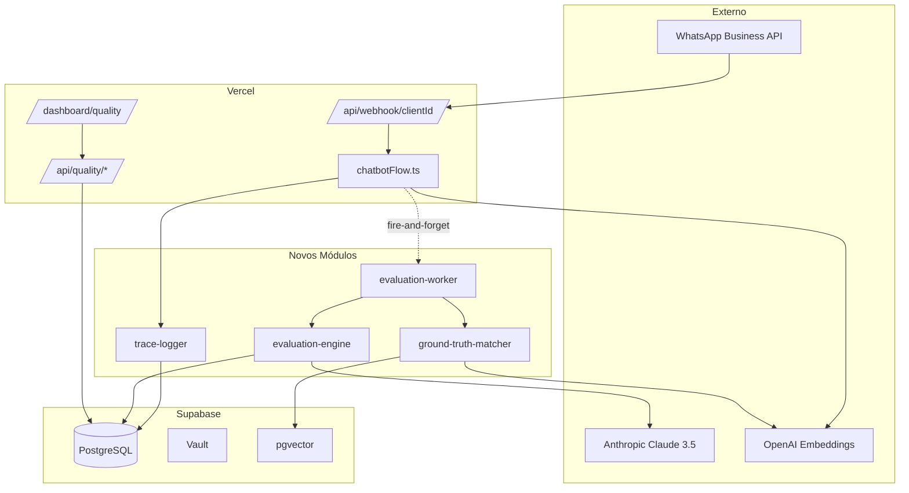
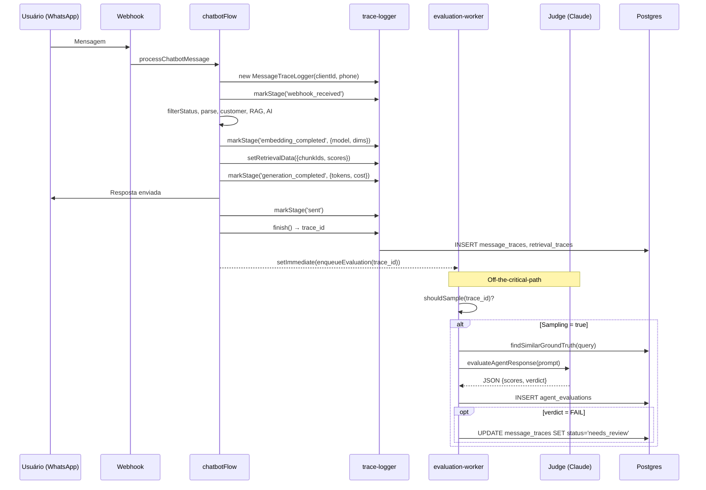
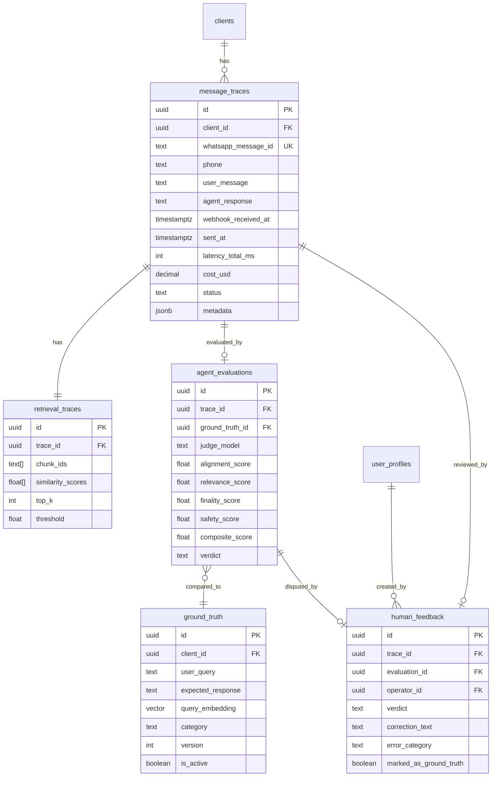

# Stack Tecnológica e Arquitetura — Sistema de Qualidade UzzApp

> Documento de referência transversal. Citado por todos os sprints.

---

## 1. Stack consolidada

### 1.1 Stack já existente (reaproveitamento)

| Camada | Tecnologia | Versão | Uso |
|--------|-----------|--------|-----|
| Runtime | Next.js | 16 (App Router) | Webhook, APIs, Dashboard |
| Lang | TypeScript | 5.x | Toda codebase |
| Hospedagem | Vercel (serverless) | — | Functions com timeout 60s (Pro) |
| Banco | Supabase PostgreSQL | 15+ | Tabelas + Vault + pgvector |
| Vetores | pgvector | 0.5+ | RAG e GT matching |
| Cache/fila | Redis | 7 | Batching de mensagens (30s) |
| Auth/RBAC | Supabase Auth + `user_profiles` | — | RLS multi-tenant |
| Embeddings | OpenAI `text-embedding-3-small` | — | 1536 dims (PADRÃO) |
| LLM gerador | Groq Llama 3.3 70B / OpenAI GPT-4o | — | Via `callDirectAI()` |
| Tracking custo | Tabelas `gateway_usage_logs`, `client_budgets` | — | `unified-tracking.ts` |
| WhatsApp | Meta Business API | v18.0 | Webhook + envio |

### 1.2 Stack nova (introduzida)

| Camada | Lib/Tech | Por quê |
|--------|----------|---------|
| **Juiz LLM** | `@anthropic-ai/sdk` ^0.30.0 | Claude 3.5 Sonnet como avaliador |
| **Validação** | `zod` ^3.x (já presente) | Schemas dos JSONs do juiz e APIs |
| **Test runner** | `vitest` ^1.x | Rápido, ESM nativo, compatível com TS |
| **HTTP mock** | `msw` ^2.x | Mock determinístico de Anthropic e OpenAI |
| **API testing** | `supertest` + Next.js test handler | Cobertura de rotas |
| **E2E** | `@playwright/test` | UI do operador |
| **Carga** | `autocannon` ou `k6` | Sprint 6 |
| **Coverage** | `@vitest/coverage-v8` | Cobertura de código |
| **Linter** | ESLint + plugin TS (já presente) | — |

### 1.3 Variáveis de ambiente novas

```env
# Anthropic (juiz)
ANTHROPIC_API_KEY=sk-ant-api03-xxxxx          # Plataforma OU por tenant via Vault

# Sistema de avaliação
EVALUATION_SAMPLING_RATE=0.20                 # 20% inicial
EVALUATION_MAX_DAILY_USD=10                   # Teto diário (alerta a partir de 80%)
EVALUATION_JUDGE_MODEL=claude-3-5-sonnet-20240620
EVALUATION_JUDGE_PROMPT_VERSION=v1            # Versionamento de prompts

# Retenção LGPD
TRACE_RETENTION_DAYS=90                       # TTL de message_traces
PII_SANITIZATION_ENABLED=true                 # Sanitização de logs

# Eval suite (CI)
EVAL_SUITE_FAIL_THRESHOLD=0.85                # 85% dos casos devem passar
```

### 1.4 Vault (secrets por cliente)

| Secret | Escopo | Quando |
|--------|--------|--------|
| `ANTHROPIC_API_KEY_<clientId>` | Por tenant | Se cada cliente quiser usar sua própria chave |
| `OPENAI_API_KEY_<clientId>` | Por tenant | Já existente |

**Decisão (S0):** começar com chave Anthropic **da plataforma** (mais simples); migrar para per-tenant se algum cliente exigir.

---

## 2. Arquitetura completa (com novos módulos)

### 2.1 Diagrama de componentes



### 2.2 Pipeline antes vs depois

**Antes (hoje):**

```
WA → Webhook → 14 nodes → resposta enviada → fim
```

**Depois (S6):**

```
WA → Webhook → 14 nodes (instrumentados com trace-logger) → resposta enviada
                                                                 │
                                                          [setImmediate]
                                                                 ▼
                                                       evaluation-worker
                                                       ├── sampling decision
                                                       ├── ground-truth-matcher
                                                       ├── evaluation-engine (Claude 3.5)
                                                       ├── persist agent_evaluations
                                                       └── alerta se FAIL
                                                                 │
                                                                 ▼
                                                       Operador revisa em /dashboard/quality
                                                       └── correção → human_feedback → ground_truth
```

### 2.3 Fluxo de dados (trace de uma mensagem)



---

## 3. Modelo de dados (visão consolidada)



---

## 4. Convenções

### 4.1 Naming de arquivos

| Padrão | Onde | Exemplo |
|--------|------|---------|
| `kebab-case.ts` | `src/lib/**` | `evaluation-engine.ts` |
| `camelCase.ts` | `src/nodes/**` | `getRAGContext.ts` |
| `PascalCase.tsx` | `src/components/**` | `EvaluationList.tsx` |
| `route.ts` | `src/app/api/**` | `src/app/api/traces/route.ts` |
| `*.test.ts` | colocalizado | `evaluation-engine.test.ts` |
| `*.spec.ts` | E2E (Playwright) | `operator-review.spec.ts` |

### 4.2 Migrations

```
supabase/migrations/YYYYMMDDHHMMSS_<verbo>_<entidade>.sql
```

Exemplos:
- `20260422120000_create_message_traces.sql`
- `20260423090000_create_ground_truth.sql`
- `20260429140000_add_metadata_jsonb_to_traces.sql`

**Regras:**
- Uma migration por sprint (ou no máximo 2 — uma para tabelas, outra para RLS/funcs).
- **Sempre** habilitar RLS na mesma migration que cria a tabela.
- **Sempre** índice em `client_id` em tabelas multi-tenant.
- **Nunca** `DROP COLUMN` em produção sem migration de reversão preparada.

### 4.3 RLS (Row Level Security)

Padrão obrigatório para tabelas novas:

```sql
ALTER TABLE <tabela> ENABLE ROW LEVEL SECURITY;

CREATE POLICY "<tabela>_tenant_isolation" ON <tabela>
  FOR ALL
  USING (
    client_id IN (
      SELECT client_id FROM user_profiles WHERE id = auth.uid()
    )
  )
  WITH CHECK (
    client_id IN (
      SELECT client_id FROM user_profiles WHERE id = auth.uid()
    )
  );

-- Service role bypass (para webhook serverless):
CREATE POLICY "<tabela>_service_role" ON <tabela>
  FOR ALL
  TO service_role
  USING (true)
  WITH CHECK (true);
```

### 4.4 API routes (padrão obrigatório)

```typescript
// src/app/api/<recurso>/route.ts
import { NextRequest, NextResponse } from 'next/server'
import { z } from 'zod'
import { createServerClient } from '@/lib/supabase'
import { getCurrentUserClientId } from '@/lib/auth-helpers'

export const dynamic = 'force-dynamic'

const QuerySchema = z.object({
  limit: z.coerce.number().int().min(1).max(100).default(20),
  cursor: z.string().optional()
})

export async function GET(request: NextRequest) {
  try {
    const clientId = await getCurrentUserClientId()
    if (!clientId) {
      return NextResponse.json({ error: 'Unauthorized' }, { status: 401 })
    }
    
    const params = QuerySchema.parse(Object.fromEntries(request.nextUrl.searchParams))
    const supabase = await createServerClient()
    
    const { data, error } = await supabase
      .from('<tabela>')
      .select('*')
      .eq('client_id', clientId)
      .limit(params.limit)
    
    if (error) throw error
    return NextResponse.json({ data })
  } catch (error) {
    if (error instanceof z.ZodError) {
      return NextResponse.json({ error: 'Invalid params', details: error.errors }, { status: 400 })
    }
    return NextResponse.json({ error: 'Internal error' }, { status: 500 })
  }
}
```

### 4.5 Testes (estrutura de pastas)

```
src/
├── lib/
│   ├── trace-logger.ts
│   ├── trace-logger.test.ts          ← unit
│   ├── evaluation-engine.ts
│   ├── evaluation-engine.test.ts     ← unit
│   └── ...
├── app/api/
│   └── traces/
│       ├── route.ts
│       └── route.test.ts             ← integration
└── ...

tests/
├── e2e/
│   ├── operator-review.spec.ts       ← Playwright
│   └── ground-truth-crud.spec.ts
├── eval-suite/
│   ├── golden-cases.json             ← 100 casos
│   └── run.ts                        ← Script de regressão
├── fixtures/
│   ├── webhook-payload.json
│   ├── claude-response-pass.json
│   └── claude-response-fail.json
└── mocks/
    ├── anthropic.handlers.ts          ← MSW handlers
    └── openai.handlers.ts
```

---

## 5. Configuração de ambientes

| Ambiente | Banco | Anthropic | Sampling | Notas |
|----------|-------|-----------|----------|-------|
| **dev local** | Supabase local OU branch | Mock (MSW) por padrão | 100% | Permite passar `ANTHROPIC_API_KEY` para testar real |
| **CI** | Supabase ephemeral branch | Mock (MSW) | N/A | Eval suite roda contra fixtures |
| **staging** | Supabase project staging | Anthropic real (key separada) | 100% | Validação pré-produção |
| **production** | Supabase project prod | Anthropic real | 20% (configurável) | Tetos diários ativos |

---

## 6. Setup local (resumo)

```bash
# 1. Instalar deps novas
npm install @anthropic-ai/sdk
npm install -D vitest @vitest/coverage-v8 msw supertest @playwright/test autocannon

# 2. Configurar .env.local
cp .env.example .env.local
# Adicionar: ANTHROPIC_API_KEY, EVALUATION_*

# 3. Aplicar migrations
supabase db push

# 4. Rodar dev
npm run dev

# 5. Rodar testes
npm run test           # vitest
npm run test:e2e       # playwright
npm run eval-suite     # script custom
```

### Scripts a adicionar em `package.json`

```json
{
  "scripts": {
    "test": "vitest",
    "test:watch": "vitest --watch",
    "test:coverage": "vitest --coverage",
    "test:integration": "vitest --dir src/app/api",
    "test:e2e": "playwright test",
    "test:e2e:ui": "playwright test --ui",
    "eval-suite": "tsx tests/eval-suite/run.ts",
    "eval-suite:ci": "tsx tests/eval-suite/run.ts --ci --threshold=0.85"
  }
}
```

---

## 7. Decisões arquiteturais consolidadas (ADRs)

| ID | Decisão | Sprint | Justificativa curta |
|----|---------|--------|---------------------|
| ADR-001 | Claude 3.5 Sonnet como juiz | S3 | Validado pela Jota.ai; melhor custo/qualidade que GPT-4 e Opus |
| ADR-002 | Avaliação assíncrona (`setImmediate`) | S3 | Não bloquear resposta ao usuário (latência extra inaceitável) |
| ADR-003 | Ground truth versionado e imutável | S2 | Time-travel + auditoria + rollback |
| ADR-004 | Sampling 20% inicial | S3 | Custo controlado (~R$270/mês); aumentar com evidência |
| ADR-005 | Chunking structure-aware (markdown headers) | S5 | Reduz risco de chunk irrelevante |
| ADR-006 | `text-embedding-3-small` em todo código novo | S0 | Consistência com produto atual; 1536 dims |
| ADR-007 | RLS via `user_profiles`, não `auth.users` direto | S0 | Padrão do projeto; suporta operadores multi-cliente |
| ADR-008 | `metadata JSONB` em todas as tabelas novas | S1 | Reservar para Agente V2 sem migration dupla |
| ADR-009 | `vitest` em vez de Jest | S0 | ESM nativo, mais rápido, melhor TS |
| ADR-010 | Testes co-localizados (`*.test.ts` ao lado do `.ts`) | S0 | Discoverability; padrão moderno |

---

## 8. Performance budgets

| Métrica | Budget | Como medir | Sprint |
|---------|--------|-----------|--------|
| Latência adicional do `trace-logger` por mensagem | < 50ms p95 | Benchmark vs baseline | S1 |
| Tempo total do webhook (p99) | < 3000ms | Vercel analytics | S1, S6 |
| Tempo do juiz (p95) | < 5000ms | `agent_evaluations` query | S3 |
| Throughput do worker (msgs/s) | > 5/s | Carga em S6 | S6 |
| Pico de fila (mensagens pending) | < 100 | Query `WHERE status='pending'` | S6 |
| Custo por avaliação | < $0.02 | `AVG(cost_usd) FROM agent_evaluations` | S3 |
| Custo diário total | < $10 (ajustável) | Cron de alerta | S6 |

---

## 9. Observabilidade do próprio sistema

> O sistema de qualidade também precisa ser observável. Logs estruturados para:

- Falhas do juiz (timeout, JSON inválido) → `console.error('[evaluation-worker]', ...)` com `trace_id`.
- Skip de avaliação por sampling → `console.info('[sampling] skipped trace=X reason=below_rate')`.
- Bloqueio de orçamento → `console.warn('[budget] daily limit reached client=X')`.

**Logs vão para:** Vercel logs (curto prazo) + tabela `execution_logs` (longo prazo, queryável).

---

## 10. Rollback

| Sprint | Como reverter | Quanto tempo |
|--------|---------------|--------------|
| S1 | Desativar `trace-logger` via flag em `bot_configurations`; manter migrations (sem dado novo) | < 5min |
| S2 | UI de GT escondida do menu; código segue, sem efeito no fluxo | < 5min |
| S3 | `setImmediate` desativado via flag; juiz não é chamado | < 5min |
| S4 | Página `/dashboard/quality/evaluations` removida do sidebar | < 5min |
| S5 | Reverter chunking novo (manter chunking antigo como fallback) | 30min |
| S6 | Cron de retenção desativado; rate limit relaxado | < 5min |

**Migrations não revertem automaticamente** — manter SQL de reversão pronto em `supabase/migrations-rollback/`.

---

---

## 11. Decisões técnicas registradas em produção (pós-incidente)

> Incidentes ocorridos durante a implementação do Sprint 1 que produziram decisões permanentes.

| # | Decisão | Data | Contexto |
|---|---------|------|---------|
| FIX-001 | **Nunca usar `pg.Pool` em nodes do flow** | 2026-04-20 | `saveChatMessage`, `getChatHistory`, `checkDuplicateMessage` causavam hang no Vercel serverless. Migrados para Supabase client (HTTP stateless). Todos os novos nodes devem usar `createServiceRoleClient()`. |
| FIX-002 | **Dedupe de webhooks por `wamid` antes de qualquer processamento** | 2026-04-21 | Meta entrega o mesmo webhook 2× frequentemente. Checar `wamid` no banco no início do flow (node 8) evita duplicate AI responses e errors desnecessários. |
| FIX-003 | **`void promise.catch()` em vez de `setImmediate()`** | 2026-04-20 | `setImmediate` pode nunca disparar se Vercel congela a função após retornar HTTP 200. `void traceLogger.finish().catch()` roda no mesmo tick antes do freeze. |
| FIX-004 | **Condição de supressão de erros do trace-logger deve ser específica** | 2026-04-20 | Condição invertida estava suprimindo todos os erros de insert em `message_traces`. Corrigida: suprimir apenas "relation does not exist" (tabela ainda não criada). |
| FIX-005 | **`params` em route handlers do Next.js 15+ é Promise** | 2026-04-20 | `{ params }: { params: Promise<{ id: string }> }` + `await params` obrigatório em todos os novos route handlers com params dinâmicos. |

*Documento de stack v1.1 — atualizado em 2026-04-21.*
